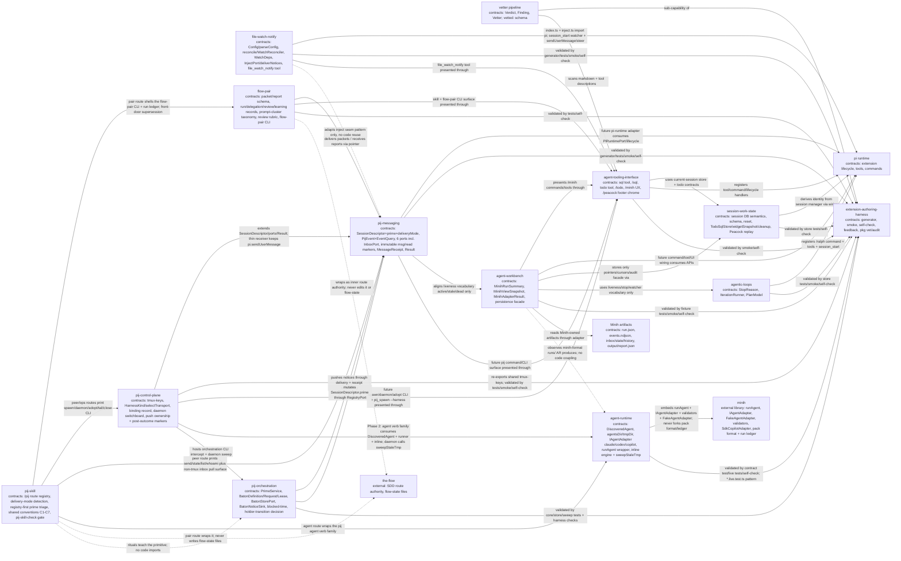

# Domain Map

## Health Summary

| Relationship | Status | Notes |
|--------------|--------|-------|
| `agent-tooling-interface` → `session-work-state` | healthy | UI/tool/strip/footer layer consumes `SessionSqlStore`, `TodoSqlStore.widgetSnapshot`, targeted cleanup operations, and Peacock append-only replay; stores remain pi-free. |
| `agent-tooling-interface` → `pi runtime` | healthy | Wiring owns pi APIs and presentation. |
| `session-work-state` → `pi runtime` | indirect | Store does not import pi; `index.ts` passes plain session/location data. |
| `session-work-state` / `agent-tooling-interface` → `extension-authoring-harness` | healthy | Harness provides generator, store tests, `/todo` + `/sql` smoke, self-check, ledgers, and retro loop. |
| `agentic-loops` → `pi runtime` | healthy | Wiring owns pi APIs (`appendEntry`, `setStatus`, `notify`, `registerCommand`, `registerTool`, `sessionManager.getEntries()`). Store remains pi-free (P2). |
| `agentic-loops` → pi-sdk `createAgentSession` | observed-only | External dependency (not a pij domain). Lifecycle ownership documented in workshop 002 § Resource ownership; F-02 risk class. |
| `agentic-loops` → `extension-authoring-harness` | healthy | Harness provides Driver SDK (`Scenario`/`Step`/`Session`), `compactAndAssert()` (AC-12 gift a), `FakeIterationRunner` test util. |
| AC-05 (`/compact` durability of `customType`) | **unverified** | Blocks D-005 closure. T024 smoke is the gate; if A1/A2 fails, escalate to pi-mono per workshop 004 § Upstream escalation. |
| `agent-workbench` → Minih artifacts | healthy | Phase 1 defines a read-only adapter boundary. Minih remains source of truth; Pi stores only projections/pointers/cursors/audit milestones. |
| `agent-workbench` → `agent-tooling-interface` | healthy | Workbench contracts feed Pi-visible `/minih status --json` and read-only tools; UI/modal work stays in later phases. |
| `agent-workbench` → `pi runtime` | indirect | Future command/tool/UI wiring consumes Pi extension APIs through `index.ts`/`ui.ts`; Minih lifecycle ownership remains external. |
| `agent-workbench` → `session-work-state` | contract-only | Persistence facade consumes session-scoped semantics for selected pointers, seen cursors, opt-ins, and audit/intent/outcome records; storage internals remain outside the domain. |
| `agent-workbench` → `agentic-loops` | vocabulary-only | Consumes liveness, explicit stop separation, watcher cleanup, and single `session_start` discipline without reusing Ralph Loop code or owning Minih lifecycle. |
| `pij-messaging` → `pi runtime` | indirect (future) | Phase-1 core is pi-free; only the Phase-3 `adapters/pi-runtime.ts` will import pi to implement `PiRuntimePort` (isIdle/inject/compact + input/turn lifecycle for receipts). |
| `pij-messaging` → `extension-authoring-harness` | healthy | `just new` generator, vitest (50 specs), Biome, self-check, retros, difficulty ledger. |
| `pij-messaging` → `agent-workbench` | vocabulary-only | Reuses `active/stale/dead` liveness + working-state names; no code reuse (pij owns its own peer registry, AW reads Minih runs). |
| `pij-messaging` → `agent-tooling-interface` | contract-only (future) | The future `pij` command/CLI surface + boot self-announce will present through Pi command/tool UX; no wiring in Phase 1. |
| `file-watch-notify` → `pi runtime` | healthy | `index.ts` + `inject.ts` are the only pi importers: `session_start` arms the watcher; delivery is `sendUserMessage` (immediate) / `sendUserMessage(...,{deliverAs:"steer"})` (busy). Core/watcher stay pi-free (P2). |
| `file-watch-notify` → `extension-authoring-harness` | healthy | `just new` generator, vitest (39 specs: TDD core + real-fs watcher + fake-pi inject/stale-ctx + runtime tool e2e), Biome, boot-only smoke, self-check. |
| `file-watch-notify` → `agent-tooling-interface` | contract-only | `file_watch_notify` LLM tool (status/list/watch/stop; recursive watch option) presents through Pi tool UX. |
| `file-watch-notify` ⇢ `pij-messaging` | pattern-only | Adapts pij's `pi-runtime` inject path (idle→send, busy→steer); **no import, no shared code, no changes to pij**. |
| `flow-pair` → `pij-messaging` | planned (dogfooded) | Worker-packet delivery + report return over the live peer channel; **pointer-only** sends (packet body in the ledger). Dogfood `dlg-0001` confirmed idle/stale/busy delivery + inline report round-trip. No changes to pij-messaging. |
| `flow-pair` → `agent-tooling-interface` | planned | Skill + `flow-pair` CLI present through Pi skill/tool UX; not yet built. |
| `flow-pair` → `extension-authoring-harness` | planned | `just`/vitest/self-check will validate the pi-free helper lib; retros/difficulty/velocity feed the learning loop. |
| `flow-pair` ⇢ `the-flow` (external) | wraps-only | Wrapper-level delegation seam; **never** edits `the-flow` or writes `.the-flow-state.json`/`the-flow.json`/`the-flow.md`. Single flow-state-writer invariant. |
| `pij-control-plane` → `pij-messaging` | extends (Plans 019/041) | Reuses `SessionDescriptor` (+`deliveryMode`), the six ports including `InboxPort`, immutable `msg-*`/`read-*`, receipt event persistence, and `FsChannel`. The daemon marks only push-owned tmux outcomes; pi and pull consumers retain ownership. |
| `pij-control-plane` → `extension-authoring-harness` | healthy | The shared `tmux-keys` lib (argv-only, injectable `TmuxRunner`) is re-exported by `harness/driver/tmux.ts` for parity; vitest + Biome + Driver smoke validate. |
| `pij-control-plane` → `agent-tooling-interface` | contract-only (future) | The `pij spawn`/`daemon`/`adopt` CLI + `pij_spawn --harness` UX will present through Pi command/tool surfaces. |
| `agent-runtime` → `minih` (external) | embeds-only | Imports minih's `runAgent`, `IAgentAdapter`, `FakeAgentAdapter`, validators, and `SdkCopilotAdapter` as a library at exact tag `minih-v0.2.4`. The pack format, validators, and `runs/<ts>/` ledger are minih's — **never forked, never extended**; a pack that runs under pij runs under stock minih unchanged. AC-12 contract test guards the API against tag drift. |
| `agent-runtime` → `extension-authoring-harness` | healthy | Rides the `*.live.test.ts` + `describe.skipIf` live-gate pattern, the vitest globs (contract + boundary tests auto-included), and `just self-check` / `harness checks`. |
| `pij-control-plane` → `agent-runtime` | planned (Phase 2) | The `pij agent` verb family will consume `DiscoveredAgent`, the runner, and the inline engine; the daemon consumes only the `sweepStaleTmp()` crash-sweep hook (added Phase 1). Dependency direction is `cli → core/agents → minih`, never the reverse. |
| `agent-workbench` ⇢ `agent-runtime` | observes-only | Reads the minih-format `runs/<ts>/` that `agent-runtime` produces; no import, no shared code — run artifacts stay minih-owned. |
| `pij-skill` → `flow-pair` | planned (Phase 2) | The pair route ports the flow-pair skill's protocol prose and shells the existing `flow-pair` CLI; the engine (lib/schemas/tests/`.flow-pair` ledger root) stays flow-pair-owned and untouched. |
| `pij-skill` → `pij-control-plane` / `pij-messaging` / `agent-runtime` | prints-only | Route modules print CLI commands in fenced blocks; delivery-mode detection keeps tmux/pi push-first and routes non-tmux peers to `pij inbox --wait`; no imports or code coupling. |
| `pij-orchestration` → `pij-messaging` | consumes | Uses session ids, the existing delivery channel, registry descriptors, and `queued\|delivered\|unverified` receipt vocabulary; it introduces no transport. |
| `pij-orchestration` → `extension-authoring-harness` | healthy | Pure lifecycle/sweep tests, real-filesystem store tests, the full pij regression suite, skill check, and harness sensors provide backpressure. |
| `pij-control-plane` → `pij-orchestration` | hosts | The bin intercept owns process I/O and git HEAD probing; the daemon owns periodic holder-liveness sweep wiring. The orchestration core remains pi-free. |
| `pij-skill` ⇢ `pij-orchestration` | teaches-only | Prime rituals explain the primitive beside the human evidence workflow; no code or state dependency. |
| `pij-orchestration` → `pij-messaging` prime contract | healthy | `PrimeService` preserves full descriptors through `RegistryPort`; `list --prime` consumes only explicit `prime:true`, while legacy absence projects as `false`. |
| `pij-control-plane` → prime designation | healthy | The CLI supplies exact self resolution and the daemon gives latest persisted mutable prime state authority over stale tick snapshots. |
| `pij-skill` ⇢ prime designation | teaches-only | Route triage reads `pij list --prime --here --json`; bootstrap/handover print write-side set/unset commands without importing product code. |

## History

| Date | Change |
|------|--------|
| 2026-05-15 | Added Plan 006 session SQL domains and their harness/pi relationships. |
| 2026-05-15 | Plan 009 — added vetter pipeline as a sub-capability of `extension-authoring-harness` with a consume edge to `agent-tooling-interface` (scans its surfaces). Pipeline contracts (`Verdict`, `Finding`, `Vetter`, `vetted:` schema) live in `harness/scripts/vetters/`. |
| 2026-05-15 | Plan 008 — added `agentic-loops` node (`RL`); two outbound edges (to `pi runtime` for wiring; to `extension-authoring-harness` for tests/smoke). No cross-domain edge to existing pij domains in v1. AC-05 `/compact` durability listed as unverified in Health Summary until T024 lands. |
| 2026-05-15 | Plan 010 — extended `session-work-state` with `TodoSqlStore` over the default `todos` / `todo_deps` schema and extended `agent-tooling-interface` with `todo` tool, `/todo`, overlay/status UX, docs, and smoke. |
| 2026-05-16 | Plan 010 ST-001 — added `TodoSqlStore.widgetSnapshot`, below-editor `todo-strip`, and `session-sql:changed` refresh edge for raw SQL mutations. |
| 2026-05-16 | Plan 010 follow-up — added targeted todo cleanup (`delete <id>`, `prune done`) to the store and tool/command UX. |
| 2026-05-16 | Plan 007 Phase 1 — added `agent-workbench` (`AW`) and Minih artifact source (`MH`) nodes with one-way consume edges to `pi runtime`, `agent-tooling-interface`, `session-work-state`, `agentic-loops`, `extension-authoring-harness`, and Minih-owned artifacts; expanded `agent-tooling-interface` node label for `/minih` read-only surfaces. |
| 2026-05-27 | Plan 013 — extended `agent-tooling-interface` with `/peacock` footer chrome and `session-work-state` with Peacock append-only color/surface replay semantics. |
| 2026-06-16 | Plan 014 Phase 1 — added `pij-messaging` (`PIJ`) node; four outbound edges (future pi-runtime adapter → `pi runtime`; validation → `extension-authoring-harness`; liveness vocabulary-only → `agent-workbench`; future CLI surface → `agent-tooling-interface`). Phase-1 core is pi-free; no inbound edges yet. |
| 2026-06-17 | Plan 015 — added `file-watch-notify` (`FWN`) node; three outbound edges (`pi runtime` wiring; `extension-authoring-harness` validation; `agent-tooling-interface` status command) plus a dashed pattern-only link to `pij-messaging` (adapts the inject seam, no code reuse). Standalone extension; snapshot-reconcile trap fix is the headline contract. |
| 2026-06-17 | Plan 015 (amend) — `FWN` gained a runtime control surface; it ultimately settled on the LLM-callable `file_watch_notify` tool (not a slash command) for arm/list/stop/status. |
| 2026-06-17 | Plan 015 (live crash fix) — `FWN` inject seam now treats stale/throwing Pi ctx as non-fatal after reload/session replacement. |
| 2026-06-17 | Plan 015 (tool surface fix) — `FWN` gained the missing LLM-callable `file_watch_notify` tool plus recursive watch option; obsolete slash-command parser/surface removed. |
| 2026-06-17 | Plan 016 — added `flow-pair` (`FP`) node + external `the-flow` (`TF`) node; three consume edges (`PIJ` delivery, `ATI` surface, `H` validation) + a dashed wraps-only edge to `TF`. Created during planning; domain doc produced by the first manual flow-pair worker-delegation dogfood (`dlg-0001`). |
| 2026-06-27 | Plan 019 — added `pij-control-plane` (`PCP`) node; three outbound edges (extends `pij-messaging`; validated by `extension-authoring-harness`; future CLI surface through `agent-tooling-interface`). Group A landed the shared `tmux-keys` primitives. Health Summary + edge detail finalized at T028. |
| 2026-07-03 | Plan 029 Phase 1 — added `agent-runtime` (`AR`) node + external `minih` (`MINIH`) library node; two outbound edges (embeds-only → `MINIH`; validated → `extension-authoring-harness`) plus two inbound: `PCP → AR` (planned Phase-2 `pij agent` CLI + daemon `sweepStaleTmp` hook) and a dashed observes-only `AW ⇢ AR` (workbench reads the minih runs AR produces). Runtime built CLI-free in Phase 1; `pij agent` surface + built-ins + docs land in Phase 2. |
| 2026-07-11 | Plan 036 — added `pij-orchestration` (`PO`) with outbound notice/receipt consumption from `pij-messaging`, harness validation, and inbound hosting edges from `pij-control-plane` plus the teaching-only `pij-skill` relationship. |
| 2026-07-11 | Plan 038 — extended existing PIJ/PO/PCP/PS relationships for descriptor-backed prime designation, list filtering, mutable merge ownership, and registry-first skill triage. |
| 2026-07-12 | Plan 041 — extended PIJ/PCP/PS contracts with immutable inbox/read markers, pull delivery ownership, post-outcome tmux/pi markers, durable receipt convergence, and non-tmux inbox guidance. |
