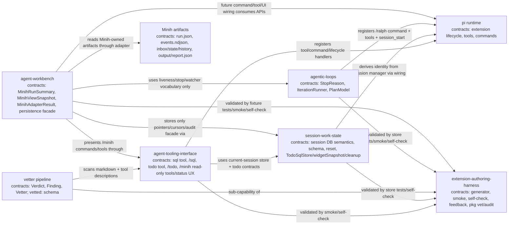

# Domain Map

## Health Summary

| Relationship | Status | Notes |
|--------------|--------|-------|
| `agent-tooling-interface` → `session-work-state` | healthy | UI/tool/strip layer consumes `SessionSqlStore`, `TodoSqlStore.widgetSnapshot`, and targeted cleanup operations; stores remain pi-free and SQL-backed. |
| `agent-tooling-interface` → `pi runtime` | healthy | Wiring owns pi APIs and presentation. |
| `session-work-state` → `pi runtime` | indirect | Store does not import pi; `index.ts` passes plain session/location data. |
| `session-work-state` / `agent-tooling-interface` → `extension-authoring-harness` | healthy | Harness provides generator, store tests, `/todo` + `/sql` smoke, self-check, ledgers, and retro loop. |
| `agentic-loops` → `pi runtime` | healthy | Wiring owns pi APIs (`appendEntry`, `setStatus`, `notify`, `registerCommand`, `registerTool`, `sessionManager.getEntries()`). Store remains pi-free (P2). |
| `agentic-loops` → pi-sdk `createAgentSession` | observed-only | External dependency (not a pij domain). Lifecycle ownership documented in workshop 002 § Resource ownership; F-02 risk class. |
| `agentic-loops` → `extension-authoring-harness` | healthy | Harness provides Driver SDK (`Scenario`/`Step`/`Session`), `compactAndAssert()` (AC-12 gift a), `FakeIterationRunner` test util. |
| AC-05 (`/compact` durability of `customType`) | **unverified** | Blocks D-005 closure. T024 smoke is the gate; if A1/A2 fails, escalate to pi-mono per workshop 004 § Upstream escalation. |
| `agent-workbench` → Minih artifacts | healthy | Phase 1 defines a read-only adapter boundary. Minih remains source of truth; Pi stores only projections/pointers/cursors/audit milestones. |
| `agent-workbench` → `agent-tooling-interface` | healthy | Workbench contracts feed Pi-visible `/minih status --json` and read-only tools; UI/modal work stays in later phases. |
| `agent-workbench` → `pi runtime` | indirect | Future command/tool/UI wiring consumes Pi extension APIs through `index.ts`/`ui.ts`; Minih lifecycle ownership remains external. |
| `agent-workbench` → `session-work-state` | contract-only | Persistence facade consumes session-scoped semantics for selected pointers, seen cursors, opt-ins, and audit/intent/outcome records; storage internals remain outside the domain. |
| `agent-workbench` → `agentic-loops` | vocabulary-only | Consumes liveness, explicit stop separation, watcher cleanup, and single `session_start` discipline without reusing Ralph Loop code or owning Minih lifecycle. |

## History

| Date | Change |
|------|--------|
| 2026-05-15 | Added Plan 006 session SQL domains and their harness/pi relationships. |
| 2026-05-15 | Plan 009 — added vetter pipeline as a sub-capability of `extension-authoring-harness` with a consume edge to `agent-tooling-interface` (scans its surfaces). Pipeline contracts (`Verdict`, `Finding`, `Vetter`, `vetted:` schema) live in `harness/scripts/vetters/`. |
| 2026-05-15 | Plan 008 — added `agentic-loops` node (`RL`); two outbound edges (to `pi runtime` for wiring; to `extension-authoring-harness` for tests/smoke). No cross-domain edge to existing pij domains in v1. AC-05 `/compact` durability listed as unverified in Health Summary until T024 lands. |
| 2026-05-15 | Plan 010 — extended `session-work-state` with `TodoSqlStore` over the default `todos` / `todo_deps` schema and extended `agent-tooling-interface` with `todo` tool, `/todo`, overlay/status UX, docs, and smoke. |
| 2026-05-16 | Plan 010 ST-001 — added `TodoSqlStore.widgetSnapshot`, below-editor `todo-strip`, and `session-sql:changed` refresh edge for raw SQL mutations. |
| 2026-05-16 | Plan 010 follow-up — added targeted todo cleanup (`delete <id>`, `prune done`) to the store and tool/command UX. |
| 2026-05-16 | Plan 007 Phase 1 — added `agent-workbench` (`AW`) and Minih artifact source (`MH`) nodes with one-way consume edges to `pi runtime`, `agent-tooling-interface`, `session-work-state`, `agentic-loops`, `extension-authoring-harness`, and Minih-owned artifacts; expanded `agent-tooling-interface` node label for `/minih` read-only surfaces. |
