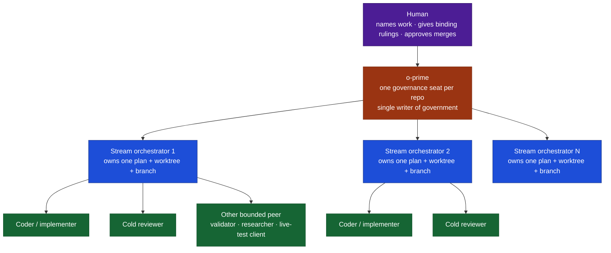
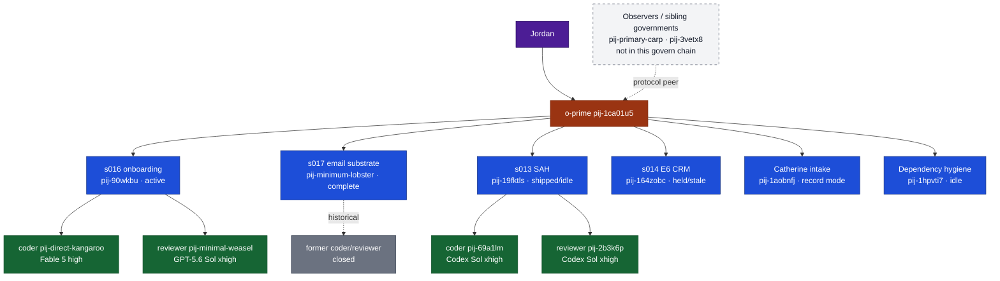
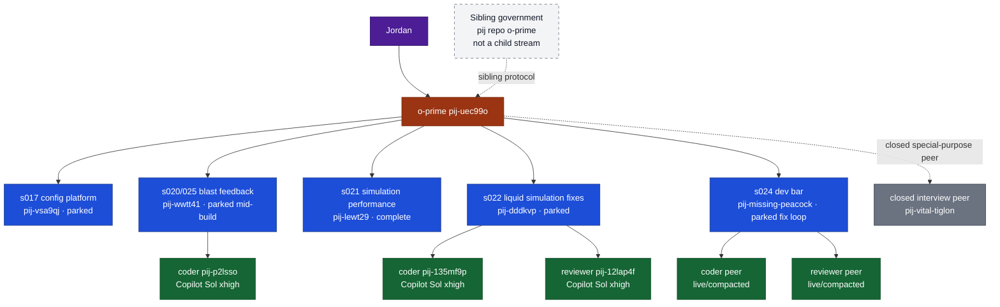

# pij prime hierarchy — canonical tree and examples

The canonical ownership chain is:



## Canonical boundaries

1. **The o-prime governs; it does not implement.** It owns portfolio state,
   roster, fences, batons, rulings, and one-hop verification.
2. **Each stream orchestrator owns one work item and its fleet.** Coders,
   reviewers, validators, and test clients are children of the stream—not direct
   o-prime workers.
3. **Evidence travels upward one verified hop.** Worker claims are checked by
   the orchestrator; stream claims are independently checked by the o-prime.
4. **Streams do not coordinate sideways.** Cross-stream overlap and sequencing
   go through the o-prime.
5. **Isolation is by worktree/branch/fence; serialization is by baton.** Human
   merge approval remains the final gate.
6. **Lifecycle is ownership-aware.** Reusable peers may be compacted and reused;
   dissolved seats are not resumed; closed ordinals are not recycled.

## Historical example: osk-split-billing



Source: the osk-split-billing canonical prime-tree artifact.

## Historical example: SecondCrack



Source: SecondCrack Plan 018 government evidence reported by its o-prime.

## The key visual rule

```text
human
└── o-prime
    ├── stream orchestrator
    │   ├── coder
    │   ├── reviewer
    │   └── other bounded peers
    ├── stream orchestrator
    │   └── its own fleet
    └── stream orchestrator
        └── its own fleet
```

An o-prime can have `1..N` streams. Each stream can have `0..N` peers over its
lifecycle. Peers belong to their stream; separate o-primes are sibling
governments, not children.
