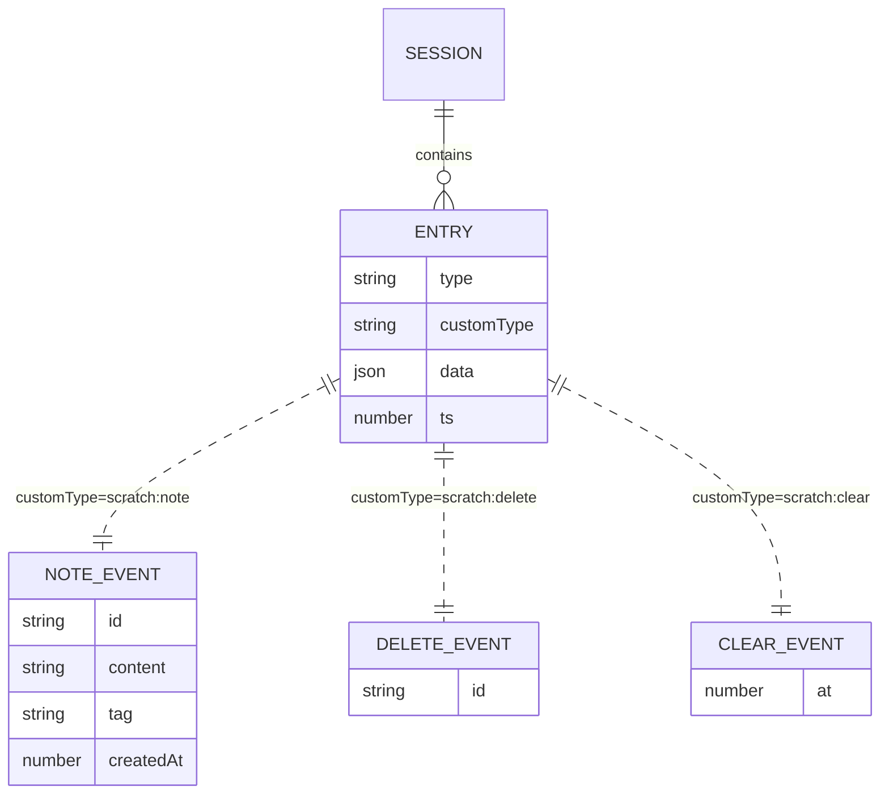
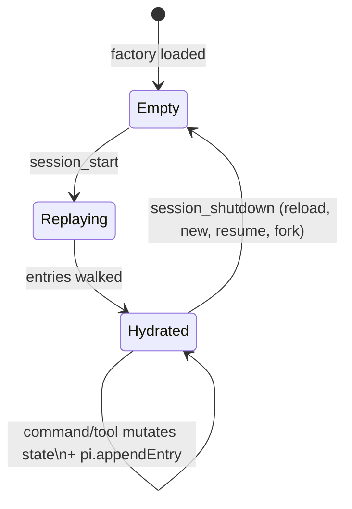

# Workshop: `scratch` — pij's first extension

**Type**: Integration Pattern + Data Model + CLI Flow
**Plan**: 001-pi-extensions
**Spec**: this workshop is the spec until `/plan-1b-specify` runs
**Created**: 2026-05-09 · **Updated**: 2026-05-09 (T2 layout, patterns section)
**Status**: Draft

**Related Documents**:
- [Workshop 001 — Loading extensions into pi](001-loading-extensions-into-pi.md) — distribution
- [Workshop 002 — Dev loop and hot reload](002-dev-loop-and-hot-reload.md) — iteration
- [Research dossier](../research-dossier.md)
- [`findings/01-extension-api.md`](../findings/01-extension-api.md) — IA-02 (registerTool), IA-03 (registerCommand), IA-08 (appendEntry), IA-17 (UI), IA-01 (events)
- [`findings/05-context-management.md`](../findings/05-context-management.md) — `session_start` lifecycle
- pi-mono `packages/coding-agent/docs/extensions.md` § Quick Start, § State Management, § Custom Tools

**Domain Context**:
- **Primary**: future `extensions/` domain — `scratch` is its first inhabitant and its template.
- **Related**: future `context/` (notes are session-scoped context); session storage (we ride on pi's append-only entry log).

---

## Purpose

`scratch` is pij's first extension. It is a session-scoped notepad: short notes the user (and the LLM) can save during a session, list, delete, and clear, with the count visible in the status line. It is small enough to write in an afternoon (~250 lines across three files) and **deliberately exercises seven of the highest-value concepts in the ExtensionAPI** so the implementer leaves with a working mental model of the surface — and a copy-pasteable template for every extension that follows.

This workshop is both the design *and* the canonical pattern for pij extensions going forward. Keep it open while writing the code; copy its layout for the next extension.

## Key Questions Addressed

- What user-facing surfaces does `scratch` expose, and what does each one do?
- How do we make notes survive `/reload` (and what about `/new`, `/resume`, `/fork`, compaction)?
- Which `pi.*` and `ctx.*` APIs do we touch, and why each?
- What's the data model? How are notes stored on disk?
- How do we structure the code so the data layer is testable without spinning up pi?
- What's the contract for the LLM-callable tools? (Schema, return shape, token budget.)
- Where does it sit in the pij file tree, and what conventions does that establish for future extensions?
- Where can it go wrong, and how does each failure surface to the user?

---

## Why this is the right "first extension"

Every other candidate first-extension hits 1–3 concepts. `scratch` hits seven, organically:

| Concept | Where in `scratch` |
|---|---|
| `pi.registerCommand` | `/scratch add\|list\|del\|clear` |
| `pi.registerTool` (TypeBox schema) | `scratch_save`, `scratch_list` |
| `pi.on("session_start")` | Rehydrate from session entries (covers startup AND `/reload` AND `/resume` AND `/fork` in one handler) |
| `pi.appendEntry` | Event-sourced persistence |
| `ctx.ui.notify` | Command feedback |
| `ctx.ui.confirm` | Gate the destructive `/scratch clear` |
| `ctx.ui.setStatus` | Live note count in the footer |

Plus three pij-wide conventions we'll establish here and reuse in every later extension:

- **T2 layout** (extension is a directory; `index.ts` wires, `store.ts` owns data). See § Patterns established.
- **Pi-free store + injected side effects** so the data layer is unit-testable without booting pi.
- **Append-only event-sourced state** that replays from `ctx.sessionManager.entries` on every `session_start`.

What `scratch` intentionally **doesn't** do (so it stays small): no compaction hook, no `before_provider_request` rewriting, no custom message renderer, no provider registration, no MCP, no sub-agents. Those are workshops 004+.

---

## Overview — what `scratch` does

```
┌─────────────────────────────────────────────────────────────────────────┐
│ /scratch add Remember to refactor compaction to honour custom limits    │
│ ✓ saved [#1]                                                            │
│                                                                         │
│ /scratch add --tag bug Token meter undercounts by ~7% on Claude Sonnet  │
│ ✓ saved [#2]                                                            │
│                                                                         │
│ /scratch list                                                           │
│ 1.        Remember to refactor compaction to honour custom limits       │
│ 2. [bug]  Token meter undercounts by ~7% on Claude Sonnet               │
│                                                                         │
│ ────────────────────────── footer status ──────────────────────────     │
│ scratch: 2 notes │ model: claude-opus-4-7 │ ctx: 14% │ /Users/.../pij   │
│                                                                         │
│ /reload                                                                 │
│ ✓ scratch: restored 2 notes                                             │
│                                                                         │
│ /scratch clear                                                          │
│ Confirm: Wipe 2 notes? [y/N] y                                          │
│ ✓ cleared 2 notes                                                       │
│                                                                         │
│ The LLM, mid-conversation, can also call:                               │
│   scratch_save({ content: "user wants strict TS, see msg ↑", tag: "ctx"})│
│   scratch_list({ tag: "ctx" })                                          │
└─────────────────────────────────────────────────────────────────────────┘
```

---

## User-facing surfaces

### Slash command — `/scratch <sub> [args]`

| Subcommand | Synopsis | Notes |
|---|---|---|
| `/scratch` | (no sub) → equivalent to `/scratch list` | Convenience |
| `/scratch list` | Print all notes as a numbered list | `info` toast |
| `/scratch add <text>` | Save `<text>` as a new note | Returns `success` toast with index |
| `/scratch add --tag <t> <text>` | Save with a tag | Tag is a single token (no spaces) |
| `/scratch del <n>` | Delete note at 1-based index | `error` toast if out of range |
| `/scratch clear` | Wipe all notes | Confirm dialog; aborts if no notes |

**Why one command with subcommands** instead of `/scratch-add`, `/scratch-list`, …: the slash dispatcher passes the raw arg string to the handler, so subcommand parsing is free. One namespace, fewer registrations, easier to discover.

### LLM-callable tools

| Tool | Purpose | Schema |
|---|---|---|
| `scratch_save` | Let the model save a note ("note this for later") | `{ content: string (≤2048 chars), tag?: string }` |
| `scratch_list` | Let the model recall notes | `{ tag?: string, limit?: number (1–200, default 50) }` |

`scratch_list` returns a numbered list as `text` content plus `details: { total }` so the model knows if it was truncated. Token-budgeted: even with `limit=200`, total returned bytes are capped at 8 KB.

### Status line widget

- Key: `"scratch"`
- When `notes.length > 0`: `"scratch: N note(s)"`
- When empty: cleared (empty string)

Refreshed on every mutation and on `session_start`.

### Confirm dialog

- Triggered only by `/scratch clear` when `notes.length > 0`.
- Title: `"Clear scratchpad?"`
- Message: `"Wipe N notes?"`
- Cancel = no-op, no entry written, no notify.

---

## Data model

### Note (in-memory and persisted shape)

```ts
interface Note {
  id: string;        // ulid-ish: Date.now().toString(36) + "-" + random6
  content: string;   // ≤2048 chars (validated at write)
  tag?: string;      // single token, optional
  createdAt: number; // Date.now()
}
```

### Three custom entry types in the session

We are **append-only**. We never mutate prior entries. Edits and deletes are new entries that the replay function applies when rebuilding state.

| `customType` | `data` shape | Meaning |
|---|---|---|
| `"scratch:note"` | `Note` | A new note was created |
| `"scratch:delete"` | `{ id: string }` | A note was deleted |
| `"scratch:clear"` | `{ at: number }` | All notes existing at this point were wiped |

### Why event-sourced (vs a single snapshot entry)

- Pi's session file is already an append-only log; we're matching the grain.
- Forks/branches inherit the entry stream, so notes come along for free.
- Replay is deterministic — easy to reason about, easy to test.
- We never need to load-modify-write a snapshot, which is racey and pi-anti-pattern.

The only cost is that replay walks all entries on `session_start`. For the foreseeable future (`O(messages)` per session, typically <500), this is microseconds.

### Conceptual model



---

## State machine — replay on `session_start`



### Replay rules

```
for each entry in ctx.sessionManager.entries (in append order):
  if entry.type !== "custom": skip
  switch entry.customType:
    "scratch:note":   notes.push(data)
    "scratch:delete": notes = notes.filter(n => n.id !== data.id)
    "scratch:clear":  notes = []
```

Order is critical — entries are guaranteed in append order by pi, so we must replay in that order. A stale `scratch:delete` for an id that's already gone (because of a prior `scratch:clear`) is a harmless no-op, which is what we want.

### Lifecycle walkthrough

| Event | What happens to scratch state |
|---|---|
| pi starts (with pij autoloaded) | factory runs → store constructed (notes = []) → `session_start { reason: "startup" }` → `store.rehydrate(...)` → notes populated from disk |
| `/reload` | `session_shutdown { reason: "reload" }` → re-import → fresh store → `session_start { reason: "reload" }` → rehydrate → restored |
| `/new` | fresh session file → empty entries → rehydrate yields `[]` (correct: fresh session, fresh scratchpad) |
| `/resume <other-session>` | switch session file → rehydrate that session's entries |
| `/fork` | fork copies entries up to point → rehydrate yields inherited notes |
| `/scratch clear` | append `scratch:clear` entry → `store.clear()` → status line cleared |
| Compaction | (See § Open Questions Q1) custom entries are not LLM messages, so they should pass through. Verify before shipping. |
| pi exits | `session_shutdown { reason: "quit" }` — no special action |

---

## File layout in pij — the **T2 pattern**

Each extension is a **directory** with at least three files:

```
pij/
├── package.json                    ← T4: peerDeps + "pi:" manifest pointing at .pi/extensions
├── tsconfig.json                   ← noEmit; strict
├── biome.json                      ← match pi-mono house style
├── vitest.config.ts                ← runs *.test.ts under .pi/extensions/
├── .pi/
│   ├── extensions/
│   │   └── scratch/                ← T2: directory per extension
│   │       ├── index.ts            ← factory + wiring (registrations, handlers, command dispatch)
│   │       ├── store.ts            ← Note type, replay, mutations, format — pi-free!
│   │       └── store.test.ts       ← unit tests (vitest, runs without pi)
│   ├── skills/
│   ├── prompts/
│   └── themes/
└── docs/plans/…
```

### Why three files (and not one, and not seven)

- **`store.ts`** holds all the data + rules. Zero imports from `@earendil-works/*`. Pure logic over plain data. This is what we test in CI.
- **`index.ts`** is the *only* file that talks to pi. It owns the factory, registrations, and side effects (`ctx.ui.*`, `pi.appendEntry` injection into the store). Everything pi-shaped lives here, in one place.
- **`store.test.ts`** sits next to `store.ts`. Vitest runs it in plain Node — no pi runtime, no TUI, no API key. ~30 ms per file.

Adding more files (e.g., a separate `commands.ts`, `tools.ts`) is overkill at this size. Wait until either grows past ~150 lines, then split.

### When T1 (single file) is OK

For extensions <80 lines with one concern (e.g., a single `tool_call` hook that confirms `rm -rf`), a flat `.pi/extensions/foo.ts` is fine. pi-mono's own `redraws.ts` and `tps.ts` are this. **Default to T2** unless the extension is *visibly* trivial.

### Run with

```bash
cd /Users/jordanknight/pi-hacking/pij
pi                           # auto-loads .pi/extensions/scratch/index.ts
```

---

## Reference implementation

Three files. Paste-ready. Comments explain decisions, not what the code does.

### File 1 of 3 — `store.ts` (~100 lines)

The data layer. Notice: **no imports from `@earendil-works/*`**. The only TypeScript dependency is `node:` builtins (none used here, so zero imports). This is the file that lives forever; refactors of pi shouldn't ripple here.

```ts
// pij/.pi/extensions/scratch/store.ts

// ─── entry tags (exported so tests and index.ts share the source of truth) ──
export const ENTRY_NOTE   = "scratch:note";
export const ENTRY_DELETE = "scratch:delete";
export const ENTRY_CLEAR  = "scratch:clear";

// ─── limits ─────────────────────────────────────────────────────────────────
export const MAX_NOTE_BYTES   = 2048;
export const MAX_LIST_BYTES   = 8192;
export const DEFAULT_LIST_LIMIT = 50;
export const MAX_LIST_LIMIT   = 200;

// ─── domain ─────────────────────────────────────────────────────────────────
export interface Note {
  id: string;
  content: string;
  tag?: string;
  createdAt: number;
}

/**
 * Structural type for entries we replay from. Matches pi's SessionEntry
 * by shape (TS structural typing means the real Entry assigns to this
 * with no cast at the call site). Keeps store.ts pi-free.
 */
export interface ReplayableEntry {
  readonly type: string;
  readonly customType?: string;
  readonly data?: unknown;
}

/**
 * The side effect we depend on. Injected via constructor so tests can
 * substitute a recorder. Real wiring binds pi.appendEntry.
 */
export type AppendFn = (customType: string, data: unknown) => void;

// ─── id generation ──────────────────────────────────────────────────────────
export function newId(now: number = Date.now(), random: () => number = Math.random): string {
  return `${now.toString(36)}-${random().toString(36).slice(2, 8)}`;
}

// ─── store ──────────────────────────────────────────────────────────────────
type AddResult    = { ok: true; note: Note }      | { ok: false; reason: "too_long" };
type DeleteResult = { ok: true; note: Note }      | { ok: false; reason: "out_of_range" };

export class ScratchStore {
  private notes: Note[] = [];

  constructor(private readonly append: AppendFn) {}

  /** Replace in-memory state by replaying the entry log in append order. */
  rehydrate(entries: Iterable<ReplayableEntry>): void {
    this.notes = [];
    for (const entry of entries) {
      if (entry.type !== "custom") continue;
      switch (entry.customType) {
        case ENTRY_CLEAR:
          this.notes = [];
          break;
        case ENTRY_NOTE:
          this.notes.push(entry.data as Note);
          break;
        case ENTRY_DELETE: {
          const { id } = entry.data as { id: string };
          this.notes = this.notes.filter((n) => n.id !== id);
          break;
        }
      }
    }
  }

  count(): number { return this.notes.length; }

  list(opts?: { tag?: string; limit?: number }): Note[] {
    const limit = Math.min(Math.max(opts?.limit ?? DEFAULT_LIST_LIMIT, 0), MAX_LIST_LIMIT);
    let view = this.notes;
    if (opts?.tag) view = view.filter((n) => n.tag === opts.tag);
    return view.slice(-limit);
  }

  add(content: string, tag?: string): AddResult {
    if (content.length > MAX_NOTE_BYTES) return { ok: false, reason: "too_long" };
    const note: Note = { id: newId(), content, tag, createdAt: Date.now() };
    // Persist BEFORE updating memory: a crash between the two leaves us
    // consistent (replay finds the note); the other order would show a
    // phantom note that vanishes on /reload.
    this.append(ENTRY_NOTE, note);
    this.notes.push(note);
    return { ok: true, note };
  }

  deleteAt(index1Based: number): DeleteResult {
    const idx = index1Based - 1;
    if (idx < 0 || idx >= this.notes.length) return { ok: false, reason: "out_of_range" };
    const note = this.notes[idx];
    this.append(ENTRY_DELETE, { id: note.id });
    this.notes.splice(idx, 1);
    return { ok: true, note };
  }

  clear(): number {
    const count = this.notes.length;
    this.append(ENTRY_CLEAR, { at: Date.now() });
    this.notes = [];
    return count;
  }

  /** Render the list as numbered text, capped at MAX_LIST_BYTES. */
  format(opts?: { tag?: string; limit?: number }): string {
    const view = this.list(opts);
    if (view.length === 0) return "(no notes)";

    const lines: string[] = [];
    let total = 0;
    for (let i = view.length - 1; i >= 0; i--) {
      const n = view[i];
      const tag = n.tag ? ` [${n.tag}]` : "";
      const line = `${i + 1}.${tag} ${n.content}`;
      if (total + line.length > MAX_LIST_BYTES) break;
      total += line.length;
      lines.unshift(line);
    }
    if (lines.length < view.length) {
      lines.unshift(`(showing ${lines.length} of ${view.length} — output capped at ${MAX_LIST_BYTES} bytes)`);
    }
    return lines.join("\n");
  }
}
```

### File 2 of 3 — `index.ts` (~110 lines)

The wiring. Imports pi types here and only here. Constructs the store with `pi.appendEntry` bound as the side effect. Owns command dispatch and tool execute bodies.

```ts
// pij/.pi/extensions/scratch/index.ts
import type {
  ExtensionAPI,
  ExtensionCommandContext,
  ExtensionContext,
} from "@earendil-works/pi-coding-agent";
import { Type } from "typebox";

import {
  DEFAULT_LIST_LIMIT,
  MAX_LIST_LIMIT,
  MAX_NOTE_BYTES,
  ScratchStore,
} from "./store.js";   // ← .js extension required (NodeNext / ESM resolution)

function parseAddArgs(rest: string): { tag?: string; text: string } {
  // Accept `--tag foo bar baz`  → tag=foo, text="bar baz"
  // Or just plain text         → tag=undefined, text="bar baz"
  const m = /^--tag\s+(\S+)\s+(.*)$/s.exec(rest);
  return m ? { tag: m[1], text: m[2] } : { text: rest };
}

async function handleScratchCommand(
  args: string,
  ctx: ExtensionCommandContext,
  store: ScratchStore,
  refreshStatus: (ctx: ExtensionContext) => void,
): Promise<void> {
  const trimmed = args.trim();
  const spaceIdx = trimmed.indexOf(" ");
  const sub  = spaceIdx === -1 ? trimmed : trimmed.slice(0, spaceIdx);
  const rest = spaceIdx === -1 ? ""      : trimmed.slice(spaceIdx + 1).trim();

  switch (sub) {
    case "":
    case "list":
      ctx.ui.notify(store.format(), "info");
      return;

    case "add": {
      if (!rest) {
        ctx.ui.notify("usage: /scratch add [--tag <t>] <text>", "error");
        return;
      }
      const { tag, text } = parseAddArgs(rest);
      if (!text) { ctx.ui.notify("text is required", "error"); return; }
      const result = store.add(text, tag);
      if (!result.ok) {
        ctx.ui.notify(`rejected: ${result.reason} (max ${MAX_NOTE_BYTES} chars)`, "error");
        return;
      }
      refreshStatus(ctx);
      ctx.ui.notify(`saved [#${store.count()}]`, "success");
      return;
    }

    case "del": {
      const n = parseInt(rest, 10);
      const result = store.deleteAt(n);
      if (!result.ok) {
        ctx.ui.notify(`usage: /scratch del <1..${store.count() || 0}>`, "error");
        return;
      }
      refreshStatus(ctx);
      ctx.ui.notify(`deleted note #${n}`, "info");
      return;
    }

    case "clear": {
      if (store.count() === 0) {
        ctx.ui.notify("scratch is already empty", "info");
        return;
      }
      const ok = await ctx.ui.confirm("Clear scratchpad?", `Wipe ${store.count()} notes?`);
      if (!ok) { ctx.ui.notify("cancelled", "info"); return; }
      const cleared = store.clear();
      refreshStatus(ctx);
      ctx.ui.notify(`cleared ${cleared} notes`, "info");
      return;
    }

    default:
      ctx.ui.notify(`unknown: /scratch ${sub}. try: list, add, del, clear`, "error");
  }
}

export default function (pi: ExtensionAPI) {
  const store = new ScratchStore((customType, data) => pi.appendEntry(customType, data));

  function refreshStatus(ctx: ExtensionContext): void {
    const n = store.count();
    ctx.ui.setStatus(
      "scratch",
      n === 0 ? "" : `scratch: ${n} note${n === 1 ? "" : "s"}`,
    );
  }

  // One handler covers startup, /reload, /new, /resume, /fork.
  // ctx.sessionManager.entries is structurally compatible with ReplayableEntry.
  pi.on("session_start", async (event, ctx) => {
    store.rehydrate(ctx.sessionManager.entries);
    refreshStatus(ctx);
    if (event.reason === "reload" && store.count() > 0) {
      const n = store.count();
      ctx.ui.notify(`scratch: restored ${n} note${n === 1 ? "" : "s"}`, "info");
    }
  });

  pi.registerCommand("scratch", {
    description: "Session scratchpad. Usage: /scratch [list|add|del|clear]",
    handler: async (args, ctx) => handleScratchCommand(args, ctx, store, refreshStatus),
  });

  pi.registerTool({
    name: "scratch_save",
    label: "Scratch save",
    description:
      "Save a short note to the session scratchpad. Use to remember things across this conversation that don't need to surface to the user yet.",
    parameters: Type.Object({
      content: Type.String({ description: `What to remember (≤${MAX_NOTE_BYTES} chars)` }),
      tag:     Type.Optional(Type.String({ description: "Optional one-word tag (e.g. 'todo', 'bug', 'context')" })),
    }),
    async execute(_id, params, _signal, _onUpdate, ctx) {
      const result = store.add(params.content, params.tag);
      if (!result.ok) {
        return {
          content: [{ type: "text", text: `rejected: ${result.reason}` }],
          details: { error: result.reason },
        };
      }
      refreshStatus(ctx);
      return {
        content: [{ type: "text", text: `Saved note ${result.note.id}` }],
        details: { id: result.note.id, tag: result.note.tag, count: store.count() },
      };
    },
  });

  pi.registerTool({
    name: "scratch_list",
    label: "Scratch list",
    description: "List notes in the session scratchpad. Optional tag filter.",
    parameters: Type.Object({
      tag:   Type.Optional(Type.String({ description: "Filter to this tag only" })),
      limit: Type.Optional(Type.Number({ description: `Max notes to return (1–${MAX_LIST_LIMIT}, default ${DEFAULT_LIST_LIMIT})` })),
    }),
    async execute(_id, params, _signal, _onUpdate, _ctx) {
      const text = store.format({ tag: params.tag, limit: params.limit });
      const total = params.tag
        ? store.list({ tag: params.tag, limit: MAX_LIST_LIMIT }).length
        : store.count();
      return { content: [{ type: "text", text }], details: { total } };
    },
  });
}
```

### File 3 of 3 — `store.test.ts` (~95 lines)

Vitest. Pure Node — no pi runtime needed. Run with `npm test`.

```ts
// pij/.pi/extensions/scratch/store.test.ts
import { describe, expect, it } from "vitest";
import {
  ENTRY_CLEAR,
  ENTRY_DELETE,
  ENTRY_NOTE,
  MAX_LIST_BYTES,
  MAX_NOTE_BYTES,
  type ReplayableEntry,
  ScratchStore,
} from "./store.js";

function makeStore() {
  const appended: Array<{ customType: string; data: unknown }> = [];
  const store = new ScratchStore((customType, data) => appended.push({ customType, data }));
  return { store, appended };
}

describe("ScratchStore", () => {
  describe("add", () => {
    it("appends a note entry and stores the note", () => {
      const { store, appended } = makeStore();
      const r = store.add("hello");
      expect(r.ok).toBe(true);
      if (r.ok) expect(r.note.content).toBe("hello");
      expect(store.count()).toBe(1);
      expect(appended).toEqual([{ customType: ENTRY_NOTE, data: expect.objectContaining({ content: "hello" }) }]);
    });

    it("rejects content over the size limit and emits no entry", () => {
      const { store, appended } = makeStore();
      const r = store.add("x".repeat(MAX_NOTE_BYTES + 1));
      expect(r).toEqual({ ok: false, reason: "too_long" });
      expect(store.count()).toBe(0);
      expect(appended).toHaveLength(0);
    });

    it("preserves the optional tag", () => {
      const { store } = makeStore();
      const r = store.add("note", "todo");
      if (r.ok) expect(r.note.tag).toBe("todo");
    });
  });

  describe("deleteAt", () => {
    it("removes the note at a 1-based index and emits a delete entry", () => {
      const { store, appended } = makeStore();
      store.add("a"); store.add("b");
      const r = store.deleteAt(1);
      expect(r.ok).toBe(true);
      expect(store.count()).toBe(1);
      expect(store.list().map((n) => n.content)).toEqual(["b"]);
      expect(appended.at(-1)?.customType).toBe(ENTRY_DELETE);
    });

    it("rejects out-of-range indices and emits no entry", () => {
      const { store, appended } = makeStore();
      store.add("a");
      const before = appended.length;
      expect(store.deleteAt(99)).toEqual({ ok: false, reason: "out_of_range" });
      expect(appended).toHaveLength(before);
    });
  });

  describe("clear", () => {
    it("wipes notes and emits a clear entry", () => {
      const { store, appended } = makeStore();
      store.add("a"); store.add("b");
      expect(store.clear()).toBe(2);
      expect(store.count()).toBe(0);
      expect(appended.at(-1)?.customType).toBe(ENTRY_CLEAR);
    });
  });

  describe("rehydrate", () => {
    it("replays note + delete + note", () => {
      const { store } = makeStore();
      const entries: ReplayableEntry[] = [
        { type: "custom", customType: ENTRY_NOTE,   data: { id: "1", content: "a", createdAt: 1 } },
        { type: "custom", customType: ENTRY_NOTE,   data: { id: "2", content: "b", createdAt: 2 } },
        { type: "custom", customType: ENTRY_DELETE, data: { id: "1" } },
        { type: "custom", customType: ENTRY_NOTE,   data: { id: "3", content: "c", createdAt: 3 } },
      ];
      store.rehydrate(entries);
      expect(store.list().map((n) => n.id)).toEqual(["2", "3"]);
    });

    it("clear wipes everything before it", () => {
      const { store } = makeStore();
      store.rehydrate([
        { type: "custom", customType: ENTRY_NOTE,  data: { id: "1", content: "a", createdAt: 1 } },
        { type: "custom", customType: ENTRY_CLEAR, data: { at: 2 } },
        { type: "custom", customType: ENTRY_NOTE,  data: { id: "2", content: "b", createdAt: 3 } },
      ]);
      expect(store.list().map((n) => n.id)).toEqual(["2"]);
    });

    it("ignores non-custom entries", () => {
      const { store } = makeStore();
      store.rehydrate([
        { type: "user-message", data: { text: "hi" } },
        { type: "custom", customType: ENTRY_NOTE, data: { id: "1", content: "x", createdAt: 1 } },
      ]);
      expect(store.count()).toBe(1);
    });
  });

  describe("list", () => {
    it("filters by tag", () => {
      const { store } = makeStore();
      store.add("a"); store.add("b", "todo"); store.add("c", "todo");
      expect(store.list({ tag: "todo" })).toHaveLength(2);
    });

    it("respects limit and returns the most-recent N", () => {
      const { store } = makeStore();
      store.add("a"); store.add("b"); store.add("c");
      expect(store.list({ limit: 2 }).map((n) => n.content)).toEqual(["b", "c"]);
    });
  });

  describe("format", () => {
    it("returns a placeholder when empty", () => {
      const { store } = makeStore();
      expect(store.format()).toBe("(no notes)");
    });

    it("caps output at MAX_LIST_BYTES and notes truncation", () => {
      const { store } = makeStore();
      for (let i = 0; i < 5; i++) store.add("x".repeat(2000));
      const out = store.format();
      expect(out.length).toBeLessThanOrEqual(MAX_LIST_BYTES + 200);
      expect(out).toMatch(/showing \d+ of 5/);
    });
  });
});
```

---

## Patterns established

These conventions are baked into `scratch` and **every future pij extension should follow them** unless there's a specific reason not to.

### P1 — T2 layout by default

Each extension is a directory under `.pi/extensions/<name>/` with `index.ts` (wiring) and `store.ts` (data). T1 (single file) is allowed only for extensions <80 lines with a single concern. T3 (own `package.json`) only when the extension needs npm deps the rest of pij doesn't.

### P2 — Pi-free store

`store.ts` imports nothing from `@earendil-works/*`. The data layer never knows it's running inside pi. Result: tests run in plain Node, refactors of pi don't ripple, and the store is portable to other runtimes (SDK, RPC, future harnesses).

### P3 — Inject side effects via constructor

The store takes its side effect (`AppendFn` here) as a constructor arg. Real wiring binds `pi.appendEntry`; tests pass a recorder array. No globals, no module-level state shared between tests, no spying on `console`. This pattern scales to other side effects (logging, telemetry, network) as extensions grow.

### P4 — Tagged-union returns over throws

Public methods that can fail return `{ ok: true; … } | { ok: false; reason: "<discriminator>" }`. Callers `switch` on `result.ok`. No `try/catch` for expected failures, no exception types to import. TypeScript narrows the union for free.

### P5 — Constants live with their data

Limits, schema sizes, default page sizes are exported `const`s in `store.ts`. `index.ts` imports them for tool descriptions ("≤2048 chars"); tests import them for assertions. One source of truth.

### P6 — Structural entry types at the boundary

`store.ts` defines `ReplayableEntry` (the minimum it needs to read). Pi's real `SessionEntry` is structurally compatible; no cast at the call site. Keeps the store free of `@earendil-works/*` imports without sacrificing type safety.

### P7 — `.js` on relative imports

NodeNext / ESM resolution requires `.js` even when the source is `.ts`:
```ts
import { ScratchStore } from "./store.js";   // ← .js, not .ts
```
This isn't a pij choice — it's a TypeScript-with-NodeNext requirement. Worth flagging because most editors don't auto-add it.

### P8 — Tests target the store

`*.test.ts` files sit next to the file they test, run under vitest, and exercise pure-data paths. We deliberately do **not** test the wiring file in unit tests — it's mostly registration boilerplate; bugs there show up immediately in the dev loop. If wiring grows test-worthy logic (e.g., complex argument parsing), extract it to a pure helper in another file and test that.

### P9 — Persist before mutate (event-sourced consistency)

Inside the store, `appendEntry` is called *before* updating the in-memory array. A crash between the two leaves the system consistent: replay finds the persisted entry on next load. The opposite order would show phantom notes that vanish on `/reload`.

### P10 — One handler for `session_start`, all reasons

The same handler covers `startup`, `reload`, `new`, `resume`, `fork`. Branch on `event.reason` only when behaviour differs (e.g., the `"restored N notes"` toast on reload). Don't subscribe to multiple lifecycle events for state hydration — `session_start` fires for all of them.

---

## Edge cases & failure modes

| Scenario | Behaviour | Why |
|---|---|---|
| `/scratch` with no args | Equivalent to `/scratch list` | Friendlier default |
| `/scratch list` on empty pad | Toast: `(no notes)` | Don't fail silently |
| `/scratch add` (no text) | `error` toast with usage | Same as a CLI |
| `/scratch add --tag foo` (no text after tag) | `error` toast | Tag without content is meaningless |
| `/scratch del 99` (out of range) | `error` toast with valid range | Range computed from current count |
| `/scratch clear` on empty pad | `info` toast: `scratch is already empty` — no confirm | Don't waste a dialog |
| User cancels confirm on `/scratch clear` | `info` toast: `cancelled` — no entry written | Idempotent cancel |
| LLM passes `content.length > 2048` to `scratch_save` | Tool returns `{ error: "too_long" }`; nothing persisted | Same cap as the slash command |
| LLM passes `limit > 200` | Treated as 200 (`Math.min`) | Predictable cap |
| LLM passes `limit < 1` | Treated as 0 → `(no notes)` | Cheap to handle |
| `scratch_list` would return >8 KB | Truncated; first line is `(showing N of M — output capped at 8 KB)` | Token-budget |
| User edits scratch.ts and `/reload`s | New code runs; notes survive (replay from session) | The whole point of event sourcing |
| Concurrent `addNote` from a tool *and* a command | Pi serializes events; no race | Not a concern |
| `/scratch del 1` while LLM is mid-stream | Queues until idle (per ExtensionAPI semantics) | Pi handles back-pressure |
| Session file deleted between `/reload`s | `entries` empty → notes empty → no error | Same as `/new` |
| User runs pi from `/tmp` (no `.pi/extensions/`) | Extension not loaded; commands missing | Either install via Path 4 (`pi install /…/pij`) or `cd pij` first |
| `peerDependencies` not installed | Type errors in editor; runtime fails on first import | `npm install` at pij root once |
| Forgot `.js` extension on import | TS compile error under NodeNext | Pattern P7; editor extension can auto-fix |

---

## Open Questions

### Q1: Do `customType` entries survive `/compact`?

**OPEN — verify before shipping.** Compaction collapses LLM-bound message entries into a summary. Custom entries (from `pi.appendEntry`) are *not* LLM messages, so they should pass through untouched. IA-08 says "CustomEntry doesn't participate in LLM context"; the implication is that compaction only rewrites context-participating entries.

**How to verify**:
1. Add several `/scratch add` notes.
2. Force compaction (`/compact` or fill context).
3. `/scratch list` after compaction; if empty, the assumption was wrong.
4. If wrong: subscribe to `session_before_compact` and either re-emit notes after, or write a single `scratch:snapshot` entry pre-compact and rehydrate prefers snapshots.

This is the only material question for v1. The fallback (snapshot-pre-compact) is ~30 lines of additional code in `store.ts` — acceptable.

### Q2: Should we expose a `scratch_delete` tool for the LLM?

**OPEN — leave out of v1.** Letting the model delete its own notes risks erasing context the user wanted preserved. If the LLM should "forget" something, the user can `/scratch del <n>`. Re-evaluate after a week of dogfooding.

### Q3: Should notes be per-session or per-project?

**RESOLVED — per-session.** Sessions are pi's persistence unit. Riding on `appendEntry` is one method call; cross-session storage requires a JSON file at `.pi/scratch.json` plus our own read/write code, plus deciding what "project" means when pi runs from a subdir. A future `scratch-global` extension can sit alongside this one.

### Q4: Should the status line show the latest note, or just a count?

**RESOLVED — count only.** The footer is shared real estate. A preview of the latest note risks leaking sensitive context. A count is information-dense and unambiguous.

### Q5: Should `/scratch clear` be reversible (recoverable from the entry log)?

**RESOLVED — no.** The clear *is* an entry, so technically a future `/scratch undo-clear` could find the last `scratch:clear` and synthesize a state without it. Not worth the complexity for v1. The confirm dialog is enough friction.

### Q6: Why TypeBox over Zod / JSON Schema by hand?

**RESOLVED.** Pi already bundles `typebox` and the official extension docs use it everywhere. Mixing schema libraries adds peer-dep churn and hurts greppability.

### Q7: Persist-then-mutate vs mutate-then-persist?

**RESOLVED — persist first.** Encoded in the store (Pattern P9). A crash between the two leaves us consistent: replay finds the entry. The opposite order would show phantom notes that vanish on `/reload`.

### Q8: Does `ctx.ui.setStatus(key, "")` clear or display empty?

**OPEN — verify on first run.** The in-tree examples (`tps.ts`, `redraws.ts`) use this pattern; if `""` shows an empty pill in the footer rather than clearing, we'll need a guard or a separate `clearStatus` API. Trivial to fix once observed.

### Q9: Should we test the wiring file too?

**RESOLVED — no, not in unit tests** (Pattern P8). Wiring is mostly `pi.register*` calls; bugs there show up in the dev loop within seconds. If the wiring grows test-worthy logic (complex parsers, state machines), extract to a pure helper file and test that.

---

## Stretch goals (workshops 003a, 003b…)

Once `scratch` is shipped and dogfooded:

1. **`/scratch search <query>`** — substring or fuzzy match across content.
2. **`/scratch export <path>`** — dump the whole pad to a markdown file.
3. **Tag autocomplete** — register `getArgumentCompletions` on the `--tag` flag, draw tags from existing notes.
4. **`scratch_inject` tool** — let the LLM pull notes (or a tag) into the *next* turn's system prompt via `before_agent_start`. Demonstrates the highest-leverage hook (CM-07).
5. **Custom message renderer** — make `scratch:note` entries render as a sidebar widget in the TUI, not just toasts.
6. **Pre-compaction snapshot** — if Q1 turns out badly.
7. **Cross-session "starred" notes** — a sibling extension `pij-starred` storing to a project file.

Each is a workshop and a phase in its own right.

---

## Acceptance for v1

`scratch` is "done" for this workshop's purposes when:

- [ ] `cd pij && pi` loads it without error.
- [ ] `npm test` passes (`store.test.ts` green).
- [ ] `npm run typecheck` passes (`tsc --noEmit`).
- [ ] `/scratch add foo` then `/scratch list` shows `1. foo`.
- [ ] `/reload`, then `/scratch list` still shows `1. foo`.
- [ ] `/scratch del 1` removes it.
- [ ] `/scratch clear` requires confirm and then empties.
- [ ] Status line shows `scratch: N notes` while notes exist; cleared when empty.
- [ ] LLM, prompted with "save a note that you'll remember next turn", successfully calls `scratch_save` and a subsequent `scratch_list` returns it.
- [ ] `/new` produces an empty pad.
- [ ] Q1 (compaction survival) verified one way or the other; if entries are lost, the snapshot mitigation is implemented.

---

## Quick Reference

```bash
# Install / autoload (workshop 001 §Path 1)
cd /Users/jordanknight/pi-hacking/pij
mkdir -p .pi/extensions/scratch
# write store.ts, index.ts, store.test.ts (refs above)
npm install
npm test                                  # store.test.ts → green
npm run typecheck                         # tsc --noEmit → clean
pi                                        # auto-loads .pi/extensions/scratch/index.ts

# Or install globally (workshop 001 §Path 4)
pi install /Users/jordanknight/pi-hacking/pij

# Iterate (workshop 002)
# Terminal A: pi              ← /reload after edits
# Terminal B: editor
# Terminal C: npm test -- --watch
# Terminal D: npx tsc --noEmit --watch
```

```
SLASH COMMANDS
  /scratch                       (alias for list)
  /scratch list
  /scratch add [--tag <t>] <text>
  /scratch del <n>               (1-based)
  /scratch clear                 (confirms first)

LLM TOOLS
  scratch_save({ content, tag? })
  scratch_list({ tag?, limit? })

PERSISTENCE
  custom entries: scratch:note | scratch:delete | scratch:clear
  survives:  /reload, /resume (within that session), /fork
  resets:    /new (intended)
  unknown:   /compact (Q1 — verify)

PATTERNS (P1-P10)
  T2 layout · pi-free store · injected side effects · tagged-union returns ·
  constants with data · structural entry types · .js imports · test the store ·
  persist-before-mutate · one session_start handler
```

---

## See Also

- Workshop 001 — Loading extensions into pi (where to put the scratch directory)
- Workshop 002 — Dev loop and hot reload (how to iterate on it)
- pi-mono `examples/extensions/with-deps/` — the dependency-shape pattern; scratch is even simpler (no extra deps)
- pi-mono `examples/extensions/reload-runtime.ts` — for stretch goal #4 (tool → command handoff)
- `findings/01-extension-api.md` IA-02, IA-03, IA-08, IA-17 — the four APIs we lean on
