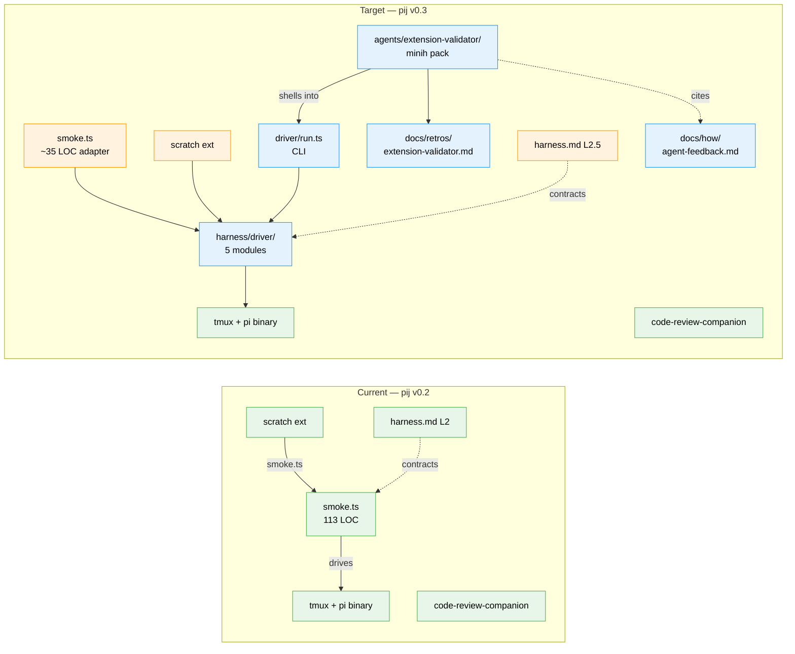

# Flight Plan: Agent Pilot Harness

**Spec**: [agent-pilot-harness-spec.md](./agent-pilot-harness-spec.md)
**Plan**: [agent-pilot-harness-plan.md](./agent-pilot-harness-plan.md)
**Research**: [research-dossier.md](./research-dossier.md) (6 subagents · 56 findings)
**Workshop**: [workshops/001-driver-sdk-api-surface.md](./workshops/001-driver-sdk-api-surface.md) ✅ Implementation Ready
**Generated**: 2026-05-10 · **Updated**: 2026-05-11 (post-architect)
**Status**: **In Progress** (Phase 1 active under `/plan-6-v2-implement-phase-companion`)

---

## The Mission

**What we're building**: A typed tmux Driver SDK at `harness/driver/` plus an `extension-validator` minih agent slug, so future agents can pilot `pi` inside tmux to validate extensions end-to-end. The first agent run validates `scratch` (the only kept extension) and produces the first **magic-wand wish list** — feedback that becomes harness recipes for the next extension.

**Why it matters**: pij's harness IS the product. Today every caller rediscovers tmux automation badly; encoding it once unlocks autonomous validator agents, retires three open difficulties (D-006, D-014, D-005-evidence), and produces the second real-extension velocity data point that AC-15's compounding hypothesis needs.

---

## Where We Are → Where We're Headed

```
TODAY (pij v0.2):                          AFTER this plan (pij v0.3):
1 kept extension (scratch)                 1 kept extension + 1 validator agent
~110 LOC of tmux automation                ~450 LOC typed Driver SDK + ~35 LOC adapter
Smoke is local-only, agent-unfriendly      Smoke calls Driver SDK; agent does too
1 real-extension velocity data point       2 data points (unblocks AC-15 at ext #3)
0 magic-wand wishes captured               1+ magic-wand wishes curated

🔵 harness.md BIO contract (L2)            🟡 harness.md BIO contract (L2.5)
🔵 npm scripts (boot/test/lint)            🔵 npm scripts (boot/test/lint)
🟡 harness/scripts/smoke.ts (113 LOC)      🟡 harness/scripts/smoke.ts (~35 LOC adapter)
🟡 .pi/extensions/scratch/*.ts             🟡 scratch (Step union; D-006 setStatus fix)
❌ no Driver SDK                            🔴 harness/driver/ (5 files: tmux/errors/session/index/run)
❌ no validator agent                       🔴 agents/extension-validator/ (5-file minih pack)
❌ no agent-feedback docs                   🔴 docs/how/agent-feedback.md (magic-wand loop)
❌ no agent CLI                             🔴 harness/driver/run.ts (JSON in, JSON out)
❌ no validator retros home                 🔴 docs/retros/extension-validator.md (auto-harvest)

🔵 D-013 fresh-clone (encoded)             🔵 D-013 fresh-clone (encoded)
🟡 D-014 shell-quoting (open)              ✅ D-014 closed (argv-array)
🟡 D-006 setStatus("") (open)              ✅ D-006 closed (use undefined)
🟡 D-005 customType /compact (open)        ⏳ D-005 evidence captured (pass → encoded)
🟡 D-008 SDK-driven smoke (open)           🟡 D-008 still open (CI smoke deferred)
```

**Legend**: 🔵 unchanged · 🟡 modified · 🔴 new · ✅ resolved · ⏳ evidence pending · ❌ absent



**Legend**: existing (green, unchanged) · changed (orange, modified) · new (blue, created)

---

## Scope

**Goals**:
- Encode all 12 tmux gotchas (TC-01..TC-12) in `harness/driver/` so no caller rediscovers them
- Make `extension-validator` an installable minih agent slug, modeled on `code-review-companion`
- Produce the second real-extension velocity data point (extension #2 — the validator pilot itself)
- Capture the first magic-wand wish list and curate one wish through the full A→B→C loop
- Close D-014 (shell-quoting) and D-006 (`setStatus` semantics)
- Capture D-005 evidence (`customType` survives `/compact`) via the validator pilot
- Keep tmux substrate visible — humans can still `tmux attach` to a validator run

**Non-Goals**:
- node-pty headless path (defers to D-008 stretch — not v1)
- CI smoke integration (still local-only)
- Companion-mode validator slug (one-shot only for v1)
- Automated wish→difficulty curator pipeline (humans review retros manually)
- Multi-extension batch validation (one extension per run)
- Speculative pre-compaction snapshot fallback (T014 conditional — only ships if D-005 falsifies)
- Workshops 002 (validator agent prompt) and 003 (magic-wand envelope) — both optional, deferred

---

## Journey Map


**Legend**: green = done · yellow = next/active · grey = not started

---

## Phases Overview

Single phase (Mode: Simple).

| Phase | Title | Tasks | CS | Status |
|-------|-------|-------|----|--------|
| 1 | Driver SDK + Validator Pilot | 13 mandatory + 1 conditional (T014) | CS-2 | In Progress |

### Phase 1 task summary

| Group | Tasks | What it ships |
|-------|-------|---------------|
| SDK module + tests | T001 (tmux), T002 (errors), T003 (session), T004 (index/orchestrator), T005 (run.ts CLI), T006 (integration tests) | `harness/driver/` (~450 LOC) + unit + integration tests |
| Adapters + scratch fixes | T007 (smoke.ts adapter), T008 (scratch smoke rewrite), T009 (scratch D-006 fix + ledger) | smoke runs over Driver SDK; scratch uses new shape; D-006 → encoded |
| Validator pack + docs | T010 (extension-validator pack), T011 (docs/how/agent-feedback.md) | `agents/extension-validator/` + magic-wand loop docs |
| Pilot + ledger sweep | T012 (pilot — USER-DRIVEN), T013 (difficulties + velocity + README + harness.md) | First green pilot · D-014 → encoded · velocity row 7 · harness.md L2.5 |
| Conditional | T014 (D-005 fallback dossier) | Only if T012 falsifies D-005 |

---

## Acceptance Criteria

- [ ] AC-01: SDK module compiles · `harness/driver/{tmux,session,errors,index,run}.ts` typecheck and lint clean
- [ ] AC-02: Unit tests pass · ≥10 tests with mocked `node:child_process`
- [ ] AC-03: `npm run smoke -- scratch` exits 0 against real `pi` via the new SDK adapter
- [ ] AC-04: Scratch's `smoke.ts` uses the discriminated `Step` union; no fixed sleeps remain
- [ ] AC-05: D-006 fix lands in scratch (`setStatus("scratch", undefined)`) · ledger → encoded
- [ ] AC-06: D-014 closed · no `args.join(" ")` shell strings in `harness/` · ledger → encoded
- [ ] AC-07: `harness/driver/run.ts` accepts JSON scenario, prints JSON `RunReport`
- [ ] AC-08: `agents/extension-validator/` pack installs locally
- [ ] AC-09: Validator pilots scratch unattended; `report.json` has non-empty `retrospective.magicWand`
- [ ] AC-10: D-005 evidence captured in `RunReport`; ledger updated based on outcome
- [ ] AC-11: `docs/velocity.md` row 7 records first green validator wall-clock
- [ ] AC-12: At least one magic-wand wish curated to a difficulty row, SDK enhancement, or "no action" disposition
- [ ] AC-13: Human can `tmux attach -t pij-<scenario>-<pid>` during/after a validator run

---

## Key Findings (top 6 from plan)

| # | Impact | Finding |
|---|--------|---------|
| 01 | Critical | Workshop 001 is authoritative paste-ready code — implementation phase is transcription, not design |
| 02 | Critical | D-014 closes by argv-array execution everywhere — `execFileSync("tmux", argv)` retires the class |
| 03 | Critical | D-006 closed during research via PR-04 — scratch's `setStatus("", "")` is a bug today; one-line fix |
| 04 | High | `agents/code-review-companion/` is the structural template for `agents/extension-validator/` |
| 05 | High | D-005 evidence requires a manual pilot — agent in main session cannot drive interactive minih+tmux+pi |
| 06 | High | Mock policy carve-out: `node:child_process` mocked for SDK unit tests only; integration uses real tmux against `bash` |

---

## Key Risks

| Risk | Likelihood | Impact | Mitigation |
|------|-----------|--------|------------|
| R-1: SDK abstractions don't fit validator's actual needs | Medium | Medium | Magic-wand wish loop (AC-12) is exactly the surface for this |
| R-3: D-005 falsifies | Low–Medium | High | T014 is dormant fallback dossier; SDK + pack still land cleanly |
| R-7: Workshops 002/003 scope creep during T010 | Medium | Low | T010 explicitly transcribes from `code-review-companion`; deviations need explicit decision |
| R-8: scratch smoke rewrite breaks `npm run smoke -- scratch` | Low | Medium | T007 lands first; T008 immediately follows; both verified before T009 |

(Full risk table: see [plan § Risks](./agent-pilot-harness-plan.md#risks))

---

## Clarifications Logged (2026-05-10)

All 8 questions resolved at Recommended defaults. Highlights:

- **Testing**: Hybrid — TDD for SDK (mocked `child_process`); lightweight for agent pack; manual for pilot
- **Mocks**: Targeted exception — mock `node:child_process` for SDK unit tests only
- **Docs**: Hybrid — README + new `docs/how/agent-feedback.md` for the magic-wand loop
- **Harness**: Extend `harness.md` Interact + History; bump maturity L2 → L2.5
- **Validator pack**: Local-only at `agents/extension-validator/` for v1; registry publish deferred
- **Domain Review**: Skipped — pij has no formal `docs/domains/`

Full table in [`agent-pilot-harness-spec.md` § Clarifications](./agent-pilot-harness-spec.md#clarifications).

---

## Flight Log

<!-- Updated by /plan-6 and /plan-6a after each phase completes -->

_No phases completed yet. Phase 1 begins after `/plan-4` (readiness gate) → `/validate-v2` (thesis-aware review)._

---

## Next Steps

1. ✅ `/plan-1a-explore` — research dossier (56 findings)
2. ✅ `/plan-2c-workshop "Driver SDK API surface"` — workshop 001 (Implementation Ready)
3. ✅ `/plan-1b-specify --simple` — spec with 13 ACs
4. ✅ `/plan-2-clarify` — 8 answers, all Recommended
5. ✅ `/plan-3-architect` — plan with 13+1 tasks (just completed)
6. **Next**: `/plan-4-v2-complete-the-plan` — readiness gate (5 validators in parallel)
7. `/validate-v2` — thesis-aware review (forward-compatibility, thesis alignment)
8. `/plan-6-v2-implement-phase-companion` — ship with parallel companion review
