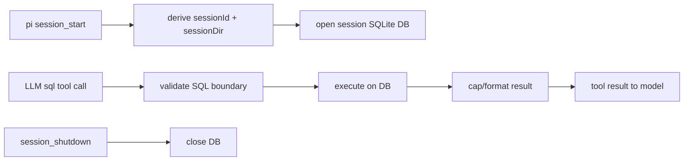

# Research Report: Generic SQLite Session Tool

**Generated**: 2026-05-14T12:13:47Z
**Research Query**: "prepare a plan for a generic SQL Lite tool, linked to current session"
**Mode**: Pre-Plan
**Location**: `docs/plans/006-generic-sqlite-session-tool/research-dossier.md`
**FlowSpace**: Not available (only Perplexity MCP detected)
**Findings**: 34

## Executive Summary

### What It Should Do

Build a pi extension that gives the running agent a private SQLite workbench scoped to the current pi session. The model can create whatever tables it wants and run SQL to manage structured in-session work: todos, review queues, test matrices, dependency graphs, batches, and state machines.

### Business Purpose

This is not historical memory and not DuckDB/cloud session search. It is a **session-local working memory substrate**: a low-friction place for the agent to structure its own current task without polluting project files or requiring a bespoke todo extension for every workflow.

### Key Insights

1. **Pi already exposes the right extension surface**: `registerTool`, `session_start`, `session_shutdown`, `ctx.sessionManager.getSessionId()`, and `appendEntry`/session APIs are enough for a session-linked SQLite tool.
2. **Use a DB per pi session ID**: derive storage from `ctx.sessionManager.getSessionDir()` + `getSessionId()`; use `:memory:` only for ephemeral/no-session mode.
3. **SQLite driver is the key decision**: local Node is v24.7.0 and supports `node:sqlite` / `DatabaseSync`, but pi advertises Node `>=20.6.0`; choosing `node:sqlite` likely means explicitly requiring newer Node for this extension or adding a fallback dependency.
4. **The harness is ready**: scaffold via `npm run new -- session-sql`; test the pi-free store; smoke via `/sql` command; run `npm run self-check`.

### Quick Stats

- **Relevant project components**: 10 files inspected
- **Relevant pi APIs**: 6 (`registerTool`, `registerCommand`, `session_start`, `session_shutdown`, `getSessionId`, `getSessionDir`)
- **Test strategy**: store-level SQLite unit tests + TUI smoke command
- **Complexity**: Medium (driver/version/security boundary decisions)
- **Prior Learnings**: 6 directly relevant
- **Domains**: No domain registry found

## Agent Harness Status

- **Engineering substrate**: Present. `package.json` defines `typecheck`, `test`, `lint`, `new`, `smoke`, and `self-check` scripts (`package.json:24-34`).
- **Agent harness governance**: Present under legacy filename `docs/project-rules/harness.md`.
- **Maturity**: L2 — `npm install` boot, `npm run self-check` observe, tmux-driven smoke interact (`docs/project-rules/harness.md:7`, `docs/project-rules/harness.md:33-50`).
- **Note**: Legacy filename — consider migrating `harness.md` to `agent-harness.md` later, but do not modify as part of this research.

## How It Currently Works

### Entry Points Available

| Entry Point | Type | Location | Purpose |
|------------|------|----------|---------|
| `pi.registerTool` | Extension API | `pi-mono/.../extensions/types.ts:1133` | Expose LLM-callable SQL tool |
| `pi.registerCommand` | Extension API | `docs/plans/001-pi-extensions/findings/01-extension-api.md:IA-03` | Add `/sql` debug/smoke command |
| `session_start` | Event | `pi-mono/.../extensions/types.ts:1090` | Open/reopen DB for current session |
| `session_shutdown` | Event | `pi-mono/.../extensions/types.ts:554` | Close DB before reload/new/resume/fork/quit |
| `ctx.sessionManager.getSessionId()` | Session API | `pi-mono/.../session-manager.ts:188` | Stable current-session key |
| `ctx.sessionManager.getSessionDir()` | Session API | `pi-mono/.../session-manager.ts:188` | Storage root for DB files |

### Core Execution Flow

1. **Extension loads**
   - Scaffolded at `.pi/extensions/session-sql/` using `npm run new -- session-sql`.
   - `index.ts` registers a `sql` tool and `/sql` command.

2. **Session starts**
   - `session_start` fires for `startup`, `reload`, `new`, `resume`, and `fork`.
   - Handler computes current DB target:
     - persisted session: `<sessionDir>/session-sql/<sessionId>.sqlite`
     - no-session/ephemeral: `:memory:`
   - Store opens DB, initializes pragmas, and maybe creates optional default tables (`todos`, `todo_deps`) only if the product spec chooses defaults.

3. **Agent calls `sql` tool**
   - Tool accepts `{ query, description }` and optional output caps.
   - Store executes SQL against the current session DB.
   - Results return rows for result-producing statements and metadata for mutations.
   - Errors return tagged results, not thrown exceptions.

4. **Human/debug smoke uses `/sql`**
   - `/sql status` displays DB scope/path/counts.
   - `/sql <statement>` runs a statement and renders a compact result.
   - `/sql reset` confirms and deletes/recreates the current session DB.

5. **Session shuts down or switches**
   - `session_shutdown` closes the current `DatabaseSync` handle.
   - A replacement session gets a new extension instance and new DB handle.

### Data Flow



### State Management

- Primary state should live in SQLite, not in `appendEntry` replay.
- The session identity comes from pi's `SessionManager`, not global process state.
- DB handles are in-memory runtime resources and must be re-created on `session_start`.
- DB files are session artifacts. They should not be sent to the LLM unless queried through the tool.

## Architecture & Design

### Proposed Component Map

| File | Responsibility |
|------|----------------|
| `.pi/extensions/session-sql/index.ts` | Pi wiring: tool, command, lifecycle, UI status |
| `.pi/extensions/session-sql/store.ts` | Pi-free SQLite session DB manager, validation, result formatting |
| `.pi/extensions/session-sql/store.test.ts` | Unit tests against temp DB / `:memory:` |
| `.pi/extensions/session-sql/smoke.ts` | TUI smoke via `/sql` command |
| `.pi/extensions/session-sql/AGENTS.md` | Generated extension-local checklist |

### Design Patterns To Follow

1. **T2 extension layout**
   - Required by AGENTS rules: `.pi/extensions/<name>/{index,store,test}.ts`.

2. **Pi-free store**
   - `store.ts` must import nothing from `@earendil-works/*`.
   - Node built-ins (`node:fs`, `node:path`, `node:sqlite`) are acceptable if the driver decision accepts Node version constraints.

3. **Side effects injected or isolated**
   - Store owns SQLite side effects behind a narrow class boundary.
   - `index.ts` owns pi side effects (`ctx.ui`, `pi.registerTool`, events).

4. **Tagged-union returns over throws**
   - `executeSql()` returns `{ ok: true, ... } | { ok: false, reason, message }`.
   - Tool catches no expected store exceptions because store normalizes them.

5. **Constants in `store.ts`**
   - `MAX_QUERY_BYTES`, `MAX_RESULT_ROWS`, `MAX_RESULT_BYTES`, blocked statements, default pragmas.

6. **One `session_start` handler**
   - Covers startup/reload/new/resume/fork; no separate reload handler.

### Candidate Tool Contract

```ts
pi.registerTool({
  name: "sql",
  label: "Session SQL",
  description: "Execute SQLite against a private database scoped to the current pi session. Use it for task tracking, test matrices, batch state, and structured temporary work.",
  promptSnippet: "sql: run SQLite against a private per-session scratch database for structured task state.",
  promptGuidelines: [
    "Use sql when structured session-local state would help: todos, dependencies, review queues, test matrices, batches.",
    "Create tables as needed; this database is private to the current pi session and is not long-term memory.",
    "Keep query results compact; use LIMIT for exploratory SELECTs.",
  ],
  parameters: Type.Object({
    query: Type.String({ description: "SQLite statement(s) to execute against the current session database." }),
    description: Type.String({ description: "2-5 word summary of what this query does." }),
  }),
  executionMode: "sequential",
  async execute(_id, params, _signal, _onUpdate, ctx) { /* ... */ },
});
```

### Candidate Store Result Types

```ts
type SqlResult =
  | { ok: true; kind: "rows"; rows: Record<string, unknown>[]; columns: string[]; truncated: boolean }
  | { ok: true; kind: "change"; changes: number; lastInsertRowid?: number | bigint }
  | { ok: true; kind: "exec"; message: string }
  | { ok: false; reason: "not_open" | "too_large" | "unsafe" | "sqlite_error"; message: string };
```

## Dependencies & Integration

### Internal Dependencies

| Dependency | Purpose | Risk if Changed |
|------------|---------|-----------------|
| `harness/scripts/new-extension.ts` | Scaffold extension from templates | Low; stable generator (`harness/scripts/new-extension.ts:2-67`) |
| `harness/templates/extension/*` | Encodes P1-P10 baseline | Medium; template currently has `setStatus(..., "")` drift (`index.ts.template:17`) |
| `harness/test-utils.ts` | Store test recorder patterns | Low; may not be needed if SQLite side effect is tested directly |
| `harness/scripts/smoke.ts` | Runs extension smoke scenarios | Low; supports no-scenario success and filtered scenarios (`harness/scripts/smoke.ts:12-42`) |
| `SessionManager` | Session ID/dir/file access | Medium; source of current-session link |

### External Dependencies / Driver Options

| Option | Pros | Cons | Recommendation |
|--------|------|------|----------------|
| `node:sqlite` / `DatabaseSync` | Zero npm dependency; sync API; local Node v24.7.0 verified; TypeScript import typechecks | Experimental warning locally; pi package supports Node `>=20.6.0`, where this may not exist | Best product fit **if** we explicitly accept/bump Node requirement for this extension |
| `better-sqlite3` | Mature sync API; fast | Native dependency/build friction for git/npm pi packages | Good fallback if Node 20 support is mandatory and native builds are acceptable |
| `sqlite3` | Common package | Async callback complexity; native dependency | Avoid for this small session store |
| `sql.js` | Pure WASM; Node 20 compatible | WASM/package resolution; manual persistence/export; heavier model | Consider only if avoiding native deps while preserving Node 20 is mandatory |

### Local Verification

- Local Node: `v24.7.0`.
- `require("node:sqlite")` works and exposes `DatabaseSync`, `StatementSync`, `backup`, and constants.
- Local import typecheck of `import { DatabaseSync } from "node:sqlite"` passes with current `@types/node`.
- Runtime emits: `ExperimentalWarning: SQLite is an experimental feature and might change at any time`.

## Quality & Testing

### Unit Test Targets

`store.test.ts` should cover:

1. Opens `:memory:` DB and executes `CREATE TABLE`.
2. Executes `INSERT`, `SELECT`, and `INSERT ... RETURNING`.
3. Returns tagged `sqlite_error` for invalid SQL.
4. Caps result rows and marks `truncated: true`.
5. Rejects oversized query strings.
6. Rejects filesystem escape statements if chosen (`ATTACH`, `VACUUM INTO`, `load_extension`).
7. Closes DB idempotently.
8. Opens separate DB files for separate session IDs.
9. `reset()` recreates a clean DB.
10. Optional default `todos` tables exist only if spec chooses default bootstrap.

### Smoke Test Strategy

Use `/sql` command because LLM tool invocation is hard to assert deterministically in tmux:

1. `/sql status` → expect `session-sql` and current mode.
2. `/sql create table task(id integer primary key, title text)` → expect success.
3. `/sql insert into task(title) values ('smoke')` → expect change/success.
4. `/sql select title from task` → expect `smoke`.
5. `/reload` then `/sql select title from task` → expect `smoke` if persistence is file-backed.
6. `/sql reset` with confirmation if implemented.

### Current Gaps

- No current extension remains in `.pi/extensions/` after retiring scratch; this will become the next real extension data point.
- `D-005` (`customType` survival across `/compact`) remains open, but this SQLite tool does not need `customType` for primary state. If it uses `appendEntry` for metadata, add a compact smoke.
- The generated template still clears status with `""`; implementation must use `undefined` per D-006.

## Prior Learnings

### PL-01: Use `getEntries()`, not `.entries`

**Source**: `docs/difficulties.md:18`, `docs/plans/003-scratch/execution.log.md:52`
**Type**: gotcha

**What They Found**: Real `ReadonlySessionManager` exposes `getEntries()`; workshop/template drift once used `.entries`.

**Action**: For this extension, use `getSessionId()`, `getSessionDir()`, and `getEntries()` methods only. Do not access imaginary properties.

### PL-02: `setStatus(key, "")` does not clear

**Source**: `docs/difficulties.md:13`, `docs/plans/004-agent-pilot-harness/research-dossier.md:146`
**Type**: gotcha

**What They Found**: Only `undefined` clears a footer status. Empty string stores an empty status.

**Action**: `refreshStatus(ctx)` should call `ctx.ui.setStatus("sql", undefined)` when no DB/status should render.

### PL-03: `notify(..., "success")` is invalid

**Source**: `docs/difficulties.md:25`
**Type**: API drift

**What They Found**: `ctx.ui.notify` accepts only `"info" | "warning" | "error"`.

**Action**: Use `"info"` for successful SQL command notifications.

### PL-04: Keep pi wiring out of the store

**Source**: `AGENTS.md` P2/P3/P8; `harness/templates/extension/store.ts.template`
**Type**: convention

**What They Found**: Tests target the pi-free store; side effects should be isolated.

**Action**: Store may use SQLite/file APIs, but it must not import pi packages. Test the store directly.

### PL-05: Persist-before-mutate is less relevant but the consistency principle still applies

**Source**: `AGENTS.md` P9; scratch notes
**Type**: architectural pattern

**What They Found**: For event-sourced state, append before in-memory mutation.

**Action**: SQLite statements are the persistence operation. Do not update any mirrored in-memory counters before the SQL statement succeeds.

### PL-06: `limit: 0` edge cases bite

**Source**: `docs/difficulties.md:26`, `docs/plans/003-scratch/execution.log.md:84`
**Type**: JavaScript gotcha

**What They Found**: `slice(-0)` returns the full array.

**Action**: Implement explicit output cap handling: if max rows/bytes is 0, return no rows, not all rows.

### Prior Learnings Summary

| ID | Type | Key Insight | Action |
|----|------|-------------|--------|
| PL-01 | gotcha | Session APIs are methods | Use `getSessionId()`/`getSessionDir()` |
| PL-02 | gotcha | Clear status with `undefined` | Never use empty string to clear |
| PL-03 | API drift | No `success` notify level | Use `info` |
| PL-04 | convention | Store stays pi-free | Test store directly |
| PL-05 | architecture | Persistence is source of truth | SQL success gates any mirror |
| PL-06 | JS gotcha | Zero limits need explicit branch | Test caps carefully |

## Domain Context

No domain registry exists.

Potential domains identified:

| Proposed Domain | Evidence | Boundary | Files |
|----------------|----------|----------|-------|
| Extension authoring harness | Existing generator/templates/smoke | How pij scaffolds and validates pi extensions | `harness/scripts/new-extension.ts`, `harness/templates/extension/*`, `harness/scripts/smoke.ts` |
| Session-scoped agent work state | New concept | Runtime-only structured data tied to pi sessions | Proposed `.pi/extensions/session-sql/*` |
| Pi extension lifecycle integration | Existing pi API docs/source | Session lifecycle, tools, UI | pi-mono `extensions/types.ts`, `session-manager.ts` |

Potential domain action: if this grows beyond one extension, formalize a `session-work-state` domain covering generic task/state tools for agents.

## Critical Discoveries

### Critical Finding 01: Driver choice controls portability

**Impact**: High
**Source**: Local Node test + pi package metadata
**What**: `node:sqlite` is available locally on Node v24.7.0, but pi's package engine is `>=20.6.0` and pij's root engine is `>=20`.
**Why It Matters**: A top-level `import { DatabaseSync } from "node:sqlite"` will fail on older supported Node versions.
**Required Action**: Decide in spec whether to require Node 24+ for this extension or use a dependency/fallback.

### Critical Finding 02: Session scope should use `sessionId`, not cwd or global files

**Impact**: High
**Source**: `ReadonlySessionManager` includes `getSessionId`, `getSessionDir`, and `getSessionFile` (`session-manager.ts:188-195`).
**What**: Cwd-level files would create project memory, not session memory.
**Why It Matters**: User explicitly wants current-session context, not persistent global memory.
**Required Action**: DB path must derive from current session manager.

### Critical Finding 03: SQL freedom needs a filesystem boundary

**Impact**: High
**Source**: SQLite capabilities + user intent
**What**: SQLite can use statements like `ATTACH` or extension loading to cross the intended DB boundary.
**Why It Matters**: The user wants the model to do what it likes **in SQL as a session store**, not arbitrary filesystem writes through SQLite.
**Required Action**: Either explicitly allow all SQLite power, or block `ATTACH`, `VACUUM INTO`, and extension loading. Recommendation: block filesystem escape by default with a clear error.

### Critical Finding 04: Smoke should avoid relying on LLM behavior

**Impact**: Medium
**Source**: Harness smoke is tmux/TUI step based (`harness/scripts/smoke.ts:2-42`).
**What**: Testing a tool by asking the model to call it is slow/flaky.
**Why It Matters**: The harness needs deterministic validation.
**Required Action**: Add `/sql` command that exercises the same store path as the tool.

## Modification Considerations

### Safe to Modify

1. **New extension directory**: `.pi/extensions/session-sql/` is isolated.
2. **Store tests**: adding SQLite temp-file tests is local and fast.
3. **Smoke scenario**: new `smoke.ts` is discoverable without touching runner.

### Modify with Caution

1. **Root `package.json` engines**
   - If using `node:sqlite`, bumping engines to Node 24+ affects the whole harness.
   - Alternative: extension-specific dependency/driver.

2. **Tool name `sql`**
   - Generic and desirable, but could collide with another extension.
   - Pi conflict handling exists, but the UX is best if this owns `sql` in pij.

3. **Default tables**
   - Auto-creating `todos` is helpful but can feel opinionated.
   - Better default: create no user tables, but document suggested schemas in tool description; optionally expose `/sql init todos`.

### Danger Zones

1. **Letting SQL write outside the session DB**
   - `ATTACH` and extension loading can break the session-only promise.

2. **Returning huge query results**
   - Must cap rows/bytes to protect context and TUI rendering.

3. **Sharing one DB across sessions**
   - Violates the core product requirement.

## Recommended Plan Shape

### Phase 0 — Driver Decision Spike

- Confirm desired portability target:
  - Option A: require Node 24+ and use `node:sqlite`.
  - Option B: preserve Node 20 and use `better-sqlite3` or `sql.js`.
- Run a tiny `tsx` spike from repo root importing the chosen driver.
- Record decision in the spec/plan.

### Phase 1 — Scaffold Extension

- Run `npm run new -- session-sql`.
- Keep T2 layout.
- Replace generated ping tool with `sql` tool.
- Fix generated status clearing to use `undefined` if status is used.

### Phase 2 — Store / SQL Runner

- Implement `SessionSqlStore` in `store.ts`.
- Derive/open DB from `{ sessionId, sessionDir }` passed by `index.ts`.
- Execute SQL sequentially.
- Return tagged-union results.
- Cap output rows/bytes.
- Block filesystem escape statements if spec agrees.

### Phase 3 — Pi Wiring

- `session_start`: open DB for current session.
- `session_shutdown`: close DB.
- `registerTool("sql")`: model-facing SQL workbench.
- `registerCommand("sql")`: status/run/schema/reset for humans and smoke.
- Optional `promptGuidelines`: tell the model when to use session SQL.

### Phase 4 — Tests

- Store unit tests for success, errors, caps, reset, session separation.
- No pi runtime in unit tests.
- Avoid `any` types and inline imports.

### Phase 5 — Smoke + Self-check

- Smoke `/sql` command path: status → create → insert → select → reload → select.
- Run `npm run typecheck`, `npm test`, `npm run lint`, `npm run smoke -- session-sql`, then `npm run self-check`.
- Update `docs/velocity.md` and `docs/difficulties.md` if any friction appears.

## External Research Opportunities

### Research Opportunity 1: Node SQLite stability and version floor

**Why Needed**: Local Node supports `node:sqlite`, but it emits an experimental warning and pi supports Node `>=20.6.0`.
**Impact on Plan**: Determines whether this extension can be zero-dependency or needs a dependency/fallback.
**Source Findings**: Critical Finding 01.

**Ready-to-use prompt:**

```text
/deepresearch "For a TypeScript pi coding-agent extension that provides a per-session SQLite scratch database, determine the best SQLite driver choice as of 2026. Context: pi package engine is Node >=20.6.0, local development is Node 24.7.0, @types/node supports node:sqlite, and pi git/npm extensions may be installed with npm. Compare node:sqlite DatabaseSync, better-sqlite3, sqlite3, and sql.js for stability, install friction, Node version compatibility, security/sandboxing, TypeScript ergonomics, and suitability for a local session-scoped agent workbench. Recommend a version floor and migration/fallback strategy."
```

**Results location**: `docs/plans/006-generic-sqlite-session-tool/external-research/sqlite-driver-choice.md`

## Appendix: File Inventory

### Core Files Inspected

| File | Purpose |
|------|---------|
| `package.json` | Scripts, pi resource paths, peer deps, Node engine |
| `harness/scripts/new-extension.ts` | Extension generator |
| `harness/templates/extension/index.ts.template` | Pi wiring template |
| `harness/templates/extension/store.ts.template` | Pi-free store template |
| `harness/templates/extension/store.test.ts.template` | Store test template |
| `harness/templates/extension/smoke.ts.template` | Smoke template |
| `harness/scripts/smoke.ts` | Scenario discovery/runner adapter |
| `docs/project-rules/harness.md` | BIO harness contract |
| `docs/difficulties.md` | Prior gotchas |
| `pi-mono/.../extensions/types.ts` | Extension API source of truth |
| `pi-mono/.../session-manager.ts` | Session identity/storage source of truth |

## Next Steps

1. Run `/plan-1b-specify "Build a pi extension that exposes a generic SQLite tool scoped to the current pi session"`.
2. Clarify driver choice: zero-dep Node 24+ `node:sqlite` vs Node 20-compatible dependency.
3. If driver uncertainty matters, run the external research prompt above before specifying.
4. Then run `/plan-3-architect` to produce phase tasks.

---

**Research Complete**: 2026-05-14T12:13:47Z
**Report Location**: `docs/plans/006-generic-sqlite-session-tool/research-dossier.md`
