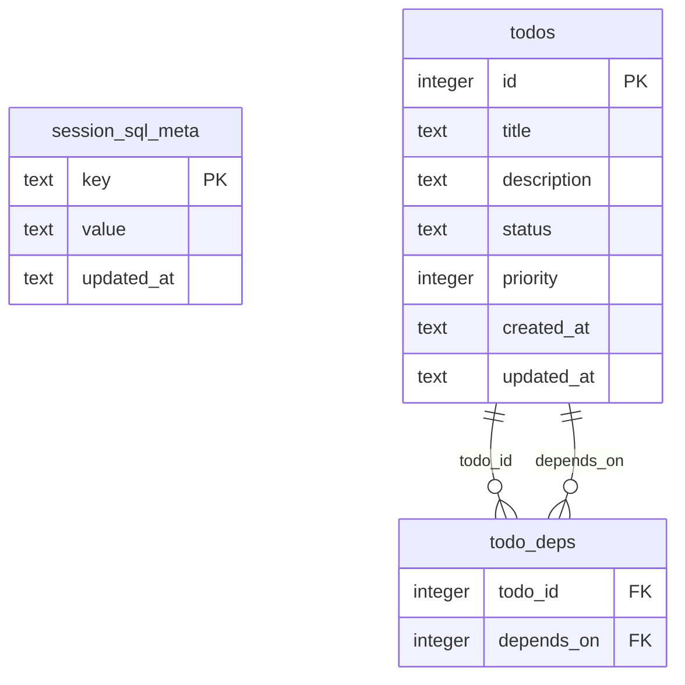

# Workshop: Default Schema and Migrations

**Type**: Data Model / Storage Design
**Plan**: 006-generic-sqlite-session-tool
**Spec**: Pending — this workshop precedes the feature spec
**Created**: 2026-05-15T03:44:22Z
**Status**: Draft

**Value Thesis**: This workshop makes each new session DB immediately useful while preserving arbitrary agent-created schema and a clean path for future default tables.
**Target Proof Level**: Implementation Ready
**Current Proof Level**: Contract Ready

**Selected Value Axes**:
- **Agent Readiness**: The agent gets a useful task/dependency schema on first use.
- **Implementation Readiness**: Exact DDL and bootstrap rules can be implemented directly.
- **Migration Safety**: Version metadata gives future schema additions a path.
- **Learning Compounding**: Default schema decisions are reusable across future work-state tools.

**Related Documents**:
- [Research dossier](../research-dossier.md)
- [Workshop 001: Session SQLite Semantics and Safety Boundary](./001-session-sqlite-semantics-and-safety-boundary.md)
- [Workshop 003: Tool, Command, and Result Contract](./003-tool-command-and-result-contract.md)
- [Workshop 005: Validation and Smoke Harness](./005-validation-and-smoke-harness.md)

---

## Purpose

Define the small default schema created in every new session SQL DB and the migration posture for adding future default tables.

## Fresh Entrant Outcome

A fresh human or agent should be able to use this workshop to reach **Implementation Ready** with no additional context.

They should be able to:

- Paste/adapt the v1 DDL into store initialization.
- Write tests for bootstrap, constraints, persistence, and custom-table preservation.
- Add future default tables through additive migrations.

## Key Questions Addressed

- Should a new DB start blank or include default tables?
- Which default tables belong in v1?
- How does the schema stay useful without becoming an app-specific ontology?
- How is schema version recorded?
- What migration rules protect agent-created tables?
- What tests prove the schema is correct?

---

## Value Frame

| Field | Selection | Why It Matters |
|-------|-----------|----------------|
| Target Proof Level | Implementation Ready | The DDL and tests should flow directly into implementation. |
| Primary Value Axis | Agent Readiness | The model can immediately track work without bootstrapping every session. |
| Supporting Value Axes | Implementation Readiness, Migration Safety, Learning Compounding | The default schema should be small now and extensible later. |
| Downstream Loop Improved | Implementation / Testing / Future migrations / Agent execution | Store initialization and tests become direct translations of this workshop. |

## Evidence Ledger

| Evidence | Location | Supports | Status |
|----------|----------|----------|--------|
| User decision: include a little schema | Workshop 001 | Default schema existence | Ready |
| Proposed DDL | This workshop | Store bootstrap | Ready |
| Tool contract references schema | Workshop 003 | Prompt guidance and `/sql schema` | Ready |
| Test matrix | Workshop 005 | Schema validation | Ready |
| Migration execution evidence | Future implementation tests | Bootstrap/migration correctness | Missing |

## Design Principles

1. **Default, not mandatory**: agents may ignore these tables and create any others.
2. **Small**: v1 is not a full project-management app.
3. **Versioned**: every DB records default schema version.
4. **Additive first**: future default schema changes should add tables/columns, not destroy user data.
5. **Plain SQLite**: no custom extensions, hidden sync, or nonstandard storage.
6. **Custom-table preserving**: initialization/migration must not drop agent-created tables.

## Conceptual Model



## v1 DDL

```sql
PRAGMA foreign_keys = ON;

CREATE TABLE IF NOT EXISTS session_sql_meta (
  key TEXT PRIMARY KEY,
  value TEXT NOT NULL,
  updated_at TEXT NOT NULL DEFAULT CURRENT_TIMESTAMP
);

CREATE TABLE IF NOT EXISTS todos (
  id INTEGER PRIMARY KEY AUTOINCREMENT,
  title TEXT NOT NULL,
  description TEXT,
  status TEXT NOT NULL DEFAULT 'pending'
    CHECK (status IN ('pending', 'in_progress', 'done', 'blocked')),
  priority INTEGER NOT NULL DEFAULT 0,
  created_at TEXT NOT NULL DEFAULT CURRENT_TIMESTAMP,
  updated_at TEXT NOT NULL DEFAULT CURRENT_TIMESTAMP
);

CREATE TABLE IF NOT EXISTS todo_deps (
  todo_id INTEGER NOT NULL REFERENCES todos(id) ON DELETE CASCADE,
  depends_on INTEGER NOT NULL REFERENCES todos(id) ON DELETE CASCADE,
  PRIMARY KEY (todo_id, depends_on),
  CHECK (todo_id != depends_on)
);

INSERT INTO session_sql_meta (key, value, updated_at)
VALUES ('schema_version', '1', CURRENT_TIMESTAMP)
ON CONFLICT(key) DO UPDATE SET
  value = excluded.value,
  updated_at = excluded.updated_at;
```

## Table Contracts

### `session_sql_meta`

| Column | Type | Meaning |
|--------|------|---------|
| `key` | `TEXT PRIMARY KEY` | Metadata key |
| `value` | `TEXT NOT NULL` | String value; JSON allowed if future values need structure |
| `updated_at` | `TEXT NOT NULL` | SQLite timestamp |

Reserved keys:

| Key | Value |
|-----|-------|
| `schema_version` | Current default schema version, starts at `1` |
| `created_by` | Optional future marker, e.g. `pij-session-sql` |
| `created_at` | Optional future DB creation timestamp |

### `todos`

| Column | Type | Meaning |
|--------|------|---------|
| `id` | `INTEGER PRIMARY KEY AUTOINCREMENT` | Stable local task ID |
| `title` | `TEXT NOT NULL` | Short task name |
| `description` | `TEXT` | Optional task detail |
| `status` | `TEXT` constrained | `pending`, `in_progress`, `done`, `blocked` |
| `priority` | `INTEGER` | Agent-defined priority/sort hint |
| `created_at` | `TEXT` | Creation timestamp |
| `updated_at` | `TEXT` | Last update timestamp |

No trigger updates `updated_at` in v1. Agents may update it explicitly.

### `todo_deps`

| Column | Type | Meaning |
|--------|------|---------|
| `todo_id` | FK to `todos(id)` | Dependent task |
| `depends_on` | FK to `todos(id)` | Prerequisite task |

A cycle is not prevented in v1. Agents can query cycles if they care.

## Example Agent Workflows

### Create task list

```sql
INSERT INTO todos(title, description, priority)
VALUES
  ('Choose SQLite driver', 'Confirm node:sqlite floor', 10),
  ('Implement store', 'Open DB, init schema, execute SQL', 8),
  ('Write smoke', 'Use /sql command path', 7);
```

### Add dependency

```sql
INSERT INTO todo_deps(todo_id, depends_on)
VALUES (2, 1);
```

### Query ready tasks

```sql
SELECT t.id, t.title, t.status
FROM todos t
WHERE t.status = 'pending'
  AND NOT EXISTS (
    SELECT 1
    FROM todo_deps d
    JOIN todos prereq ON prereq.id = d.depends_on
    WHERE d.todo_id = t.id
      AND prereq.status != 'done'
  )
ORDER BY t.priority DESC, t.id ASC;
```

## Migration Contract

### Bootstrap algorithm

1. Open DB.
2. Enable `PRAGMA foreign_keys = ON` for the connection.
3. Ensure `session_sql_meta` exists.
4. Read `schema_version` if present.
5. Apply needed migrations up to current version.
6. Write final `schema_version`.
7. Never drop agent-created tables during bootstrap.

### Migration shape

```typescript
interface Migration {
  from: number;
  to: number;
  sql: string;
}
```

v1 may use idempotent bootstrap instead of a full migration runner, but the implementation should not make future migrations harder.

### Future table candidates

| Table | Purpose | Add when |
|-------|---------|----------|
| `batches` | Track batch operations | Repeated batch workflows appear |
| `batch_items` | Per-item status/results | Batch workflows need item granularity |
| `test_cases` | TDD/test matrix | Agents repeatedly plan tests in SQL |
| `review_items` | Code review findings | Review workflows adopt SQL store |
| `decisions` | Lightweight session decisions | Agents need a local decision ledger |

## Decision Space

| Option | Description | Pros | Cons | Decision |
|--------|-------------|------|------|----------|
| Blank DB | No default tables | Pure scratchpad | Agent bootstraps common tables every time | Rejected |
| Minimal versioned schema | Meta + todos + deps | Useful immediately; migration anchor | Slightly opinionated | Selected |
| Rich work-management schema | Many default tables | Covers more workflows | Premature ontology | Rejected v1 |
| Triggers for `updated_at` | Auto-update timestamps | Less manual SQL | Hidden behavior | Rejected v1 |
| Additive migrations | Only add defaults over time | Low risk to custom tables | Some cleanup deferred | Selected |
| Destructive migrations | Drop/reshape defaults | Cleaner schema evolution | Data-loss risk | Rejected unless future workshop approves |

## Attention Reduction

| Future Loop | Before Workshop | After Workshop |
|-------------|-----------------|----------------|
| Implementation | Store bootstrap shape was open | DDL and algorithm are explicit. |
| Testing | Agent would invent schema tests | Test expectations are clear. |
| Agent execution | Model starts from blank DB | Useful default tasks/deps exist. |
| Future migrations | Schema changes could be ad hoc | Version/migration posture exists. |
| Review | Reviewer would ask whether custom tables survive | Preservation is a stated rule. |

## Open Questions

### Q1: Should v1 include triggers?

**Decision**: No. Keep v1 plain and explicit; agents can update `updated_at` manually.

### Q2: Should cycles be prevented in `todo_deps`?

**Decision**: No. Cycle prevention requires recursive checks/triggers and is overkill for v1.

### Q3: Should default schema include `decisions` now?

**Direction**: Not in v1. Add after real usage shows demand.

## Validation / Acceptance

This workshop reaches Implementation Ready when:

- Store initialization uses this DDL or a reviewed equivalent.
- Tests prove all v1 tables exist in a new DB.
- Tests prove `schema_version = 1`.
- Tests prove invalid todo status fails.
- Tests prove cascade delete works when foreign keys are enabled.
- Tests prove custom agent-created tables survive reopen/bootstrap.

## Quick Reference

```text
v1 tables: session_sql_meta, todos, todo_deps
schema_version: 1
migration mode: additive-first
custom tables: must survive bootstrap/reopen
triggers: none in v1
cycle prevention: none in v1
```
