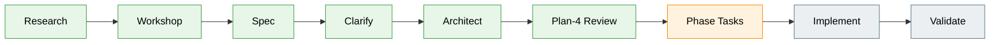

# Flight Plan: Pi-Native Minih Workbench

**Spec**: [agent-workbench-spec.md](./agent-workbench-spec.md)  
**Plan**: [agent-workbench-plan.md](./agent-workbench-plan.md)  
**Dossier**: [research-dossier.md](./research-dossier.md) + `/tmp/pij-minih-flowspace-v3/research-dossier.md`  
**Workshops**: [001 Pi-native Agent Workbench UX](./workshops/001-pi-native-agent-workbench-ux.md) — Minih-only full modal viewer first  
**Generated**: 2026-05-16  
**Status**: Ready for Phase 1 task dossier  
**Mode**: Full, max 3 implementation phases  
**Complexity**: CS-5 (epic)

---

## The Mission

**What we're building**: A Pi-native Minih Workbench that lets users see what is happening in Minih without leaving Pi. V1 lists running Minih agents, lets the user select one with arrow keys, opens a full-area Pi modal/popover with a Minih `--human`-like live view, supports scrollback/status/tool visibility, and closes safely with `Esc` without stopping the Minih run. Phase 3 then adds typed messaging, explicit stop/report controls, and push-context delivery.

**Why it matters**: Minih companions and agent runs produce valuable context, findings, statuses, and reports, but today they are hidden behind separate CLI views and artifact paths. The first proof makes Minih observable from the main Pi session; Phase 3 makes it interactable and context-aware.

---

## Current State → Target State

```text
TODAY:                                      TARGET:
Minih runs exist outside Pi                 /minih lists running Minih agents
User runs minih view/attach separately      Enter opens a Pi-native modal viewer
Artifacts are inspectable but hidden        Transcript/tools/status/report visible in Pi
Esc/close semantics are external CLI        Esc closes modal, run continues
Typing semantics are broad/ambiguous        Phase 3 coordinated typing from modal
Companion findings require polling          Phase 3 push-context delivery
Right monitor idea existed                  Right monitor is deferred / out of v1
```

---

## Scope Snapshot

### Goals

- List active/stale Minih runs and optionally bounded recent report-ready runs.
- Keyboard-select one run and open it with Enter.
- Render a full-area modal/popover that feels like Minih `--human` / `attach` but is native Pi UI.
- Show transcript, tool activity, inside/outside status, liveness, diagnostics, context/usage indicators, and report state.
- Support independent scrollback inside the modal.
- Close with `Esc` without stopping/killing the Minih run.
- Use Minih artifacts as source of truth.
- In Phase 3, type messages from the modal to coordinated Minih runs.
- In Phase 3, provide explicit stop/report controls.
- In Phase 3, push material Minih updates into Pi context with duplicate suppression.
- Validate with deterministic fixtures and Driver SDK smoke.

### Non-Goals

- Right-hand monitor/dock in v1.
- Automatic UI popups on events.
- Replacing Minih runner/protocol/artifacts.
- Arbitrary agent-pack install UX.
- Generic provider dashboard for pi-subagents/Ralph/etc. in v1.
- Live Minih/Copilot runs in routine self-check.

---

## Journey Map



---

## Phase Index

| Phase | Title | Primary Domain | Objective | Depends On |
|-------|-------|----------------|-----------|------------|
| 1 | Minih inventory + artifact adapter | `agent-workbench` | Create the domain and read-only Minih run/status/report projection with deterministic fixtures and pull surfaces. | None |
| 2 | Full modal Minih run viewer | `agent-tooling-interface` | Add `/minih` list + full modal viewer with keyboard selection, scrollback, status/tool/report panes, watcher lifecycle, and safe `Esc`. | Phase 1 |
| 3 | Interaction, push context, and hardening | `agent-workbench` | Add gated coordinated send, confirmed stop/report controls, push-context delivery, duplicate suppression, docs, and final smoke. | Phase 2 |

---

## Target Domains

| Domain | Relationship | Role |
|--------|--------------|------|
| `agent-workbench` | create | Product boundary for Minih run summaries, full modal viewer, Phase 3 controls, and push context. |
| `agent-tooling-interface` | modify | Pi command/tool/message/UI experience. |
| `session-work-state` | consume | Session-scoped pointer/cursor/modal state patterns if needed. |
| `agentic-loops` | consume | Long-running-agent lifecycle and safety vocabulary. |
| `extension-authoring-harness` | modify | Fixture tests, smoke, self-check evidence. |

---

## Key Findings

| Finding | Impact | Action |
|---------|--------|--------|
| `agent-workbench` is new | Critical | Create a domain doc and registry/map entries in Phase 1. |
| Minih artifacts/helpers remain source of truth | Critical | Isolate Minih IO in `minih-adapter.ts`; do not parse ANSI or embed Minih runner. |
| Phase 3 write/push crosses safety boundary | Critical | Keep Phase 1–2 read-only; add capability checks, confirmation, audit events, redaction, scoped push, and dedupe in Phase 3. |
| Full modal TUI is the first proof gate | High | Prove native Pi component focus/scroll/Esc behavior in Phase 2 smoke before richer panes. |
| Deterministic smoke must avoid live agents | High | Use fixture run dirs, fake watchers, slash commands, and JSON envelopes; live Minih is opt-in only. |

---

## Current Decisions

- Mode: **Full**, with **exactly three implementation phases**.
- Testing: **Hybrid**.
- Mocks: **Targeted** only at external/runtime boundaries.
- Docs: **Hybrid** README quick-start + `docs/how/agent-workbench.md`.
- Domain boundary: create `agent-workbench` in Phase 1.
- Harness: current L2 + companion overlay is sufficient; add feature-specific fixtures and smoke.
- Product v1/first proof: **Minih-only full modal viewer first**.
- Right-hand monitor/dock: deferred/out of v1.
- Phase 3 required: typing/send, stop/report controls, and push context.

---

## Critical Risks

| Risk | Mitigation Direction |
|------|----------------------|
| Modal UI fights Pi editor/focus | Build a focused modal with explicit Esc close and independent scroll state; smoke it. |
| Minih artifact parsing drift | Reuse Minih helpers where public; otherwise isolate and fixture-test adapter parsing. |
| Scope creep into send/stop/push before viewer works | Keep phases 1/2 read-only; phase 3 handles required interaction/push work. |
| Status ambiguity | Keep liveness, inside status, outside status, terminal result, peer state, attention, and UI focus separate. |
| Live Minih/Copilot tests are flaky/expensive | Use fake fixture run dirs in routine tests; live runs opt-in only. |
| Push-context leakage/flooding | Default to opened/observed or opted-in runs, compact/redacted payloads, material taxonomy, and stable dedupe cursors. |

---

## Next Steps

1. Run `/plan-5-v2-phase-tasks-and-brief` for Phase 1 using [agent-workbench-plan.md](./agent-workbench-plan.md).
2. Preserve the plan validation record when generating tasks.
3. Keep the first proof read-only: inventory/adapter before modal, modal before Phase 3 interaction/push.
4. Run plan-4/validate again only if the plan contract changes materially.

---

## Flight Log

### 2026-05-16 — Specification started

Created initial Agent Workbench spec from research and workshop context.

### 2026-05-16 — Clarification update

User clarified v1 should be Minih-only and focused on visibility: list running Minih agents, select one, open a full modal `--human`-like view, scroll history/status/tools, close with Esc. Right-hand monitor is out of v1. Follow-up clarification: typing/send, explicit stop/report controls, and push context are required Phase 3 scope, not stretch.

### 2026-05-16 — Validation update

Ran thesis-aware validation on the spec. Fixed HIGH findings by replacing residual optional Phase 3 wording, adding Phase 3 safety/push policy, defining default material-event taxonomy, and expanding validation criteria.

### 2026-05-16 — Architecture plan generated

Created [agent-workbench-plan.md](./agent-workbench-plan.md) with three phases: inventory/adapter, full modal viewer, and interaction/push hardening. Flight plan updated for plan-4 review.

### 2026-05-16 — Plan-4 and validation complete

Ran plan-4 readiness review: no HIGH findings. Folded mechanical MEDIUM findings into the plan: agentic-loops edge, persistence contract, keybinding constants in `store.ts`, single `session_start`, and persist-before-side-effect discipline. Re-ran thesis-aware validation on the architected plan: no HIGH findings. Folded mechanical MEDIUM findings into the plan: bounded completed/report-ready list section, concrete `persistence.ts`, dependency decision gate, redaction/truncation contract, large-pane bounds, watcher failure recovery, and current handoff state.
