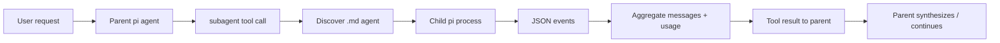

# Research Report: Options for Pi Extensions That Do Subagents

**Generated**: 2026-05-14T12:14:53Z  
**Research Query**: "research options for pi extensions that do subagents"  
**Mode**: Pre-Plan / Plan-Associated  
**Location**: `docs/plans/007-options-for-pi-extensions-that-do-subagents/research-dossier.md`  
**FlowSpace**: Not available in this session; used standard tools, pi docs, pi examples, pij prior dossiers, and GitHub CLI.  
**Findings**: 52 synthesized findings across implementation, dependencies, conventions, quality, contracts, docs/evolution, prior learnings, and boundaries.

---

## Executive Summary

### What It Does

Pi does **not** have a native in-process `Task` / nested-agent primitive in core. Subagent behavior is implemented today by extensions and adjacent harnesses that either:

1. spawn child `pi` processes in `--mode json`, print, or RPC mode;
2. run child sessions in terminal multiplexer panes;
3. manage background child sessions and steer results back to the parent; or
4. use a separate agent runtime such as minih for validation/review workflows outside the live pi session.

### Business Purpose

Subagents multiply usable context and specialization: scouts can explore read-only, planners can plan without editing, reviewers can audit in parallel, and workers can implement in isolation. For pij, subagents are most valuable for **extension validation**, **parallel research**, **companion review**, and eventually a reusable `pij-task` / delegation surface.

### Key Insights

1. **Best off-the-shelf default today:** `nicobailon/pi-subagents` is the broadest, most polished-looking general subagent package from the current GitHub/NPM signals: foreground/background runs, built-in roles, async status, prompt templates, context filtering, and no setup required beyond `pi install npm:pi-subagents`.
2. **Best Claude-Code-style surface:** `@tintinweb/pi-subagents` deliberately mirrors Claude Code (`Agent`, `get_subagent_result`, `steer_subagent`), has live widgets, background agents, event-bus RPC, scheduling, context inheritance, memory scopes, worktrees, and rich `.pi/agents/*.md` frontmatter.
3. **Best pij-owned path:** Use the official `examples/extensions/subagent/` as the minimal code template, but avoid hand-rolling unless pij has a sharper need than existing packages. For validation, pij already has a better outside-the-session path: `agents/extension-validator/` + `harness/driver/`.

### Quick Stats

- **Native core subagent API**: absent.
- **Official example**: `examples/extensions/subagent/` (~988 LOC) using child `pi --mode json -p --no-session` processes.
- **Current ecosystem candidates found via GitHub CLI**: 15+ subagent/crew/team packages, including `nicobailon/pi-subagents` (1389 stars), `HazAT/pi-interactive-subagents` (452), `tintinweb/pi-subagents` (303), `melihmucuk/pi-crew` (54), `mjakl/pi-subagent` (42).
- **Local pij harness agents**: `agents/code-review-companion/` and `agents/extension-validator/` are minih packs, not pi extensions.
- **Complexity**: medium for process-spawn subagents; high for async/background/resumable/interactive subagents.
- **Prior learnings**: 6 directly relevant findings from plans 001, 004, 005.
- **Domains**: no formal `docs/domains/` registry; natural boundaries are `extensions`, `agents`, `harness/driver`, and `packages`.

---

## Decision Matrix: Which Option Should We Use?

| Option | Best For | Install / Location | Strengths | Risks / Caveats | Recommendation |
|---|---|---|---|---|---|
| `nicobailon/pi-subagents` | General-purpose delegation, background work, built-in roles | `pi install npm:pi-subagents` | Most complete out-of-box UX; foreground/background; builtins (`scout`, `researcher`, `planner`, `worker`, `reviewer`, `oracle`, etc.); prompt shortcuts; context filtering; doctor command | Large surface; must verify exact behavior locally before relying on it in pij automation | **Try first** for day-to-day subagents |
| `@tintinweb/pi-subagents` | Claude Code-style Task parity, extensibility, event bus | `pi install npm:@tintinweb/pi-subagents` | `Agent`-style tool; mid-run steering; resume; live widget; memory; worktrees; scheduled subagents; cross-extension RPC; event bus | Early release; broad feature set means more moving parts | **Best architecture reference** if building or composing |
| `HazAT/pi-interactive-subagents` | Human-visible async agents in mux panes | `pi install git:github.com/HazAT/pi-interactive-subagents` | Fully non-blocking; cmux/tmux/zellij/WezTerm; live pane status; results steer back; interrupt/resume | Requires running pi inside supported mux; heavier operational model | Use when **watchable interactive panes** matter |
| `@melihmucuk/pi-crew` | Clean background crew orchestration | `pi install npm:@melihmucuk/pi-crew` | `crew_spawn`, `crew_abort`, `crew_respond`, `crew_done`; bundled agents and prompts; steering results back | Newer/smaller ecosystem signal; verify maturity | Good middle ground for async without pane UX |
| `@mjakl/pi-subagent` | Minimal predictable delegation | `pi install npm:@mjakl/pi-subagent` | Simpler spawn/fork modes; depth/cycle guards; `.pi/agents` support | Fewer features: intentionally trims chains/scope selectors | Good if we want small surface |
| Official `examples/extensions/subagent/` | Learning / custom pij-owned implementation | Copy from installed pi examples | Clear code; single/parallel/chain modes; custom rendering; project-agent confirmation | Blocks parent while foreground; no background persistence; needs maintenance | Use as **template**, not first choice |
| Pi SDK `createAgentSession()` | Same-process subagent runner in a Node app | package/SDK integration | Type-safe, direct event subscriptions, no subprocess JSON parsing | No official extension-native subagent example; extension re-entrancy/resource lifecycle must be proven | Research further before committing |
| Minih agent packs + pij Driver SDK | Extension validation, code-review companions outside pi | `agents/*` + `harness/driver/` | Already exists in pij; deterministic tmux validation; magic-wand retros | Not an LLM-callable pi extension; separate minih runtime | Keep for harness validation |

**Short answer:** install `nicobailon/pi-subagents` to use subagents now; study `@tintinweb/pi-subagents` for advanced design; use pij's `extension-validator` + Driver SDK for validation agents; only build a pij extension if we need a sharply different contract.

---

## How It Currently Works

### Entry Points

| Entry Point | Type | Location | Purpose |
|---|---|---|---|
| `pi.registerTool({ name: "subagent" })` | Extension tool | Official example `examples/extensions/subagent/index.ts` | Parent model delegates single/parallel/chain child tasks |
| `spawn(pi, ["--mode", "json", "-p", "--no-session", ...])` | Child process | Official example `runSingleAgent()` | Runs isolated child pi process and parses JSON events |
| `--mode rpc` protocol | JSONL subprocess mode | Pi `docs/rpc.md` | Long-running subprocess integration, prompts, steering, UI requests |
| `createAgentSession()` | SDK API | Pi `docs/sdk.md` | Embed child agent sessions in a Node/TS app |
| `.pi/agents/*.md`, `~/.pi/agent/agents/*.md` | Agent definition convention | Official example and community packages | Role prompts + model/tools/thinking frontmatter |
| `harness/driver/run.ts` | pij validator CLI | `harness/driver/run.ts` | Minih validator drives real pi in tmux and returns `RunReport` |

### Core Execution Flow — Official Example

1. **Parent model calls `subagent` tool**
   - File: installed pi `examples/extensions/subagent/index.ts`
   - Schema supports exactly one of: single `{ agent, task }`, parallel `{ tasks }`, or chain `{ chain }`.

2. **Extension discovers agent definitions**
   - File: `examples/extensions/subagent/agents.ts`
   - User agents: `~/.pi/agent/agents/*.md`
   - Project agents: nearest `.pi/agents/*.md`, only when `agentScope` is `project` or `both`.
   - Project agents prompt for confirmation in UI because repo-controlled prompts can run tools.

3. **Extension spawns child pi process**
   - Code pattern: `spawn(invocation.command, invocation.args, { cwd, shell: false, stdio: ["ignore", "pipe", "pipe"] })`
   - Args include `--mode json -p --no-session`, optional `--model`, optional `--tools`, optional `--append-system-prompt <tmpfile>`, then `Task: ...`.

4. **Extension parses child JSON events**
   - Captures `message_end` events for assistant/tool messages.
   - Aggregates usage: input/output/cache/cost/context tokens/turns.
   - Streams partial parent tool updates via `onUpdate`.

5. **Result returns to parent**
   - Single mode returns final child assistant text.
   - Parallel mode summarizes each child.
   - Chain mode feeds previous final output into `{previous}` placeholders.
   - Custom renderers show collapsed/expanded output and usage.

### Data Flow



### State Management

- Official example is mostly **stateless per invocation**; agent definitions are rediscovered every call.
- Community packages add more state:
  - async run registries;
  - background job status;
  - transcript artifacts;
  - resumption/session ids;
  - scheduled jobs;
  - memory scopes;
  - worktree branches.
- pij's minih validators write structured report envelopes and retrospectives outside pi session history.

---

## Architecture & Design

### Core Components

- **Tool registration layer**: exposes LLM-callable delegation (`subagent`, `Agent`, `crew_spawn`, etc.).
- **Agent definition loader**: parses markdown frontmatter for role, model, tools, thinking, skills, memory, or behavior flags.
- **Child runner**: starts child agent via `pi --mode json`, `pi --mode rpc`, print mode, tmux pane, or SDK session.
- **Event collector**: parses child output (`message_end`, `tool_execution_*`, `agent_end`, etc.).
- **Progress renderer**: parent tool updates, widgets, completion notifications, transcript links.
- **Safety layer**: project-agent trust gates, depth/cycle guards, tool restrictions, child-tool denylist, worktree isolation.

### Design Patterns Identified

1. **Process isolation as context isolation**
   - Spawn child `pi` processes to get fresh windows and failure boundaries.
   - Simple and robust, at the cost of process overhead and JSON parsing.

2. **Markdown agents as roles**
   - `.md` frontmatter mirrors Claude Code subagents.
   - Common fields: `name`, `description`, `model`, `thinking`, `tools`, `skills`.

3. **Parent as orchestrator, child as worker**
   - Parent decides fan-out / synthesis.
   - Child should not recursively orchestrate unless explicitly allowed.
   - `nicobailon/pi-subagents` explicitly filters parent-only subagent artifacts and prevents child sessions from receiving the subagent tool.

4. **Async result as steering message**
   - Background child finishes, then notifies / steers parent to process result.
   - Used by async packages like `pi-crew`, `pi-interactive-subagents`, and `@tintinweb/pi-subagents`.

5. **Human-visible panes for debuggability**
   - Mux-backed subagents preserve the ability to watch and interact with child sessions.
   - This aligns with pij's harness philosophy: tmux is a feature, not just a workaround.

### System Boundaries

- **Inside pi extension**: can register tools/commands, spawn child processes, update UI, send messages.
- **Outside pi session**: minih agents and `harness/driver` validate pi from the outside.
- **Core limitation**: no native in-process child-agent API in ExtensionAPI; subprocess/SDK are the escape hatches.

---

## Dependencies & Integration

### What Subagent Extensions Depend On

| Dependency | Type | Purpose | Risk if Changed |
|---|---|---|---|
| `pi --mode json` / print mode | CLI protocol | One-shot child output collection | Event names/shape drift can break parsers |
| `pi --mode rpc` | CLI protocol | Long-running child sessions, steering, UI | More complex protocol; client must implement JSONL correctly |
| Node `child_process.spawn` | Runtime | Process isolation | Must handle aborts, stderr, exit codes |
| Extension API `registerTool`, `onUpdate`, renderers | Pi API | Parent tool exposure and UI | Extension API changes affect tool shape |
| `.pi/agents` / `~/.pi/agent/agents` | Convention | Custom roles | Trust issues for repo-controlled prompts |
| `ctx.ui` | UI | Confirm project agents; widgets | No-op/degraded in print/JSON modes |
| `pi.events` | Event bus | Cross-extension subagent RPC | Schema is convention-only unless package defines it |

### What Depends on Subagents

- Parallel research workflows.
- Planner → worker → reviewer loops.
- Validation companions.
- Community workflow suites (`rpiv`, `superpowers`, crews/teams).
- Potential future pij feature: `pij-task` or `pij-review`.

### Integration Architecture Options

#### 1. One-shot JSON child process

Use when child should do one task and exit.

- **Pros**: simple, isolated, easy to aggregate.
- **Cons**: foreground unless extra process registry is built; no mid-run steering.
- **Reference**: official `examples/extensions/subagent/`.

#### 2. RPC child process

Use when child needs multi-turn interaction, steering, or state inspection.

- **Pros**: supports `prompt`, `steer`, `follow_up`, `abort`, session commands, extension UI protocol.
- **Cons**: client complexity; strict JSONL; must handle UI requests.
- **Reference**: `docs/rpc.md`, `examples/rpc-extension-ui.ts`.

#### 3. Terminal-mux child session

Use when a human may watch/interact with children.

- **Pros**: high debuggability; real pi UI; aligns with pij tmux habits.
- **Cons**: terminal dependency; harder CI.
- **Reference**: `HazAT/pi-interactive-subagents`, pij `harness/driver`.

#### 4. Same-process SDK session

Use in custom apps/runners, not as the first extension approach.

- **Pros**: type-safe, direct events, no text protocol.
- **Cons**: no proven extension-native subagent template; lifecycle/resource isolation needs design.
- **Reference**: pi `docs/sdk.md`.

#### 5. External agent runtime (minih)

Use for validation and review agents that are not part of the live parent pi conversation.

- **Pros**: already encoded in pij; clean report envelopes; harness-oriented.
- **Cons**: not LLM-callable from parent pi.
- **Reference**: `agents/extension-validator/`, `agents/code-review-companion/`.

---

## Quality & Testing

### Current Test / Validation Coverage

- **Official example**: example code exists but should not be treated as production-tested for pij needs.
- **pij harness**: `npm run smoke` and `harness/driver` can validate extensions through real pi in tmux.
- **Minih validator**: `agents/extension-validator/` is designed to run smoke scenarios and write `RunReport` envelopes.
- **Community packages**: GitHub stars/readmes show activity, not correctness. Top candidates need local install smoke before adopting.

### Test Strategy for Any Adopted Subagent Package

1. Install in a throwaway project-local `.pi/settings.json` or disposable checkout.
2. Boot `pi` from pij root.
3. Ask for a read-only `scout` against a tiny target.
4. Test parallel 2-agent run.
5. Test abort/cancel.
6. Test project `.pi/agents` trust prompt.
7. Test `/reload` behavior.
8. Run `npm run self-check` after removing/disabling the package.

### Known Issues & Technical Debt

| Issue | Severity | Location | Impact |
|---|---|---|---|
| No native ExtensionAPI child-agent primitive | High | pi core | All extension subagents reimplement subprocess/session orchestration |
| Project-local agents are prompt-code | High | `.pi/agents/*.md` | Repo can define agents that use tools; requires confirmation/trust gate |
| Child recursion / tool inheritance | High | subagent packages | Child agents can spawn more children unless explicitly blocked |
| Async result races | Medium | background packages | Parent may receive results while user/agent is mid-turn; steering semantics matter |
| Worktree/file mutation conflicts | Medium | worker subagents | Parallel writers can conflict without worktrees/locks |
| JSON event shape drift | Medium | process parsers | Extensions parsing CLI output can break on pi changes |
| Heavy package surface | Medium | rich packages | More features = harder to reason about failure modes |

### Performance Characteristics

- Process-spawn overhead is acceptable for research/review tasks, not for micro-tools.
- Parallel fan-out multiplies token spend. Prefer cheap/read-only models (`haiku`) for scouts.
- Background work needs visible cost/usage reporting to avoid runaway spend.
- Worktree isolation costs disk and git operations but reduces write conflicts.

---

## Modification Considerations

### ✅ Safe to Modify / Adopt

1. **Project/user agent definitions** (`.pi/agents/*.md`, `~/.pi/agent/agents/*.md`)
   - Low-code customization of roles.
   - Start read-only: `read, grep, find, ls, bash`.

2. **Project `.pi/settings.json` package trials**
   - Add one subagent package at a time.
   - Use `npm run pkg` if committing third-party package management in pij.

3. **pij minih validators**
   - Already part of harness.
   - Safe to improve for validation/reporting.

### ⚠️ Modify with Caution

1. **Building a new subagent extension**
   - Only worthwhile if our contract is different: e.g., typed harness integration, stricter no-recursion, worktree-first validation, or FlowSpace-first research.

2. **Async/background subagents**
   - Must design state, cancellation, result delivery, and user visibility.

3. **Forked/inherited context**
   - Powerful but may leak sensitive/irrelevant parent context into children.

### 🚫 Danger Zones

1. **Parallel write-capable workers in same worktree**
   - Use worktrees or restrict to read-only review/scout.

2. **Child agents inheriting parent subagent tool**
   - Can create uncontrolled recursion.

3. **Trusting project-local agents without a gate**
   - Treat `.pi/agents` like executable code.

4. **Relying on unverified third-party claims**
   - Previous plan 005 explicitly warned that many package URLs/features came from external research and need verification.

---

## Prior Learnings (From Previous Implementations)

### 📚 Prior Learning PL-01: Pi Has No Native Subagent API

**Source**: `docs/plans/001-pi-extensions/findings/01-extension-api.md`, `docs/plans/001-pi-extensions/research-dossier.md`  
**Original Type**: critical architecture finding

**What They Found**:
> Extensions cannot spawn child agents through a native nested-agent API. Community workarounds spawn `pi` as a subprocess.

**Why This Matters Now**:
Any pij design must choose subprocess, RPC, SDK, tmux, or minih. Do not assume a first-class `Task` API exists.

**Action for Current Work**:
Treat subprocess/RPC as the baseline. If we want native in-process subagents, that is a pi-core/API proposal, not a normal pij extension.

---

### 📚 Prior Learning PL-02: Official Subagent Example Exists

**Source**: installed pi `examples/extensions/subagent/`, `docs/plans/001-pi-extensions/findings/02-in-tree-extensions.md`  
**Original Type**: implementation reference

**What They Found**:
> The example registers a tool that spawns separate `pi` processes, supports single/parallel/chain modes, parses JSON events, and renders results.

**Why This Matters Now**:
We have a concrete template for a custom extension if off-the-shelf packages do not fit.

**Action for Current Work**:
Study/copy patterns, but do not clone blindly. The example lacks the background/runtime features of newer community packages.

---

### 📚 Prior Learning PL-03: Minih + Driver SDK Is Better for Validation Agents

**Source**: `docs/plans/004-agent-pilot-harness/research-dossier.md`, `agents/extension-validator/`, `harness/driver/`  
**Original Type**: encoded harness architecture

**What They Found**:
> Validator agents should not rediscover tmux; they should invoke `harness/driver/run.ts` and emit structured `RunReport` + magic-wand retrospectives.

**Why This Matters Now**:
If the goal is “agents validate pi extensions,” a live pi subagent extension is the wrong layer. The validator pack is already the proper substrate.

**Action for Current Work**:
Use subagent extensions for in-session delegation; use minih/driver for extension validation.

---

### 📚 Prior Learning PL-04: Verify Third-Party Extensions Before Encoding Policy

**Source**: `docs/plans/005-pi-ecosystem-survey/research-dossier.md`  
**Original Type**: gotcha / research caveat

**What They Found**:
> Many third-party URLs/features were externally sourced and should be treated as candidates until installed and smoke-tested.

**Why This Matters Now**:
GitHub stars/readmes are enough to shortlist options, not enough to commit pij defaults.

**Action for Current Work**:
Before adding a subagent package to `.pi/settings.json`, run a local install smoke and record the result.

---

### 📚 Prior Learning PL-05: Project Harness Already Has Agent Feedback Loop

**Source**: `docs/project-rules/harness.md`, `docs/how/agent-feedback.md`  
**Original Type**: harness capability

**What They Found**:
> pij has L2/L2.5 harness maturity: npm boot, smoke via tmux, self-check, Driver SDK, extension-validator.

**Why This Matters Now**:
We can evaluate subagent packages through the harness rather than relying only on manual impressions.

**Action for Current Work**:
Create smoke scenarios for any adopted package if it becomes part of pij’s recommended stack.

---

### Prior Learnings Summary

| ID | Type | Source Plan | Key Insight | Action |
|---|---|---|---|---|
| PL-01 | architecture | 001 | No native subagent API | Use subprocess/RPC/minih |
| PL-02 | reference | 001 | Official subagent example exists | Template for custom build |
| PL-03 | harness | 004 | Validation belongs in minih + Driver SDK | Do not force validation into live extension |
| PL-04 | caveat | 005 | Third-party claims need local verification | Smoke before adopting |
| PL-05 | harness | project-rules | pij can validate through tmux | Use harness to evaluate |

---

## Domain Context

No `docs/domains/registry.md` exists.

### Potential Domains Identified

| Proposed Domain | Evidence | Boundary | Files |
|---|---|---|---|
| `extensions` | Pi ExtensionAPI usage; `.pi/extensions/` | In-session tools/commands/events | `.pi/extensions/*`, official examples |
| `agents` | Minih packs and subagent `.md` role files | Agent identities/prompts/schemas | `agents/*`, `.pi/agents/*`, `~/.pi/agent/agents/*` |
| `harness-driver` | tmux Driver SDK | External validation of pi | `harness/driver/*` |
| `package-management` | `.pi/settings.json`, `.pi/packages.yaml`, `npm run pkg` | Third-party pi packages | `.pi/settings.json`, `harness/scripts/packages.ts` |

### Domain Map Position

Subagent work crosses two boundaries:

- **Pi extension boundary**: parent pi session exposes delegation tools.
- **Agent harness boundary**: external minih agents validate or review outside the live session.

Do not collapse these. A subagent extension is a user-facing capability; a validator agent is infrastructure.

### Potential Domain Actions

- No formal domain extraction needed yet.
- If pij builds a subagent extension, formalize an `agents` domain contract for `.pi/agents/*.md` fields and trust rules.
- If pij adopts third-party packages, keep ownership in `package-management`, not `extensions`.

---

## Critical Discoveries

### 🚨 Critical Finding 01: No Native Child-Agent API

**Impact**: Critical  
**Source**: pi `extensions.md`, `sdk.md`, plan 001 findings  
**What**: ExtensionAPI exposes tools/events/UI/session controls but no native child-agent runner callable inside a tool.  
**Why It Matters**: Every implementation must own process/session lifecycle and output parsing.  
**Required Action**: Prefer existing packages unless pij needs a unique harness-integrated contract.

### 🚨 Critical Finding 02: Project-Local Agents Are Trust-Sensitive

**Impact**: Critical  
**Source**: official subagent README and `agents.ts`  
**What**: `.pi/agents/*.md` are repo-controlled prompts that can direct child agents to use tools.  
**Why It Matters**: A malicious repo can define a dangerous “reviewer” or “worker.”  
**Required Action**: Require confirmation/trust gates for project agents; default to user/bundled read-only agents.

### 🚨 Critical Finding 03: Parent/Child Recursion Must Be Blocked

**Impact**: High  
**Source**: `nicobailon/pi-subagents` README, `mjakl/pi-subagent` README  
**What**: Rich packages explicitly filter parent-only subagent artifacts or enforce depth/cycle guards.  
**Why It Matters**: Uncontrolled delegation can recurse and burn tokens/processes.  
**Required Action**: Any custom pij design must deny child access to delegation tools by default.

### 🚨 Critical Finding 04: For Validation, pij Already Has a Better Substrate

**Impact**: High  
**Source**: `agents/extension-validator/`, `harness/driver/run.ts`  
**What**: Extension-validator can drive real pi through tmux and write structured reports.  
**Why It Matters**: A live subagent extension should not replace the harness validation flow.  
**Required Action**: Use subagent packages for development assistance, not as the primary extension smoke validator.

### 🚨 Critical Finding 05: Ecosystem Is Crowded Enough to Avoid “Yet Another” Generic Package

**Impact**: Medium  
**Source**: GitHub CLI search, plan 005 survey  
**What**: Many subagent packages exist with overlapping roles.  
**Why It Matters**: Building another generic subagent extension is unlikely to compound unless it encodes a pij-specific advantage.  
**Required Action**: First verify/adopt; build only for a differentiated contract.

---

## Supporting Documentation

### Related Documentation

- Pi extensions: `/Users/jordanknight/.npm-global/lib/node_modules/@earendil-works/pi-coding-agent/docs/extensions.md`
- Pi SDK: `/Users/jordanknight/.npm-global/lib/node_modules/@earendil-works/pi-coding-agent/docs/sdk.md`
- Pi RPC: `/Users/jordanknight/.npm-global/lib/node_modules/@earendil-works/pi-coding-agent/docs/rpc.md`
- Pi packages: `/Users/jordanknight/.npm-global/lib/node_modules/@earendil-works/pi-coding-agent/docs/packages.md`
- Official subagent example: `/Users/jordanknight/.npm-global/lib/node_modules/@earendil-works/pi-coding-agent/examples/extensions/subagent/`
- pij driver: `harness/driver/`
- pij validator: `agents/extension-validator/`
- Prior pi-extension research: `docs/plans/001-pi-extensions/research-dossier.md`
- Ecosystem survey: `docs/plans/005-pi-ecosystem-survey/research-dossier.md`

### Historical Context

- Plan 001 identified subagents as pi’s biggest missing primitive versus Claude Code/Copilot/Codex/Goose.
- Plan 004 built an agent-pilot harness so minih agents can drive real pi inside tmux.
- Plan 005 found that subagents are no longer an empty ecosystem gap: multiple packages now compete.

---

## Recommendations

### If We Want Subagents Immediately

1. Install and smoke-test `nicobailon/pi-subagents` first:
   ```bash
   pi install npm:pi-subagents
   ```
2. Run simple read-only scout/reviewer prompts.
3. If it works, consider adding it through `.pi/packages.yaml` / `npm run pkg` rather than hand-editing `.pi/settings.json`.

### If We Want a Rich Architecture Reference

Study `@tintinweb/pi-subagents`:

```bash
pi install npm:@tintinweb/pi-subagents
```

Pay attention to:
- event bus API;
- child recursion prevention;
- `.pi/agents` frontmatter;
- worktree isolation;
- scheduled/background runs;
- result rendering.

### If We Want Human-Watchable Subagents

Test `HazAT/pi-interactive-subagents` in tmux/cmux:

```bash
pi install git:github.com/HazAT/pi-interactive-subagents
```

This aligns strongly with pij’s tmux-first philosophy, but it is more operationally opinionated.

### If We Want to Build Our Own

Only build a custom pij extension if it is **not generic**. Candidate differentiators:

1. **FlowSpace-first scout**: subagents query a code graph and return node ids.
2. **Harness-aware validator**: child agents can invoke `harness/driver` and report RunReports.
3. **Worktree-first worker**: all write-capable subagents run in isolated git worktrees by default.
4. **Strict no-recursion/no-project-agent policy**: safer enterprise/team defaults.
5. **Minih bridge**: pi tool launches minih agents and harvests envelopes.

Otherwise, adopt.

---

## External Research Opportunities

### Research Opportunity 1: Verify Top Subagent Packages Locally

**Why Needed**: GitHub/README evidence is enough to shortlist but not enough to commit package policy.  
**Impact on Plan**: Determines whether pij adopts an existing package or designs a custom one.  
**Source Findings**: CD-05, PL-04

**Ready-to-use prompt:**

```text
/deepresearch "Verify the current pi subagent extension ecosystem as of 2026-05. Focus on nicobailon/pi-subagents, tintinweb/pi-subagents, HazAT/pi-interactive-subagents, melihmucuk/pi-crew, and mjakl/pi-subagent. For each: install path, package manifest shape, active maintenance, tool names/schema, background behavior, project-agent trust model, child recursion prevention, context inheritance/forking, cancellation, artifacts/transcripts, and known issues. Output a recommendation for a pij project that wants safe subagents for extension development."
```

**Results location**: `docs/plans/007-options-for-pi-extensions-that-do-subagents/external-research/verify-subagent-packages.md`

### Research Opportunity 2: SDK-Based In-Process Child Sessions Inside Extensions

**Why Needed**: Pi docs say the SDK can build custom tools that spawn sub-agents, but the official extension example uses subprocesses. The same-process approach may be cleaner or may be a lifecycle trap.  
**Impact on Plan**: Determines whether a future pij-owned subagent extension should use SDK sessions instead of child `pi` processes.  
**Source Findings**: IA/DC findings on SDK vs ExtensionAPI

**Ready-to-use prompt:**

```text
/deepresearch "Investigate whether a pi TypeScript extension can safely create in-process child AgentSession instances via @earendil-works/pi-coding-agent createAgentSession() inside a registered tool. Compare against spawning `pi --mode json` and `pi --mode rpc`. Cover extension resource loading, auth/model registry reuse, cancellation, session persistence, event subscriptions, tool inheritance, reentrancy/deadlock risks, and examples in pi-mono or community repos. Output an implementation recommendation and minimal safe architecture."
```

**Results location**: `docs/plans/007-options-for-pi-extensions-that-do-subagents/external-research/sdk-in-process-subagents.md`

---

## Appendix: File Inventory

### Core Files Read

| File | Purpose |
|---|---|
| `docs/project-rules/harness.md` | pij Boot/Interact/Observe contract |
| `harness/driver/index.ts` | Driver SDK public surface and `runScenario()` |
| `harness/driver/run.ts` | Agent-facing scenario CLI |
| `agents/extension-validator/agent.json` | minih validator manifest |
| `agents/extension-validator/prompt.md` | validator run loop and report envelope |
| installed pi `docs/extensions.md` | ExtensionAPI and custom tool/events docs |
| installed pi `docs/sdk.md` | `createAgentSession()` and SDK embedding docs |
| installed pi `docs/rpc.md` | JSONL subprocess protocol |
| installed pi `docs/packages.md` | third-party package install/distribution |
| installed pi `examples/extensions/subagent/index.ts` | official subagent extension implementation |
| installed pi `examples/extensions/subagent/agents.ts` | agent discovery implementation |
| `docs/plans/001-pi-extensions/research-dossier.md` | prior extension/subagent findings |
| `docs/plans/005-pi-ecosystem-survey/research-dossier.md` | package ecosystem survey |

### Candidate Packages / Repos Surfaced

| Repo / Package | Signal | Notes |
|---|---:|---|
| `nicobailon/pi-subagents` | 1389 stars | Broadest default candidate |
| `HazAT/pi-interactive-subagents` | 452 stars | Mux-pane, non-blocking, human-watchable |
| `tintinweb/pi-subagents` | 303 stars | Claude Code-style, rich architecture |
| `melihmucuk/pi-crew` | 54 stars | Background crew with steering and interactive sessions |
| `mjakl/pi-subagent` | 42 stars | Minimal spawn/fork with depth/cycle guards |
| `teelicht/pi-superagents` | 31 stars | Superpowers workflow integration |
| `daynin/nano-team` | 11 stars | Tiny compact chip-row subagents |
| `MasuRii/pi-agent-router` | 3 stars | Agent routing/delegation rendering |

---

## Next Steps

1. **Decide intent**: use subagents interactively, validate extensions, or build a custom differentiated extension.
2. **If using now**: smoke-test `nicobailon/pi-subagents` and `@tintinweb/pi-subagents` in a throwaway run.
3. **If validating extensions**: continue using `agents/extension-validator/` + `harness/driver/`; do not replace it with a live subagent extension.
4. **If building**: run `/plan-1b-specify` with a precise feature, e.g. “FlowSpace-first read-only scout subagents for pij.”

---

**Research Complete**: 2026-05-14T12:14:53Z  
**Report Location**: `/Users/jordanknight/pi-hacking/pij/docs/plans/007-options-for-pi-extensions-that-do-subagents/research-dossier.md`
