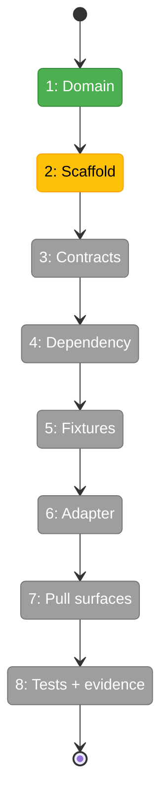
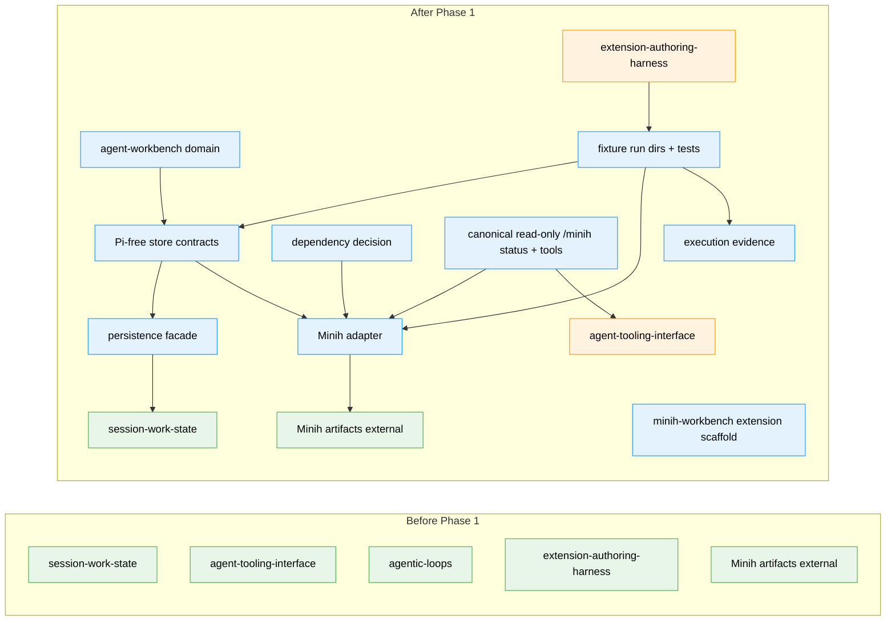

# Flight Plan: Phase 1 — Minih inventory + artifact adapter

**Plan**: [../../agent-workbench-plan.md](../../agent-workbench-plan.md)  
**Phase**: Phase 1: Minih inventory + artifact adapter  
**Generated**: 2026-05-16  
**Status**: Ready for takeoff

---

## Departure → Destination

**Where we are**: The spec and architecture plan are validated, but no `agent-workbench` domain or `.pi/extensions/minih-workbench` implementation exists. Existing extensions (`session-sql`, `todo`, `ralph-loop`) provide patterns only.

**Where we're going**: A developer can inspect Minih run inventory through read-only, fixture-backed contracts: new domain docs, generated extension scaffold, Pi-free store contracts, persistence facade, dependency decision, Minih adapter, deterministic fixtures, canonical read-only command/tool envelopes, tests, and execution evidence.

---

## Domain Context

### Domains We're Changing

| Domain | What Changes | Key Files |
|--------|--------------|-----------|
| `agent-workbench` | Create the new product/domain contract and core read-only adapter/store/persistence files. | `docs/domains/agent-workbench/domain.md`; `.pi/extensions/minih-workbench/store.ts`; `.pi/extensions/minih-workbench/persistence.ts`; `.pi/extensions/minih-workbench/minih-adapter.ts`; `.pi/extensions/minih-workbench/AGENTS.md` |
| `agent-tooling-interface` | Add canonical read-only `/minih status --json` and model-facing list/status/report tools. | `.pi/extensions/minih-workbench/index.ts`; `.pi/extensions/minih-workbench/ui.ts` |
| `extension-authoring-harness` | Add fixture run directories, store/adapter tests, dependency decision evidence, execution log evidence, and phase tracking. | `.pi/extensions/minih-workbench/fixtures/`; `.pi/extensions/minih-workbench/store.test.ts`; `.pi/extensions/minih-workbench/minih-adapter.test.ts`; `tasks/phase-1-minih-inventory-artifact-adapter/minih-dependency-decision.md`; `tasks/phase-1-minih-inventory-artifact-adapter/execution.log.md` |

### Domains We Depend On (no changes)

| Domain | What We Consume | Contract |
|--------|-----------------|----------|
| `session-work-state` | Session-scoped persistence semantics for future pointers/cursors/audit records. | `SessionSqlStore` / session-local current-state pattern via injected facade |
| `agentic-loops` | Lifecycle/safety vocabulary and single-session-start discipline. | Liveness/stop separation; P10-style `session_start` handling |
| Minih runtime/artifacts | Durable run artifacts, state, inbox, report shapes. | `agents/<slug>/runs/<runId>/` artifact contract |

---

## Flight Status

<!-- Updated by /plan-6-v2: pending → active → done. Use blocked for problems/input needed. -->

**Legend**: grey = pending | yellow = active | red = blocked/needs input | green = done

---

## Stages

<!-- Updated by /plan-6-v2 during implementation: [ ] → [~] → [x] -->

- [x] **Stage 1: Establish domain** — create `agent-workbench` and map it into the registry/domain map (`docs/domains/agent-workbench/domain.md` — new file).
- [~] **Stage 2: Scaffold extension** — generate `.pi/extensions/minih-workbench/` and add extension-local rules (`AGENTS.md` — new file).
- [ ] **Stage 3: Define contracts** — add Pi-free store contracts, adapter results, bounded snapshots, and persistence facade (`store.ts`, `persistence.ts`).
- [ ] **Stage 4: Decide Minih boundary** — record helper-vs-CLI/raw fallback decision before adapter code can add dependencies (`minih-dependency-decision.md` — new file).
- [ ] **Stage 5: Build fixtures** — create deterministic Minih artifact directories for success and failure cases (`fixtures/` — new directory).
- [ ] **Stage 6: Implement adapter** — read Minih artifacts/fixtures through a tagged, bounded, read-only adapter (`minih-adapter.ts`).
- [ ] **Stage 7: Expose read-only pull surfaces** — wire canonical `/minih status --json` and read-only tools (`index.ts`, `ui.ts`).
- [ ] **Stage 8: Prove with tests and evidence** — add store/adapter tests and log validation results (`*.test.ts`, `execution.log.md`).

---

## Architecture: Before & After

**Legend**: existing (green, unchanged) | changed (orange, modified) | new (blue, created)

---

## Acceptance Criteria

- [ ] `agent-workbench` domain exists and is registered/mapped without circular ownership.
- [ ] `.pi/extensions/minih-workbench` is generated with T2 layout and extension-local rules.
- [ ] `store.ts` is Pi-free and exports Minih run summary/view/status/persistence contracts with bounded snapshot constants.
- [ ] Minih dependency decision is recorded before adapter implementation imports or shells out through any helper path.
- [ ] `minih-adapter.ts` reads fixture Minih artifacts and returns tagged summaries/snapshots/diagnostics without throwing.
- [ ] Fixtures cover active, stale, completed/report-ready, malformed/missing, permission-like, coordinated, non-coordinated, and large-output cases.
- [ ] Canonical `/minih status --json` and model tools return deterministic bounded envelopes.
- [ ] Store and adapter tests cover sorting, status axes, reports, diagnostics, truncation, and the no-write Phase 1 invariant.
- [ ] Execution log records targeted tests, `just typecheck` or stronger, final `just self-check`, `minih doctor` status, and package-vet evidence if a package is added.

## Goals & Non-Goals

**Goals**:

- Create domain and extension foundation.
- Prove read-only Minih artifact inventory and report/status projection.
- Build deterministic fixture evidence.
- Prepare contracts that Phase 2 and Phase 3 can consume.

**Non-Goals**:

- No full modal viewer.
- No composer/send/stop/push context.
- No live Minih/Copilot routine validation.
- No generic provider dashboard.
- No package or pi-mono edits without explicit vetted approval.

---

## Handover to Phase 2/3

- **Exports for Phase 2**: `MinihRunSummary`, bounded snapshot contracts, read-only adapter results, fixture run dirs, canonical `/minih status --json`, and read-only list/status/report tools.
- **Exports for Phase 3**: `persistence.ts` facade, no-write Phase 1 invariant, dependency decision, and adapter boundary that future write wrappers must not bypass.
- **Non-exports**: no modal component, no composer, no send/stop/push implementation, no live Minih launch flow.
- **Required evidence**: store/adapter test results, `just typecheck` or stronger, final `just self-check`, `minih doctor` status, and package-vet evidence if any dependency was added.

---

## Checklist

- [x] T001: Create the `agent-workbench` domain document.
- [x] T002: Register `agent-workbench` in domain registry and map.
- [x] T003: Scaffold the `minih-workbench` extension from the harness generator.
- [ ] T004: Add extension-local implementation rules.
- [ ] T005: Define Pi-free store contracts and constants.
- [ ] T006: Define injected session persistence facade.
- [ ] T007: Record the Minih dependency decision and package policy.
- [ ] T008: Create deterministic Minih fixture run directories.
- [ ] T009: Implement the read-only Minih adapter.
- [ ] T010: Add canonical read-only command/tool wiring for inventory/status/report.
- [ ] T011: Add store/projection tests.
- [ ] T012: Add adapter fixture tests.
- [ ] T013: Record validation evidence for Phase 1.
