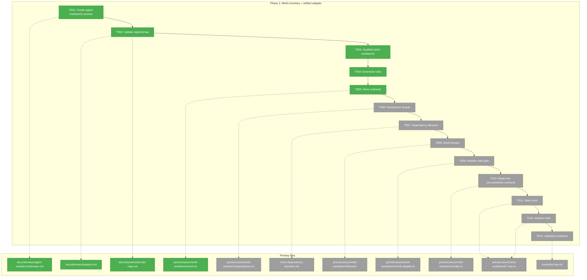
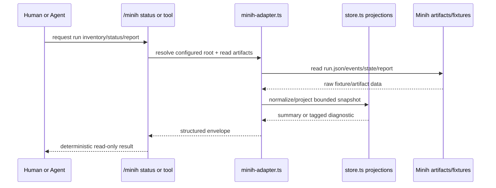

# Phase 1 Tasks: Minih inventory + artifact adapter

**Plan**: [`../../agent-workbench-plan.md`](../../agent-workbench-plan.md)  
**Spec**: [`../../agent-workbench-spec.md`](../../agent-workbench-spec.md)  
**Phase**: Phase 1: Minih inventory + artifact adapter  
**Status**: Proposed  
**Complexity**: CS-4

---

## Executive Briefing

### Purpose

This phase establishes the Minih Workbench foundation without building the full modal or any write-capable controls. It creates the `agent-workbench` domain, scaffolds the `.pi/extensions/minih-workbench` extension, defines the Pi-free contracts, and proves Minih artifact reading with deterministic fixtures and read-only pull surfaces.

### What We're Building

A read-only Minih inventory and artifact adapter layer: domain docs, extension scaffold, fixture run directories, `store.ts` contracts, `persistence.ts` facade, `minih-adapter.ts` read path, deterministic `/minih status --json` and read-only tools, store/adapter tests, a dependency decision record, and execution evidence logging.

### Goals

- ✅ Create and register the new `agent-workbench` domain.
- ✅ Scaffold `minih-workbench` using the project generator and T2 layout.
- ✅ Keep `store.ts` Pi-free and put constants/types/projections there.
- ✅ Isolate Minih artifact/CLI/helper access in `minih-adapter.ts`.
- ✅ Add a persistence facade contract for later pointers/cursors/audit state.
- ✅ Build fixture Minih run directories for active, stale, completed/report-ready, malformed, missing, permission-like, coordinated, non-coordinated, and large-output cases.
- ✅ Record the helper-vs-CLI dependency decision before adapter implementation can add dependencies.
- ✅ Add canonical read-only status/report/list command and tool contracts.
- ✅ Capture validation evidence in `execution.log.md` during implementation.

### Non-Goals

- ❌ No full modal viewer UI in this phase.
- ❌ No composer, send, stop, or push-context behavior in this phase.
- ❌ No right-hand dock/provider dashboard.
- ❌ No Minih runner replacement or embedded Minih `runAgent` execution.
- ❌ No live Minih/Copilot routine tests.
- ❌ No edits to pi-mono or the installed Pi binary.

---

## Prior Phase Context

Phase 1 has no prior implementation phase.

### A. Deliverables

None.

### B. Dependencies Exported

None.

### C. Gotchas & Debt

None from prior phases. Carry forward the plan-level validation findings:

- Minih remains the source of truth; Pi must not duplicate Minih artifacts as canonical state.
- Read-only first proof must not drift into Phase 3 write/control work.
- Fixture-backed deterministic evidence is required because live Minih/Copilot runs are not routine validation.

### D. Incomplete Items

None.

### E. Patterns to Follow

- T2 extension layout by default.
- Pi-free `store.ts`; side effects injected through wiring/adapter boundaries.
- Tagged-union results over throws.
- Constants live in `store.ts` next to constrained data.
- Tests target store/adapter contracts, not Pi wiring.
- One `session_start` handler later covers all reasons; Phase 1 should not create lifecycle patterns that make that impossible.

---

## Pre-Implementation Check

Concept search result: **NEW implementation**. No existing pij extension/domain implements Minih run inventory, run-summary projection, Minih artifact adapter, `/minih` surfaces, or a Pi-native Minih modal/workbench. Reuse patterns from `agent-tooling-interface`, `session-work-state`, `agentic-loops`, `extension-authoring-harness`, and `harness/scripts/vetters/agent.ts`; do not extend `ralph-loop` into Minih Workbench.

Agent harness health:

- Engineering harness: `just self-check` passed in the parent session after plan validation.
- Agent harness: `minih doctor` returned `status: degraded` with **0 errors** and warnings for package-vetter retrospective/shared preamble hygiene; `code-review-companion` `prompt-state-vocabulary-drift` passed. ⚠️ Plan-6 must validate agent harness at start before companion-backed implementation.

| File | Exists? | Domain Check | Notes |
|------|---------|--------------|-------|
| `/Users/jordanknight/pi-hacking/pij/docs/domains/agent-workbench/domain.md` | No | Create under `agent-workbench` | New domain contract; include Concepts/Contracts/Composition/Dependencies/Boundary sections. |
| `/Users/jordanknight/pi-hacking/pij/docs/domains/registry.md` | Yes | Modify domain registry | Add `agent-workbench`; preserve existing rows/history. |
| `/Users/jordanknight/pi-hacking/pij/docs/domains/domain-map.md` | Yes | Modify domain map | Add one-way consume edges; no Minih ownership transfer. |
| `/Users/jordanknight/pi-hacking/pij/.pi/extensions/minih-workbench/` | No | Create extension scaffold | Must use `just new minih-workbench`; do not hand-roll scaffold. |
| `/Users/jordanknight/pi-hacking/pij/.pi/extensions/minih-workbench/AGENTS.md` | No | `agent-workbench` contract | Extension-local rules for source of truth, read-only Phase 1, and safety. |
| `/Users/jordanknight/pi-hacking/pij/.pi/extensions/minih-workbench/store.ts` | No | `agent-workbench` contract | Pi-free contracts, constants, projections, tagged results. |
| `/Users/jordanknight/pi-hacking/pij/.pi/extensions/minih-workbench/persistence.ts` | No | `agent-workbench` internal | Injected facade for session persistence; can be stubbed in Phase 1. |
| `/Users/jordanknight/pi-hacking/pij/docs/plans/007-options-for-pi-extensions-that-do-subagents/tasks/phase-1-minih-inventory-artifact-adapter/minih-dependency-decision.md` | No | `extension-authoring-harness` evidence | Record helper-vs-CLI decision and package-vetting posture before adapter dependency choices. |
| `/Users/jordanknight/pi-hacking/pij/.pi/extensions/minih-workbench/fixtures/` | No | `extension-authoring-harness` fixture | Deterministic Minih run dirs; no live LLM dependency. |
| `/Users/jordanknight/pi-hacking/pij/.pi/extensions/minih-workbench/minih-adapter.ts` | No | `agent-workbench` internal | Minih artifacts/CLI/helper boundary; no Pi imports. |
| `/Users/jordanknight/pi-hacking/pij/.pi/extensions/minih-workbench/index.ts` | No | `agent-tooling-interface` wiring | Commands/tools/lifecycle; no full modal yet. |
| `/Users/jordanknight/pi-hacking/pij/.pi/extensions/minih-workbench/ui.ts` | No | `agent-tooling-interface` internal | Placeholder or minimal future UI exports only; no modal implementation in Phase 1. |
| `/Users/jordanknight/pi-hacking/pij/.pi/extensions/minih-workbench/store.test.ts` | No | `extension-authoring-harness` test | Store projections/status/bounds/no-write tests. |
| `/Users/jordanknight/pi-hacking/pij/.pi/extensions/minih-workbench/minih-adapter.test.ts` | No | `extension-authoring-harness` test | Fixture-backed adapter tests. |
| `/Users/jordanknight/pi-hacking/pij/docs/plans/007-options-for-pi-extensions-that-do-subagents/tasks/phase-1-minih-inventory-artifact-adapter/execution.log.md` | No | `extension-authoring-harness` evidence | Created by plan-6; must record validation command outcomes. |

---

## Architecture Map



---

## Tasks

| Status | ID | Task | Domain | Path(s) | Done When | Notes |
|--------|-----|------|--------|---------|-----------|-------|
| [x] | T001 | Create the `agent-workbench` domain document. | `agent-workbench` | `/Users/jordanknight/pi-hacking/pij/docs/domains/agent-workbench/domain.md` | Domain doc exists with Purpose, Source Locations, Concepts, Contracts, Composition, Dependencies, Boundary Owns/Excludes, and History; it states Minih artifacts remain upstream-owned and Phase 1 is read-only. | Plan Finding 01. Include contracts for run summary, modal state, adapter result, persistence facade, and Phase 3 placeholders without implementing Phase 3. |
| [x] | T002 | Register `agent-workbench` in domain registry and map. | `agent-workbench` | `/Users/jordanknight/pi-hacking/pij/docs/domains/registry.md`; `/Users/jordanknight/pi-hacking/pij/docs/domains/domain-map.md` | Registry has an `agent-workbench` row; domain map has an `AW` node and one-way consume/use edges to Pi runtime, Minih artifacts, `agent-tooling-interface`, `session-work-state`, `agentic-loops`, and `extension-authoring-harness`; no circular business-domain dependency is introduced. | Preserve existing history. Edge to `agentic-loops` is vocabulary-only; no lifecycle ownership transfer. |
| [x] | T003 | Scaffold the `minih-workbench` extension from the harness generator. | `extension-authoring-harness` | `/Users/jordanknight/pi-hacking/pij/.pi/extensions/minih-workbench/` | `just new minih-workbench` has created the extension; generated files compile before customization; no hand-rolled T2 boilerplate. | Plan Finding 05; AGENTS.md requires generator use for new extensions. |
| [x] | T004 | Add extension-local implementation rules. | `agent-workbench` | `/Users/jordanknight/pi-hacking/pij/.pi/extensions/minih-workbench/AGENTS.md` | File states Minih source-of-truth, read-only Phase 1, no ANSI parsing from `minih view/attach`, no write/send/stop/push in Phase 1, no hardcoded keybindings, Pi-free store, and fixture-first validation. | Mirrors plan/spec safety contract for future agents. |
| [x] | T005 | Define Pi-free store contracts and constants. | `agent-workbench` | `/Users/jordanknight/pi-hacking/pij/.pi/extensions/minih-workbench/store.ts` | `store.ts` exports structural types and pure helpers for `MinihRunSummary`, `MinihRunKind`, status axes, diagnostics, `MinihModalState`, bounded pane snapshots, `MinihViewSnapshot`, adapter tagged results, default page/byte limits, and placeholder action identifiers needed by later UI work; imports nothing from Pi packages; no `any`. | Plan Finding 02 and validation fix. Default keybinding maps belong to Phase 2; only placeholder action identifiers are allowed here. |
| [ ] | T006 | Define injected session persistence facade. | `agent-workbench` | `/Users/jordanknight/pi-hacking/pij/.pi/extensions/minih-workbench/persistence.ts`; `/Users/jordanknight/pi-hacking/pij/.pi/extensions/minih-workbench/store.ts` | A small interface/facade exists for selected run pointers, seen cursors, push opt-ins, and audit/intent/outcome records; Phase 1 can provide no-op/temp implementation, but type contract supports persist-before-side-effect in Phase 3. | Consumes `session-work-state` semantics without owning SQLite internals. |
| [ ] | T007 | Record the Minih dependency decision and package policy. | `extension-authoring-harness` | `/Users/jordanknight/pi-hacking/pij/docs/plans/007-options-for-pi-extensions-that-do-subagents/tasks/phase-1-minih-inventory-artifact-adapter/minih-dependency-decision.md` | Decision doc states whether Phase 1 uses Minih public helpers, local CLI/JSON/artifact contracts, or raw fixture-backed fallback; any new package path uses `just pkg add <source>` with vet/audit evidence; no hand-editing of `.pi/packages.yaml`, `.pi/settings.json`, pi-mono, or installed Pi. | Must be completed before adapter implementation can add dependency/helper imports. |
| [ ] | T008 | Create deterministic Minih fixture run directories. | `extension-authoring-harness` | `/Users/jordanknight/pi-hacking/pij/.pi/extensions/minih-workbench/fixtures/` | Fixtures cover active, stale/dead, completed/report-ready, failed/malformed, missing/partial artifacts, permission-like diagnostics, coordinated, non-coordinated, and large transcript/tool-output cases; fixtures include minimal `events.ndjson`, `run.json`, `completed.json`, inbox/state/history, and `output/report.json` shapes as needed. | No live Minih/Copilot. Use compact synthetic data only. |
| [ ] | T009 | Implement the read-only Minih adapter. | `agent-workbench` | `/Users/jordanknight/pi-hacking/pij/.pi/extensions/minih-workbench/minih-adapter.ts`; `/Users/jordanknight/pi-hacking/pij/.pi/extensions/minih-workbench/store.ts` | Adapter resolves a configured Minih root or fixture root, lists active/stale plus bounded recent completed/report-ready runs, reads snapshots/report summaries, separates liveness/terminal/inside/outside/attention diagnostics, bounds large panes, returns tagged results, and never throws for malformed/missing fixture artifacts. | Follow T007 dependency decision. Prefer Minih public helpers if available; otherwise isolate raw artifact fallback here. Never parse ANSI. |
| [ ] | T010 | Add canonical read-only command/tool wiring for inventory/status/report. | `agent-tooling-interface` | `/Users/jordanknight/pi-hacking/pij/.pi/extensions/minih-workbench/index.ts`; `/Users/jordanknight/pi-hacking/pij/.pi/extensions/minih-workbench/ui.ts` | `/minih status --json`, `minih_runs_list`, `minih_run_status`, and `minih_read_report` return deterministic bounded envelopes; no `send`, `stop`, composer, push, or modal UI is implemented yet. | Pull fallback for smoke/model use. Aliases may be additional only; they cannot replace canonical `/minih status --json`. Keep one future-compatible `session_start` handler shape; no expensive watchers in Phase 1. |
| [ ] | T011 | Add store/projection tests. | `extension-authoring-harness` | `/Users/jordanknight/pi-hacking/pij/.pi/extensions/minih-workbench/store.test.ts` | Tests cover summary sorting, status-axis separation, attention classification, bounded pane windows/truncation markers, report-ready projection, default constants/placeholders, tagged result helpers, and no-write Phase 1 invariant. | Store tests should be pure and fixture-light. |
| [ ] | T012 | Add adapter fixture tests. | `extension-authoring-harness` | `/Users/jordanknight/pi-hacking/pij/.pi/extensions/minih-workbench/minih-adapter.test.ts`; `/Users/jordanknight/pi-hacking/pij/.pi/extensions/minih-workbench/fixtures/` | Tests use fixture run dirs to prove active/stale/completed/malformed/missing/permission-like/large cases produce summaries or diagnostics without crashes; tests prove no `last-run` race assumption and no ANSI parsing. | Plan Findings 02 and 06. |
| [ ] | T013 | Record validation evidence for Phase 1. | `extension-authoring-harness` | `/Users/jordanknight/pi-hacking/pij/docs/plans/007-options-for-pi-extensions-that-do-subagents/tasks/phase-1-minih-inventory-artifact-adapter/execution.log.md`; relevant test outputs | Execution log records targeted store/adapter test outcomes, `just typecheck` or stronger, final `just self-check`, `minih doctor` status before companion use, and dependency-vet evidence if any package was added. | Evidence task closes the dossier loop; plan-6 updates this during implementation. |

---

## Context Brief

### Key findings from plan

- **Finding 01 — New domain**: `agent-workbench` does not exist; Phase 1 must create it and keep ownership split from existing domains.
- **Finding 02 — Minih source of truth**: All Minih IO goes through `minih-adapter.ts`; avoid `last-run`, ANSI parsing, and status collapse.
- **Finding 03 — Write/push safety boundary**: Phase 1 remains read-only but creates contracts that make Phase 3 gating possible.
- **Finding 05 — T2 + Pi-free store**: Use generator, pure store, injected side effects, tagged results, and store/adapter tests.
- **Finding 06 — Deterministic smoke/tests**: Fixture run dirs and command envelopes are the evidence path; live Minih/Copilot is opt-in only.
- **Finding 07 — Inventory scope**: `/minih` inventory contract includes active + stale plus bounded recent completed/report-ready rows.

### Domain dependencies

- `agent-tooling-interface`: tool/command UX and deterministic command envelopes — consumed for `/minih status --json`, `minih_runs_list`, `minih_run_status`, and `minih_read_report` wiring.
- `session-work-state`: session-scoped persistence semantics — consumed through a narrow `persistence.ts` facade for selected/open pointers, seen cursors, push opt-ins, and audit records; Minih artifacts remain canonical.
- `agentic-loops`: long-running-agent lifecycle/safety vocabulary — consumed for liveness, explicit stop separation, watcher cleanup vocabulary, and single `session_start` discipline; no Ralph Loop code reuse.
- `extension-authoring-harness`: generator, store tests, fixtures, smoke, self-check, package vet/audit — consumed for scaffold, tests, fixture evidence, and dependency policy.
- Minih runtime/artifacts (external): `agents/<slug>/runs/<runId>/` artifacts — consumed read-only in Phase 1 via adapter and fixtures.

### Domain constraints

- `store.ts` must import nothing from `@earendil-works/*` or Pi runtime packages.
- Relative imports use `.js` extensions.
- No `any`; use structural boundary types and tagged unions.
- Constants/defaults live in `store.ts` next to constrained data.
- `minih-adapter.ts` owns filesystem/CLI/helper IO; `index.ts` owns Pi wiring; `ui.ts` stays UI-only.
- No model-facing write tools in Phase 1.
- No package manifest edits by hand; use `just pkg add` if a dependency becomes necessary.

### Agent harness context

- **Boot**: Engineering harness boot is `npm install`; agent overlay boot is `minih run code-review-companion` when implementation uses companion review.
- **Interact**: Pi TUI (`pi`) and Driver SDK/tmux smoke; companion interaction through `minih outside inbox send`.
- **Observe**: `just self-check`, Vitest output, Driver SDK smoke transcripts, Minih run artifacts, validation records.
- **Maturity**: L2 engineering harness + companion overlay. `minih doctor` currently has warnings but no errors.
- **Pre-phase validation**: Agent MUST validate Boot → Interact → Observe at start of implementation: run `just typecheck` or stronger, verify `minih doctor` before companion use, and finish with `just self-check`.

### Reusable from prior phases

No prior Minih Workbench phases. Reusable project patterns:

- `.pi/extensions/session-sql` and `.pi/extensions/todo` for command/tool result envelopes and smoke style.
- `.pi/extensions/ralph-loop` for tagged lifecycle/state discipline and single `session_start` pattern.
- `harness/templates/extension/*` for scaffolded T2 layout.
- `harness/scripts/vetters/agent.ts` for Minih run-dir race-avoidance lessons and report parsing caution.

### Mermaid flow diagram

```mermaid
flowchart LR
    A[Minih fixture/root] --> B[minih-dependency-decision.md]
    B --> C[minih-adapter.ts]
    C --> D[store.ts projections]
    D --> E[index.ts read-only commands/tools]
    E --> F[/minih status --json + read-only tools]
    D --> G[store/adapter tests]
    C --> G
    G --> H[execution.log.md evidence]
```

### Mermaid sequence diagram



---

## Discoveries & Learnings

_Populated during implementation by plan-6._

| Date | Task | Type | Discovery | Resolution | References |
|------|------|------|-----------|------------|------------|
| 2026-05-16 | T003 | gotcha | `just new minih-workbench` generated an unused starter `DeleteResult` alias that made Biome fail before commit. | Removed the alias in generated `store.ts` and encoded the fix in `harness/templates/extension/store.ts.template`; logged D-031. | `docs/difficulties.md#D-031` |

**Types**: `gotcha` | `research-needed` | `unexpected-behavior` | `workaround` | `decision` | `debt` | `insight`

---

## Directory Layout

```text
docs/plans/007-options-for-pi-extensions-that-do-subagents/
  ├── agent-workbench-plan.md
  └── tasks/phase-1-minih-inventory-artifact-adapter/
      ├── tasks.md
      ├── tasks.fltplan.md
      ├── minih-dependency-decision.md
      └── execution.log.md   # created by plan-6
```

---

## Validation Record (2026-05-16)

### Validation Thesis

**Raison d'être**: Make the first implementation phase executable by a plan-6 agent without rediscovering product intent: create the new `agent-workbench` domain and build a read-only Minih inventory/artifact adapter foundation with deterministic fixtures.

**Value claim**: Implementation becomes cheaper, safer, and more repeatable because Phase 1 agents get concrete file paths, task sequencing, domain constraints, fixture/test expectations, package policy, and harness context before touching code.

**Artifact promise**: Future implementation can rely on this dossier for the Phase 1 task list, pre-implementation audit, context brief, architecture diagrams, and flight plan handoff; it will not ask implementers to decide modal UX or Phase 3 write/push behavior.

**Intended beneficiaries**: plan-6 implementer, companion reviewer, future plan-5 Phase 2 author, domain reviewers, and maintainers.

**Proof target**: Implementation.

**Evidence standard**: Exact plan alignment, correct file paths/domains, complete 7-column task table, no contradiction with spec/workshop/plan/domain docs, explicit pre-check, and task success criteria that can be validated by tests/smoke.

**Thesis source**: `agent-workbench-plan.md` Phase 1, Key Findings, Domain Manifest, Acceptance Criteria, Validation Record; this dossier's Executive Briefing and Tasks.

**Thesis verdict**: Advanced after fixes.

**Main thesis risk**: Future-contract items for modal state, push opt-ins, and audit records could be over-implemented by plan-6 unless treated strictly as inert Phase 1 contracts/placeholders.

---

| Agent | Lenses Covered | Thesis Axes Covered | Issues | Verdict |
|-------|---------------|---------------------|--------|---------|
| Source Truth | Source Truth, Evidence Sufficiency, Technical Constraints, Domain Boundaries | Implementation Readiness, Contract Integrity, Review Compression | 1 HIGH fixed; 2 MEDIUM fixed; 1 LOW fixed | ✅ after rerun |
| Cross-Reference + Completeness | Cross-Reference, Completeness, Testing Alignment, Proof-Level Fit | Implementation Readiness, Operational Reliability, Safety to Change, Agent Readiness | 3 MEDIUM fixed; 1 LOW fixed | ✅ after rerun |
| Thesis Alignment | Thesis Alignment, Evidence Sufficiency, Proof-Level Fit, Hidden Assumptions, Domain Boundaries, Concept Documentation | Thesis Alignment, User/Product Value Preservation, Downstream Usefulness, Implementation Readiness, Review Compression | 2 MEDIUM fixed; 1 LOW fixed | ✅ after rerun |
| Forward Compatibility | Forward-Compatibility, Integration & Ripple, Test Boundary, Domain Boundaries, Technical Constraints, Deployment & Ops, System Behavior | Downstream Usefulness, Contract Integrity, Agent Readiness, Implementation Readiness, Cross-Domain Coordination | 0 | ✅ |

### Forward-Compatibility Matrix

| Consumer | Requirement | Failure Mode | Verdict | Evidence |
|----------|-------------|--------------|---------|----------|
| plan-6 Phase 1 implementation | Needs an actionable implementation queue with domain/file ownership, generator/scaffold rules, Pi-free contracts, adapter boundary, deterministic fixtures/tests, and validation logging. | shape mismatch / contract drift / test boundary | ✅ | T001-T013 provide ordered file paths, done criteria, no-write boundaries, dependency gate, fixture tests, and execution evidence. |
| Phase 2 task dossier | Needs Phase 1 outputs that can become a native Pi list/modal viewer without re-reading Minih internals or changing first-proof scope. | encapsulation lockout / shape mismatch / lifecycle ownership | ✅ | Phase 1 exports run summaries, modal/snapshot contracts, adapter results, fixture data, and canonical read-only pull surfaces while excluding modal implementation. |
| Phase 3 task dossier | Needs future interaction/push tasks to add send/stop/push safely without bypassing Minih ownership, persistence-before-side-effect, or read-only proof invariants. | encapsulation lockout / lifecycle ownership / contract drift / test boundary | ✅ | T006/T007/T010 preserve persistence facade, no-write invariant, dependency decision, and adapter boundary for later write wrappers. |
| code-review companion | Needs companion runs/reports to be observable through Minih artifacts and pull surfaces, with harness health/evidence checks, while avoiding live-agent routine-test coupling. | shape mismatch / contract drift / test boundary | ✅ | Pre-check records `minih doctor`; fixtures include coordinated/report-ready cases; read-only tools include report/status pull access; T013 records evidence. |

**Thesis alignment**: Value claim advanced; proof level is Target = Implementation and Actual = Implementation-ready task dossier; main thesis risk is that future-contract items for modal state, push opt-ins, and audit records could be over-implemented by plan-6 unless treated strictly as inert Phase 1 contracts/placeholders.

**Outcome alignment**: The Phase 1 tasks preserve the VPO Outcome quote — “Minih companions and agent runs produce valuable context, findings, statuses, and reports, but today they are hidden behind separate CLI views and artifact paths. The first proof makes Minih observable from the main Pi session; Phase 3 makes it interactable and context-aware.”

**Standalone?**: No — downstream consumers are plan-6 Phase 1 implementation, Phase 2 and Phase 3 task dossiers, and the code-review companion.

Overall: VALIDATED WITH FIXES
