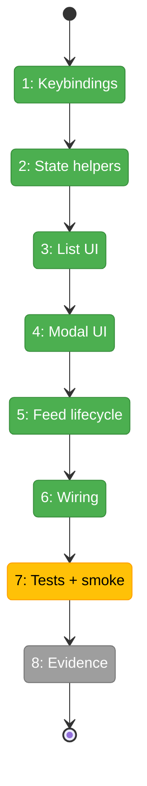

# Flight Plan: Phase 2 — Full modal Minih run viewer

**Plan**: [../../agent-workbench-plan.md](../../agent-workbench-plan.md)  
**Phase**: Phase 2: Full modal Minih run viewer  
**Generated**: 2026-05-16  
**Status**: Ready for takeoff

---

## Departure → Destination

**Where we are**: Phase 1 has landed. The repo now has an `agent-workbench` domain, `.pi/extensions/minih-workbench/` T2 extension, Pi-free store contracts, persistence facade, read-only Minih artifact adapter, deterministic fixtures, canonical `/minih status --json`, read-only model tools, store/adapter tests, and status-only smoke. No native run-list UI, modal viewer, pane focus/scroll UI, or watcher/feed lifecycle exists yet.

**Where we're going**: A developer/operator can run `/minih`, navigate a Pi-native Minih run list with the keyboard, press Enter to open a full-area read-only modal viewer, inspect transcript/tool/coordination/status/report/diagnostic panes with independent scroll/focus state, close with `Esc` without controlling the run, and validate the whole read-only flow through deterministic tests and smoke.

---

## Domain Context

### Domains We're Changing

| Domain | What Changes | Key Files |
|--------|--------------|-----------|
| `agent-workbench` | Add Phase 2 keybinding defaults, pure list/modal state helpers, pane focus/scroll helpers, lazy feed lifecycle contracts over Phase 1 snapshots, and updated extension-local rules. | `.pi/extensions/minih-workbench/store.ts`; `.pi/extensions/minih-workbench/feed.ts`; `.pi/extensions/minih-workbench/persistence.ts`; `.pi/extensions/minih-workbench/AGENTS.md`; `docs/domains/agent-workbench/domain.md` |
| `agent-tooling-interface` | Replace text-only `/minih` default with a native Pi list/modal flow while preserving canonical read-only JSON/tool pull surfaces. | `.pi/extensions/minih-workbench/ui.ts`; `.pi/extensions/minih-workbench/index.ts`; `docs/domains/agent-tooling-interface/domain.md` |
| `extension-authoring-harness` | Add store/feed/UI tests, expand Minih Workbench Driver SDK smoke, and record execution evidence/flight status. | `.pi/extensions/minih-workbench/store.test.ts`; `.pi/extensions/minih-workbench/ui.test.ts`; `.pi/extensions/minih-workbench/feed.test.ts`; `.pi/extensions/minih-workbench/smoke.ts`; `tasks/phase-2-full-modal-minih-run-viewer/execution.log.md` |

### Domains We Depend On (no changes)

| Domain | What We Consume | Contract |
|--------|-----------------|----------|
| `session-work-state` | Session-scoped pointer/cursor semantics through the existing persistence facade. | Selected-run pointer, seen cursor, audit/intent/outcome facade shape; Minih artifacts remain external. |
| `agentic-loops` | Lifecycle vocabulary for liveness, explicit stop separation, watcher cleanup, and single `session_start` discipline. | P10 one-handler lifecycle pattern; dispose/cleanup discipline, no lifecycle ownership transfer. |
| Minih runtime/artifacts | Durable run artifacts and reports. | `agents/<slug>/runs/<runId>/` artifacts read only through `minih-adapter.ts`. |
| Pi TUI runtime | Native custom UI component primitives. | `ctx.ui.custom`, overlay options, `Component.render/handleInput/invalidate`, `matchesKey`, `Key`, width-safe rendering. |

---

## Flight Status

<!-- Updated by /plan-6-v2: pending → active → done. Use blocked for problems/input needed. -->



**Legend**: grey = pending | yellow = active | red = blocked/needs input | green = done

---

## Stages

<!-- Updated by /plan-6-v2 during implementation: [ ] → [~] → [x] -->

- [x] **Stage 1: Define controls and state** — add default keybinding constants and pure list/modal focus/scroll helpers (`store.ts`).
- [x] **Stage 2: Prove pure behavior** — expand store tests for keybindings, selection, pane focus, cursor paging, and safe close (`store.test.ts`).
- [x] **Stage 3: Build native list UI** — implement width-safe run-list rendering and keyboard selection (`ui.ts`, `index.ts`).
- [x] **Stage 4: Build full modal UI** — implement header, transcript/tools/coordination/report/diagnostics panes, disabled composer reason, focus and scroll indicators (`ui.ts`).
- [x] **Stage 5: Add lazy feed lifecycle** — create read-only feed manager with fake timers/readers, diagnostics, bounded polling fallback, coalescing, and explicit dispose (`feed.ts`).
- [x] **Stage 6: Wire commands/lifecycle** — connect `/minih`, `/minih list`, `/minih view`, `/minih report`, session_start reconciliation, and session_shutdown cleanup (`index.ts`).
- [~] **Stage 7: Validate UI/feed behavior** — add targeted UI/feed tests and deterministic Driver SDK modal smoke (`ui.test.ts`, `feed.test.ts`, `smoke.ts`).
- [ ] **Stage 8: Land evidence and handoff** — update execution log, extension `AGENTS.md`, domain docs, flight status, velocity/difficulty records, and Phase 3 handoff notes (`execution.log.md`, domain docs).

---

## Architecture: Before & After

```mermaid
flowchart LR
    classDef existing fill:#E8F5E9,stroke:#4CAF50,color:#000
    classDef changed fill:#FFF3E0,stroke:#FF9800,color:#000
    classDef new fill:#E3F2FD,stroke:#2196F3,color:#000

    subgraph Before["Before Phase 2"]
        BStore[Pi-free store contracts]:::existing
        BAdapter[Read-only Minih adapter]:::existing
        BPull[/minih status + tools]:::existing
        BUi[ui.ts text formatting only]:::existing
        BSmoke[status-only smoke]:::existing
    end

    subgraph After["After Phase 2"]
        AStore[Store + keybindings + list/modal state]:::changed
        AAdapter[Read-only Minih adapter]:::existing
        AFeed[Lazy read-only feed manager]:::new
        AList[Native run-list component]:::new
        AModal[Full-area modal viewer]:::new
        AWiring[/minih list/view/report UI wiring]:::changed
        APull[/minih status + tools preserved]:::existing
        ATests[store/feed/UI tests + modal smoke]:::changed

        AAdapter --> AFeed
        AFeed --> AStore
        AStore --> AList
        AStore --> AModal
        AList --> AModal
        AWiring --> AList
        AWiring --> AModal
        AWiring --> APull
        ATests --> AStore
        ATests --> AFeed
        ATests --> AList
        ATests --> AModal
    end
```

**Legend**: existing (green, unchanged) | changed (orange, modified) | new (blue, created)

---

## Acceptance Criteria

- [ ] `store.ts` exports Minih Workbench default keybinding constants and pure list/modal state helpers without importing Pi runtime packages.
- [ ] New or modified Minih Workbench files use top-level standard imports / `import type`; no inline or dynamic imports are introduced.
- [ ] `/minih` opens a Pi-native keyboard-selectable run list in interactive mode while `/minih status --json` remains unchanged.
- [ ] Active/stale runs render first and bounded recent completed/report-ready rows render in a distinct section.
- [ ] Up/Down selection and Enter-open behavior are deterministic and use injected/default keybindings, not hardcoded key checks.
- [ ] A selected run opens in a full-area Pi-native modal without sending any Minih message or control.
- [ ] Modal panes show transcript, tool activity, coordination/inside/outside status, liveness, attention, output/report state, diagnostics, and disabled/absent composer reason.
- [ ] Pane focus and scrollback are visible and independent from the main Pi conversation.
- [ ] `Esc` closes only the list/modal and releases feed handles; it never sends stop/control/kill or writes to Minih artifacts.
- [ ] Watcher/feed lifecycle is lazy, fixture/fake-feed testable, diagnostic on failure with bounded polling fallback, coalesced, and safe after dispose/reload/shutdown.
- [ ] Driver SDK smoke proves `/minih`, list selection, modal open, pane scroll/focus or page movement, report/diagnostic view, Esc close, and reload cleanup over fixtures/fake feeds.
- [ ] Phase 2 execution log records targeted tests, `npm run smoke -- minih-workbench`, `just typecheck` or stronger, final `just self-check`, agent harness health, and companion farewell if used.

## Goals & Non-Goals

**Goals**:

- Prove the read-only list → modal Minih Workbench UX inside Pi.
- Preserve Phase 1 read-only adapter/tool contracts.
- Add keybinding defaults, pure state helpers, lazy feed lifecycle, and deterministic UI smoke.
- Hand Phase 3 stable UI/feed/read-only contracts for interaction/push hardening.

**Non-Goals**:

- No composer/send/stop/push-context implementation.
- No write-capable model tools or Minih control messages.
- No right-hand dock/provider dashboard.
- No nested Minih Ink/ANSI UI or live Minih/Copilot routine validation.
- No package, pi-mono, or installed Pi binary edits without explicit approval.

---

## Checklist

- [x] T001: Add Minih Workbench keybinding contracts and defaults.
- [x] T002: Add pure list/modal state helpers.
- [x] T003: Expand store tests for Phase 2 state contracts.
- [x] T004: Build UI rendering primitives and stable text anchors.
- [x] T005: Implement the keyboard-selectable Minih run-list component.
- [x] T006: Implement the full-area read-only modal viewer component.
- [x] T007: Add lazy read-only feed/watch lifecycle with fake-feed support.
- [x] T008: Wire `/minih` list/view/report commands to the native UI while preserving pull contracts.
- [x] T009: Reconcile lifecycle and session state without auto-opening UI.
- [x] T010: Add targeted UI/feed tests.
- [ ] T011: Expand deterministic Driver SDK smoke for read-only modal flows.
- [ ] T012: Record Phase 2 evidence and update domain/handoff docs.
