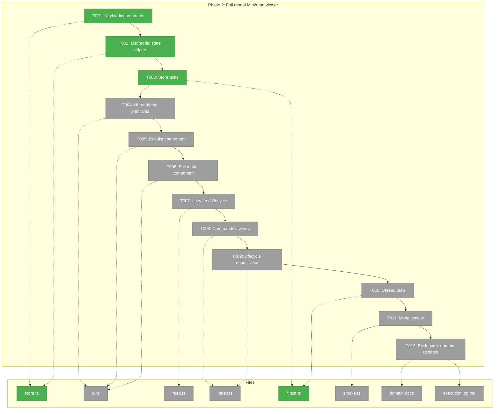
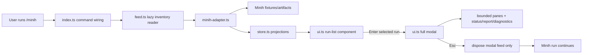

# Phase 2 Tasks: Full modal Minih run viewer

**Plan**: [`../../agent-workbench-plan.md`](../../agent-workbench-plan.md)  
**Spec**: [`../../agent-workbench-spec.md`](../../agent-workbench-spec.md)  
**Phase**: Phase 2: Full modal Minih run viewer  
**Status**: Proposed  
**Complexity**: CS-5

---

## Executive Briefing

### Purpose

This phase proves the core Pi-native Minih Workbench user journey on top of the Phase 1 read-only adapter: `/minih` opens a keyboard-selectable run list, Enter opens a full-area Pi-native modal viewer, panes render bounded Minih projections, and `Esc` closes the view without controlling the Minih run. It is the read-only UX proof gate before Phase 3 adds send/stop/push behavior.

### What We're Building

A native Pi TUI list and modal experience inside the existing `.pi/extensions/minih-workbench/` extension. The phase adds named keybinding defaults, pure list/modal state helpers, list and modal components, lazy feed/watch lifecycle over fixture-backed adapter reads, command wiring for `/minih`, `/minih list`, `/minih view <slug> <runId>`, and `/minih report <slug> <runId>`, targeted tests, deterministic Driver SDK smoke, and evidence logging.

### Goals

- ✅ Keep Minih artifacts as the source of truth; consume Phase 1 adapter/store contracts only.
- ✅ Add default Minih Workbench keybinding constants next to `MINIH_WORKBENCH_ACTIONS`; no hardcoded keys.
- ✅ Render active/stale runs first plus bounded recent completed/report-ready rows.
- ✅ Support Up/Down selection, Enter open, refresh, pane focus, pane scroll/page, and safe close.
- ✅ Show transcript, tools, coordination/status, output/report, diagnostics, liveness, inside/outside status, attention, and disabled/absent composer reason.
- ✅ Start modal/list feeds lazily, coalesce refreshes, diagnose watcher failures, and dispose handles on close/shutdown/reload.
- ✅ Prove read-only behavior with store/feed/UI tests and Driver SDK smoke over fixtures/fake feeds.

### Non-Goals

- ❌ No composer, typed send, stop control, report-control action, or push-context delivery.
- ❌ No right-hand dock/provider dashboard.
- ❌ No Minih runner replacement, embedded Minih Ink UI, ANSI parsing from `minih view/attach`, or live Minih/Copilot routine validation.
- ❌ No arbitrary Minih launches, installs, write-capable tools, or model-facing control surfaces.
- ❌ No pi-mono or installed Pi binary changes.

---

## Prior Phase Context

### Phase 1: Minih inventory + artifact adapter

#### A. Deliverables

- Domain docs created/updated:
  - `/Users/jordanknight/pi-hacking/pij/docs/domains/agent-workbench/domain.md`
  - `/Users/jordanknight/pi-hacking/pij/docs/domains/registry.md`
  - `/Users/jordanknight/pi-hacking/pij/docs/domains/domain-map.md`
- Minih Workbench extension scaffolded with T2/generator layout:
  - `/Users/jordanknight/pi-hacking/pij/.pi/extensions/minih-workbench/AGENTS.md`
  - `/Users/jordanknight/pi-hacking/pij/.pi/extensions/minih-workbench/store.ts`
  - `/Users/jordanknight/pi-hacking/pij/.pi/extensions/minih-workbench/persistence.ts`
  - `/Users/jordanknight/pi-hacking/pij/.pi/extensions/minih-workbench/minih-adapter.ts`
  - `/Users/jordanknight/pi-hacking/pij/.pi/extensions/minih-workbench/index.ts`
  - `/Users/jordanknight/pi-hacking/pij/.pi/extensions/minih-workbench/ui.ts`
  - `/Users/jordanknight/pi-hacking/pij/.pi/extensions/minih-workbench/smoke.ts`
- Deterministic fixtures/tests/evidence added:
  - `/Users/jordanknight/pi-hacking/pij/.pi/extensions/minih-workbench/fixtures/`
  - `/Users/jordanknight/pi-hacking/pij/.pi/extensions/minih-workbench/store.test.ts`
  - `/Users/jordanknight/pi-hacking/pij/.pi/extensions/minih-workbench/minih-adapter.test.ts`
  - `/Users/jordanknight/pi-hacking/pij/docs/plans/007-options-for-pi-extensions-that-do-subagents/tasks/phase-1-minih-inventory-artifact-adapter/minih-dependency-decision.md`
  - `/Users/jordanknight/pi-hacking/pij/docs/plans/007-options-for-pi-extensions-that-do-subagents/tasks/phase-1-minih-inventory-artifact-adapter/execution.log.md`
- Read-only APIs/wiring created:
  - Slash commands: `/minih status --json`, `/minih status <slug> <runId> --json`, `/minih report <slug> <runId> --json`.
  - Model tools: `minih_runs_list`, `minih_run_status`, `minih_read_report`.
  - Deterministic `minih-workbench` smoke.

#### B. Dependencies Exported

- `store.ts` exports Pi-free Minih Workbench contracts: `MinihRunSummary`, `MinihRunKind`, separated status axes, diagnostics, `MinihModalState`, bounded pane snapshot/view contracts, `MinihViewSnapshot`, adapter tagged-result shapes, default page/byte limits, report-ready projection, and placeholder action identifiers.
- `store.ts` exports pure projection/helper behavior documented by tests: summary sorting, active/stale plus completed/report-ready inventory projection, report-ready de-dupe, independent completed-limit handling, bounded pane truncation markers, tagged result helpers, and the Phase 1 no-write invariant.
- `persistence.ts` exports `MinihWorkbenchPersistence` plus selected-run pointer, seen cursor, push opt-in, audit/intent/outcome record contracts, and a Pi-free in-memory implementation.
- `minih-adapter.ts` exports the read-only artifact boundary: fixture/configured-root resolution, inventory projection, bounded selected-run snapshots, diagnostics, report summaries, permission-like marker handling, and tagged errors instead of throws.
- Pull-surface contracts are deterministic bounded envelopes through `/minih status --json`, `minih_runs_list`, `minih_run_status`, and `minih_read_report`.

#### C. Gotchas & Debt

- Generator scaffold had an unused starter `DeleteResult` alias that failed Biome/lint; Phase 1 encoded the fix in `/Users/jordanknight/pi-hacking/pij/harness/templates/extension/store.ts.template` and logged D-031.
- `projectInventory()` needed two fixes: de-dupe report-ready active/stale runs and enforce `completedLimit` independently.
- Adapter initially accepted parseable but wrong-shape `run.json`; fixed with a structural guard requiring `runId` plus recognized status.
- `minih doctor` was degraded with 0 errors; warnings remained around preamble/retro hygiene. Plan-6 must re-check before companion use.
- Original code-review companion went stale before `output/report.json`; recovery run produced the final report and logged D-032 / `minih recover-report` wishlist.
- Future-contract fields for modal state, push opt-ins, and audit records are inert placeholders. Phase 2 may use modal/list pointers and feed lifecycle, but must not implement Phase 3 write/push semantics.

#### D. Incomplete Items

- No Phase 1 task remains open: T001–T013 completed, Phase 1 flight plan is `Landed`, final `just self-check` passed, and companion recovery report approved Phase 1 with 0 unresolved HIGH/MEDIUM findings.
- Intentionally not implemented in Phase 1: full modal viewer, run-list custom UI, watcher/feed lifecycle, default keybinding maps, composer/send/stop/push, durable session persistence integration, and live Minih/Copilot routine tests.
- `ui.ts` is currently text formatting only; modal/list components start in this phase.

#### E. Patterns to Follow

- Preserve Minih artifacts as canonical; do not create a second Pi-owned Minih run store.
- Keep `store.ts` Pi-free: no Pi runtime imports, no `@earendil-works/*`, no `any`, constants near constrained data, pure helpers/projections only.
- Keep side effects behind boundaries: `minih-adapter.ts` owns Minih artifact reads, `index.ts` owns Pi command/tool/UI wiring, `ui.ts` owns TUI components, and persistence is injected.
- Use tagged results and diagnostics instead of throws for malformed/missing/permission-like cases.
- Keep liveness, terminal result, inside status, outside status, attention/report state, and UI focus separate.
- Use deterministic fixtures/fake feeds for routine validation; live Minih/Copilot is opt-in only.
- Avoid ANSI parsing, `last-run` assumptions, direct artifact reads outside adapter, package manifest hand edits, premature write/send/stop/push controls, hardcoded key checks, and global always-on pollers.

---

## Pre-Implementation Check

Concept search result: **EXTEND existing implementation**. Phase 1 created the canonical `.pi/extensions/minih-workbench` adapter/store/pull-surface foundation, but no full modal viewer, run-list keyboard-selection component, or Minih watcher/feed lifecycle exists yet. Reuse the Todo overlay/component pattern as an idiom only; do not import todo-specific UI. Reuse the existing Driver SDK before changing smoke infrastructure.

Agent harness health:

- Engineering harness: Phase 1 final `just self-check` passed; plan-6 must rerun `just typecheck` or stronger at start and `just self-check` before completion.
- Agent harness: `minih doctor` currently reports `status: degraded` with **0 errors**, **3 warnings**, **3 healthy**, **4 total**. ⚠️ Plan-6 must validate `minih doctor` before companion-backed implementation and use the recovery/farewell protocol if a companion run goes stale.

| File | Exists? | Domain Check | Notes |
|------|---------|--------------|-------|
| `/Users/jordanknight/pi-hacking/pij/.pi/extensions/minih-workbench/store.ts` | Yes | `agent-workbench` contract | Modify for `MinihWorkbenchKeybindings`, default keybinding constants, list/modal state helpers, pane focus/scroll helpers, and tests; keep Pi-free and no `@earendil-works/*` imports. |
| `/Users/jordanknight/pi-hacking/pij/.pi/extensions/minih-workbench/AGENTS.md` | Yes | `agent-workbench` contract | Update after implementation so local rules say Phase 2 list/modal/feed contracts are landed while composer/send/stop/push remain Phase 3-only. |
| `/Users/jordanknight/pi-hacking/pij/.pi/extensions/minih-workbench/ui.ts` | Yes | `agent-tooling-interface` UI | Replace/extend text-only formatting with native Pi TUI list/modal components; may import `@earendil-works/pi-tui`; no Minih filesystem reads. |
| `/Users/jordanknight/pi-hacking/pij/.pi/extensions/minih-workbench/index.ts` | Yes | `agent-tooling-interface` wiring | Wire `/minih`, `/minih list`, `/minih view <slug> <runId>`, report flow, UI custom handles, lifecycle cleanup, and fake/feed injection. Preserve canonical `/minih status --json`. |
| `/Users/jordanknight/pi-hacking/pij/.pi/extensions/minih-workbench/minih-adapter.ts` | Yes | `agent-workbench` internal | Reuse read-only adapter; only extend cursor/root options if modal needs them. Do not parse ANSI or add write/control wrappers in Phase 2. |
| `/Users/jordanknight/pi-hacking/pij/.pi/extensions/minih-workbench/persistence.ts` | Yes | `agent-workbench` internal | Reuse selected-run pointer facade; Phase 2 can keep in-memory/session-scoped behavior but must not implement push/audit side effects beyond inert records. |
| `/Users/jordanknight/pi-hacking/pij/.pi/extensions/minih-workbench/feed.ts` | No | `agent-workbench` internal | New optional file for lazy feed/poll manager with injected timers/readers, debounce/coalesce, diagnostics, and explicit dispose; keep Pi-free if practical. |
| `/Users/jordanknight/pi-hacking/pij/.pi/extensions/minih-workbench/ui.test.ts` | No | `extension-authoring-harness` test | New targeted tests for render anchors, selection, close semantics, and width truncation if component logic is testable without Pi runtime. |
| `/Users/jordanknight/pi-hacking/pij/.pi/extensions/minih-workbench/feed.test.ts` | No | `extension-authoring-harness` test | New targeted tests for fake feed lifecycle, callbacks-after-dispose, debounce/coalescing, and failure diagnostics if `feed.ts` is created. |
| `/Users/jordanknight/pi-hacking/pij/.pi/extensions/minih-workbench/store.test.ts` | Yes | `extension-authoring-harness` test | Expand for keybinding defaults, list selection, pane focus/scroll cursor helpers, and read-only no-control invariants. |
| `/Users/jordanknight/pi-hacking/pij/.pi/extensions/minih-workbench/smoke.ts` | Yes | `extension-authoring-harness` smoke | Expand from status-only smoke to fixture-backed `/minih` list → selection → modal → pane scroll → Esc close → reload behavior. |
| `/Users/jordanknight/pi-hacking/pij/docs/domains/agent-workbench/domain.md` | Yes | `agent-workbench` contract | Update composition/history after implementation to mark full modal viewer/list state contracts implemented. |
| `/Users/jordanknight/pi-hacking/pij/docs/domains/agent-tooling-interface/domain.md` | Yes | `agent-tooling-interface` contract | Update command/UI source locations and history after `/minih` modal/list flows land. |
| `/Users/jordanknight/pi-hacking/pij/docs/plans/007-options-for-pi-extensions-that-do-subagents/tasks/phase-2-full-modal-minih-run-viewer/execution.log.md` | No | `extension-authoring-harness` evidence | Created by plan-6; must record per-task validation, companion findings, smoke evidence, and final self-check. |

---

## Architecture Map



---

## Tasks

| Status | ID | Task | Domain | Path(s) | Done When | Notes |
|--------|-----|------|--------|---------|-----------|-------|
| [x] | T001 | Add Minih Workbench keybinding contracts and defaults. | `agent-workbench` | `/Users/jordanknight/pi-hacking/pij/.pi/extensions/minih-workbench/store.ts` | `store.ts` exports `MinihWorkbenchKeybindings` and `DEFAULT_MINIH_WORKBENCH_KEYBINDINGS` next to `MINIH_WORKBENCH_ACTIONS`; defaults cover open list, open selected run, close view, refresh, select previous/next, pane focus next/previous, transcript/tool/coordination/diagnostics/report page up/down where applicable; no inline key literals are needed by UI code. | Plan task 2.1; project no-hardcoded-keybindings rule. Use `KeyId` only in UI wiring if needed; store remains Pi-free by using strings/readonly arrays. |
| [x] | T002 | Add pure list/modal state helpers. | `agent-workbench` | `/Users/jordanknight/pi-hacking/pij/.pi/extensions/minih-workbench/store.ts` | Store exports pure helpers for list selection bounds, selected run resolution, open/close modal transitions, pane focus cycling, pane cursor paging, and safe-close/no-control result; helpers preserve independent pane cursors and do not mutate Minih artifacts. | Builds on Phase 1 `MinihModalState`, `MinihPaneCursor`, `defaultModalState()`, and `phase1NoWriteResult()`. Add report pane cursor if required for modal UX. |
| [x] | T003 | Expand store tests for Phase 2 state contracts. | `extension-authoring-harness` | `/Users/jordanknight/pi-hacking/pij/.pi/extensions/minih-workbench/store.test.ts` | Tests cover keybinding defaults, list selection wrap/clamp behavior, opening selected run, closing view without control side effects, pane focus cycling, independent pane cursor paging, and bounded/truncation metadata preservation. | Tests remain pure and fixture-light; no Pi runtime or TUI component dependency. |
| [ ] | T004 | Build UI rendering primitives and stable text anchors. | `agent-tooling-interface` | `/Users/jordanknight/pi-hacking/pij/.pi/extensions/minih-workbench/ui.ts` | `ui.ts` exposes reusable formatting/render helpers for list rows, section headers, status axes, diagnostics, truncation/page indicators, disabled composer reason, and width-safe lines; every rendered smoke-critical state has stable visible anchors. | Use `@earendil-works/pi-tui` utilities such as `truncateToWidth`, `matchesKey`, `Key`, `Component` as needed. No adapter/file reads in UI. |
| [ ] | T005 | Implement the keyboard-selectable Minih run-list component. | `agent-tooling-interface` | `/Users/jordanknight/pi-hacking/pij/.pi/extensions/minih-workbench/ui.ts`; `/Users/jordanknight/pi-hacking/pij/.pi/extensions/minih-workbench/index.ts` | `/minih` or `/minih list` renders a Pi-native list component showing active/stale first plus bounded completed/report-ready section; rows show slug/run id, liveness, terminal, inside/outside, attention, material count, report state, and diagnostics count; Up/Down selection, Enter open, refresh, and Esc close use injected keybindings. | Plan tasks 2.2/2.1. Reuse Todo overlay idiom but not todo code. If `ctx.hasUI` is false, command falls back to existing structured/text output. |
| [ ] | T006 | Implement the full-area read-only modal viewer component. | `agent-tooling-interface` | `/Users/jordanknight/pi-hacking/pij/.pi/extensions/minih-workbench/ui.ts` | Enter or `/minih view <slug> <runId>` opens a full-area Pi-native overlay/modal for the selected run with header, transcript, tools, coordination/status, output/report, diagnostics, context/count indicators when available, visible focused pane, scroll/page indicators, and a clear composer-disabled reason; `Esc` closes only the modal. | Plan task 2.3. Native Pi UI only; do not nest Minih Ink or parse ANSI. Composer is absent/disabled in Phase 2. |
| [ ] | T007 | Add lazy read-only feed/watch lifecycle with fake-feed support. | `agent-workbench` | `/Users/jordanknight/pi-hacking/pij/.pi/extensions/minih-workbench/feed.ts`; `/Users/jordanknight/pi-hacking/pij/.pi/extensions/minih-workbench/minih-adapter.ts`; `/Users/jordanknight/pi-hacking/pij/.pi/extensions/minih-workbench/store.ts` | Feed manager starts only when list/modal is open, refreshes selected/list snapshots through injected adapter readers, coalesces duplicate refreshes, exposes diagnostics on read/poll failure, falls back to bounded polling after watcher/subscription failure, ignores callbacks after dispose, and supports deterministic fake/timer injection for tests and smoke. | Plan task 2.5. New file is acceptable if it keeps watcher logic out of UI. Bounded polling fallback must be limited/debounced and disposable; no global always-on poller and no Phase 3 push. |
| [ ] | T008 | Wire `/minih` list/view/report commands to the native UI while preserving pull contracts. | `agent-tooling-interface` | `/Users/jordanknight/pi-hacking/pij/.pi/extensions/minih-workbench/index.ts`; `/Users/jordanknight/pi-hacking/pij/.pi/extensions/minih-workbench/ui.ts` | `/minih` opens the list in interactive mode; `/minih list` is an explicit alias; `/minih view <slug> <runId>` opens the modal; `/minih report <slug> <runId>` shows the report pane/summary; existing `/minih status --json` and model tools remain deterministic and backward-compatible; forbidden Phase 3 verbs still return read-only warnings. | Plan task 2.4/2.5 operator flows. Do not replace canonical `/minih status --json`. |
| [ ] | T009 | Reconcile lifecycle and session state without auto-opening UI. | `agent-tooling-interface` | `/Users/jordanknight/pi-hacking/pij/.pi/extensions/minih-workbench/index.ts`; `/Users/jordanknight/pi-hacking/pij/.pi/extensions/minih-workbench/persistence.ts` | Exactly one `session_start` handler covers startup/reload/new/resume/fork, clears/reconciles stale UI handles and selected pointers without auto-opening UI; `session_shutdown` disposes list/modal feed handles and clears statuses/widgets; reload recreates handles safely only on next explicit `/minih` action. | Plan task 2.5 and P10. Esc releases modal watcher; it never sends stop/control/kill. |
| [ ] | T010 | Add targeted UI/feed tests. | `extension-authoring-harness` | `/Users/jordanknight/pi-hacking/pij/.pi/extensions/minih-workbench/ui.test.ts`; `/Users/jordanknight/pi-hacking/pij/.pi/extensions/minih-workbench/feed.test.ts`; `/Users/jordanknight/pi-hacking/pij/.pi/extensions/minih-workbench/minih-adapter.test.ts` | Tests prove stable list/modal render anchors, width-safe rendering, selected/focused pane markers, disabled composer reason, feed coalescing, watcher failure diagnostics with bounded polling fallback, callbacks-after-dispose ignored, and fake-feed reload/close behavior. | If component tests are impractical, capture the gap in `execution.log.md` and cover the behavior with store/feed tests plus smoke. |
| [ ] | T011 | Expand deterministic Driver SDK smoke for read-only modal flows. | `extension-authoring-harness` | `/Users/jordanknight/pi-hacking/pij/.pi/extensions/minih-workbench/smoke.ts`; `/Users/jordanknight/pi-hacking/pij/harness/driver/` only if a proven minimal helper gap exists | Smoke proves `/minih`, list render, Up/Down selection, Enter modal open, transcript/tool/diagnostic/report/status anchors, pane focus or page scroll, Esc close with no control/write, stale/malformed diagnostics, report-ready view, watcher-failure fallback if exposed through a deterministic fake, and `/reload` cleanup/reopen behavior over fixtures/fake feeds. | Plan task 2.6. Use existing Driver SDK `type`, `press`, `wait`, and `capture` first; no live Minih/Copilot. |
| [ ] | T012 | Record Phase 2 evidence and update domain/handoff docs. | `extension-authoring-harness` | `/Users/jordanknight/pi-hacking/pij/docs/plans/007-options-for-pi-extensions-that-do-subagents/tasks/phase-2-full-modal-minih-run-viewer/execution.log.md`; `/Users/jordanknight/pi-hacking/pij/docs/plans/007-options-for-pi-extensions-that-do-subagents/tasks/phase-2-full-modal-minih-run-viewer/tasks.md`; `/Users/jordanknight/pi-hacking/pij/docs/plans/007-options-for-pi-extensions-that-do-subagents/tasks/phase-2-full-modal-minih-run-viewer/tasks.fltplan.md`; `/Users/jordanknight/pi-hacking/pij/docs/plans/007-options-for-pi-extensions-that-do-subagents/agent-workbench.fltplan.md`; `/Users/jordanknight/pi-hacking/pij/.pi/extensions/minih-workbench/AGENTS.md`; `/Users/jordanknight/pi-hacking/pij/docs/domains/agent-workbench/domain.md`; `/Users/jordanknight/pi-hacking/pij/docs/domains/agent-tooling-interface/domain.md`; `/Users/jordanknight/pi-hacking/pij/docs/velocity.md`; `/Users/jordanknight/pi-hacking/pij/docs/difficulties.md` if needed | Execution log records pre-phase harness health, companion run/farewell if used, targeted tests, `npm run smoke -- minih-workbench`, `just typecheck` or stronger, final `just self-check`, and any new difficulties/retros; extension `AGENTS.md`, domain docs, and plan flight status reflect Phase 2 landed; Phase 3 handoff lists exported UI/feed/read-only contracts and non-exports. | Full `docs/how/agent-workbench.md` can wait for Phase 3 unless implementation discovers user-facing ambiguity that should be documented immediately. |

---

## Context Brief

### Key findings from plan

- **Finding 01 — New boundary exists now**: Phase 2 must extend the Phase 1 `agent-workbench` contracts instead of creating a parallel Minih state model.
- **Finding 02 — Minih source of truth**: UI and feed code consume `minih-adapter.ts`/`store.ts` snapshots only; no direct artifact reads in `ui.ts` or ad hoc `last-run`/ANSI parsing.
- **Finding 03 — Write/push safety**: Phase 2 remains read-only. `Esc` closes UI only; composer/send/stop/push are absent or visibly disabled until Phase 3.
- **Finding 04 — Modal feasibility proof gate**: Start with the smallest reliable full-area native Pi modal/list spike, then add panes/scroll/watcher evidence. Fallback may be simpler but must remain full-area Pi-native and smoke-covered.
- **Finding 05 — T2 + Pi-free store**: Keep pure state in `store.ts`, side effects in `index.ts`/`feed.ts`/adapter, and tests targeted at store/feed/UI contracts.
- **Finding 06 — Deterministic smoke**: Use fixture run dirs, fake feeds/timers, slash commands, and stable text anchors; no live Minih/Copilot or model tool choice in routine validation.
- **Finding 07 — Inventory scope**: UI must include active/stale inventory plus bounded recent completed/report-ready rows.

### Domain dependencies

- `agent-workbench`: `MinihRunSummary`, `MinihViewSnapshot`, `MinihModalState`, status axes, bounded pane snapshots, adapter tagged results, persistence facade, and action identifiers — the product contract Phase 2 renders.
- `agent-tooling-interface`: Pi `ctx.ui.custom()`/overlay, command registration, notifications/status, custom UI components, keybinding injection, and non-interactive fallback behavior — the user-visible implementation surface.
- `session-work-state`: session-scoped pointer/cursor semantics through `MinihWorkbenchPersistence`; Phase 2 may persist selected run pointer but must not store Minih artifacts as canonical state.
- `agentic-loops`: liveness/stop separation, watcher dispose vocabulary, and one-handler `session_start` discipline — lifecycle safety only, no Ralph code reuse.
- `extension-authoring-harness`: Vitest, Driver SDK/tmux smoke, `just self-check`, execution logs, velocity/difficulty/retro loop — evidence path and harness improvement obligations.
- Minih artifacts/runtime: external source of truth under `agents/<slug>/runs/<runId>/`; Phase 2 reads through adapter only.
- Pi TUI runtime: `Component.render(width)`, `handleInput(data)`, `invalidate()`, `ctx.ui.custom(..., { overlay: true })`, `overlayOptions`, `matchesKey`, `Key`, `truncateToWidth`, and stable `done()` close behavior.

### Domain constraints

- `store.ts` remains Pi-free and must not import `@earendil-works/*`.
- `ui.ts` may import Pi TUI component utilities but must not read Minih files, spawn Minih commands, or mutate persistence directly.
- `index.ts` owns Pi API calls and must preserve canonical read-only commands/tools.
- `feed.ts`/watcher logic must use injected readers/timers where possible and expose explicit `dispose()`.
- All relative imports use `.js` extensions.
- No inline/dynamic imports in new or modified Minih Workbench files; use top-level standard imports and top-level `import type` for types.
- No `any`; use structural boundary types and tagged results.
- Constants/defaults live in `store.ts` next to the data they constrain.
- No write/send/stop/push/control/model-message side effects in Phase 2.
- No package manifest hand edits; Phase 2 should need no new package.

### Agent harness context

- **Boot**: Engineering harness boot is already warm; implementation starts with `just typecheck` or stronger. Companion boot, if used, is `export GH_TOKEN=$(gh auth token); minih run code-review-companion` after `minih doctor`.
- **Interact**: Pi TUI commands (`/minih`, `/minih list`, `/minih view`, `/minih report`) and Driver SDK/tmux smoke; companion interaction through `minih outside inbox send` per commit boundary.
- **Observe**: Vitest output, `npm run smoke -- minih-workbench`, final `just self-check`, Minih companion run artifacts/farewell, and `execution.log.md`.
- **Maturity**: L2 engineering harness + companion overlay. Current `minih doctor` is degraded but has 0 errors.
- **Pre-phase validation**: Plan-6 MUST validate Boot → Interact → Observe at start: check dirty branch, run `just typecheck` or stronger, run `minih doctor` before companion use, and finish with `just self-check`.

### Reusable from prior phases

- Phase 1 `store.ts`: run summaries, modal state, bounded panes, action identifiers, projections, no-write invariant.
- Phase 1 `minih-adapter.ts`: fixture/configured-root artifact reads, list/status/report snapshots, diagnostics, report summaries.
- Phase 1 fixtures: active coordinated companion, stale worker, standalone run, completed/report-ready run, malformed/missing/permission-like cases, large output.
- Phase 1 read-only command/tool envelopes and smoke root.
- Todo extension UI idiom: `Component`, `ctx.ui.custom(..., { overlay: true })`, `matchesKey`, selected index, request render, and close callback.
- Ralph lifecycle discipline: detach/unsubscribe/dispose in `finally`, callbacks after dispose ignored, single `session_start` pattern.
- Driver SDK: `type`, `press`, `wait`, `capture`, tmux key names, and existing extension smoke loader.

### Mermaid flow diagram



### Mermaid sequence diagram

```mermaid
sequenceDiagram
    participant User as Human
    participant Cmd as /minih command
    participant Feed as Lazy feed manager
    participant Adapter as minih-adapter.ts
    participant Store as store.ts
    participant UI as ui.ts components
    participant Minih as Minih artifacts

    User->>Cmd: /minih
    Cmd->>Feed: start list feed
    Feed->>Adapter: listMinihRuns(root)
    Adapter->>Minih: read run artifacts
    Minih-->>Adapter: raw artifacts
    Adapter->>Store: project inventory/status axes
    Store-->>Adapter: bounded snapshot
    Adapter-->>Feed: tagged result
    Feed-->>UI: render run list
    User->>UI: Up/Down then Enter
    UI->>Feed: start selected-run feed
    Feed->>Adapter: readMinihRunStatus(slug, runId)
    Adapter-->>Feed: view snapshot
    Feed-->>UI: render full modal panes
    User->>UI: Page/Tab/scroll
    UI->>Store: update pure cursor/focus state
    User->>UI: Esc
    UI->>Feed: dispose selected-run feed
    UI-->>User: close modal; no Minih control sent
```

---

## Discoveries & Learnings

_Populated during implementation by plan-6._

| Date | Task | Type | Discovery | Resolution | References |
|------|------|------|-----------|------------|------------|

**Types**: `gotcha` | `research-needed` | `unexpected-behavior` | `workaround` | `decision` | `debt` | `insight`

---

## Directory Layout

```text
docs/plans/007-options-for-pi-extensions-that-do-subagents/
  ├── agent-workbench-plan.md
  └── tasks/phase-2-full-modal-minih-run-viewer/
      ├── tasks.md
      ├── tasks.fltplan.md
      └── execution.log.md   # created by plan-6
```

---

## Validation Record (2026-05-16)

### Validation Thesis

**Raison d'être**: Make Phase 2 implementation executable by a plan-6 agent without rediscovering product intent: transform the architecture plan's read-only list→full-modal Minih viewer phase into concrete tasks, paths, dependencies, tests, and handoff context.

**Value claim**: Phase 2 implementation becomes cheaper, safer, and more repeatable because implementers get source-grounded file paths, prior-phase exports, Pi TUI constraints, read-only safety boundaries, lifecycle expectations, and deterministic validation tasks before touching code.

**Artifact promise**: Future plan-6 agents can rely on this dossier to build exactly the read-only Minih run-list and full modal viewer, preserving Phase 1 contracts and deferring Phase 3 send/stop/push behavior.

**Intended beneficiaries**: plan-6 implementer, code-review companion, Phase 3 task author, domain reviewers, Pi operators, and future maintainers.

**Proof target**: Implementation.

**Evidence standard**: Source-code match, correct domains and file paths, Pi docs/API alignment, plan/spec alignment, complete 7-column tasks, deterministic tests/smoke expectations, and forward-compatible Phase 3 handoff.

**Thesis source**: `agent-workbench-plan.md` Phase 2 objective/deliverables/key findings; `agent-workbench-spec.md` Summary/Goals/Acceptance Criteria; `workshops/001-pi-native-agent-workbench-ux.md`.

**Thesis verdict**: Advanced.

**Main thesis risk**: Runtime Pi TUI full-modal/focus feasibility remains the main implementation risk, bounded here by focused spike/fallback expectations and deterministic Driver SDK smoke.

---

| Agent | Lenses Covered | Thesis Axes Covered | Issues | Verdict |
|-------|---------------|---------------------|--------|---------|
| Source Truth | Source Truth, Technical Constraints, Domain Boundaries, Evidence Sufficiency | Implementation Readiness, Contract Integrity, Safety to Change | 1 MEDIUM fixed; rerun no issues | ✅ after fixes |
| Cross-Reference + Completeness | Cross-Reference, Completeness, Proof-Level Fit, Test Boundary, Agent Readiness | Review Compression, Implementation Readiness, Operational Reliability | 1 MEDIUM fixed; 1 LOW fixed; rerun no issues | ✅ after fixes |
| Thesis Alignment | Thesis Alignment, User Experience, Safety to Change, Evidence Sufficiency, Proof-Level Fit | Thesis Alignment, User/Product Value Preservation, Implementation Readiness | 0 | ✅ |
| Forward Compatibility | Forward-Compatibility, Integration & Ripple, Test Boundary, Domain Boundaries, Contract Integrity | Downstream Usefulness, Cross-Domain Coordination, Contract Integrity | 0 | ✅ |

### Forward-Compatibility Matrix

| Consumer | Requirement | Failure Mode | Verdict | Evidence |
|----------|-------------|--------------|---------|----------|
| plan-6 Phase 2 implementation | Needs exact executable tasks, file paths, task order, validation gates, and boundaries for building the read-only native list + full modal viewer without rediscovering product intent. | Shape mismatch / contract drift / test-boundary failure | ✅ | Tasks T001–T012 provide ordered 7-column work with paths and done criteria; pre-check maps source files/domains; flight plan stages and acceptance mirror the same implementation sequence. |
| Phase 3 task dossier/implementation | Needs stable read-only UI/feed contracts, selected-run/pane state, lifecycle ownership, and handoff context for send/stop/push without write/control leakage or encapsulation lockout. | Encapsulation lockout / lifecycle ownership conflict / contract drift | ✅ | Non-goals forbid composer/send/stop/report-control/push; T007 keeps feed read-only and disposable; T009 protects no-auto-open and safe `Esc`; T012 requires Phase 3 exports/non-exports handoff. |
| code-review companion | Needs reviewable domain/evidence checkpoints, Minih report/status observability, deterministic fixture/fake-feed validation, and companion health/recovery expectations without coupling routine validation to live Minih/Copilot. | Agent-readiness / test-boundary failure / live-run coupling | ✅ | Pre-check and T012 require `minih doctor`, companion farewell if used, targeted tests, smoke, final `just self-check`, and fixture/fake-feed validation. |
| Pi operators | Need the public UX contract preserved: `/minih` opens a run list, Up/Down selects, Enter opens full modal, pane focus/scroll stays inside the modal, and `Esc` safely closes without stopping Minih. | UX semantics drift / control leakage / focus-lifecycle conflict | ✅ | Purpose/goals, T005/T006/T009, flight-plan acceptance, and smoke requirements repeatedly encode list → modal → safe `Esc` semantics. |

**Thesis alignment**: Value claim advanced; proof level is Target = Implementation and Actual = Implementation-ready task dossier; main thesis risk is runtime Pi TUI full-modal/focus feasibility, which the dossier bounds with spike/fallback and deterministic smoke requirements.

**Outcome alignment**: The artifact advances the VPO Outcome — "Minih companions and agent runs produce valuable context, findings, statuses, and reports, but today they are hidden behind separate CLI views and artifact paths. The first proof makes Minih observable from the main Pi session; Phase 3 makes it interactable and context-aware." — by turning the Phase 2 observability proof into source-grounded implementation tasks while preserving Phase 3 as a gated future handoff.

**Standalone?**: No — downstream consumers are plan-6 Phase 2 implementation, the Phase 3 task dossier/implementation, the code-review companion, and Pi operators using the `/minih` list → modal UX.

Overall: VALIDATED WITH FIXES
