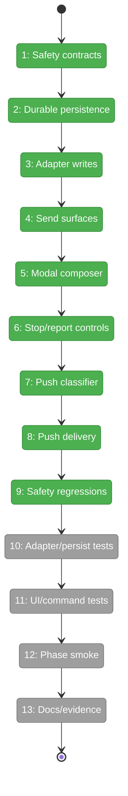
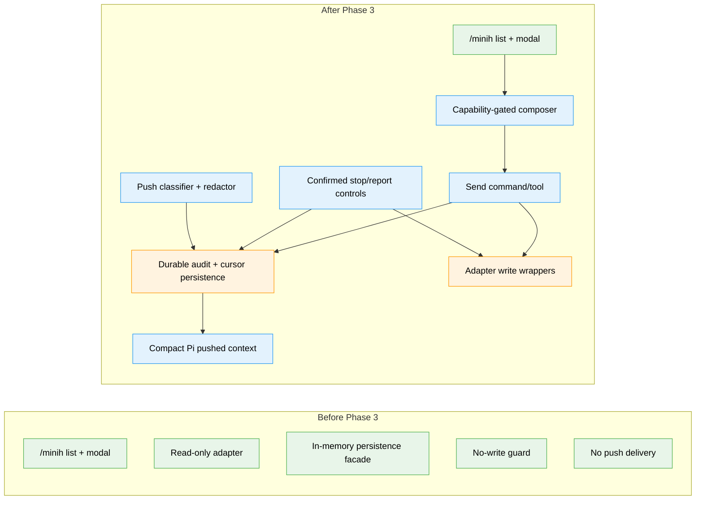

# Flight Plan: Phase 3 — Interaction, Push Context, and Hardening

**Plan**: [../../agent-workbench-plan.md](../../agent-workbench-plan.md)  
**Phase**: Phase 3: Interaction, push context, and hardening  
**Generated**: 2026-05-16  
**Status**: In Progress

---

## Departure → Destination

**Where we are**: Phase 1 created the `agent-workbench` domain, Minih adapter, fixture-backed projections, persistence facade, and read-only pull surfaces. Phase 2 landed the native `/minih` run list, full read-only modal viewer, pane focus/scroll, lazy feed lifecycle, safe `Esc` close, and deterministic modal smoke. No composer, send, stop/control, report-control, push-context delivery, or durable cursor/audit implementation exists yet.

**Where we're going**: A developer/operator can use Minih Workbench to send messages to active coordinated writable runs, stop runs only through explicit confirmed control paths, view/report safely, and receive compact material Minih updates in Pi context once without leaks, spam, or duplicates after same-session reload/resume.

---

## Domain Context

### Domains We're Changing

| Domain | What Changes | Key Files |
|--------|-------------|-----------|
| `agent-workbench` | Add Phase 3 capability, outbound message/control, push classifier, dedupe cursor, redaction/truncation, adapter write wrapper, persistence/audit, and safety contracts. | `.pi/extensions/minih-workbench/store.ts`, `.pi/extensions/minih-workbench/persistence.ts`, `.pi/extensions/minih-workbench/minih-adapter.ts`, optional `.pi/extensions/minih-workbench/push.ts`, `docs/domains/agent-workbench/domain.md` |
| `agent-tooling-interface` | Add gated composer, `/minih send`, `minih_send_message`, stop/report controls, `minih_stop_run`, confirmation UI, and compact Pi pushed-context delivery. | `.pi/extensions/minih-workbench/index.ts`, `.pi/extensions/minih-workbench/ui.ts`, `README.md`, `docs/domains/agent-tooling-interface/domain.md` |
| `extension-authoring-harness` | Add deterministic fixture/fake writer/push tests, smoke coverage, execution evidence, docs, velocity, and difficulty/retro handoff. | `.pi/extensions/minih-workbench/*.test.ts`, `.pi/extensions/minih-workbench/smoke.ts`, `.pi/extensions/minih-workbench/fixtures/`, `docs/how/agent-workbench.md`, `docs/velocity.md`, `docs/difficulties.md`, this task directory |
| `session-work-state` | Clarify/consume durable session-scoped persistence for selected pointers, seen cursors, push opt-ins, and audit/intent/outcome records if implementation updates the domain contract; same-session reload/resume may preserve rows, while new/forked sessions remain independent. | `.pi/extensions/minih-workbench/persistence.ts`, optional `.pi/extensions/minih-workbench/session-persistence.ts`, `docs/domains/session-work-state/domain.md` |

### Domains We Depend On (no changes)

| Domain | What We Consume | Contract |
|--------|----------------|----------|
| `agentic-loops` | Liveness vocabulary, explicit stop separation, watcher cleanup, and one-handler `session_start` discipline. | Long-running agent safety semantics |
| Minih runtime/artifacts | Canonical run artifacts, inbox lanes, history/state/report files, and CLI/helper write surfaces. | Minih-owned `agents/<slug>/runs/<runId>/` artifact and outside-inbox/control protocol |
| Pi runtime | Commands, tools, custom UI, confirmations, lifecycle, and message injection. | `registerCommand`, `registerTool`, `ctx.ui.confirm`, `ctx.ui.custom`, `pi.sendMessage`/equivalent |

---

## Flight Status

<!-- Updated by /plan-6-v2: pending → active → done. Use blocked for problems/input needed. -->

**Legend**: grey = pending | yellow = active | red = blocked/needs input | green = done

---

## Stages

<!-- Updated by /plan-6-v2 during implementation: [ ] → [~] → [x] -->

- [x] **Stage 1: Define safety contracts** — capability, outbound message/control, action-state, push taxonomy, redaction, and dedupe contracts in Pi-free store (`store.ts`).
- [x] **Stage 2: Back persistence durably** — make selected pointers, seen cursors, push opt-ins, and audit/intent/outcome records survive same-session reload/resume through the existing facade, while new/forked sessions start independent (`persistence.ts`, optional `session-persistence.ts` — new file).
- [x] **Stage 3: Add adapter write wrappers** — implement injected Minih writer wrappers for the baseline `minih outside inbox send <slug> --run <runId> --type <type> --subject <subject> --body <body> [--ack-of <messageId>]` protocol and stop control without raw writes outside adapter (`minih-adapter.ts`).
- [x] **Stage 4: Wire send surfaces** — add `/minih send` and `minih_send_message` with explicit run id, fresh capability check, persisted intent, adapter write, and persisted outcome (`index.ts`).
- [x] **Stage 5: Add modal composer** — render composer/send affordance only for coordinated writable runs and keep read-only disabled reasons visible (`ui.ts`).
- [x] **Stage 6: Add stop/report controls** — add confirmed stop UI/command/tool, with `minih_stop_run({ slug, runId, confirm: "stop <slug>/<runId>" })` exact match for model tools, and report/farewell read-only controls; cancel/mismatch/failure sends no control (`index.ts`, `ui.ts`).
- [x] **Stage 7: Classify pushed context** — implement material-event classifier, redaction/truncation, stable cursor keys, and urgent/non-urgent delivery policy (`store.ts`, optional `push.ts` — new file).
- [x] **Stage 8: Deliver pushed context** — wire scoped opened/observed/opted-in push delivery after durable cursor/audit write; suppress duplicates across same-session reload/resume and preserve new/fork independence (`index.ts`, `feed.ts`).
- [x] **Stage 9: Prove safety negatives** — add regression tests for read-only no-write, persistence failure, stop cancel, safe Esc, and no raw/leaky push payloads (`*.test.ts`).
- [ ] **Stage 10: Prove adapter/persistence behavior** — add fake writer/cursor/audit tests and deterministic fixture lanes (`minih-adapter.test.ts`, `fixtures/`).
- [ ] **Stage 11: Prove UI/command behavior** — add keybinding, composer, exact stop confirmation literal, report, tool schema/result, and pushed-envelope tests (`ui.test.ts`, `store.test.ts`).
- [ ] **Stage 12: Prove end-to-end smoke** — deterministic Driver SDK smoke covers send, read-only gating, stop confirm/cancel/mismatch, push once, same-session dedupe after reload, and Esc safe close (`smoke.ts`).
- [ ] **Stage 13: Land docs and evidence** — update README, `docs/how/agent-workbench.md`, extension rules, domain docs, plan progress, velocity, difficulties, execution log, and final validation evidence (`docs/**`, `.pi/extensions/minih-workbench/AGENTS.md`).

---

## Architecture: Before & After

**Legend**: existing (green, unchanged) | changed (orange, modified) | new (blue, created)

---

## Acceptance Criteria

- [ ] Store contracts expose capability, action-state, outbound message/control, material-event, redaction/truncation, and dedupe helpers without Pi imports, `any`, or inline/dynamic imports.
- [ ] Send is enabled only for active coordinated writable runs after a fresh capability check and explicit `slug`/`runId`; read-only/non-coordinated/stale/completed/missing runs perform zero writes.
- [ ] Every send/control path records durable intent/audit before the adapter write and durable outcome after it; persistence failure returns a tagged error and skips the side effect.
- [ ] Adapter write wrappers are the only production Minih write boundary, follow the current outside-inbox CLI/helper protocol baseline, and return tagged success/unavailable/error results with diagnostics.
- [ ] Modal composer uses named/injected keybindings, is disabled or absent with a clear reason for read-only runs, and never interprets freeform text as stop/control.
- [ ] Stop requires explicit confirmation, including exact `confirm: "stop <slug>/<runId>"` for `minih_stop_run`, sends a dedicated control message only after confirmation and persisted intent, rejects mismatches with zero writes, and is never triggered by `Esc`, close, report viewing, or composer text.
- [ ] Report/farewell controls remain read-only and surface path/summary/findings where available.
- [ ] Push classifier sends findings, questions, blockers, permission/needs-recovery states, terminal reports, farewells, and explicit user-addressed inside messages once; routine progress/tool/counter/status churn and large raw outputs are suppressed.
- [ ] Pushed context is compact, redacted/truncated, source-labelled, and excludes secrets, environment values, raw reports/tool outputs, and unbounded paths from model-visible payloads.
- [ ] Push scope defaults to opened/observed runs plus explicitly opted-in runs; it does not push all running Minih agents by default.
- [ ] Same-session reload/resume does not duplicate pushes because stable cursors are durably advanced before model-visible delivery; new/forked sessions start with no inherited Minih Workbench rows unless a future explicit import/migration is designed.
- [ ] Deterministic tests cover capability gates, writer shapes, confirmation, audit ordering, cursor replay, redaction, no-write negatives, and keybinding injection.
- [ ] `npm run smoke -- minih-workbench` proves coordinated send, read-only gating, stop confirm/cancel/mismatch, confirmed stop control, report/farewell viewing, push-once behavior, same-session reload dedupe, and safe `Esc` close without live Minih/Copilot.
- [ ] README, `docs/how/agent-workbench.md`, extension `AGENTS.md`, domain docs, task docs, flight plan, velocity, and difficulties/retros are updated with final evidence.
- [ ] Final implementation reports `just self-check` passing before Phase 3 is declared complete.

## Goals & Non-Goals

**Goals**:

- Add gated send, stop/report controls, and pushed context on top of the landed read-only workbench.
- Preserve Minih as source of truth and keep Minih IO behind adapter wrappers.
- Enforce capability checks, confirmation, persistence-before-side-effect, audit, redaction/truncation, scoped push, and duplicate suppression as tests.
- Keep routine validation deterministic with fixtures/fakes and Driver SDK smoke.

**Non-Goals**:

- Launching Minih agents, installing packages, provider dashboards, right-hand monitor/dock, or all-runs push by default.
- Live Minih/Copilot validation in routine self-check.
- Raw artifact writes from UI/index, raw report/tool output pushes, any stop behavior tied to `Esc`/close/freeform text, or adding the workshop's optional `minih_read_inbox` debug/backfill tool without a later validated plan change.

---

## Checklist

- [x] T001: Define Phase 3 capability, outbound message/control, action-state, push-event, redaction/truncation, and safety contracts in the Pi-free store.
- [x] T002: Add durable session-scoped persistence backing for selected pointers, seen cursors, push opt-ins, and audit/intent/outcome records.
- [x] T003: Implement Minih adapter write wrappers for outside-inbox send and stop-control delivery using injected execution/writer dependencies.
- [x] T004: Add capability-gated send command/tool surfaces: `/minih send <slug> <runId> ...` and `minih_send_message`.
- [x] T005: Add a capability-gated modal composer and send action that reuses Phase 2 keybinding injection and safe modal state.
- [x] T006: Add explicit stop/report controls and `minih_stop_run` with confirmation and audit.
- [x] T007: Implement the pure push-context classifier, dedupe-key builder, redaction/truncation helpers, and urgency policy.
- [x] T008: Wire scoped push-context delivery into Pi with durable cursor/audit ordering and reload-safe replay suppression.
- [x] T009: Add negative safety regression tests across store, adapter, persistence, command/tool, and push paths.
- [ ] T010: Expand adapter/persistence fixture tests for write wrappers, audit ordering, cursor replay, and fake Minih run lanes.
- [ ] T011: Expand UI/command/tool tests for composer, send, stop confirmation, report controls, push delivery envelopes, and keybindings.
- [ ] T012: Expand deterministic Driver SDK smoke for Phase 3 interaction, controls, push, duplicate suppression, and reload.
- [ ] T013: Update operator docs, extension rules, domain docs, plan flight status, execution evidence, velocity, and difficulty/retro handoff.
