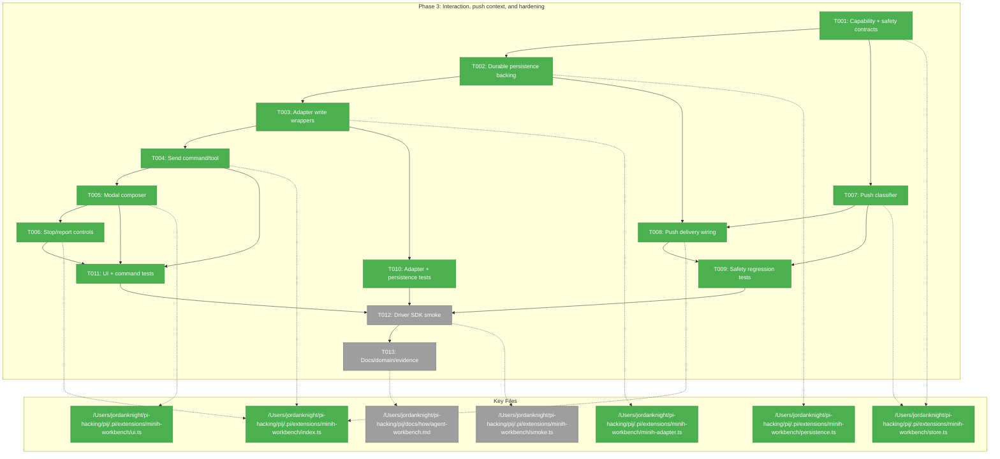
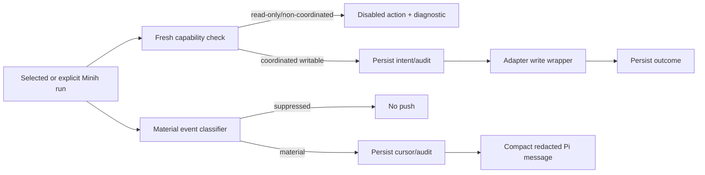
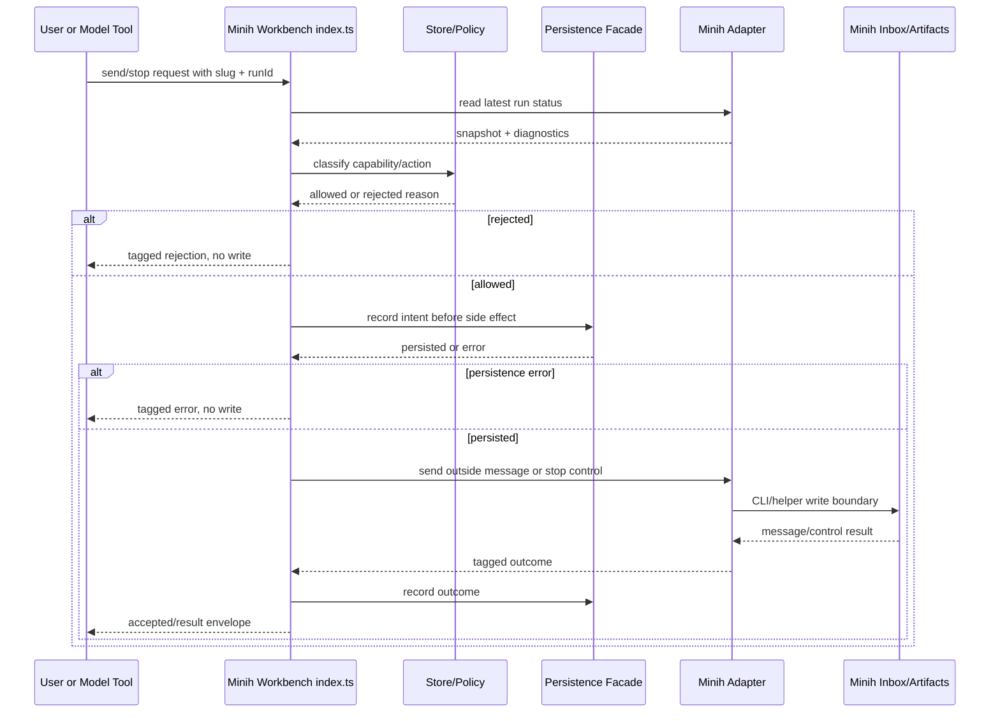

# Phase 3 Tasks: Interaction, Push Context, and Hardening

**Plan**: [agent-workbench-plan.md](../../agent-workbench-plan.md)  
**Phase**: Phase 3: Interaction, push context, and hardening  
**Status**: In Progress  
**Complexity**: CS-5  
**Generated**: 2026-05-16

---

## Executive Briefing

**Purpose**: Phase 3 turns the landed read-only Minih Workbench into a gated interaction surface without weakening Minih ownership or Phase 2 safe-close semantics. It adds coordinated message sending, confirmed stop/report controls, and compact pushed context with durable audit/cursor records.

**What We're Building**: A capability-gated Minih interaction layer over the existing `/minih` list/modal/read-only feed. Coordinated writable runs can receive explicit outside-inbox messages; stop uses a dedicated confirmed control path; material Minih events can enter Pi context once, compactly and redacted, after durable cursor/audit writes.

**Goals**:

- ✅ Define Phase 3 capability, outbound-message, stop-control, push, redaction, audit, and cursor contracts in Pi-free code.
- ✅ Keep Minih artifacts/inboxes/reports canonical; all Minih writes go through adapter write wrappers.
- ✅ Enable composer, `/minih send`, and `minih_send_message` only for active coordinated writable runs after fresh capability checks.
- ✅ Add explicit stop/report UI/command/tool controls with confirmation, audit intent/outcome records, and no `Esc`/freeform-text stop behavior.
- ✅ Push material events into Pi context once with scoped opt-in/opened-run policy, durable dedupe cursors, compact payloads, and redaction/truncation.
- ✅ Expand deterministic fixture/fake tests and smoke for send, read-only gating, stop confirmation, push delivery, dedupe, and reload/resume.
- ✅ Update README, `docs/how/agent-workbench.md`, domain docs, extension rules, velocity, and Phase 3 handoff evidence.

**Non-Goals**:

- ❌ No arbitrary Minih agent launches, `yolo` starts, third-party package installs, or provider dashboard.
- ❌ No right-side monitor/dock or automatic UI popups.
- ❌ No raw Minih artifact writes from UI/index code and no ANSI parsing of `minih view`/`attach`.
- ❌ No live Minih/Copilot requirement in routine tests or `just self-check`.
- ❌ No push of raw reports, large tool outputs, secrets, environment values, or unbounded paths into model-visible context.
- ❌ No interpretation of modal close, `Esc`, or freeform composer text as stop/control.

---

## Prior Phase Context

### Phase 1: Minih inventory + artifact adapter

#### A. Deliverables

- `/Users/jordanknight/pi-hacking/pij/docs/domains/agent-workbench/domain.md` created the `agent-workbench` product boundary and Minih source-of-truth contract.
- `/Users/jordanknight/pi-hacking/pij/docs/domains/registry.md` and `/Users/jordanknight/pi-hacking/pij/docs/domains/domain-map.md` registered `agent-workbench` and one-way edges to Minih artifacts, Pi runtime, `agent-tooling-interface`, `session-work-state`, `agentic-loops`, and `extension-authoring-harness`.
- `/Users/jordanknight/pi-hacking/pij/.pi/extensions/minih-workbench/` was scaffolded via `just new minih-workbench` with T2 layout.
- `/Users/jordanknight/pi-hacking/pij/.pi/extensions/minih-workbench/store.ts` added Pi-free run summaries, status axes, bounded pane snapshots, tagged adapter results, inventory projection, limits, diagnostics, and no-write guard placeholders.
- `/Users/jordanknight/pi-hacking/pij/.pi/extensions/minih-workbench/persistence.ts` added the injected persistence facade for selected runs, seen cursors, push opt-ins, and audit/intent/outcome records.
- `/Users/jordanknight/pi-hacking/pij/.pi/extensions/minih-workbench/minih-adapter.ts` added read-only Minih artifact readers and diagnostics over deterministic fixtures.
- `/Users/jordanknight/pi-hacking/pij/.pi/extensions/minih-workbench/index.ts` added canonical pull surfaces: `/minih status --json`, status/report JSON commands, and read-only tools `minih_runs_list`, `minih_run_status`, `minih_read_report`.
- `/Users/jordanknight/pi-hacking/pij/.pi/extensions/minih-workbench/fixtures/` added active, stale, coordinated, standalone, completed/report-ready, malformed, partial, permission-like, and large-output fixture runs.
- `/Users/jordanknight/pi-hacking/pij/.pi/extensions/minih-workbench/store.test.ts`, `/Users/jordanknight/pi-hacking/pij/.pi/extensions/minih-workbench/minih-adapter.test.ts`, and `/Users/jordanknight/pi-hacking/pij/.pi/extensions/minih-workbench/smoke.ts` established fixture-first validation.

#### B. Dependencies Exported

- `MinihRunSummary`, `MinihStatusAxes`, `MinihViewSnapshot`, `MinihModalState`, `MinihPaneSnapshot`, `MinihAdapterResult<T>`, diagnostics, pane bounds, and inventory projection helpers from `store.ts`.
- `MinihWorkbenchPersistence`, `SeenCursorKey`, `SeenCursorValue`, `PushOptInValue`, `WorkbenchAuditRecord`, and `MemoryMinihWorkbenchPersistence` from `persistence.ts`.
- Adapter read APIs: `defaultFixtureRoot()`, `listMinihRuns()`, `readMinihRunStatus()`, and `readMinihReport()`.
- Canonical read-only pull contracts and fixture roots for deterministic smoke/tests.

#### C. Gotchas & Debt

- Inventory de-dupe and completed-limit edge cases required companion fixes; preserve independent active/completed bounds and no duplicate report-ready active rows.
- Adapter initially accepted wrong-shape `run.json`; keep structural validation for any new writer/capability reads.
- The original Phase 1 companion stale-run report required recovery; final evidence should keep companion report/retro harvesting explicit.
- No new Minih package dependency was added; helper-vs-CLI decisions must be recorded before adding dependencies.
- Phase 1 persistence is in-memory; Phase 3 must add durable backing before real push/write side effects.

#### D. Incomplete Items

- No Phase 1 tasks remain open.
- Full modal UI, composer/send, stop controls, report controls, push-context delivery, and live Minih/Copilot validation were intentionally deferred.

#### E. Patterns to Follow

- Minih artifacts remain canonical; Pi stores pointers/cursors/audit only.
- `store.ts` stays Pi-free and pure; `minih-adapter.ts` owns Minih IO; `index.ts` owns Pi wiring; `ui.ts` owns TUI rendering.
- Use tagged results/diagnostics instead of throws.
- Use fixture-first validation; live Minih/Copilot remains opt-in.
- Never parse ANSI output, assume `last-run`, or write Minih artifacts outside the adapter boundary.

### Phase 2: Full modal Minih run viewer

#### A. Deliverables

- `/Users/jordanknight/pi-hacking/pij/.pi/extensions/minih-workbench/store.ts` added `MINIH_WORKBENCH_ACTIONS`, `DEFAULT_MINIH_WORKBENCH_KEYBINDINGS`, list selection helpers, modal open/close helpers, pane focus/cursor/page helpers, and report cursor support.
- `/Users/jordanknight/pi-hacking/pij/.pi/extensions/minih-workbench/ui.ts` added native `MinihRunListComponent`, `MinihRunModalComponent`, width-safe render primitives, stable smoke anchors, and disabled composer reason.
- `/Users/jordanknight/pi-hacking/pij/.pi/extensions/minih-workbench/feed.ts` added `MinihReadOnlyFeed`, lazy starts, coalesced refreshes, watcher diagnostics, bounded fallback polling, and dispose guards.
- `/Users/jordanknight/pi-hacking/pij/.pi/extensions/minih-workbench/index.ts` wired `/minih`, `/minih list`, `/minih view <slug> <runId>`, `/minih report <slug> <runId>`, selected-pointer cleanup, and session lifecycle disposal.
- `/Users/jordanknight/pi-hacking/pij/.pi/extensions/minih-workbench/store.test.ts`, `/Users/jordanknight/pi-hacking/pij/.pi/extensions/minih-workbench/ui.test.ts`, `/Users/jordanknight/pi-hacking/pij/.pi/extensions/minih-workbench/feed.test.ts`, and `/Users/jordanknight/pi-hacking/pij/.pi/extensions/minih-workbench/smoke.ts` cover modal state, keybinding injection, width safety, report paging, feed lifecycle, list → modal → Esc → report → reload smoke.
- `/Users/jordanknight/pi-hacking/pij/.pi/extensions/minih-workbench/AGENTS.md`, domain docs, plan flight plan, and execution log were updated for Phase 3 handoff.

#### B. Dependencies Exported

- `DEFAULT_MINIH_WORKBENCH_KEYBINDINGS`, `MINIH_WORKBENCH_ACTIONS`, `MinihWorkbenchKeybindings`.
- Pure selection/modal helpers: `moveListSelection`, `resolveSelectedRun`, `openModalForRun`, `closeModalSafely`, `cycleFocusedPane`, `pageFocusedPane`, `pageModalPane`, and cursor helpers.
- UI components: `MinihRunListComponent`, `MinihRunModalComponent`, render helpers, stable anchors, and `MINIH_DISABLED_COMPOSER_REASON`.
- Feed contracts: `MinihReadOnlyFeed`, `createInventoryFeed`, `createRunFeed`, lazy/disposable/coalesced behavior.
- Preserved read-only commands/tools and adapter projections from Phase 1.

#### C. Gotchas & Debt

- Multiline report/pane/diagnostic text needed explicit width-safe normalization.
- Report pane paging was initially inert; keep cursor-window tests when adding richer controls.
- Keybinding tests must use non-default keys or they miss hardcoded-key regressions.
- Async refreshes must guard closed/superseded components and ignore callbacks after dispose.
- Non-UI fallbacks must not leave selected/modal state set.
- Smoke assertions must prove close/input release with deterministic post-close signals, not generic scrollback words.
- Phase 2 still has no durable session-backed cursor/pointer storage and no write wrappers.

#### D. Incomplete Items

- No Phase 2 tasks remain open; companion approved all findings F001–F008.
- Intentional Phase 3 carry-forward: composer/send, stop/control, report-control semantics beyond viewing, Minih write wrappers, push classifier/delivery/dedupe, durable cursor/audit persistence, and docs/how guide.

#### E. Patterns to Follow

- Extend landed contracts instead of creating parallel state/UI/feed abstractions.
- Preserve `Esc` safe close forever: close updates Pi UI only and never sends Minih control.
- Keep named keybinding constants and injected key maps; no raw hardcoded keys.
- Keep lazy/disposable feeds; no global always-on polling or auto-open UI on reload.
- Keep canonical read-only pull surfaces while adding write-capable surfaces behind explicit gates.

---

## Pre-Implementation Check

| File | Exists? | Domain Check | Notes |
|------|---------|--------------|-------|
| `/Users/jordanknight/pi-hacking/pij/.pi/extensions/minih-workbench/store.ts` | yes | `agent-workbench` contract | Modify for capability, outbound message, stop-control, push taxonomy, redaction/truncation, action state, and pure safety helpers. Pi-free; no `@earendil-works/*`; no inline/dynamic imports. |
| `/Users/jordanknight/pi-hacking/pij/.pi/extensions/minih-workbench/persistence.ts` | yes | `agent-workbench` internal / consumes `session-work-state` semantics | Modify facade if needed for durable audit/cursor outcomes; keep Pi-free. Durable implementation must be injected outside this file. |
| `/Users/jordanknight/pi-hacking/pij/.pi/extensions/minih-workbench/session-persistence.ts` | no | `agent-tooling-interface`/`session-work-state` bridge | New optional Pi-backed persistence adapter if implementation chooses a separate file instead of keeping wiring in `index.ts`; must preserve `MinihWorkbenchPersistence` interface. |
| `/Users/jordanknight/pi-hacking/pij/.pi/extensions/minih-workbench/minih-adapter.ts` | yes | `agent-workbench` Minih IO boundary | Modify for adapter write wrappers. No raw writes in `ui.ts`/`index.ts`; prefer Minih CLI/helper; fixture/fake writers for tests. |
| `/Users/jordanknight/pi-hacking/pij/.pi/extensions/minih-workbench/feed.ts` | yes | `agent-workbench` feed lifecycle | Modify only if push observer can reuse feed lifecycle; preserve lazy start, bounded fallback polling, dispose guards, and fixture timers. |
| `/Users/jordanknight/pi-hacking/pij/.pi/extensions/minih-workbench/push.ts` | no | `agent-workbench` optional Pi-free helper | New optional file if the push classifier/redactor grows too large for `store.ts`; must import only Pi-free local contracts. |
| `/Users/jordanknight/pi-hacking/pij/.pi/extensions/minih-workbench/ui.ts` | yes | `agent-tooling-interface` UI | Modify for capability-gated composer and explicit controls; no Minih IO/persistence writes; `Esc` remains close-only. |
| `/Users/jordanknight/pi-hacking/pij/.pi/extensions/minih-workbench/index.ts` | yes | `agent-tooling-interface` wiring | Modify for commands/tools, confirmation UI, persistence injection, `pi.sendMessage`, lifecycle push replay suppression; high-risk contract surface. |
| `/Users/jordanknight/pi-hacking/pij/.pi/extensions/minih-workbench/store.test.ts` | yes | `extension-authoring-harness` | Expand for capability gates, outbound/control shapes, classifier, redaction, dedupe, audit ordering, no-write negatives. |
| `/Users/jordanknight/pi-hacking/pij/.pi/extensions/minih-workbench/minih-adapter.test.ts` | yes | `extension-authoring-harness` | Expand for fake writer success/unavailable/error, exact outside-inbox message/control shape, and no raw UI writes. |
| `/Users/jordanknight/pi-hacking/pij/.pi/extensions/minih-workbench/feed.test.ts` | yes | `extension-authoring-harness` | Expand only if push observer shares feed lifecycle; cover dispose/reload duplicate suppression. |
| `/Users/jordanknight/pi-hacking/pij/.pi/extensions/minih-workbench/ui.test.ts` | yes | `extension-authoring-harness` | Expand for non-default composer/control keybindings, disabled composer reasons, stop/report controls, and Esc safe close. |
| `/Users/jordanknight/pi-hacking/pij/.pi/extensions/minih-workbench/smoke.ts` | yes | `extension-authoring-harness` | Expand deterministic Driver SDK smoke for send, read-only gating, stop confirm/cancel, push delivery/dedupe, reload. No live Minih/Copilot. |
| `/Users/jordanknight/pi-hacking/pij/.pi/extensions/minih-workbench/fixtures/` | yes | `extension-authoring-harness` | Extend with writable coordinated fixture lanes, push material/non-material events, duplicate cursor cases, and fake report/farewell examples. |
| `/Users/jordanknight/pi-hacking/pij/.pi/extensions/minih-workbench/AGENTS.md` | yes | `agent-workbench` local rules | Update after Phase 3 lands so it no longer says send/stop/push are future-only and documents permanent safety gates. |
| `/Users/jordanknight/pi-hacking/pij/docs/how/agent-workbench.md` | no | `agent-workbench` operator guide | Create in Phase 3 with list/modal/send/stop/report/push/troubleshooting guidance. |
| `/Users/jordanknight/pi-hacking/pij/README.md` | yes | `agent-tooling-interface` quick-start | Modify with Minih Workbench quick-start and safety notes. |
| `/Users/jordanknight/pi-hacking/pij/docs/domains/agent-workbench/domain.md` | yes | `agent-workbench` contract | Update contracts/composition/history after Phase 3. |
| `/Users/jordanknight/pi-hacking/pij/docs/domains/agent-tooling-interface/domain.md` | yes | `agent-tooling-interface` contract | Update command/tool/UI/push surfaces after Phase 3. |
| `/Users/jordanknight/pi-hacking/pij/docs/domains/session-work-state/domain.md` | yes | `session-work-state` consumed | Update only if durable persistence adds/clarifies session-scoped storage contract. |
| `/Users/jordanknight/pi-hacking/pij/docs/plans/007-options-for-pi-extensions-that-do-subagents/agent-workbench.fltplan.md` | yes | `extension-authoring-harness` tracking | Mark Phase 3 progress/handoff during implementation. |
| `/Users/jordanknight/pi-hacking/pij/docs/plans/007-options-for-pi-extensions-that-do-subagents/tasks/phase-3-interaction-push-context-and-hardening/tasks.md` | yes | `extension-authoring-harness` tracking | This dossier; plan-6 updates status/discoveries/validation. |
| `/Users/jordanknight/pi-hacking/pij/docs/plans/007-options-for-pi-extensions-that-do-subagents/tasks/phase-3-interaction-push-context-and-hardening/tasks.fltplan.md` | yes | `extension-authoring-harness` tracking | Phase flight plan; plan-6 updates state diagram/stages/checklist. |
| `/Users/jordanknight/pi-hacking/pij/docs/plans/007-options-for-pi-extensions-that-do-subagents/tasks/phase-3-interaction-push-context-and-hardening/execution.log.md` | no | `extension-authoring-harness` evidence | Created by plan-6 implementation. |
| `/Users/jordanknight/pi-hacking/pij/docs/velocity.md` | yes | `extension-authoring-harness` evidence | Update at phase end. |
| `/Users/jordanknight/pi-hacking/pij/docs/difficulties.md` | yes | `extension-authoring-harness` self-improvement | Update only for new friction or companion difficulties. |

**Concept Search Results**:

- Outbound write wrappers: no implemented Minih write wrapper exists; reuse `agent-workbench` contracts, `persistence.ts`, and `minih-adapter.ts`; stop should use `type: control` with body beginning `stop`.
- Push context: no classifier/dedupe delivery exists; reuse `MinihWorkbenchPersistence` seen cursors/push opt-ins/audit records and Pi `sendMessage(..., { deliverAs })` semantics from local Pi findings.
- Confirmation: reuse `ctx.ui.confirm` patterns from `/todo clear` and `/sql reset`; model-facing stop must be stronger than those examples with explicit run id, fresh capability check, typed confirmation, and audit.
- `minih_read_inbox` workshop note: defer this debug/backfill tool unless a later validated plan change adds it. Phase 3 new write-capable tools are limited to `minih_send_message` and `minih_stop_run`; existing read-only pull tools remain list/status/report.

**Minih Write Protocol Baseline**:

- Current CLI baseline for send/control wrappers is `minih outside inbox send <slug> --run <runId> --type <type> --subject <subject> --body <body> [--ack-of <messageId>]`.
- Default composer send uses `type=task`; richer explicit replies may use `question`, `directive`, `briefing`, or `review-request` only when the UI/tool schema names that type.
- Stop uses a dedicated control wrapper with `--type control` and a body beginning exactly with `stop`; stop is never composer text.
- Adapter wrappers may substitute a public Minih helper for the CLI only if they preserve the same adapter-level tagged result shape: accepted/rejected/unavailable/error, diagnostics, optional message/control id, and no raw production writes outside the adapter.
- Implementation must probe/record the exact helper-vs-CLI decision in T003 evidence before enabling production side effects.

**Agent Harness Health Check**:

- Governance doc: `/Users/jordanknight/pi-hacking/pij/docs/project-rules/agent-harness.md`.
- Health command run for this dossier: `minih doctor`.
- Result: `status=degraded`, `errors=0`, `warnings=3`, `healthy=3/4`; `code-review-companion` passed `prompt-state-vocabulary-drift` but warnings remain for missing shared preamble, unharvested package-vetter retro, and a stale Phase 1 companion run.
- Context Brief note: Agent harness is available at L2 + companion overlay, but plan-6 must re-run `minih doctor` before booting the Phase 3 companion and treat any errors as blocking.

---

## Architecture Map



---

## Tasks

| Status | ID | Task | Domain | Path(s) | Done When | Notes |
|--------|-----|------|--------|---------|-----------|-------|
| [x] | T001 | Define Phase 3 capability, outbound message/control, action-state, push-event, redaction/truncation, and safety contracts in the Pi-free store. | `agent-workbench` | `/Users/jordanknight/pi-hacking/pij/.pi/extensions/minih-workbench/store.ts`; `/Users/jordanknight/pi-hacking/pij/.pi/extensions/minih-workbench/store.test.ts` | Store exports structural types and pure helpers for coordinated writable capability, explicit outbound message draft shape, stop-control draft shape, action availability, material-event classification inputs, stable dedupe keys, redaction/truncation bounds, and safe-close invariants. Tests prove non-coordinated/read-only runs remain disabled and `Esc`/close returns no stop/control side effects. | Plan findings 03/07; spec Phase 3 Safety. Keep constants in `store.ts`; no Pi imports, no `any`, no inline/dynamic imports. |
| [x] | T002 | Add durable session-scoped persistence backing for selected pointers, seen cursors, push opt-ins, and audit/intent/outcome records. | `agent-workbench` / `session-work-state` consume | `/Users/jordanknight/pi-hacking/pij/.pi/extensions/minih-workbench/persistence.ts`; optional `/Users/jordanknight/pi-hacking/pij/.pi/extensions/minih-workbench/session-persistence.ts`; `/Users/jordanknight/pi-hacking/pij/.pi/extensions/minih-workbench/index.ts`; `/Users/jordanknight/pi-hacking/pij/.pi/extensions/minih-workbench/store.test.ts` | `MinihWorkbenchPersistence` remains the single facade; same-session reload/resume preserves selected pointers, cursors, audit records, and push opt-ins; new/forked sessions start with no inherited Minih Workbench rows unless a future explicit import/migration is designed; write/push paths can fail closed when persistence fails; tests prove persist-before-side-effect ordering and no parallel cursor/audit store. | Phase 1 in-memory facade is insufficient for push dedupe. If a Pi-backed implementation needs Pi types, keep it out of Pi-free `persistence.ts`. Respect `session-work-state` new/fork independence. |
| [x] | T003 | Implement Minih adapter write wrappers for outside-inbox send and stop-control delivery using injected execution/writer dependencies. | `agent-workbench` | `/Users/jordanknight/pi-hacking/pij/.pi/extensions/minih-workbench/minih-adapter.ts`; `/Users/jordanknight/pi-hacking/pij/.pi/extensions/minih-workbench/minih-adapter.test.ts`; `/Users/jordanknight/pi-hacking/pij/.pi/extensions/minih-workbench/fixtures/` | Adapter exposes tagged wrappers for send message and stop control matching the Minih write protocol baseline (`minih outside inbox send <slug> --run <runId> --type <type> --subject <subject> --body <body> [--ack-of <messageId>]`; stop uses `--type control` and body beginning `stop`), explicit `slug`/`runId`, message/control id capture where available, unavailable/error results, diagnostics, and no raw production writes outside the adapter. Tests use fake writer dependencies and assert exact outside-inbox and control shapes. | Concept search found no writer exists. Prefer Minih CLI/helper boundary; raw NDJSON append only in fixture tests if needed. T003 must record the helper-vs-CLI decision before enabling production side effects. |
| [x] | T004 | Add capability-gated send command/tool surfaces: `/minih send <slug> <runId> ...` and `minih_send_message`. | `agent-tooling-interface` | `/Users/jordanknight/pi-hacking/pij/.pi/extensions/minih-workbench/index.ts`; `/Users/jordanknight/pi-hacking/pij/.pi/extensions/minih-workbench/store.ts`; `/Users/jordanknight/pi-hacking/pij/.pi/extensions/minih-workbench/store.test.ts`; `/Users/jordanknight/pi-hacking/pij/.pi/extensions/minih-workbench/minih-adapter.test.ts` | Command/tool require explicit run id, fresh status/capability check, active coordinated writable run, persisted intent before adapter write, persisted outcome after adapter result, and tagged accepted/rejected/unavailable/error envelopes. Read-only/non-coordinated/stale/completed/missing runs perform zero writes with clear reasons. | Do not replace read-only tools; add `minih_send_message` as a new write-capable tool with strict schema. Defer workshop's optional `minih_read_inbox` debug/backfill tool unless a later validated plan change adds it. No model-controlled launches/installs. |
| [x] | T005 | Add a capability-gated modal composer and send action that reuses Phase 2 keybinding injection and safe modal state. | `agent-tooling-interface` | `/Users/jordanknight/pi-hacking/pij/.pi/extensions/minih-workbench/ui.ts`; `/Users/jordanknight/pi-hacking/pij/.pi/extensions/minih-workbench/index.ts`; `/Users/jordanknight/pi-hacking/pij/.pi/extensions/minih-workbench/ui.test.ts`; `/Users/jordanknight/pi-hacking/pij/.pi/extensions/minih-workbench/store.test.ts` | Writable coordinated runs show a bounded composer/send affordance; read-only runs show a disabled/absent reason. Composer text is delivered only through the T004 send path, never interpreted as stop/control. Key handling uses named actions and injected maps; tests use non-default keys and prove default raw keys do not accidentally act. | Keep UI free of Minih IO and persistence mutation. Preserve width-safe rendering and pane scroll/focus behavior. |
| [x] | T006 | Add explicit stop/report controls and `minih_stop_run` with confirmation and audit. | `agent-tooling-interface` | `/Users/jordanknight/pi-hacking/pij/.pi/extensions/minih-workbench/index.ts`; `/Users/jordanknight/pi-hacking/pij/.pi/extensions/minih-workbench/ui.ts`; `/Users/jordanknight/pi-hacking/pij/.pi/extensions/minih-workbench/store.ts`; `/Users/jordanknight/pi-hacking/pij/.pi/extensions/minih-workbench/ui.test.ts`; `/Users/jordanknight/pi-hacking/pij/.pi/extensions/minih-workbench/minih-adapter.test.ts` | Stop requires explicit run id, fresh capability check, human `ctx.ui.confirm` for UI/command paths, `minih_stop_run({ slug, runId, confirm: "stop <slug>/<runId>" })` exact-string confirmation for model tool paths, persisted intent before control send, dedicated `type=control` stop message, persisted outcome, and visible success/failure diagnostics. Mismatched confirmation, cancel, persistence failure, and read-only runs return tagged rejection/error and send no control. Report controls surface report/farewell path/summary read-only and never imply stop. | Reuse `/todo clear` and `/sql reset` confirmation pattern, but add Minih-specific capability/audit. `Esc` and freeform composer text never stop. |
| [x] | T007 | Implement the pure push-context classifier, dedupe-key builder, redaction/truncation helpers, and urgency policy. | `agent-workbench` | `/Users/jordanknight/pi-hacking/pij/.pi/extensions/minih-workbench/store.ts`; optional `/Users/jordanknight/pi-hacking/pij/.pi/extensions/minih-workbench/push.ts`; `/Users/jordanknight/pi-hacking/pij/.pi/extensions/minih-workbench/store.test.ts` | Pure helpers classify findings, direct questions, blockers, permission/needs-recovery states, terminal reports, farewells, and explicit user-addressed inside messages as material; suppress routine progress, raw tool start/end, token/counter churn, duplicate status churn, and large raw tool outputs. Helpers produce stable cursor keys, compact model-visible messages, metadata-only fields, redaction markers, truncation markers, max sizes, and explicit urgent/non-urgent delivery classification. | If creating `push.ts`, keep it Pi-free and use `.js` relative imports. Tests must cover denylisted sensitive classes: secrets, environment values, large raw outputs, and unbounded paths. |
| [x] | T008 | Wire scoped push-context delivery into Pi with durable cursor/audit ordering and reload-safe replay suppression. | `agent-tooling-interface` | `/Users/jordanknight/pi-hacking/pij/.pi/extensions/minih-workbench/index.ts`; `/Users/jordanknight/pi-hacking/pij/.pi/extensions/minih-workbench/feed.ts`; `/Users/jordanknight/pi-hacking/pij/.pi/extensions/minih-workbench/persistence.ts`; `/Users/jordanknight/pi-hacking/pij/.pi/extensions/minih-workbench/feed.test.ts`; `/Users/jordanknight/pi-hacking/pij/.pi/extensions/minih-workbench/store.test.ts` | Opened/observed runs and explicitly opted-in runs are eligible; no all-runs default. Before `pi.sendMessage`/custom message delivery, the cursor/audit record is durably advanced; if persistence fails, no model-visible push occurs. Duplicate material events are not pushed after same-session reload/resume; new/forked sessions do not inherit prior cursors/opt-ins; non-material churn stays suppressed; urgent `triggerTurn`/`deliverAs` behavior is explicit and tested. | Default delivery should avoid interrupting unless classifier marks urgent. Use compact/redacted payloads only. No automatic UI popups. Respect `session-work-state` new/fork independence. |
| [x] | T009 | Add negative safety regression tests across store, adapter, persistence, command/tool, and push paths. | `extension-authoring-harness` | `/Users/jordanknight/pi-hacking/pij/.pi/extensions/minih-workbench/store.test.ts`; `/Users/jordanknight/pi-hacking/pij/.pi/extensions/minih-workbench/minih-adapter.test.ts`; `/Users/jordanknight/pi-hacking/pij/.pi/extensions/minih-workbench/feed.test.ts`; `/Users/jordanknight/pi-hacking/pij/.pi/extensions/minih-workbench/ui.test.ts` | Tests prove read-only/non-coordinated runs perform zero writes, stale/completed/malformed/missing runs fail closed, persistence failure skips side effects, close/Esc sends no control, stop cancel sends no control, raw reports/tool outputs/secrets/env/path-heavy payloads do not enter model-visible pushes, and duplicate events push once per same-session cursor. | This is a dedicated safety net, not a substitute for feature tests in T010/T011. |
| [x] | T010 | Expand adapter/persistence fixture tests for write wrappers, audit ordering, cursor replay, and fake Minih run lanes. | `extension-authoring-harness` | `/Users/jordanknight/pi-hacking/pij/.pi/extensions/minih-workbench/minih-adapter.test.ts`; `/Users/jordanknight/pi-hacking/pij/.pi/extensions/minih-workbench/store.test.ts`; `/Users/jordanknight/pi-hacking/pij/.pi/extensions/minih-workbench/fixtures/` | Fixture/fake tests prove exact send/control shapes, tagged success/unavailable/error results, message/control ids where available, intent-before-write and outcome-after-write records, cursor-before-push ordering, push opt-in behavior, same-session reload/resume replay suppression, and new/fork independence. | Extend fixtures deterministically; no live Minih/Copilot. |
| [x] | T011 | Expand UI/command/tool tests for composer, send, stop confirmation, report controls, push delivery envelopes, and keybindings. | `extension-authoring-harness` | `/Users/jordanknight/pi-hacking/pij/.pi/extensions/minih-workbench/ui.test.ts`; `/Users/jordanknight/pi-hacking/pij/.pi/extensions/minih-workbench/store.test.ts`; `/Users/jordanknight/pi-hacking/pij/.pi/extensions/minih-workbench/index.ts` | Tests cover writable vs disabled composer rendering, non-default send/stop/report keybindings, command parse errors, explicit run-id requirement, model-tool schemas/results, exact `confirm: "stop <slug>/<runId>"` match and mismatch rejection, stop confirm/cancel, read-only report viewing, and compact pushed message envelope formatting. | Prefer pure/injected tests around external runtime boundaries; avoid broad Pi runtime mocks except necessary command/UI seams. |
| [ ] | T012 | Expand deterministic Driver SDK smoke for Phase 3 interaction, controls, push, duplicate suppression, and reload. | `extension-authoring-harness` | `/Users/jordanknight/pi-hacking/pij/.pi/extensions/minih-workbench/smoke.ts`; `/Users/jordanknight/pi-hacking/pij/.pi/extensions/minih-workbench/fixtures/` | `npm run smoke -- minih-workbench` proves `/minih` list/modal still works; coordinated send succeeds and appears in timeline; non-coordinated/read-only send is blocked; stop confirm cancel sends no control; model-tool stop with wrong confirmation sends no control; confirmed stop sends dedicated control; report/farewell remains visible; one material event pushes once; same-session reload/resume does not duplicate; Esc close still releases input and never stops the run. | Use fixture/fake writer/push hooks only. No live Minih/Copilot or model-dependent behavior. |
| [ ] | T013 | Update operator docs, extension rules, domain docs, plan flight status, execution evidence, velocity, and difficulty/retro handoff. | `extension-authoring-harness` | `/Users/jordanknight/pi-hacking/pij/README.md`; `/Users/jordanknight/pi-hacking/pij/docs/how/agent-workbench.md`; `/Users/jordanknight/pi-hacking/pij/.pi/extensions/minih-workbench/AGENTS.md`; `/Users/jordanknight/pi-hacking/pij/docs/domains/agent-workbench/domain.md`; `/Users/jordanknight/pi-hacking/pij/docs/domains/agent-tooling-interface/domain.md`; `/Users/jordanknight/pi-hacking/pij/docs/domains/session-work-state/domain.md`; `/Users/jordanknight/pi-hacking/pij/docs/plans/007-options-for-pi-extensions-that-do-subagents/agent-workbench.fltplan.md`; `/Users/jordanknight/pi-hacking/pij/docs/plans/007-options-for-pi-extensions-that-do-subagents/tasks/phase-3-interaction-push-context-and-hardening/tasks.md`; `/Users/jordanknight/pi-hacking/pij/docs/plans/007-options-for-pi-extensions-that-do-subagents/tasks/phase-3-interaction-push-context-and-hardening/tasks.fltplan.md`; `/Users/jordanknight/pi-hacking/pij/docs/plans/007-options-for-pi-extensions-that-do-subagents/tasks/phase-3-interaction-push-context-and-hardening/execution.log.md`; `/Users/jordanknight/pi-hacking/pij/docs/velocity.md`; `/Users/jordanknight/pi-hacking/pij/docs/difficulties.md` | Docs describe list/modal/send/stop/report/push semantics, safety gates, troubleshooting, and no-live-test routine. Task/flight docs show landed status and validation evidence after implementation. Phase execution log records companion findings/reconciliations. Final validation includes focused tests, `npm run smoke -- minih-workbench`, `minih doctor`, package-vet evidence if any dependency is added, and `just self-check`. | Plan-6 creates/updates `execution.log.md`. Harvest companion report/retro and ledger real difficulties; do not fabricate retros. |

---

## Context Brief

### Key findings from plan

- **Finding 01 — new domain boundary**: `agent-workbench` owns Minih Workbench product contracts; do not move Minih runtime ownership into Pi.
- **Finding 02 — Minih source of truth**: all Minih IO must route through `minih-adapter.ts`; no ANSI parsing, `last-run` assumptions, or direct UI writes.
- **Finding 03 — write/privacy boundary**: Phase 3 send/stop/push is safety-critical; require explicit run id, fresh capability checks, confirmation for stop, audit events, persistence-before-side-effect, redaction/truncation, scoped push, and stable dedupe cursors.
- **Finding 04 — modal proof gate already landed**: Phase 3 must build on the landed full-modal UI rather than redesigning the viewer.
- **Finding 05 — T2/Pi-free patterns**: preserve store/adapter/ui/index split and test pure store/adapter behavior with fixtures.
- **Finding 06 — deterministic validation**: routine tests and smoke must use fixtures/fakes, not live Minih/Copilot or model choices.
- **Finding 07 — push scope**: default push scope is opened/observed plus explicitly opted-in runs; all-runs push remains a later expansion decision.

### Domain dependencies

- `agent-workbench`: `MinihRunSummary`, `MinihViewSnapshot`, `MinihAdapterResult`, `MinihWorkbenchPersistence`, keybinding/action constants, safe-close invariant, and future Phase 3 safety policy.
- `agent-tooling-interface`: Pi command/tool/custom UI/custom message surfaces for `/minih`, modal composer/controls, `ctx.ui.confirm`, and `pi.sendMessage`/equivalent delivery.
- `session-work-state`: session-scoped durable pointers, cursors, push opt-ins, and audit/intent/outcome persistence semantics through the Minih Workbench facade; same-session reload/resume may preserve rows, while new/forked sessions remain independent.
- `agentic-loops`: long-running-agent liveness vocabulary, explicit stop separation, watcher cleanup, one `session_start` handler discipline, and no implicit control from close.
- `extension-authoring-harness`: T2 layout, fixtures, Vitest, Driver SDK smoke, `just self-check`, companion review, retros, difficulty ledger, and velocity log.
- Minih runtime/artifacts: external canonical `agents/<slug>/runs/<runId>/` artifacts, inbox lanes, state/history/report files, and CLI/helper writer semantics where stable.

### Domain constraints

- `store.ts`, `persistence.ts`, and any new pure helper module must remain Pi-free and must not import `@earendil-works/*`.
- No `any` types unless absolutely necessary; prefer structural guards and tagged unions.
- No inline/dynamic imports in new or modified Minih Workbench files; use top-level standard imports and top-level `import type`.
- Relative imports use `.js` extension under NodeNext/ESM.
- Constants live near the data they constrain, especially action names, keybindings, limits, redaction/truncation bounds, and material taxonomy.
- Side effects are injected through constructors/functions; no global mutable writer/push state.
- Persist intent/cursor/audit before write/push side effects; persistence failure returns a tagged error and skips the side effect.
- Commands/tools require explicit `slug` and `runId` for write/control paths.
- `Esc`, modal close, report viewing, and freeform composer text never send stop/control.
- Package manifests are not hand-edited; any new package uses `just pkg add <source>` plus vet/audit evidence.

### Agent harness context

- **Boot**: engineering harness boot is `just install`/`npm install`; companion overlay boot is `minih run code-review-companion` after `minih doctor`.
- **Interact**: plan-6-companion sends a briefing and per-commit `review-request: T### <sha>` outside-inbox messages; implementation uses Pi TUI and Driver SDK smoke.
- **Observe**: evidence lives in `agents/code-review-companion/runs/<runId>/{inbox,events.ndjson,output/report.json}`, Vitest output, smoke transcripts, `execution.log.md`, `docs/velocity.md`, and `docs/difficulties.md`.
- **Maturity**: L2 engineering harness + companion overlay. Current pre-dossier health: `minih doctor` degraded with 0 errors, 3 warnings, 3/4 healthy.
- **Pre-phase validation**: Agent MUST run `minih doctor`, `just typecheck` or stronger, and `npm run smoke -- minih-workbench` before implementation. Any `minih doctor` errors block companion-backed work.

### Reusable from prior phases

- Deterministic Minih fixture root under `.pi/extensions/minih-workbench/fixtures/`.
- Canonical read-only adapter APIs: `listMinihRuns`, `readMinihRunStatus`, `readMinihReport`.
- Canonical read-only commands/tools: `/minih status --json`, `/minih status <slug> <runId> --json`, `/minih report <slug> <runId> --json`, `minih_runs_list`, `minih_run_status`, `minih_read_report`.
- Native list/modal components and safe close behavior.
- Feed lifecycle with lazy starts, coalescing, fallback polling, and dispose guards.
- Persistence facade for selected run pointers, seen cursors, push opt-ins, and audit records.
- Confirmation patterns from `/todo clear` and `/sql reset`.

### Mermaid flow diagram



### Mermaid sequence diagram



---

## Discoveries & Learnings

_Populated during implementation by plan-6._

| Date | Task | Type | Discovery | Resolution | References |
|------|------|------|-----------|------------|------------|
| 2026-05-17 | T002 | decision | Pi exposes append-only custom session entries but no mutable extension store. | Added `SessionMinihWorkbenchPersistence` as an append-only event projection over custom entries, with reset markers for new/fork independence. | `.pi/extensions/minih-workbench/session-persistence.ts` |
| 2026-05-17 | T003 | decision | Minih has a stable outside-inbox CLI baseline for send/control, while direct helper availability is not guaranteed in this repo. | Use injected adapter writer requests that mirror `minih outside inbox send <slug> --run <runId> --type <type> --subject <subject> --body <body> [--ack-of <messageId>]`; production wiring can back this with `pi.exec` without raw artifact writes. | `.pi/extensions/minih-workbench/minih-adapter.ts` |

**Types**: `gotcha` | `research-needed` | `unexpected-behavior` | `workaround` | `decision` | `debt` | `insight`

---

## Directory Layout

```text
docs/plans/007-options-for-pi-extensions-that-do-subagents/
  ├── agent-workbench-plan.md
  ├── agent-workbench-spec.md
  ├── agent-workbench.fltplan.md
  └── tasks/
      ├── phase-1-minih-inventory-artifact-adapter/
      │   ├── tasks.md
      │   ├── tasks.fltplan.md
      │   ├── minih-dependency-decision.md
      │   └── execution.log.md
      ├── phase-2-full-modal-minih-run-viewer/
      │   ├── tasks.md
      │   ├── tasks.fltplan.md
      │   └── execution.log.md
      └── phase-3-interaction-push-context-and-hardening/
          ├── tasks.md
          ├── tasks.fltplan.md
          └── execution.log.md   # created by plan-6
```

---

## Validation Record (2026-05-16)

### Validation Thesis

**Raison d'être**: Translate the validated Plan 007 Phase 3 safety/push contract and landed Phase 1/2 exports into implementation-ready plan-6 instructions for gated interaction, stop/report controls, and push context without product re-decisions or unsafe shortcuts.

**Value claim**: Phase 3 implementation becomes safer, faster, clearer, and more repeatable because tasks name exact files, domain boundaries, safety gates, fixtures/tests/smoke, and evidence obligations before code is touched.

**Artifact promise**: A plan-6 implementation agent and live companion reviewer can build/review Phase 3 from this dossier alone, preserving Minih source-of-truth, persist-before-side-effect, explicit confirmation, redaction/truncation, and duplicate suppression.

**Intended beneficiaries**: plan-6 implementation agents, `code-review-companion`, Pi operators, future maintainers, and downstream docs/domain consumers.

**Proof target**: Implementation.

**Evidence standard**: Source-aligned files/contracts, phase table coverage, prior-phase context, pre-implementation checks, domain constraints, safety acceptance criteria, deterministic test/smoke paths, and forward-compatible handoff.

**Thesis source**: `agent-workbench-spec.md` lines 20-22, 36-38, 182-204; `agent-workbench-plan.md` Phase 3 tasks 3.1-3.6; Phase 2 execution handoff.

**Thesis verdict**: Advanced.

**Main thesis risk**: The remaining writer/API-shape uncertainty for Minih send/stop and Pi push delivery must be resolved behind adapter/injected seams before any production write path is enabled.

---

| Agent | Lenses Covered | Thesis Axes Covered | Issues | Verdict |
|-------|---------------|---------------------|--------|---------|
| Source Truth / Technical Constraints | Source Truth, Technical Constraints, Domain Boundaries, Security & Privacy, Edge Cases & Failures, Evidence Sufficiency | Implementation Readiness, Safety to Change, Contract Integrity | 0 | ✅ |
| Cross-Reference / Completeness | Cross-Reference, Completeness, Evidence Sufficiency, Proof-Level Fit, Integration & Ripple, Hidden Assumptions, Deployment & Ops, Concept Documentation | Implementation Readiness, Agent Readiness, Review Compression | 1 MEDIUM fixed, 1 LOW fixed | ✅ after fixes |
| Thesis Alignment / Safety | Thesis Alignment, Security & Privacy, User/Product Value Preservation, Safety to Change, Proof-Level Fit, Evidence Sufficiency, Non-goal Creep, Agent Readiness | Thesis Alignment, Safety to Change, User/Product Value Preservation | 0 blocking; 1 LOW bounded implementation risk noted | ✅ |
| Forward Compatibility | Forward-Compatibility, Integration & Ripple, Contract Integrity, Test Boundary, Domain Boundaries, Deployment & Ops, Agent Readiness | Downstream Usefulness, Cross-Domain Coordination, Contract Integrity | 3 MEDIUM fixed | ✅ after fixes |

### Issues Fixed During Validation

| ID | Severity | Source | Fix |
|----|----------|--------|-----|
| V-F001 | MEDIUM | Cross-Reference / Completeness | Added Phase 3 `execution.log.md` to T013 `Path(s)` so task table, pre-check, directory layout, and evidence expectations align. |
| V-F002 | LOW | Cross-Reference / Completeness | Explicitly deferred workshop's optional `minih_read_inbox` debug/backfill tool unless a later validated plan change adds it. |
| V-F003 | MEDIUM | Forward Compatibility | Split same-session reload/resume persistence from new/fork independence to match `session-work-state` semantics. |
| V-F004 | MEDIUM | Forward Compatibility | Pinned `minih_stop_run({ slug, runId, confirm: "stop <slug>/<runId>" })` exact confirmation and mismatch rejection/no-write behavior. |
| V-F005 | MEDIUM | Forward Compatibility | Added a Minih write protocol baseline for adapter send/control wrappers and helper-vs-CLI substitution requirements. |

### Forward-Compatibility Matrix

| Consumer | Requirement | Failure Mode | Verdict | Evidence |
|----------|-------------|--------------|---------|----------|
| `plan-6-v2-implement-phase-companion` Phase 3 implementation | Implement without product re-decisions; exact files, tasks, gates, and evidence paths. | shape mismatch / lifecycle ownership | ✅ | T001-T013 cover files, dependencies, safety gates, tests, smoke, docs; validation fixes clarified lifecycle, stop schema, and write protocol baseline. |
| `code-review-companion` live review | Review commits/findings against deterministic dossier contracts. | contract drift | ✅ | Dossier names adapter boundary, audit ordering, safe Esc, redaction, exact stop confirmation, and current Minih write baseline. |
| Phase 3 deterministic tests/smoke | Prove send, read-only gating, stop confirmation/cancel/mismatch, push delivery/dedupe, and reload/resume behavior without live Minih/Copilot. | test boundary | ✅ | T009-T012 require fixture/fake writer/push tests and Driver SDK smoke; same-session reload/resume is separated from new/fork independence. |
| README/docs/how/domain docs | Consume final behavior/contract without documenting private or speculative APIs as implemented. | contract drift / accidental exposure | ✅ | T013 updates README, `docs/how/agent-workbench.md`, extension rules, domain docs, velocity/difficulties, and final evidence after implementation. |
| Pi operators using `/minih` interaction safely | Send only to coordinated writable runs; stop only explicitly; push is compact/redacted/scoped/deduped. | encapsulation lockout / lifecycle ownership | ✅ | T004-T008 require explicit run id, fresh capability checks, exact stop confirmation, persist-before-side-effect, scoped push, redaction/truncation, duplicate suppression, and no Esc/freeform stop. |

**Thesis alignment**: Value claim advanced; proof level is Target = Implementation and Actual = Implementation-ready task dossier; main thesis risk is bounded writer/API-shape uncertainty resolved through adapter/injected seams before production side effects.

**Outcome alignment**: The fixed dossier preserves the VPO outcome that Minih runs become observable first, then Phase 3 makes coordinated runs safely interactable and context-aware without transferring Minih artifact/runtime ownership into Pi.

**Standalone?**: No — downstream consumers are plan-6 Phase 3 implementation, companion review, deterministic tests/smoke, operator docs, domain docs, and Pi operators.

Overall: VALIDATED WITH FIXES
