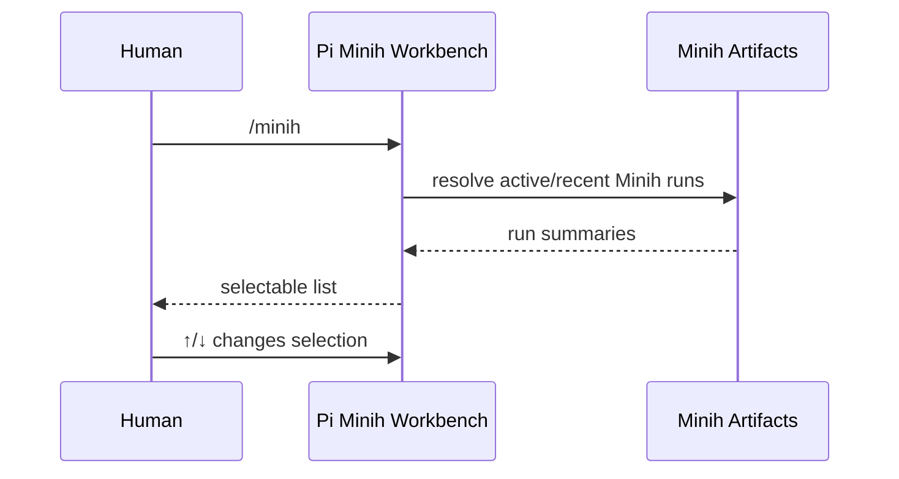
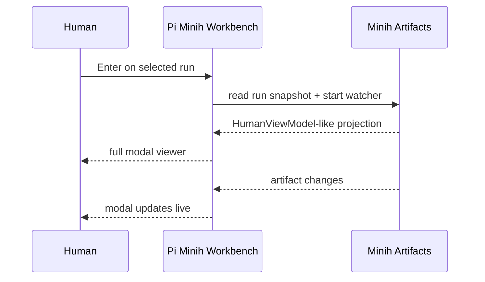
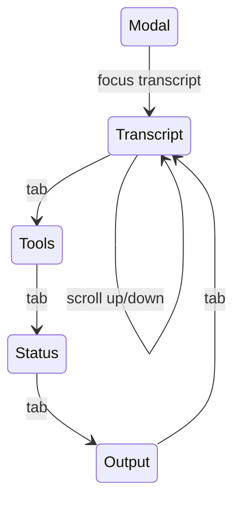
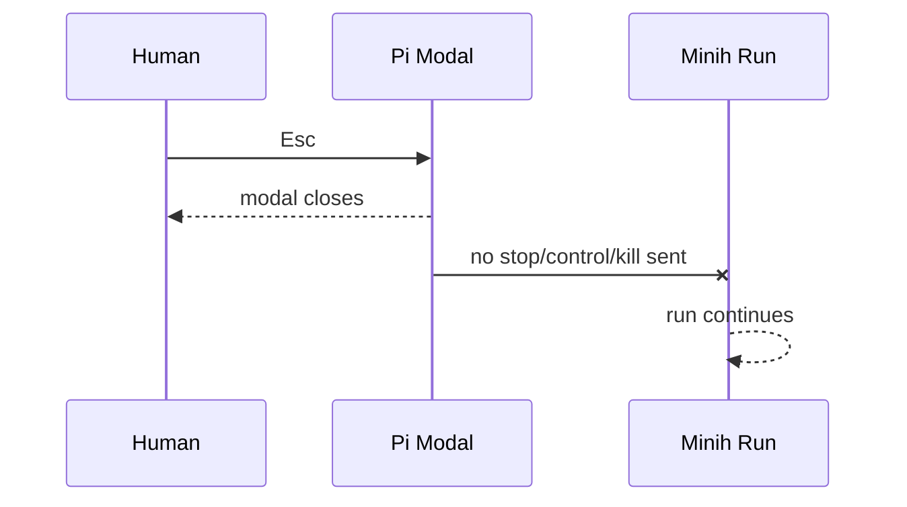
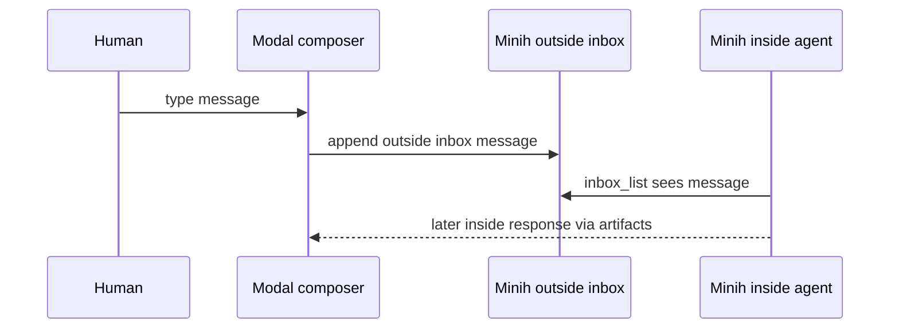
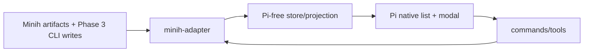

# Workshop: Pi-Native Minih Workbench UX

**Type**: UX / Integration Pattern / State Machine  
**Plan**: 007-options-for-pi-extensions-that-do-subagents  
**Spec**: [`../agent-workbench-spec.md`](../agent-workbench-spec.md)  
**Created**: 2026-05-16  
**Status**: Draft

**Value Thesis**: This workshop makes Minih usable from inside Pi by turning hidden running Minih agents into a visible, keyboard-navigable, full-screen modal experience. A fresh human should be able to list running Minih agents, open one, see what it is doing, scroll its history, understand inside/outside status, and close the view without changing the run.

**Target Proof Level**: Implementation Ready  
**Current Proof Level**: Contract Ready

**Selected Value Axes**:
- **Operator Usability**: The user can answer “what is Minih doing?” without leaving Pi.
- **Implementation Readiness**: The workshop specifies the list, modal, panes, controls, close semantics, and acceptance scenarios.
- **Operational Reliability**: Viewing is separate from controlling; `Esc` never stops or kills the run.
- **Safety to Change**: Minih artifacts remain source of truth; Pi renders projections instead of inventing a second runtime.
- **Review Compression**: Reviewers can verify UX behavior against explicit flows and scenarios rather than reconstructing intent.

**Related Documents**:
- [`../agent-workbench-spec.md`](../agent-workbench-spec.md) — current feature spec.
- [`../research-dossier.md`](../research-dossier.md) — Pi subagent options research.
- `/tmp/pij-minih-flowspace-v3/research-dossier.md` — Minih → first-class Pi synthesis.
- `/tmp/pij-minih-flowspace-v3/04-human-view-cli.md` — Minih human view / CLI / TUI findings.
- `/tmp/pij-minih-flowspace-v3/02-coordination-mailbox-state.md` — coordination mailbox/state findings.
- `/tmp/pij-minih-flowspace-v3/03-companion-lifecycle.md` — companion lifecycle findings.
- Minih `docs/how/companion-mode.md`.
- Minih `src/cli/human/{run-feed.ts,app.tsx,input-bridge.ts}` and `src/runner/human-view-model.ts`.
- Pi docs `docs/tui.md`, `docs/extensions.md`, `docs/session-format.md`.

**Domain Context**:
- **Primary Domain**: `agent-workbench` — Minih run inventory and full modal viewer product contract.
- **Related Domains**: `agent-tooling-interface` for Pi commands/UI, `session-work-state` for optional session pointers/UI state, `agentic-loops` for long-running lifecycle vocabulary, `extension-authoring-harness` for smoke/self-check proof.
- **External Upstream Domain**: Minih runner/coordination/human-view artifacts and APIs.

---

## Purpose

Clarify the simplified v1 user experience for seeing Minih runs inside Pi.

The v1 flow is intentionally narrow:

```text
list running Minih agents → select with ↑/↓ → Enter opens full modal → watch/scroll/status/tools → Esc closes
```

Message sending, stop controls, and push-context delivery are required Phase 3 follow-ons after the read-only viewer proof. Broader provider dashboards remain out of scope.

## Fresh Entrant Outcome

A fresh human or agent should be able to use this workshop to reach **Implementation Ready** with no additional context.

They should be able to:

- Explain the v1 flow and why it is Minih-only.
- Implement a keyboard-selectable list of running Minih agents.
- Implement a full-area modal/popover that renders a Minih-human-view-like projection.
- Keep close/detach semantics safe: `Esc` closes the Pi view, not the Minih run.
- Distinguish process liveness, inside status, outside status, terminal result, and UI focus.
- Defer typing/send/stop/push-context behavior to Phase 3, after the read-only viewer proof.

## Key Questions Addressed

- What is the simplest valuable Pi-native Minih UX?
- What does the run list show?
- What does the full modal viewer show?
- How does keyboard navigation work?
- What does `Esc` do?
- What Minih human-view concepts should Pi reuse?
- What is explicitly out of v1 scope?

---

## Value Frame

| Field | Selection | Why It Matters |
|-------|-----------|----------------|
| Target Proof Level | Implementation Ready | Plan-3 should be able to create max 3 phases from this without re-deciding UX basics. |
| Primary Value Axis | Operator Usability | The user’s first pain is not being able to see Minih from Pi. |
| Supporting Value Axes | Operational Reliability, Implementation Readiness, Review Compression | Close/stop safety and pane contracts are the load-bearing details. |
| Downstream Loop Improved | Implementation + Smoke | Future work can build fixture-backed tests and Driver SDK smoke from the listed scenarios. |

## Evidence Ledger

| Evidence | Location | Supports | Status |
|----------|----------|----------|--------|
| Minih `HumanViewModel` shape | Minih `src/runner/types.ts` | Modal projection contract | Ready |
| Minih run feed watches fixed artifacts | Minih `src/cli/human/run-feed.ts` | Watcher/data path | Ready |
| Minih `view` vs `attach` split | Minih `src/cli/commands/{view,attach}.ts` | Read-only vs interactive semantics | Ready |
| Minih input bridge routing | Minih `src/cli/human/input-bridge.ts` | Phase 3 typing/send behavior | Ready |
| Pi custom UI / overlay support | Pi `docs/tui.md` | Modal feasibility | Ready |
| Pi custom messages / session format | Pi `docs/extensions.md`, `docs/session-format.md` | Phase 3 push-context behavior | Ready |
| Prototype smoke | Future Driver SDK scenario | Validation | Missing |

---

## Vocabulary

| Term | Meaning | V1 behavior |
|------|---------|-------------|
| **Minih agent** | An agent definition under Minih’s `agents/<slug>/`. | Can have zero or more runs. |
| **Run** | One execution under `agents/<slug>/runs/<runId>/`. | The core item listed/opened in Pi. |
| **Running agent** | A run with live or stale-active artifacts. | Appears at top of the list. |
| **Completed run** | Run with terminal metadata/report. | May appear after active runs if included. |
| **Inside** | The Minih agent side. Writes inside lane; reads outside lane. | Findings/questions/progress originate here. |
| **Outside** | Human/operator/Pi bridge side. Writes outside lane; reads inside lane. | V1 observes first; Phase 3 typing writes here. |
| **Full modal viewer** | Pi-native full-area popover for one run. | Main v1 UI. |
| **Attach** | The concept of entering a run’s live human view. | In v1, “attach” means open the Pi modal viewer; Phase 3 adds typing where supported. |
| **Esc close** | User exits the modal. | Closes only the Pi UI; Minih run continues. |

---

## Minih Human View: What Pi Should Reuse

Minih already has the right conceptual model. Pi should render it natively, not nest Minih’s Ink UI.

### Artifact feed

Minih’s run feed watches a fixed artifact set:

```text
agents/<slug>/runs/<runId>/
├── events.ndjson
├── run.json
├── completed.json
├── inbox/
│   ├── outside/messages.ndjson
│   └── inside/messages.ndjson
├── state/
│   ├── inside.json
│   ├── outside.json
│   └── history.ndjson
└── output/report.json
```

The feed snapshots these artifacts, tolerates missing/malformed files, and builds a pure `HumanViewModel`.

**Pi consequence**: implement a Minih adapter that either imports public Minih helpers or mirrors the artifact read contract with fixture tests. Do not parse ANSI from `minih view` / `minih attach`.

### HumanViewModel panes

Minih’s model already maps to the desired modal panes:

```ts
interface HumanViewModel {
  header: HumanHeaderView;
  transcript: TranscriptEntry[];
  tools: ToolCallView[];
  coordination: CoordinationTimelineEntry[];
  state: StatePaneView;
  output: OutputPaneView;
  input: InputFooterView;
  diagnostics: ViewDiagnostic[];
}
```

V1 should render:

| Model part | Modal pane | Notes |
|------------|------------|-------|
| `header` | Header/status bar | slug, runId, liveness, event/tool counts. |
| `state` | Status pane | inside status and outside status side-by-side. |
| `transcript` | Main transcript | Scrollable run history. |
| `tools` | Tool stream/workbench | Recent/running tools and results. |
| `coordination` | Inbox/state timeline | Useful for companions and coordinated runs. |
| `output` | Report pane/footer | report path, exists/missing, validation state. |
| `diagnostics` | Diagnostics pane | stale/dead/malformed/permission/validation warnings. |
| `input` | Phase 3 composer | Hidden/disabled until Phase 3 typing is implemented. |

### View vs attach semantics

| Minih mode | Purpose | Input behavior | Pi v1 equivalent |
|------------|---------|----------------|------------------|
| `minih view <slug>` | Read-only human view for active or completed runs. | No writes. | Full modal viewer, read-only. |
| `minih attach <slug>` | Cross-process live view with write support for coordinated agents. | Coordinated runs can write outside inbox; non-coordinated are read-only. | Same full modal viewer; Phase 3 composer if coordinated. |
| `minih run --human` | Same-process human view during a run Minih owns. | Can route to SDK session or inbox. | Not v1 Pi execution path. |

Load-bearing invariant: **closing/detaching a view never stops the run**.

---

## UX Topology

### V1 surfaces

```text
┌────────────────────────────────────────────────────────────┐
│ Main Pi conversation                                       │
│                                                            │
│   /minih                                                   │
│   ┌─ Running Minih Agents ─────────────────────────────┐   │
│   │ > code-review-companion  active  reviewing  2 find │   │
│   │   package-vetter         active  reading           │   │
│   │   docs-drift             stale   pid dead          │   │
│   └────────────────────────────────────────────────────┘   │
│                                                            │
│   Enter opens selected run in full modal                   │
└────────────────────────────────────────────────────────────┘
```

```text
┌─ Minih: code-review-companion / run 2026-05-16T01-22-a9f0 ───────────┐
│ active · live · inside: reviewing · outside: in-progress · tools: 12 │
├────────────────────────────────────────┬─────────────────────────────┤
│ Transcript                             │ Workbench                   │
│                                        │ Status                      │
│ Outside: briefing                      │  inside: reviewing          │
│ Inside: progress                       │  outside: in-progress       │
│ Outside: task review-request T014      │ Tools                       │
│ Inside: finding F002                   │  ✓ ctx_read docs/...        │
│ Inside: summary APPROVE w/ caveats     │  … ctx_grep state           │
│                                        │ Output                      │
│                                        │  report: missing            │
│                                        │ Diagnostics                 │
│                                        │  none                       │
├────────────────────────────────────────┴─────────────────────────────┤
│ ↑/↓ scroll · Tab pane · Esc close (run continues)                    │
└──────────────────────────────────────────────────────────────────────┘
```

### Explicitly removed from v1

- No secondary side dock or monitor.
- No automatic UI pop when a finding arrives.
- No generic provider dashboard across Pi subagent packages.

These ideas can return later, but v1 is: **list → open full modal → watch → scroll → Esc**.

---

## Running Agent List

The list is the entry point. It should be simple, keyboard-first, and deterministic enough to smoke.

### Command entry

Preferred command namespace is Minih-specific in v1:

```bash
/minih
/minih list
/minih status --json
```

`/agents` can be a later umbrella if other providers join.

### List behavior

- Shows running Minih agents first.
- Shows stale/dead active-looking runs with diagnostics.
- May show recently completed runs below active runs if useful.
- Uses arrow up/down to change selection.
- Enter opens the selected run modal.
- Esc closes the list and returns to normal Pi.

### List row fields

| Field | Source | Example |
|-------|--------|---------|
| slug | Minih agent/run resolver | `code-review-companion` |
| liveness | resolver/PID/artifacts | `active`, `stale`, `completed`, `failed` |
| inside status | `state/inside.json` | `reviewing` |
| outside status | `state/outside.json` | `in-progress` |
| unread/material counts | inside lane + cursor if tracked | `2 findings`, `1 question` |
| run age | `run.json.startedAt` | `14m` |
| report state | `output/report.json` | `report ready`, `report missing` |

Example:

```text
Running Minih Agents
  > ● code-review-companion  active   reviewing    2 findings  run ...a9f0
    ◐ package-vetter         active   reading      no findings run ...bb41
    ! docs-drift             stale    pid dead     diagnostics run ...c010

Enter open · ↑↓ select · r report · Esc close
```

---

## Full Modal Viewer

### Purpose

The modal answers:

- What is this Minih run doing?
- Is it alive?
- What did the agent say?
- What tools is it using?
- What are the inside/outside statuses?
- Is there a report/farewell?
- Are there diagnostics or stale/dead warnings?

### Panes

| Pane | Required? | Contents |
|------|-----------|----------|
| Header | yes | slug, runId, liveness, terminal result, model, elapsed time, event/tool counts. |
| Transcript | yes | Recent/final assistant text, outside messages, inside messages, thinking summaries if available. |
| Status | yes | inside status, outside status, peer verdict if available, attention classification. |
| Tools | yes | running/recent tool calls, result status, short input/output summaries. |
| Coordination | yes for coordinated runs | inside/outside inbox messages, ack state, state transitions. |
| Output | yes | report path, exists/missing, validation/errors if known. |
| Diagnostics | yes | stale/dead/malformed/missing artifact/permission warnings. |
| Composer | Phase 3 | Only for coordinated writable runs; hidden/disabled otherwise. |

### Modal controls

Do not hardcode keybindings in implementation; use named actions/defaults. These are UX-level defaults.

| Action | Default idea | Meaning |
|--------|--------------|---------|
| `minihWorkbench.selectNext` | Down / j | Move list selection down. |
| `minihWorkbench.selectPrev` | Up / k | Move list selection up. |
| `minihWorkbench.openSelected` | Enter | Open selected run. |
| `minihWorkbench.close` | Esc | Close list/modal; run continues. |
| `minihWorkbench.scrollDown` | Down / PageDown | Scroll focused modal pane down. |
| `minihWorkbench.scrollUp` | Up / PageUp | Scroll focused modal pane up. |
| `minihWorkbench.nextPane` | Tab | Cycle modal pane focus. |
| `minihWorkbench.prevPane` | Shift-Tab | Cycle pane focus backward. |
| `minihWorkbench.openReport` | r | Open/report if present. |
| `minihWorkbench.sendMessage` | Enter in composer | Phase 3: send typed message to outside inbox. |
| `minihWorkbench.stopRun` | explicit command/button | Phase 3: confirm then send control stop. |

### Close semantics

`Esc` means:

```text
close Pi modal only
```

`Esc` does **not** mean:

- stop the Minih run;
- send control;
- kill the PID;
- mark outside state done;
- consume/ack inside messages unless the UI has an explicit “mark seen” policy.

This invariant should be in tests and docs.

---

## Phase 3 Composer / Message Sending

Typing to the Minih run is required Phase 3 work, after the read-only modal viewer is proven.

When Phase 3 lands:

- Composer appears only inside the full modal.
- Composer is enabled only for active coordinated writable Minih runs.
- Non-coordinated cross-process runs show read-only reason.
- Send path writes an outside inbox message, not stdin.
- Stop is explicit and confirmed; it is not a text accident.

Draft message shape:

```ts
interface OutboundMinihMessageDraft {
  runId: string;
  source: "modal" | "command" | "tool";
  type: "task" | "question" | "directive" | "control" | "briefing" | "review-request";
  subject: string;
  body: string;
  ackOf?: string;
}
```

Phase 3 default composer behavior:

- Freeform message → `type: task` by default.
- Reply to an inside question → `type: question` or `directive`, depending on UI affordance.
- Keep-alive → `type: directive`, not `note`.
- Stop → dedicated stop action sends `type: control`, body begins `stop`.

---

## State Semantics

Never collapse these into one status label.

| Axis | Source | Meaning | Examples |
|------|--------|---------|----------|
| Process liveness | Minih resolver / PID / artifacts | Is the run live/recoverable/terminal? | active, stale, completed, failed, unknown |
| Terminal result | `completed.json` | How did the run end? | completed, degraded, failed, timeout |
| Inside status | `state/inside.json` | What the agent says it is doing. | idle, reading, reviewing, reporting, blocked, stopping |
| Outside status | `state/outside.json` | What the operator/bridge says its side is doing. | idle, in-progress, paused, done, error |
| Peer verdict | Minih peer activity, if available | Whether the other side appears to be listening. | listening, between-polls, deaf, silent, dead, unknown |
| UI focus | Pi modal/list state | Where keyboard input goes. | list, transcript, tools, status, composer |
| Attention | Pi projection | Should the human care? | finding, question, blocked, permission_denied, stale |

Examples:

- `active` + inside `idle` is healthy for a companion waiting for work.
- `active` + inside `blocked` means the modal should show a question/attention state.
- `stale` + inside `reviewing` should be rendered as stale; trust liveness over self-reported state.
- Modal scroll pause is UI state, not Minih pause.

---

## Data Contracts

### MinihRunSummary

```ts
type MinihRunKind = "one-shot" | "coordinated" | "companion";

interface MinihRunSummary {
  slug: string;
  runId: string;
  runDir: string;
  kind: MinihRunKind;
  startedAt: string;
  updatedAt: string;
  liveness: "active" | "stale" | "completed" | "failed" | "unknown";
  terminalResult: "completed" | "degraded" | "failed" | "timeout" | null;
  insideStatus?: string;
  outsideStatus?: string;
  attention: "none" | "finding" | "question" | "blocked" | "permission_denied" | "needs_recovery";
  unreadInsideCount: number;
  findingCount: number;
  questionCount: number;
  reportPath?: string;
  diagnostics: string[];
}
```

### MinihModalState

```ts
interface MinihModalState {
  selectedRunId: string | null;
  openRunId: string | null;
  focusedPane: "transcript" | "tools" | "status" | "coordination" | "output" | "diagnostics" | "composer";
  transcriptScroll: number;
  toolsScroll: number;
  coordinationScroll: number;
  diagnosticsScroll: number;
  composerDraft?: string;
}
```

### MinihViewSnapshot

The modal should render from a single projected snapshot so tests can be fixture-driven.

```ts
interface MinihViewSnapshot {
  summary: MinihRunSummary;
  humanView: HumanViewModel;
  canSendMessage: boolean;
  sendDisabledReason?: string;
  canStop: boolean;
  reportReady: boolean;
}
```

---

## UX Flows

### Flow A — list running Minih agents



Acceptance:

- Active runs appear before completed runs.
- Multiple active runs of the same slug are separate rows.
- Stale/dead diagnostics are visible, not silently hidden.
- The list is keyboard-navigable.

### Flow B — open full modal viewer



Acceptance:

- Opening the modal sends no message to Minih.
- Modal shows transcript/tool/status/output/diagnostic panes.
- Artifact updates repaint the modal.
- Missing/malformed artifacts show diagnostics instead of crashing.

### Flow C — scroll and inspect



Acceptance:

- Modal scroll state is independent of the main Pi conversation.
- Pane focus is visible.
- Long transcripts and long tool lists remain navigable.

### Flow D — close safely



Acceptance:

- `Esc` only closes the Pi UI.
- Watchers are cleaned up or downgraded according to ownership.
- Reopening the run later shows the current state.

### Flow E — Phase 3 message send



Phase 3 acceptance:

- Composer appears only when run is active, coordinated, and writable.
- Non-coordinated runs are read-only with a clear reason.
- Stop remains a dedicated control, not accidental freeform text.

---

## Command and Tool Surface

V1 should be Minih-specific.

### Commands

| Command | Purpose |
|---------|---------|
| `/minih` | Open the selectable running Minih agents list. |
| `/minih list` | Same as `/minih`, or print/list depending on mode. |
| `/minih status [run] --json` | Deterministic status envelope for smoke/tests. |
| `/minih view <run>` | Open the full modal viewer directly. |
| `/minih report <run>` | Open/read report/farewell when available. |
| `/minih send <run> ...` | Phase 3: explicit command path to send outside inbox message. |
| `/minih stop <run>` | Phase 3: confirm then send `control:stop`. |

### Tools

Tools should be read-only first.

| Tool | V1? | Notes |
|------|-----|-------|
| `minih_runs_list` | yes | Pull fallback for run inventory. |
| `minih_run_status` | yes | Pull fallback for status. |
| `minih_read_report` | yes | Read farewell/report. |
| `minih_read_inbox` | Phase 3 | Debug/backfill. |
| `minih_send_message` | Phase 3/gated | Coordinated runs only; explicit confirmation policy. |
| `minih_stop_run` | Phase 3/gated | Confirmed control stop only. |

---

## Minih Dependency / API Reuse Boundary

Taking a dependency on Minih is desirable for readers/projections, but execution should remain out-of-process in v1.

### Reuse now from `minih/runner`

Minih exports useful runner primitives:

- `resolveRun`, `resolveRunWithDiagnostics`
- `readManifest`
- `pollInboxLane`
- `waitForAny`
- `readStateLazy`
- `derivePeerActivity`
- `buildHumanViewModel`
- types: `HumanViewModel`, `HumanViewSources`, `InboxMessage`, `LiveRunManifest`, `CompletedMetadata`, etc.

### Needs Minih public API export or wrapper

Currently useful but CLI-internal surfaces include:

- `createRunFeed` / `readAllSources` from `src/cli/human/run-feed.ts`
- `appendInboxMessage` from `src/cli/coordination.ts`
- `buildOutsideMessage` from `src/cli/commands/outside.ts`
- a stable “send outside inbox message” helper

Options:

| Option | Description | Pros | Cons | Decision |
|--------|-------------|------|------|----------|
| A | Import public Minih readers/projections; shell out for writes in Phase 3. | Uses tested Minih semantics; respects process boundary. | Needs version/dependency discipline. | Selected for v1. |
| B | Shell out for everything. | Simplest packaging boundary. | Harder to stream rich modal state; more parsing. | Fallback. |
| C | Pi writes/reads raw artifacts directly. | Fast prototype. | Drift and atomicity risk. | Use only with fixture tests and no write path. |
| D | Embed `runAgent` in Pi extension. | Max integration. | SDK/auth/lifecycle coupling. | Rejected for v1. |

---

## UI Implementation Sketch

Recommended T2 extension layout:

```text
.pi/extensions/minih-workbench/
  AGENTS.md
  index.ts          # Pi wiring: commands, tools, UI, watchers
  store.ts          # Pi-free selection/modal state and projections
  minih-adapter.ts  # Minih imports/shell commands; no Pi imports
  ui.ts             # list + modal components; no Minih file I/O
  store.test.ts
  smoke.ts
```

### Internal layers



### Watcher lifecycle

- Start no expensive watchers until list/modal opens, unless later push-context is enabled.
- On `/minih`, resolve active/recent runs and render the list.
- On Enter, start a watcher/feed for selected runDir and render modal.
- On Esc, close modal and release modal-only watchers.
- On `session_shutdown`, stop watchers and clear UI.
- On reload/resume, no modal is automatically reopened unless a future design explicitly persists it.

---

## Validation / Acceptance

This workshop reaches Implementation Ready when the future implementation can satisfy these scenarios.

### Scenario 1 — list running Minih agents

- Given two active Minih runs and one stale run fixture
- When `/minih status --json` runs
- Then all runs appear with distinct runIds, liveness, inside/outside status, and report paths where available

### Scenario 2 — keyboard-select list

- Given the Minih list is open
- When the user presses Down/Up
- Then the selected row changes
- When the user presses Enter
- Then the selected run opens in a modal

### Scenario 3 — modal render

- Given a fixture run with events, tools, inbox, state, and output artifacts
- When the modal opens
- Then transcript, tool stream, inside/outside status, output/report state, and diagnostics render

### Scenario 4 — modal scrollback

- Given transcript/tool content exceeds screen height
- When the user scrolls
- Then the modal scrolls its focused pane without moving the main Pi transcript

### Scenario 5 — Esc close safety

- Given an active run modal
- When the user presses Esc
- Then the modal closes
- And no stop/control/kill command is sent
- And the run remains active in the next list refresh

### Scenario 6 — non-coordinated/read-only clarity

- Given an active non-coordinated Minih run
- When the modal opens
- Then status/transcript render
- And any composer is hidden or disabled with a clear reason

### Scenario 7 — Phase 3 coordinated send

- Given an active coordinated writable companion
- When the Phase 3 composer is available and the user sends a message
- Then an outside inbox message is appended and later reflected in the modal timeline

### Scenario 8 — Phase 3 explicit stop

- Given an active companion
- When the user invokes stop
- Then Pi confirms intent before sending a dedicated control stop message
- And closing the modal still never implies stop

### Scenario 9 — report/farewell

- Given a completed run with `output/report.json`
- When the user opens the run/report
- Then report path and summary/farewell content are visible

### Scenario 10 — Phase 3 push context

- Given material inside events such as findings, questions, blockers, permission-denied states, terminal reports, or farewells
- When push context is enabled for the opened/observed or explicitly opted-in run
- Then Pi receives one compact pushed context message per material event
- And routine progress/tool/counter churn and duplicate events after reload are suppressed

---

## Attention Reduction

| Future Loop | Before Workshop | After Workshop |
|-------------|-----------------|----------------|
| Implementation | Developer had to reconcile monitor, attach, push, and send concepts. | V1 is a clear list → modal viewer flow. |
| Review | Reviewer had to infer close/stop safety. | `Esc` semantics are explicit and testable. |
| Testing | Smoke author had to invent UI scenarios. | Eight fixture-backed scenarios are listed. |
| Agent execution | Agent might start Phase 3 interaction/push work too early. | Minih-only viewing remains the first proof point. |
| Upstream coordination | Minih reuse needs were vague. | Specific public helper candidates are listed. |

---

## Open Questions

### Q1: Should typed messaging be required in v1?

**CURRENT ANSWER**: It is required in Phase 3, after the read-only viewer works. Architecture should not mark it as stretch.

### Q2: Should the command be `/minih`, `/minih agents`, or something else?

**RECOMMENDATION**: Use `/minih` for v1 because the feature is Minih-only. Reserve `/agents` for a future provider-neutral dashboard.

### Q3: Should completed runs appear in the first list?

**OPEN**: Active/stale runs are required. Completed recent runs are useful for report viewing but can clutter. Architect should decide whether to include a “recent completed” section or defer.

### Q4: Can Pi custom UI provide a full modal with independent scroll/panes cleanly?

**OPEN**: Prototype and smoke should answer. If not, fallback to a simpler full-screen list/text modal before asking for Pi TUI changes.

### Q5: Should push-context be in v1?

**CURRENT ANSWER**: Required in Phase 3. It is not part of the first proof, but it is not stretch.

---

## Quick Reference

- **V1 product**: Minih-only visibility from Pi.
- **Entry**: `/minih` opens running Minih agents list.
- **Navigation**: Arrow keys select; Enter opens.
- **Modal**: Full-area Pi popover like Minih `--human` / `attach`.
- **Shows**: transcript, tools, inside/outside status, liveness, diagnostics, report state, context/usage where available.
- **Scroll**: Modal panes scroll independently from main Pi transcript.
- **Close**: `Esc` closes the modal; Minih run continues.
- **Typing**: Phase 3; coordinated runs via outside inbox.
- **Side dock/monitor**: Removed from v1.

---

## Recommendation

Build the Minih Workbench as a Pi-native full modal viewer over Minih artifacts.

Start with:

1. list running Minih agents;
2. select with arrow keys;
3. press Enter to open a full modal;
4. show live transcript, tools, inside/outside status, output/report state, diagnostics;
5. support scrollback;
6. close with Esc without stopping the run.

After that works, implementation must add Phase 3 typing, stop/report controls, and push context. Any secondary docked monitor idea remains later/out of scope.
