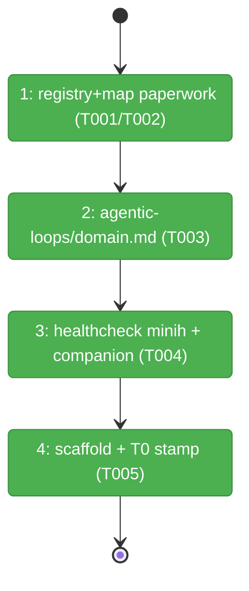
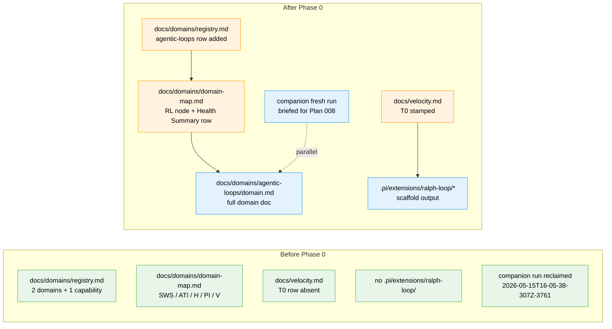

# Flight Plan: Phase 0 — Prerequisite: Domain extraction + harness health

**Plan**: [`../../ralph-loop-extension-plan.md`](../../ralph-loop-extension-plan.md)
**Phase**: Phase 0: Prerequisite — Domain extraction + harness health
**Generated**: 2026-05-15
**Status**: Landed

---

## Departure → Destination

**Where we are**: Plan 008 spec validated; plan-3 architect ran (35 tasks); plan-4 readiness gate PASS; validate-v2 PASS WITH FIXES (R2/T017.T leak-detection added; AC-10 grep check mechanical in T033). Companion blocker D-025 mitigated locally via `agents/code-review-companion/state/inside-state.schema.json` (`94cbf24`). Companion run `2026-05-15T16-05-38-307Z-3761` was reclaimed by the idle budget after F001/F004/F005 acks; no farewell envelope. Domain registry + map exist but lack an `agentic-loops` entry. No `.pi/extensions/ralph-loop/` tree on disk.

**Where we're going**: `agentic-loops` is a first-class entry in the registry, on the domain map, and has a complete domain.md with the StopReason taxonomy documented as its headline contract. A fresh companion run is alive and briefed for Plan 008. `npm run new -- ralph-loop` has emitted the scaffold tree at `.pi/extensions/ralph-loop/` and the T0 timestamp is stamped into `docs/velocity.md` as the start of the Plan 008 build clock. **Phase 1 can begin without re-deriving any context.**

---

## Domain Context

### Domains We're Changing

| Domain | What Changes | Key Files |
|--------|-------------|-----------|
| `agentic-loops` (NEW) | Formalize as first-class domain: add to registry + map; write domain.md with full contract surface (StopReason, IterationRunner, PlanModel). | `/docs/domains/agentic-loops/domain.md`, `/docs/domains/registry.md`, `/docs/domains/domain-map.md` |
| `_platform` (implicit, healthcheck-only) | Verify D-025 workaround alive; brief companion. | `agents/code-review-companion/state/inside-state.schema.json` (read-only), `agents/code-review-companion/runs/<runId>/inbox/outside/messages.ndjson` (briefing write) |
| docs (cross-domain) | Append T0 row to velocity log. | `/docs/velocity.md` |

### Domains We Depend On (no changes)

| Domain | What We Consume | Contract |
|--------|----------------|----------|
| `extension-authoring-harness` | Scaffold generator | `npm run new -- <name>` produces canonical T2 layout (`index.ts`, `store.ts`, `store.test.ts`, `smoke.ts`, `package.json`) |
| (external) pi runtime | `npm run new` honors the latest `ExtensionAPI` shape | Templates at `harness/templates/extension/*.template` |
| (external) minih CLI | Companion-mode protocol | `minih doctor`, `minih status`, `minih outside inbox send` per `agents/code-review-companion/AGENTS_README.md` |

---

## Flight Status

<!-- Updated by /plan-6-v2: pending → active → done. Use blocked for problems/input needed. -->

**Legend**: grey = pending | yellow = active | red = blocked/needs input | green = done

---

## Stages

<!-- Updated by /plan-6-v2 during implementation: [ ] → [~] → [x] -->

- [x] **Stage 1: Add `agentic-loops` to registry + map** — modify (not create) `registry.md` + `domain-map.md` (`docs/domains/registry.md` — modify; `docs/domains/domain-map.md` — modify)
- [x] **Stage 2: Write `agentic-loops/domain.md`** — full domain definition with StopReason verbatim as headline contract (`docs/domains/agentic-loops/domain.md` — new file)
- [x] **Stage 3: Healthcheck minih + companion** — verify D-025 workaround alive; boot/brief companion for Plan 008 (no file change; writes to `execution.log.md`)
- [x] **Stage 4: Scaffold ralph-loop + stamp T0** — `npm run new -- ralph-loop`; capture ISO-8601 T0 into velocity log (`docs/velocity.md` — append; `.pi/extensions/ralph-loop/*` — new scaffold)

---

## Architecture: Before & After

**Legend**: existing (green, unchanged) | changed (orange, modified) | new (blue, created)

---

## Acceptance Criteria

- [ ] `docs/domains/registry.md` has an `agentic-loops` row (status `active`) pointing at `agentic-loops/domain.md`, plus a History entry dated 2026-05-15.
- [ ] `docs/domains/domain-map.md` mermaid graph includes an `agentic-loops` node labelled with `StopReason, IterationRunner, PlanModel`; Health Summary table has an `agentic-loops` row.
- [ ] `docs/domains/agentic-loops/domain.md` exists with all seven sections (Purpose, Source Locations, Concepts, Contracts, Composition, Dependencies, History); StopReason union copy-pasted verbatim from workshop 001 (8 cases including `complete.reason: "sigil" | "plan_exhausted"`).
- [ ] `minih doctor` returns 0 with `prompt-state-vocabulary-drift` cleared; companion run id is captured in `execution.log.md` with the Plan 008 briefing message id.
- [ ] `.pi/extensions/ralph-loop/{index,store,smoke,store.test}.ts` + `package.json` exist on disk (output of `npm run new`).
- [ ] `docs/velocity.md` has a Plan 008 draft row with `T0` populated to an ISO-8601 timestamp and `T1`/`Δ` marked `pending`.

## Goals & Non-Goals

**Goals**:
- Make `agentic-loops` a real, citable domain before Phase 1 imports anything to it.
- Verify the companion review loop is operational at run-start (failing fast if D-025 regressed).
- Anchor AC-13's measurability with a captured T0.

**Non-Goals**:
- Any `store.ts` / `index.ts` / `smoke.ts` implementation (Phase 1).
- Resolving D-025 upstream (waiting on minih `0.2.0` per AI-Substrate/minih#30).
- Re-validating the plan (already done by validate-v2).

---

## Checklist

- [x] T001: Modify `docs/domains/registry.md` — add `agentic-loops` row + History entry
- [x] T002: Modify `docs/domains/domain-map.md` — add `agentic-loops` node + Health Summary + History
- [x] T003: Create `docs/domains/agentic-loops/domain.md` — full domain doc with StopReason verbatim
- [x] T004: Healthcheck D-025 workaround + boot/brief companion run for Plan 008
- [x] T005: `npm run new -- ralph-loop` + stamp T0 in `docs/velocity.md`

---

## Companion Review Plan

- **Briefing**: 1 message sent at T004; subject "Plan 008 Phase 0 — Domain extraction + harness health"; body lists hazards (F-03/F-04/F-05) + domain manifest scope.
- **Per-task review-requests**: 5 (one per task commit); fire-and-forget; companion only replies if it finds issues.
- **Final phase-end**: drain ping → wait → control:stop → read farewell envelope. Farewell informs the Phase 1 dossier readiness check before plan-6 starts Phase 1.

## Handover to Phase 1

When Phase 0 lands:
- Phase 1's pre-implementation check (in `tasks/phase-1-build/tasks.md`) consumes T0 from `docs/velocity.md`.
- Phase 1 T030 (`agent-harness.md` creation) takes over governance of the companion overlay that Phase 0 only verified.
- Phase 1 T008 (`StopReason` union in `store.ts`) MUST match the union documented in `agentic-loops/domain.md` § Contracts character-for-character; companion is briefed to flag drift.
