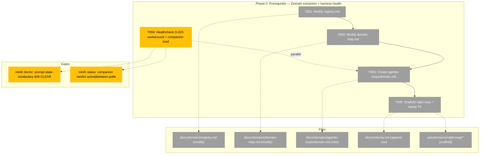
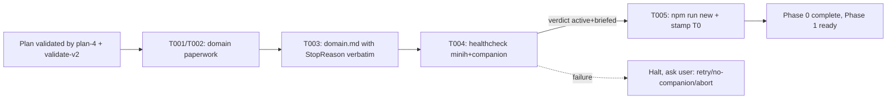
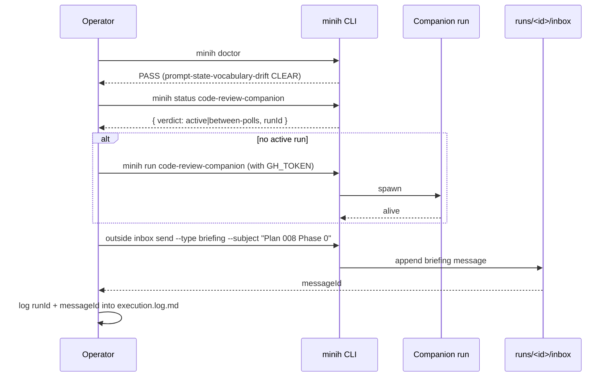

# Phase 0 — Prerequisite: Domain extraction + harness health

**Plan**: [`../../ralph-loop-extension-plan.md`](../../ralph-loop-extension-plan.md) (Simple Mode)
**Generated**: 2026-05-15
**Status**: Ready for takeoff

---

## Executive Briefing

**Purpose**: Stand up the world Plan 008 expects before any extension code is written. Specifically: formalize the `agentic-loops` domain in pij's registry; verify the minih companion is operational (D-025 workaround alive); stamp T0 for the velocity log so AC-13 is measurable end-to-end.

**What We're Building**:

- A new domain doc at `docs/domains/agentic-loops/domain.md` covering Purpose, Boundary (Owns/Excludes), Concepts table, Contracts, Composition, Dependencies.
- An additional row in the existing `docs/domains/registry.md` (already exists from plan 006/009 work — **see Discoveries**).
- An additional node + edges (none in v1) in the existing `docs/domains/domain-map.md`.
- A healthcheck dry-run confirming `minih doctor` clears `prompt-state-vocabulary-drift` and the companion run is briefed for Plan 008.
- A timestamped T0 row drafted in `docs/velocity.md` plus the scaffold output of `npm run new -- ralph-loop`.

**Goals** (✅):

- ✅ `agentic-loops` is a first-class entry in pij's domain registry, complete with the `StopReason` vocabulary documented as a contract per finding F-03.
- ✅ Companion-mode review loop verifiable from the command line in <30 s (skill plan-6 will repeat this exact check).
- ✅ T0 captured with ISO-8601 precision; scaffold files exist on disk so Phase 1 can start.
- ✅ Phase 1 has zero ambiguous "first inhabitant" status — `agentic-loops` is named in registry before its code lands.

**Non-Goals** (❌):

- ❌ Implementing any extension code (`store.ts`, `index.ts`, smoke). All of that is Phase 1.
- ❌ Adding cross-domain edges in the domain map. v1 ralph-loop has none.
- ❌ Resolving D-025 upstream. The workaround is sufficient; durable fix lives in minih `0.2.0`.
- ❌ Re-running plan-3 or plan-4. Those are validated; we are consuming, not re-validating.

---

## Prior Phase Context

Phase 0 is the first phase. No prior implementation phase exists in this plan.

**Inherited context from upstream artifacts** (read by plan-6, not subagent-reviewed):

- Spec `../../ralph-loop-extension-spec.md` § Acceptance Criteria — AC-13 anchors the velocity-log requirement satisfied by T005.
- Plan `../../ralph-loop-extension-plan.md` § Key Findings F-03 (StopReason vocabulary is THE headline contract for `agentic-loops`), F-04 (D-025 workaround per-clone artifact), F-05 (T0/T1 timestamps for compounding hypothesis).
- Workshop 001 § StopReason tagged union — verbatim contract for the domain.md Concepts/Contracts tables.
- Workshop 002 § Interface contract — `IterationRunner` belongs to this domain.
- Workshop 003 § Grammar — `PlanModel` belongs to this domain.
- Difficulty ledger D-005 (compact survival, unverified) is the **headline open question** the domain must acknowledge in its § Dependencies; D-025 (companion wedge) governs T004.

---

## Pre-Implementation Check

| File | Exists? | Domain Check | Notes |
|------|---------|-------------|-------|
| `docs/domains/registry.md` | **EXISTS** | `agentic-loops` row absent | **Modify**, not create. Plan-3 T001 written as "create"; registry already populated by plan 006 (`session-work-state`, `agent-tooling-interface`) and plan 009 (vetter pipeline note). See Discovery D08-P0-01. |
| `docs/domains/domain-map.md` | **EXISTS** | `agentic-loops` node absent | **Modify**, not create. Existing mermaid graph has SWS / ATI / H / PI / V nodes. We add a single `RL[agentic-loops]` node with no cross-domain edges in v1. |
| `docs/domains/agentic-loops/domain.md` | NEW | First file in new sub-tree | Create directory + file. Sections: Purpose, Source Locations, Concepts, Contracts, Composition, Dependencies, History. |
| `docs/velocity.md` | EXISTS | docs (cross-domain) | Append T0 row; T1 + Δ filled in by T032 at end of Phase 1. |
| `.pi/extensions/ralph-loop/*` (post `npm run new`) | NEW | `agentic-loops` internal | Scaffold output of `npm run new -- ralph-loop` — `index.ts`, `store.ts`, `store.test.ts`, `smoke.ts`, `package.json`. |
| `agents/code-review-companion/state/inside-state.schema.json` | EXISTS (`94cbf24`) | `_platform` | T004 verifies it's still present + valid. No edit. |
| Minih CLI on PATH | (`minih --version` returns) | n/a | Required for T004 healthcheck. If missing → block + ask. |

**Domain check**: `agentic-loops` is being created with this phase. No imports, no cross-domain edges in v1.

**Anti-reinvention check**: ran a conceptual scan against existing domains for overlap with "iterative agent loop" / "plan-file consumption" / "stop conditions". Result: no overlap. `session-work-state` owns session-scoped key-value persistence (different concern); `agent-tooling-interface` owns LLM-facing tool/command UX (consumer surface, not the loop itself); `extension-authoring-harness` owns generator/smoke/self-check (one level up). `agentic-loops` is genuinely new.

**Agent harness health check** (per skill § Pre-Implementation Check):

- `docs/project-rules/agent-harness.md` does **not yet exist** (it will be created in Phase 1 T030 as AC-12 gift b).
- `docs/project-rules/harness.md` (the engineering-harness governance doc) exists.
- Companion-mode harness IS live but governance doc lags — flag in Context Brief: "⚠️ Agent harness governance doc lands in Phase 1 T030; companion-mode operation pre-validated via D-025 workaround per T004."

---

## Architecture Map



**Reading**: T001→T002→T003 is the domain-paperwork chain. T004 (healthcheck) is the live-gate that can run in parallel with T003 since it touches no overlapping files. T005 (scaffold + T0 stamp) is gated by T003 because the velocity row references the domain.

---

## Tasks

| Status | ID | Task | Domain | Path(s) | Done When | Notes |
|--------|-----|------|--------|---------|-----------|-------|
| [x] | T001 | **Modify** (not create) `docs/domains/registry.md` — add `agentic-loops` row pointing at `agentic-loops/domain.md` and append a History entry "Plan 008 — agentic-loops first inhabitant: ralph-loop extension." | `agentic-loops` | `/Users/jordanknight/pi-hacking/pij/docs/domains/registry.md` | New row visible in the main table; History row appended; markdown lint clean | Discovery D08-P0-01: plan-3 says "Create" but file already exists. Pattern: follow existing table shape (Domain / Status / Primary Doc / Purpose). Status = `active`. |
| [x] | T002 | **Modify** (not create) `docs/domains/domain-map.md` — add `RL[agentic-loops\\ncontracts: StopReason, IterationRunner, PlanModel]` node to the existing mermaid `flowchart LR`; no edges (v1 ralph-loop is standalone); append Health Summary row + History row | `agentic-loops` | `/Users/jordanknight/pi-hacking/pij/docs/domains/domain-map.md` | Node appears in the mermaid graph; Health Summary has an `agentic-loops` row; History row appended | Per F-03, the visible contract on the node label is `StopReason, IterationRunner, PlanModel`. No cross-domain edges in v1. |
| [x] | T003 | Create `docs/domains/agentic-loops/domain.md` covering: Purpose, Source Locations (files from Domain Manifest), Concepts table (StopReason taxonomy, Iteration lifecycle, Plan model, Spinning detection, Compact-survival contract), Contracts (StopReason union, IterationRunner interface, PlanModel types), Composition, Dependencies (consumes pi `ExtensionAPI`, SDK `createAgentSession`; depends on D-005 verification outcome), History | `agentic-loops` | `/Users/jordanknight/pi-hacking/pij/docs/domains/agentic-loops/domain.md` | All seven sections present; StopReason union copy-pasted verbatim from workshop 001 (8 cases incl. `complete.reason: "sigil" \| "plan_exhausted"`); Source Locations match Domain Manifest; D-005 acknowledged under Dependencies | Per F-03 the StopReason taxonomy is the headline contract — give it its own subsection. Mirror the `agent-tooling-interface/domain.md` shape for consistency. |
| [x] | T004 | Healthcheck: run `minih doctor` (must pass `prompt-state-vocabulary-drift`) + `minih status code-review-companion` (must show `verdict: active` or `verdict: between-polls`); if companion is dead, boot fresh with `GH_TOKEN=$(gh auth token) minih run code-review-companion`; brief it for Plan 008 Phase 0 + Phase 1 scope; log run ID into `execution.log.md` | `_platform` | (no file change; writes to `execution.log.md`) | `minih doctor` returns 0 with no findings; companion has an active run id; briefing message visible in `inbox/outside/messages.ndjson`; execution log records run ID | Per F-04 / D-025. Removable once `AI-Substrate/minih#30` ships and `0.2.0` is on PATH. Run ID `2026-05-15T16-53-33-058Z-9b96`; briefing msg `01KRN6M5JKTK1J20WQKCR9GJ68`. |
| [x] | T005 | Run `npm run new -- ralph-loop` (stamps T0 implicitly by file mtimes; capture ISO-8601 manually too); append a draft row to `docs/velocity.md` with `T0=<ISO>`, `T1=pending`, `Δ=pending`, output column listing scaffold files | docs | `/Users/jordanknight/pi-hacking/pij/docs/velocity.md` + `/Users/jordanknight/pi-hacking/pij/.pi/extensions/ralph-loop/` (scaffold) | `.pi/extensions/ralph-loop/{index,store,test,smoke}.ts` exist; `package.json` exists; velocity log has a draft 008 row with T0 populated | Per F-05. AC-13 dependency. T0=`2026-05-15T06:56:02Z`. |

**Total**: 5 tasks. **Companion review-requests expected**: 1 per task commit boundary = 5; final phase-end summary = 1; total ~6 pings.

---

## Context Brief

**Key findings from plan** (acted on in Phase 0):

- **F-03** (StopReason vocabulary is the headline contract) → T003 must include the verbatim 8-case union in the domain doc Contracts section.
- **F-04** (D-025 workaround is per-clone) → T004 healthcheck is the live verification.
- **F-05** (AC-13 measurability) → T005 stamps T0 before any code work begins.

(F-01 and F-02 do not act in Phase 0; they're Phase 1 concerns.)

**Domain dependencies** (concepts and contracts this phase consumes):

- `extension-authoring-harness` (existing): scaffold generator (`npm run new`) — produces the initial `.pi/extensions/ralph-loop/` tree.
- No other domain consumed in Phase 0.

**Domain constraints** (Phase 0 establishes these for Phase 1):

- `agentic-loops` is internal: no external code imports it. Domain boundary is strictly the extension tree + the domain.md doc.
- `agentic-loops` **must not** import from `agent-tooling-interface` or `session-work-state`. v1 ralph-loop has no cross-domain dependencies (per spec § Target Domains: "No other domains touched").
- Files placed under `.pi/extensions/ralph-loop/` are domain-internal. `harness/test-utils.ts` additions (FakeIterationRunner) are `_platform` cross-domain helpers — clearly marked.
- Dependency direction documented in the domain.md: `agentic-loops → pi runtime` (consumes `ExtensionAPI`); `agentic-loops → pi-sdk` (consumes `createAgentSession`). Both are external dependencies, NOT pij domains.

**Agent harness context**:

- **Boot**: `npm install` (engineering harness — pij L2 substrate); `GH_TOKEN=$(gh auth token) minih run code-review-companion` (agent harness — companion mode).
- **Interact**: pi TUI for in-loop testing; `minih outside inbox send` for companion review-requests.
- **Observe**: `npm run self-check` (engineering); `minih status` + `agents/code-review-companion/runs/<runId>/{inbox,events.ndjson}` (agent).
- **Maturity**: L2 + minih companion overlay (target: minih companion codified in `docs/project-rules/agent-harness.md` at Phase 1 T030).
- **Pre-phase validation**: T004 IS the validation. If it fails, halt + ask user (per skill protocol for unhealthy harness).
- ⚠️ The agent harness governance doc (`docs/project-rules/agent-harness.md`) does NOT yet exist; it lands in Phase 1 T030 as AC-12 gift b. Phase 0 operates against the de-facto contract embodied in `docs/retros/code-review-companion.md` + AGENTS.md § Clarification protocol.

**Reusable from prior phases**:

- N/A (this is Phase 0). Future phases reuse: the `agentic-loops` domain definition (T003); the verified-alive companion run (T004); the scaffold tree (T005).

**Mermaid flow diagram** (Phase 0 ceremony):



**Mermaid sequence diagram** (companion briefing per T004):



---

## Discoveries & Learnings

_Populated during implementation by plan-6._

| Date | Task | Type | Discovery | Resolution | References |
|------|------|------|-----------|------------|------------|
| 2026-05-15 | T001/T002 (pre-impl) | unexpected-behavior | Plan-3 says "Create `docs/domains/registry.md`" and "Create `docs/domains/domain-map.md`" but both already exist (created by plan 006 for `session-work-state` + `agent-tooling-interface`; updated by plan 009 with vetter pipeline). Plan-3 was authored against a stale assumption that `agentic-loops` would be pij's first domain. | Reframed T001/T002 as MODIFY (append row/node) rather than CREATE. Existing schema is followed verbatim. Logged here so plan-validation downstream catches similar drift. | plan-3 § Target Domains states "Status: NEW (formalize in Phase 0)" — TRUE for the domain, but the registry/map containers are already there. |

(Empty rows below for plan-6 to fill in during execution.)

| | | | | | |
| | | | | | |
| | | | | | |

---

## Directory Layout

```
docs/plans/008-ralph-loop-extension/
├── ralph-loop-extension-plan.md
├── ralph-loop-extension-spec.md
├── ralph-loop-extension.fltplan.md
├── workshops/
│   ├── 001-stop-condition-catalog.md
│   ├── 002-sdk-iteration-lifecycle.md
│   ├── 003-plan-file-format.md
│   └── 004-compact-survival-smoke.md
└── tasks/
    ├── phase-0-prerequisite/
    │   ├── tasks.md                ← this file
    │   ├── tasks.fltplan.md        ← Flight Plan (Stages + Status mermaid)
    │   └── execution.log.md        ← created by plan-6
    └── phase-1-build/
        ├── tasks.md
        ├── tasks.fltplan.md
        └── execution.log.md        ← created by plan-6
```
