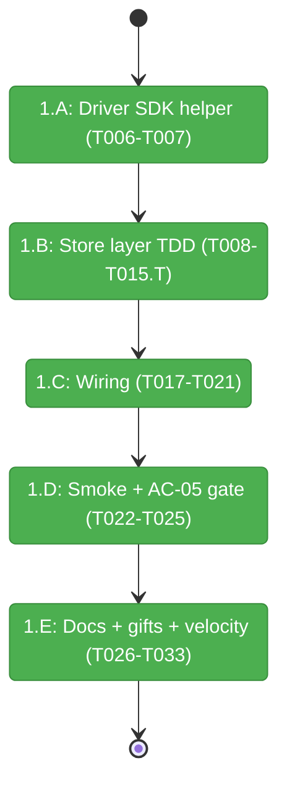
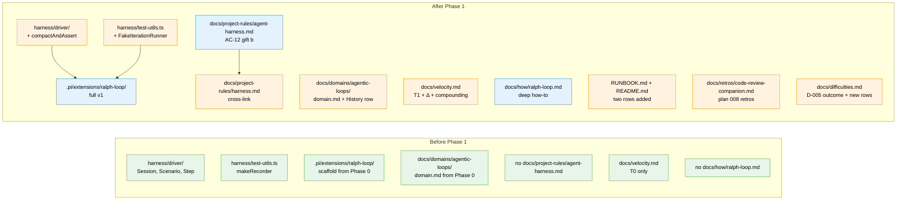

# Flight Plan: Phase 1 — The build (Simple Mode single-phase)

**Plan**: [`../../ralph-loop-extension-plan.md`](../../ralph-loop-extension-plan.md)
**Phase**: Phase 1: The build (5 sub-phases: 1.A Driver SDK helper / 1.B Store layer / 1.C Wiring / 1.D Smoke + AC-05 / 1.E Docs + gifts + velocity)
**Generated**: 2026-05-15
**Status**: Landed (2026-05-15T07:45:57Z)

---

## Departure → Destination

**Where we are**: Phase 0 complete. `agentic-loops` is a first-class domain (registry + map + domain.md). Companion alive, briefed for Plan 008. `npm run new -- ralph-loop` scaffold exists at `.pi/extensions/ralph-loop/` with default templates. T0 stamped into `docs/velocity.md`. No real ralph-loop logic written yet. No `compactAndAssert` helper. No `agent-harness.md`. AC-05 unverified.

**Where we're going**: `.pi/extensions/ralph-loop/` ships v1 satisfying spec ACs 1–13. `StopReason` taxonomy enforced via exhaustive `switch` everywhere. SDK lifecycle leak controlled by `dispose()` in `finally` + `WeakRef` leak-detection test (T017.T). AC-05 either passes the `/compact`-survival smoke OR escalates to pi-mono with a real issue URL in D-005 (clarify Q6). Two harness gifts land: `compactAndAssert()` in `harness/driver/` (AC-12 a) and `docs/project-rules/agent-harness.md` codifying minih companion-mode adoption (AC-12 b). `docs/velocity.md` row complete with T1 + Δ + compounding analysis (AC-13). AC-10 grep check mechanically enforced before merge.

---

## Domain Context

### Domains We're Changing

| Domain | What Changes | Key Files |
|--------|-------------|-----------|
| `agentic-loops` | First inhabitant lands: full `store.ts`, `index.ts` wiring, smoke, fixture, AGENTS.md, how-doc. | `.pi/extensions/ralph-loop/{store,index,store.test,runner.test,smoke}.ts` + `AGENTS.md` + `fixture-plan.md`; `docs/how/ralph-loop.md`; `docs/domains/agentic-loops/domain.md` (History row only — domain definition already set in Phase 0) |
| `_platform` | Add `compactAndAssert()` Driver SDK helper (AC-12 gift a); add `FakeIterationRunner` test util; new `agent-harness.md` governance doc (AC-12 gift b); update `harness.md` for split. | `harness/driver/index.ts` + `harness/driver/compact-assert.test.ts`; `harness/test-utils.ts`; `docs/project-rules/agent-harness.md`; `docs/project-rules/harness.md` |
| docs (cross-domain) | RUNBOOK + README + velocity + retros + difficulty ledger surface updates. | `RUNBOOK.md`, `README.md`, `docs/velocity.md`, `docs/retros/code-review-companion.md`, `docs/difficulties.md` |

### Domains We Depend On (no changes)

| Domain | What We Consume | Contract |
|--------|----------------|----------|
| `extension-authoring-harness` | Driver SDK `Scenario`/`Step`/`Session`; `npm run new` scaffold conventions; `npm run self-check`; `makeRecorder()` from `harness/test-utils.ts`; biome + tsc + vitest configs | Stable T2 layout (`index.ts`, `store.ts`, `store.test.ts`, `smoke.ts`); P1–P10 principles |
| (external) pi runtime | `ExtensionAPI`: `appendEntry`, `setStatus`, `notify`, `registerCommand`, `registerTool`, `sessionManager.getEntries()` | Pi v0.x as bundled; templates capture latest shape per D-018 / D-023 |
| (external) pi-sdk | `createAgentSession({ model, extensions, ... })`; `{ session, dispose }` lifecycle; `session.run()`; `session.on()/off()`; `session.usage()` | Per pi-mono `packages/coding-agent/src/core/agent-session.ts` |
| (external) minih CLI | `minih outside inbox send`, `minih status`, `minih harvest`; companion farewell envelope shape | Companion-mode protocol per AGENTS_README.md + docs/how/companion-mode.md |
| (external) pi `/compact` | The thing under test in AC-05 | Behaviour is **unverified** — that's why T024/T025 exist. |

---

## Flight Status

<!-- Updated by /plan-6-v2: pending → active → done. Use blocked for problems/input needed. -->

**Legend**: grey = pending | yellow = active | red = blocked/needs input | green = done

---

## Stages

<!-- Updated by /plan-6-v2 during implementation: [ ] → [~] → [x] -->

- [x] **Stage 1.A: Driver SDK helper** — Add `compactAndAssert()` + its test. AC-12 gift (a). (`harness/driver/index.ts`, `harness/driver/compact-assert.test.ts` — new)
- [x] **Stage 1.B: Store layer TDD** — Types → parseMarkdownPlan → nextUndoneTask → taskFingerprint → detectSpinning → evaluateStopPre/Post → RalphLoopStore → replay guards. Tests interleaved per task. (`.pi/extensions/ralph-loop/store.ts`, `store.test.ts`)
- [x] **Stage 1.C: Wiring** — `SdkIterationRunner` (with leak-detection test) → `/ralph` command → tools → P10 `session_start` → status pill. (`.pi/extensions/ralph-loop/index.ts`, `runner.test.ts` — new)
- [x] **Stage 1.D: Smoke + AC-05 gate** — `FakeIterationRunner` → fixture plan → 8-step `/compact`-survival smoke → interpret + escalate-if-needed. (`harness/test-utils.ts`, `.pi/extensions/ralph-loop/{fixture-plan.md,smoke.ts}`, `docs/difficulties.md`)
- [x] **Stage 1.E: Docs + harness gifts + velocity** — Per-ext `AGENTS.md` → `docs/how/ralph-loop.md` → RUNBOOK → README → `agent-harness.md` (AC-12 b) → update `harness.md` → T1 stamp + Δ → final companion drain + retro harvest + AC-10 grep. (multiple files)

---

## Architecture: Before & After

**Legend**: existing (green, unchanged) | changed (orange, modified) | new (blue, created)

---

## Acceptance Criteria

All 13 spec ACs land in Phase 1:

- [ ] **AC-01** — `/ralph start` registers and pill displays (T018, T020, T021, T024 smoke)
- [ ] **AC-02** — default 10 iterations (T014 constants + T024 smoke)
- [ ] **AC-03** — `<promise>COMPLETE</promise>` stops (T013, T017 sigil detection, T024 smoke)
- [ ] **AC-04** — stop-reason transparency (T013 + run-end notification in T020/T021)
- [ ] **AC-05** — `/compact` durability — D-005 verification (T006, T007, T022, T024, T025) **load-bearing**
- [ ] **AC-06** — P10 replay across all reasons (T020 + T015.T)
- [ ] **AC-07** — P1–P10 enforced (T008–T015 store + T017–T021 wiring; validated by `npm run self-check`)
- [ ] **AC-08** — "one task per iteration" in injected prompt (T026 AGENTS.md + T027 docs/how prompt)
- [ ] **AC-09** — Huntley attribution (T026 + T027 + T029)
- [ ] **AC-10** — no `git push` (T026 AGENTS.md rule + T033 grep check + smoke pane captures)
- [ ] **AC-11** — status-pill clears with `undefined` (T021 + manual verify)
- [ ] **AC-12** — harness improvement landed (TWO gifts): `compactAndAssert` (T006/T007) + `agent-harness.md` (T030)
- [ ] **AC-13** — velocity-log row (T005 T0 from Phase 0 + T032 T1, Δ)

## Goals & Non-Goals

**Goals**:
- Ship v1 of `ralph-loop` satisfying all 13 ACs.
- Verify or escalate D-005 with no shadow-log papering-over (clarify Q6).
- Land both AC-12 harness gifts so the next extension benefits.
- Capture T1 cleanly for AC-13's compounding-hypothesis evaluation.

**Non-Goals**:
- Multi-Ralph swarms; v2 scope.
- Cost-cap enforcement when SDK doesn't expose cost (assumption #4).
- `PlanAdapter` interface (workshop 003 § Future-proofing — v2).
- Modifying pi-mono or pi-sdk source.
- Running `/plan-7-v2-code-review` after this phase (companion already did that work).

---

## Checklist

### 1.A Driver SDK helper
- [ ] T006: Add `compactAndAssert()` to `harness/driver/index.ts` per workshop 004 § Helper utilities
- [ ] T007: `harness/driver/compact-assert.test.ts` — 4 vitest cases with mocked tmux

### 1.B Store layer (TDD-grade)
- [ ] T008: Declare `StopReason`, `IterationRecord`, `PlanModel`, etc. types in `store.ts`
- [ ] T008.T: Type-contract tests (≥3 incl. exhaustiveCheck)
- [ ] T009: `parseMarkdownPlan(text, path): PlanModel` per workshop 003 § Grammar
- [ ] T009.T: 5 worked examples + 10 edge cases (≥15 tests)
- [ ] T010: `nextUndoneTask(plan)` — first undone in doc order
- [ ] T010.T: mixed/all-done/all-undone/empty (≥3 tests)
- [ ] T011: `taskFingerprint(title)` — SHA-1 of trimmed lowercase, 12 hex chars
- [ ] T011.T: case-insensitive, whitespace-insensitive, deterministic, shape (≥4 tests)
- [ ] T012: `detectSpinning(log, n)` — last-N fingerprint check
- [ ] T012.T: short log null / mixed tail null / n-identical fires (≥3 tests)
- [ ] T013: `evaluateStopPre(state)` + `evaluateStopPost(state)` — 8 reasons, pre/post split
- [ ] T013.T: per-kind (≥8) + tie-breaks (3) + pre-eval scenarios (2) (≥13 tests)
- [ ] T014: `RalphLoopStore` class with constructor injection
- [ ] T014.T: lifecycle + P9 ordering + clock injection (≥6 tests)
- [ ] T015: Replay structural guards `isIterationData`/`isRunStartData`
- [ ] T015.T: replay determinism + idempotency + P10 cross-reason (≥4 tests)

### 1.C Wiring
- [ ] T017: `SdkIterationRunner` with dispose-in-finally + listener detach
- [ ] T017.T: 10-iteration leak-detection (WeakRef / dispose-counter)
- [ ] T018: `/ralph` command (start/stop/status/plan)
- [ ] T019: `ralph_iterate` + `ralph_check_stop` tools
- [ ] T020: Single `session_start` handler (P10)
- [ ] T021: Status pill `iter N/M`, clear with `undefined` (D-006)

### 1.D Smoke + AC-05 verification
- [ ] T022: `FakeIterationRunner` in `harness/test-utils.ts`
- [ ] T023: `fixture-plan.md` with 3 undone tasks
- [ ] T024: 8-step compact-survival smoke using `compactAndAssert()`
- [ ] T025: Run + interpret per workshop 004; escalate to pi-mono if A1/A2 fails

### 1.E Docs + harness gifts + velocity
- [ ] T026: `.pi/extensions/ralph-loop/AGENTS.md` — P1–P10 + Huntley attrib + no-git-push
- [ ] T027: `docs/how/ralph-loop.md` — plan conventions + prompt + StopReason ref + troubleshooting
- [ ] T028: RUNBOOK additions
- [ ] T029: README row
- [ ] T030: `docs/project-rules/agent-harness.md` (AC-12 gift b)
- [ ] T031: Update `docs/project-rules/harness.md` cross-link
- [ ] T032: T1 stamp + Δ + compounding analysis in `docs/velocity.md` (AC-13)
- [ ] T033: Final companion review + farewell + retro harvest + AC-10 grep check

---

## Companion Review Plan

- **Briefing** (already sent in Phase 0): same companion, expanded brief if scope drifts.
- **Per-task review-requests**: milestone-grouped at sub-phase boundaries (5 milestones: 1.A end, 1.B end, 1.C end, 1.D end, 1.E end) + the final close-out at T033. Total ~6 review-requests. Reduces companion noise; companion can review coherent slices.
- **Inline finding handling**: HIGH/CRITICAL → fix immediately + commit + re-ping; MEDIUM/LOW → queue for end-of-phase or address opportunistically per skill protocol.
- **Final phase-end ceremony**: delegated to `/plan-6a-v2-update-progress` Step 9 — drain → control:stop → farewell → reconcile → retro harvest.

## Handover

After Phase 1:
- `/plan-7-v2-code-review` is **NOT required** (companion already did that work).
- `docs/retros/code-review-companion.md` carries paired retros (companion farewell + orchestrator).
- Spec Plan 008 marked Complete; flight plan landed.
- D-005 outcome captured (verified OR escalated upstream).
- Next plan picks up `agent-harness.md` as the governance doc for its own companion run.
