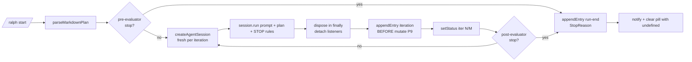

# Phase 1 — The build (Simple Mode single-phase)

**Plan**: [`../../ralph-loop-extension-plan.md`](../../ralph-loop-extension-plan.md) (Simple Mode)
**Generated**: 2026-05-15
**Status**: Ready for takeoff (after Phase 0 completes)

---

## Executive Briefing

**Purpose**: Ship `.pi/extensions/ralph-loop/` v1 — a working pi extension implementing Geoffrey Huntley's Ralph Loop pattern (fresh `createAgentSession` per iteration; markdown plan file as the workspace; closed `StopReason` taxonomy as the safety story). Verify D-005 (`/compact`-survival of `customType` entries) is the load-bearing AC-05 smoke. Land both AC-12 harness gifts: `compactAndAssert()` in the Driver SDK + `docs/project-rules/agent-harness.md` codifying minih companion-mode adoption.

**What We're Building** (5 sub-phase deliverables):

- **1.A Driver SDK helper** — `compactAndAssert(session, opts)` in `harness/driver/index.ts` + vitest with mocked tmux. Reusable by every future "must-survive-/compact" extension. AC-12 gift (a).
- **1.B Store layer** (TDD-grade) — `StopReason` tagged union (8 kinds, pre/post evaluator split per F001 resolution); markdown plan parser (`parseMarkdownPlan`); spinning detector; full `RalphLoopStore` class with P2/P3/P9 hygiene; replay determinism with structural guards.
- **1.C Wiring** — `SdkIterationRunner` (worst-case lifecycle leak risk; `dispose()` in `finally` + `WeakRef` leak-detection test); `/ralph` command (start/stop/status/plan); LLM tools (`ralph_iterate`, `ralph_check_stop`); P10 single `session_start` handler; D-006-compliant status pill.
- **1.D Smoke + AC-05 verification** — `FakeIterationRunner` for deterministic 3-iteration sequences; 3-task fixture plan; 8-step `/compact`-survival choreography using `compactAndAssert()`; failure interpretation per workshop 004 § Failure interpretation (escalate to pi-mono if A1/A2 fails; never add a shadow log).
- **1.E Docs + harness gift codification + velocity log** — per-extension `AGENTS.md`; `docs/how/ralph-loop.md`; RUNBOOK additions; README row; `docs/project-rules/agent-harness.md` (AC-12 gift b); update `harness.md`; T1 stamp + Δ in velocity log; final companion review-request with farewell envelope + retro harvest + AC-10 grep check.

**Goals** (✅):

- ✅ All 13 spec ACs met (mapped explicitly in plan § Acceptance Criteria).
- ✅ Either AC-05 passes OR D-005 row points at a real pi-mono issue with the upstream body matching workshop 004's template (per clarify Q6: escalate, don't shadow).
- ✅ `compactAndAssert()` is reusable from any smoke (AC-12 gift a) and `docs/project-rules/agent-harness.md` is the canonical doc for the companion overlay (AC-12 gift b).
- ✅ Two retro entries appended to `docs/retros/code-review-companion.md`: orchestrator + companion farewell.
- ✅ Velocity log row complete with T1 stamp, Δ, compounding hypothesis evaluated against v1 baseline.

**Non-Goals** (❌):

- ❌ Multi-Ralph swarms / parallel iterations (v2 scope).
- ❌ Cost-cap enforcement when SDK doesn't report cost (spec assumption #4; iteration-cap is the gate).
- ❌ A `PlanAdapter` interface (workshop 003 § Future-proofing: deferred to v2).
- ❌ Modifications to pi-mono. AC-05 failure → file upstream issue, mark smoke `expected_fail`, ship anyway.
- ❌ `/plan-7-v2-code-review` after this phase. Companion already reviewed every commit; running plan-7 duplicates work.

---

## Prior Phase Context

### Phase 0 — Prerequisite: Domain extraction + harness health

**Status**: Expected `[x]` complete before Phase 1 starts. plan-6 runs Phase 0 first.

**A. Deliverables** (what Phase 0 hands to Phase 1):

- `/Users/jordanknight/pi-hacking/pij/docs/domains/registry.md` — `agentic-loops` row present (status `active`).
- `/Users/jordanknight/pi-hacking/pij/docs/domains/domain-map.md` — `agentic-loops` node + Health Summary row.
- `/Users/jordanknight/pi-hacking/pij/docs/domains/agentic-loops/domain.md` — full domain doc with `StopReason` taxonomy as headline contract.
- `/Users/jordanknight/pi-hacking/pij/.pi/extensions/ralph-loop/` scaffold tree (index.ts / store.ts / store.test.ts / smoke.ts / package.json from `npm run new`).
- `/Users/jordanknight/pi-hacking/pij/docs/velocity.md` — Plan 008 draft row with T0 stamped (ISO-8601).
- A fresh, alive, briefed companion run (run id captured in `phase-0-prerequisite/execution.log.md`).

**B. Dependencies Exported** (used by Phase 1):

- The `StopReason` union shape (8 kinds incl. `complete.reason: "sigil" | "plan_exhausted"`) — Phase 1 T008 MUST match the domain doc character-for-character.
- Scaffold tree from `npm run new` — Phase 1 T008 onward edits these existing files, doesn't create the directory.
- T0 ISO-8601 string — Phase 1 T032 consumes it to compute Δ.
- Companion run id — Phase 1 review-requests target this run.

**C. Gotchas & Debt**:

- **Discovery D08-P0-01**: plan-3 said "Create" registry/map files but they already existed from plans 006 + 009. Phase 0 reframed T001/T002 as MODIFY. Plan-3 should be reviewed for similar drift assumptions before future plans.
- **D-025 workaround is per-clone** — if a fresh clone happens between Phase 0 and Phase 1 work, T004 must be re-run. plan-6 sessions encode this as part of pre-phase validation.
- **Companion may have been reclaimed mid-session** — Phase 0 ends with a verifiably alive run; Phase 1 verifies it's still alive at the top of each task batch.

**D. Incomplete Items**:

- None expected. Phase 0 has 5 tasks; all must complete before Phase 1 starts. If any fails, escalate before continuing.

**E. Patterns to Follow** (established in Phase 0, observed in Phase 1):

- "Modify existing infrastructure rather than create" — registry/map pattern. Same applies to `harness/test-utils.ts` (Phase 1 T022 adds `FakeIterationRunner` to existing file).
- "StopReason union is the headline contract" — domain.md leads with it; Phase 1 store.ts opens with it (T008).
- "Companion briefing per phase" — Phase 0 brief carries hazards F-03/F-04/F-05; Phase 1 brief expands to include F-01 (D-005 gate) and F-02 (SDK leaks).
- "Healthcheck before code" — Phase 0 T004 is the template. Phase 1 re-asserts this at the top of every plan-6 session via pre-phase validation.

---

## Pre-Implementation Check

| File | Exists? | Domain Check | Notes |
|------|---------|-------------|-------|
| `harness/driver/index.ts` | EXISTS | `_platform` | T006 adds `compactAndAssert` export. Verify barrel re-exports it. |
| `harness/driver/compact-assert.test.ts` | NEW | `_platform` | T007 creates. Vitest with mocked tmux Session. |
| `harness/test-utils.ts` | EXISTS | `_platform` | T022 adds `FakeIterationRunner`. Existing exports: `makeRecorder`, `lastCustomType`, `AppendCall`. **Do not break existing signatures**. |
| `.pi/extensions/ralph-loop/index.ts` | NEW (after Phase 0 T005 scaffold) | `agentic-loops` internal | T017 (runner) + T018 (/ralph cmd) + T019 (tools) + T020 (session_start) + T021 (status pill) all edit this file. P10 single handler invariant. |
| `.pi/extensions/ralph-loop/store.ts` | NEW (after Phase 0 T005 scaffold) | `agentic-loops` internal | T008–T015 all touch this file. P2 (no `@earendil-works/*` imports). P5 (constants here, not in index). |
| `.pi/extensions/ralph-loop/store.test.ts` | NEW (after Phase 0 T005 scaffold) | `agentic-loops` internal | T008.T–T015.T add tests. P8 (tests target the store). Uses `makeRecorder()` from `harness/test-utils.ts`. |
| `.pi/extensions/ralph-loop/runner.test.ts` | NEW | `agentic-loops` internal | T017.T leak-detection test. Either real `createAgentSession` (preferred) or a tracked-dispose double + `WeakRef` + `--expose-gc`. |
| `.pi/extensions/ralph-loop/smoke.ts` | NEW (after Phase 0 T005 scaffold) | `agentic-loops` internal | T024 builds the AC-05 choreography. Uses `compactAndAssert()` from T006. |
| `.pi/extensions/ralph-loop/AGENTS.md` | NEW | `agentic-loops` internal | T026. Per-extension P1–P10 reassertions + Huntley attribution + no-git-push rule. |
| `.pi/extensions/ralph-loop/fixture-plan.md` | NEW | `agentic-loops` internal | T023. 3 undone tasks per workshop 003 § Example 1. |
| `docs/how/ralph-loop.md` | NEW | `agentic-loops` internal | T027. Plan-file conventions, default prompt (attribution to snarktank/ghuntley/coleam00), StopReason reference table, troubleshooting. |
| `RUNBOOK.md` | EXISTS | docs cross-domain | T028. Two new sections: "How to start a Ralph Loop" + "Companion mode (minih)". |
| `README.md` | EXISTS | docs cross-domain | T029. One row in "Where things are". |
| `docs/project-rules/agent-harness.md` | NEW | `_platform` contract | T030. AC-12 gift b. Codifies BIO contract for companion overlay; D-025 workaround note; link to minih#30. |
| `docs/project-rules/harness.md` | EXISTS | docs cross-domain | T031. Update to clarify engineering vs agent harness split; cross-link to new agent-harness.md. |
| `docs/velocity.md` | EXISTS (T0 row from Phase 0) | docs cross-domain | T032. Append T1, compute Δ, evaluate compounding hypothesis. AC-13. |
| `docs/retros/code-review-companion.md` | EXISTS | docs | T033. Final retro entries (paired orchestrator + companion) appended via plan-6a Step 8/9. |

**Anti-reinvention checks** (for major new concepts):

- **StopReason**: scanned `harness/`, other `.pi/extensions/*/store.ts`. No prior implementation of stop-condition vocabulary. New concept — domain `agentic-loops`.
- **PlanModel / markdown parser**: scanned for existing markdown task parsers. None in pij. New.
- **IterationRunner**: scanned for retry-loop / iteration abstractions. None. New.
- **FakeIterationRunner**: scanned `harness/test-utils.ts`. Existing recorders pattern (`makeRecorder`); new addition follows same constructor-injection style. **Reuse pattern, not implementation.**
- **`compactAndAssert`**: scanned `harness/driver/`. No `/compact` helper exists. New. Reusable across every future "must-survive-/compact" extension (AC-12 gift a's reuse claim).

**Contract change flags** (higher risk per skill § Pre-Implementation Check):

- `harness/driver/index.ts` adds a new export (`compactAndAssert`). Additive — no signature breakage. Low risk.
- `harness/test-utils.ts` adds a new export (`FakeIterationRunner`). Additive — same.
- `docs/project-rules/harness.md` modified to add cross-link. Doc change only.
- All other touched files are NEW (no contracts to preserve).

**Agent harness health check** (re-run at top of plan-6 session):

- `docs/project-rules/agent-harness.md` → not yet written (T030 creates it). Pre-phase validation uses `docs/retros/code-review-companion.md` + AGENTS.md § Clarification protocol as de-facto contract.
- `docs/project-rules/harness.md` exists; covers engineering harness. T031 updates it.
- Companion verdict must be `active` or `between-polls` per T004 from Phase 0 (re-asserted by plan-6 at session start).

---

## Architecture Map

```mermaid
flowchart TD
    classDef pending fill:#9E9E9E,stroke:#757575,color:#fff
    classDef completed fill:#4CAF50,stroke:#388E3C,color:#fff
    classDef critical fill:#F44336,stroke:#D32F2F,color:#fff
    classDef gift fill:#FFC107,stroke:#FFA000,color:#000

    subgraph SubA["1.A Driver SDK helper"]
        T006["T006: compactAndAssert"]:::gift
        T007["T007: compact-assert.test"]:::pending
    end

    subgraph SubB["1.B Store layer (TDD)"]
        T008["T008: types"]:::pending
        T008T["T008.T tests"]:::pending
        T009["T009: parseMarkdownPlan"]:::pending
        T009T["T009.T tests"]:::pending
        T010["T010: nextUndoneTask"]:::pending
        T010T["T010.T tests"]:::pending
        T011["T011: taskFingerprint"]:::pending
        T011T["T011.T tests"]:::pending
        T012["T012: detectSpinning"]:::pending
        T012T["T012.T tests"]:::pending
        T013["T013: evaluateStopPre/Post"]:::critical
        T013T["T013.T tests"]:::critical
        T014["T014: RalphLoopStore class"]:::pending
        T014T["T014.T tests"]:::pending
        T015["T015: replay guards"]:::pending
        T015T["T015.T tests"]:::pending
    end

    subgraph SubC["1.C Wiring"]
        T017["T017: SdkIterationRunner"]:::critical
        T017T["T017.T leak detection"]:::critical
        T018["T018: /ralph command"]:::pending
        T019["T019: ralph_iterate / ralph_check_stop tools"]:::pending
        T020["T020: session_start (P10)"]:::pending
        T021["T021: status pill"]:::pending
    end

    subgraph SubD["1.D Smoke + AC-05"]
        T022["T022: FakeIterationRunner"]:::pending
        T023["T023: fixture-plan.md"]:::pending
        T024["T024: compact-survival smoke"]:::critical
        T025["T025: interpret + escalate"]:::critical
    end

    subgraph SubE["1.E Docs + gifts + velocity"]
        T026["T026: AGENTS.md"]:::pending
        T027["T027: docs/how/ralph-loop.md"]:::pending
        T028["T028: RUNBOOK"]:::pending
        T029["T029: README"]:::pending
        T030["T030: agent-harness.md"]:::gift
        T031["T031: harness.md update"]:::pending
        T032["T032: T1 + Δ"]:::pending
        T033["T033: final companion + AC-10 grep"]:::pending
    end

    T006 --> T007 --> T008
    T008 --> T008T --> T009 --> T009T --> T010 --> T010T
    T010T --> T011 --> T011T --> T012 --> T012T --> T013 --> T013T
    T013T --> T014 --> T014T --> T015 --> T015T --> T017
    T017 --> T017T --> T018 --> T019 --> T020 --> T021
    T021 --> T022 --> T023 --> T024 --> T025
    T025 --> T026 --> T027 --> T028 --> T029 --> T030
    T030 --> T031 --> T032 --> T033
```



**Legend**: grey = pending | red = critical-path (F-01/F-02/F-03 hazards) | yellow = AC-12 harness gift | green = completed

**Critical path**:
T006 → T007 → T013/T013.T (safety story) → T017/T017.T (leak control) → T024/T025 (AC-05 gate) → T033 (close-out)

---

## Tasks

### 1.A — Driver SDK helper (T006–T007)

| Status | ID | Task | Domain | Path(s) | Done When | Notes |
|--------|-----|------|--------|---------|-----------|-------|
| [ ] | T006 | Add `compactAndAssert(session, opts): Promise<CompactAssertResult>` to `harness/driver/index.ts` matching workshop 004 § Helper utilities exactly | `_platform` | `/Users/jordanknight/pi-hacking/pij/harness/driver/index.ts` | Function exported with documented signature; `npm run typecheck` passes; no callers yet | AC-12 gift (a). Workshop 004 § Helper utilities is source of truth. Companion watches for signature drift. |
| [ ] | T007 | Add `harness/driver/compact-assert.test.ts` covering: (a) field-equality success; (b) field-divergence post-compact failure with structured `divergences[]`; (c) opt-in reload check; (d) `compactTimeoutMs` honored | `_platform` | `/Users/jordanknight/pi-hacking/pij/harness/driver/compact-assert.test.ts` | All 4 tests green; `npm test` exits 0 | Constructor-injected fake tmux Session (no real tmux). |

### 1.B — Store layer (T008–T015 + interleaved tests; TDD-grade)

| Status | ID | Task | Domain | Path(s) | Done When | Notes |
|--------|-----|------|--------|---------|-----------|-------|
| [ ] | T008 | Declare `StopReason` tagged union, `IterationRecord`, `PlanModel`, `PlanTask`, `PlanStopMarker`, `PlanWarning` types per workshops 001 + 003 § Data model | `agentic-loops` | `/Users/jordanknight/pi-hacking/pij/.pi/extensions/ralph-loop/store.ts` | `tsc --noEmit` exits 0; no `any`; no `as` casts | P6 (structural types at boundary); P4 (tagged unions). `complete` carries `reason: "sigil" \| "plan_exhausted"` + `iteration`. |
| [ ] | T008.T | Type-contract tests: compile-time `exhaustiveCheck()` for every `StopReason.kind`; structural-guard test scaffolding | `agentic-loops` | `/Users/jordanknight/pi-hacking/pij/.pi/extensions/ralph-loop/store.test.ts` | `npm test` runs type tests green; ≥3 tests | TDD-grade; write before T009 wiring uses these types. |
| [ ] | T009 | Implement `parseMarkdownPlan(text, path): PlanModel` per workshop 003 § Grammar (per-line regex table) | `agentic-loops` | `/Users/jordanknight/pi-hacking/pij/.pi/extensions/ralph-loop/store.ts` | Pure function (no `Date.now`, no fs); handles all 10 edge cases from workshop 003 § Edge cases | F-03. |
| [ ] | T009.T | Tests for `parseMarkdownPlan`: 5 worked examples + 10 edge-case rows; assert full `PlanModel` not just one field | `agentic-loops` | `/Users/jordanknight/pi-hacking/pij/.pi/extensions/ralph-loop/store.test.ts` | All 15 tests green | TDD-grade. |
| [ ] | T010 | Implement `nextUndoneTask(plan)` per workshop 003 § Next-undone-task selection | `agentic-loops` | `/Users/jordanknight/pi-hacking/pij/.pi/extensions/ralph-loop/store.ts` | Returns first `kind: "undone"` task in doc order; returns `null` when none | Document order; no priority. |
| [ ] | T010.T | Tests for `nextUndoneTask`: mixed plan, all-done, all-undone, empty (≥3 tests) | `agentic-loops` | `/Users/jordanknight/pi-hacking/pij/.pi/extensions/ralph-loop/store.test.ts` | Tests green | |
| [ ] | T011 | Implement `taskFingerprint(title): string` per workshop 001 § Spinning detection (SHA-1 of trimmed lowercase title; first 12 hex chars) | `agentic-loops` | `/Users/jordanknight/pi-hacking/pij/.pi/extensions/ralph-loop/store.ts` | Deterministic; case- and whitespace-insensitive; 12 hex chars | Pure; `node:crypto` only. |
| [ ] | T011.T | Tests for `taskFingerprint`: case-insensitive, whitespace-insensitive, deterministic, 12-hex shape | `agentic-loops` | `/Users/jordanknight/pi-hacking/pij/.pi/extensions/ralph-loop/store.test.ts` | ≥4 tests green | |
| [ ] | T012 | Implement `detectSpinning(log, n)` per workshop 001 § Spinning detection algorithm | `agentic-loops` | `/Users/jordanknight/pi-hacking/pij/.pi/extensions/ralph-loop/store.ts` | Returns `Extract<StopReason, { kind: "spinning" }>` or `null`; last-N fingerprint check | Cheap; tail-slice only. |
| [ ] | T012.T | Tests for `detectSpinning`: short log returns null, mixed tail returns null, n-identical tail fires | `agentic-loops` | `/Users/jordanknight/pi-hacking/pij/.pi/extensions/ralph-loop/store.test.ts` | ≥3 tests green | |
| [ ] | T013 | Implement `evaluateStopPre(state)` AND `evaluateStopPost(state)` per workshop 001 § Evaluation order (8 reasons total; first-match-wins within each pass) | `agentic-loops` | `/Users/jordanknight/pi-hacking/pij/.pi/extensions/ralph-loop/store.ts` | All 8 `StopReason.kind` cases reachable; `complete.reason` discriminator covers both `"sigil"` and `"plan_exhausted"`; exhaustive `switch` with `exhaustiveCheck()` at every consumer | F-03; resolves companion F001 (cross-workshop pre/post drift). |
| [ ] | T013.T | Tests for `evaluateStopPre` AND `evaluateStopPost`: one test per `StopReason.kind` (≥8) + 3 tie-break scenarios + ≥2 pre-evaluator scenarios (STOP on iter-1; plan-exhausted on iter-1) + sigil-vs-plan_exhausted coverage | `agentic-loops` | `/Users/jordanknight/pi-hacking/pij/.pi/extensions/ralph-loop/store.test.ts` | ≥13 tests green | TDD-grade; THE safety proof; gates F001 closure. |
| [ ] | T014 | Implement `RalphLoopStore` class with constructor `(append: AppendFn, runner: IterationRunner, clock?: () => number)`, `startRun`, `endRun`, `recordIteration`, `rehydrate` methods per workshop 002 § Interface contract | `agentic-loops` | `/Users/jordanknight/pi-hacking/pij/.pi/extensions/ralph-loop/store.ts` | P2 (no `@earendil-works/*` imports); P3 (constructor-injected side-effects); P9 (`appendEntry` BEFORE in-memory mutate) | Constants live in this file (P5). |
| [ ] | T014.T | Tests for `RalphLoopStore`: lifecycle (startRun → recordIteration → endRun); constructor-injection via `FakeIterationRunner` from T022; **P9 ordering assertion** (append called before mutate); clock injection for wallclock tests | `agentic-loops` | `/Users/jordanknight/pi-hacking/pij/.pi/extensions/ralph-loop/store.test.ts` | ≥6 tests green | Uses `makeRecorder()` from `harness/test-utils.ts` (D-016 encoded pattern). |
| [ ] | T015 | Add P6 structural guards `isIterationData(data)` and `isRunStartData(data)` for replay; gate `rehydrate` switch cases on them | `agentic-loops` | `/Users/jordanknight/pi-hacking/pij/.pi/extensions/ralph-loop/store.ts` | Malformed replay entries dropped silently with no `as` cast | P6; mirrors scratch template's pattern. |
| [ ] | T015.T | Replay determinism tests: happy-path full replay; mid-stream malformed entry; missing entries; **replay idempotency** (same input twice → identical state); P10 cross-reason replay verified at store level | `agentic-loops` | `/Users/jordanknight/pi-hacking/pij/.pi/extensions/ralph-loop/store.test.ts` | ≥4 tests green | Smoke (T024) verifies live; this verifies model. |

### 1.C — Wiring (T017–T021)

| Status | ID | Task | Domain | Path(s) | Done When | Notes |
|--------|-----|------|--------|---------|-----------|-------|
| [ ] | T017 | Implement `SdkIterationRunner implements IterationRunner` per workshop 002; spins fresh `createAgentSession` per call; honors `AbortSignal`; `dispose()` in `finally`; detaches listeners | `agentic-loops` | `/Users/jordanknight/pi-hacking/pij/.pi/extensions/ralph-loop/index.ts` (or extracted `runner.ts`) | One iteration runs end-to-end against fixture plan in dev; `tsc --noEmit` passes; `dispose()` reachable in every code path | F-02; worst-case leak class. |
| [ ] | T017.T | **Leak-detection test** for `SdkIterationRunner`: drive 10 fixture iterations; assert no retained `AgentSession`/listener/handle survives via `WeakRef` probe with `--expose-gc` OR tracked-dispose double | `agentic-loops` | `/Users/jordanknight/pi-hacking/pij/.pi/extensions/ralph-loop/runner.test.ts` | Test fails if `dispose()` ever skipped or listener left attached; passes when workshop 002 § Resource ownership ledger honored | R2 mitigation; spec assumption #4. **Don't ship without this.** |
| [ ] | T018 | Register `/ralph` command with sub-verbs `start <path> [opts]`, `stop`, `status [--json]`, `plan` | `agentic-loops` | `/Users/jordanknight/pi-hacking/pij/.pi/extensions/ralph-loop/index.ts` | `/ralph` appears in pi command list after `/reload`; `--json` output is deterministic JSON envelope | `/ralph status --json` is smoke's read surface (workshop 004). |
| [ ] | T019 | Register `ralph_iterate` and `ralph_check_stop` tools (LLM-callable) | `agentic-loops` | `/Users/jordanknight/pi-hacking/pij/.pi/extensions/ralph-loop/index.ts` | Tools register; LLM can call them; results are structured | Optional but cheap. |
| [ ] | T020 | Single `session_start` handler (P10) hydrating store from `ctx.sessionManager.getEntries()` covering reasons `startup`/`reload`/`new`/`resume`/`fork` | `agentic-loops` | `/Users/jordanknight/pi-hacking/pij/.pi/extensions/ralph-loop/index.ts` | One handler; replay determinism verified by T015.T | P10; D-005 verification dependency. |
| [ ] | T021 | Status pill: `setStatus("ralph-loop", "iter N/M")` per iteration; clear with `undefined` (NOT `""`) at run end | `agentic-loops` | `/Users/jordanknight/pi-hacking/pij/.pi/extensions/ralph-loop/index.ts` | Pill shows during run; vanishes after stop (manual verify in pi TUI) | D-006. |

### 1.D — Smoke + AC-05 verification (T022–T025)

| Status | ID | Task | Domain | Path(s) | Done When | Notes |
|--------|-----|------|--------|---------|-----------|-------|
| [ ] | T022 | Implement `FakeIterationRunner` in `harness/test-utils.ts`; produces deterministic 3-iteration sequences when `PIJ_RALPH_FAKE_RUNNER=1` | `_platform` | `/Users/jordanknight/pi-hacking/pij/harness/test-utils.ts` | Deterministic same-input-same-output; used by smoke AND vitest | Additive export; do not break existing `makeRecorder`/`lastCustomType`/`AppendCall`. |
| [ ] | T023 | Create `.pi/extensions/ralph-loop/fixture-plan.md` with 3 undone tasks | `agentic-loops` | `/Users/jordanknight/pi-hacking/pij/.pi/extensions/ralph-loop/fixture-plan.md` | File exists; matches workshop 003 § Example 1 shape | Smoke input. |
| [ ] | T024 | Build `.pi/extensions/ralph-loop/smoke.ts` § "ralph-loop:compact-survival" — 8-step choreography per workshop 004 § Steps; uses `compactAndAssert()` from T006 | `agentic-loops` | `/Users/jordanknight/pi-hacking/pij/.pi/extensions/ralph-loop/smoke.ts` | `npm run smoke -- ralph-loop` exits 0 on a green system; assertion matrix A1–A4 from workshop 004 implemented | F-01; **THE AC-05 gate**. |
| [ ] | T025 | Run AC-05 smoke; interpret per workshop 004 § Failure interpretation. If A1/A2 fails → file pi-mono issue per § Upstream escalation; mark smoke `expected_fail`; update D-005 with issue URL. **Never add a shadow log.** | `agentic-loops` | (updates `docs/difficulties.md` D-005 if escalating) | Either smoke passes OR D-005 points at a real pi-mono URL matching the template | F-01; clarify Q6. |

### 1.E — Docs + harness gift codification + velocity log (T026–T033)

| Status | ID | Task | Domain | Path(s) | Done When | Notes |
|--------|-----|------|--------|---------|-----------|-------|
| [ ] | T026 | Write `.pi/extensions/ralph-loop/AGENTS.md` with per-extension rules, P1–P10 reassertions, Huntley attribution, link to <https://ghuntley.com/ralph/>, no-git-push rule | `agentic-loops` | `/Users/jordanknight/pi-hacking/pij/.pi/extensions/ralph-loop/AGENTS.md` | File exists; AC-09 satisfied | Per-ext AGENTS.md is P10 convention. |
| [ ] | T027 | Write `docs/how/ralph-loop.md` — plan-file conventions; default prompt (attribution to snarktank/coleam00/ghuntley); StopReason reference table; troubleshooting incl. D-005 escalation; per-iteration cost guidance; "Why did Ralph stop?" tie-break from workshop 001 | `agentic-loops` | `/Users/jordanknight/pi-hacking/pij/docs/how/ralph-loop.md` | All sections present; prompt borrows from snarktank/`prompt.md` with attribution (don't invent) | Spec Documentation Strategy. |
| [ ] | T028 | RUNBOOK.md — add "How to start a Ralph Loop" + "Companion mode (minih)" sections | docs | `/Users/jordanknight/pi-hacking/pij/RUNBOOK.md` | Both sections present; cross-link `docs/how/ralph-loop.md` + `docs/project-rules/agent-harness.md` | Matches D-020 doc pattern. |
| [ ] | T029 | README.md — add `ralph-loop` row in "Where things are" table | docs | `/Users/jordanknight/pi-hacking/pij/README.md` | Row exists pointing at `.pi/extensions/ralph-loop/` and `docs/how/ralph-loop.md` | One-row addition. |
| [ ] | T030 | Create `docs/project-rules/agent-harness.md` codifying minih + companion mode as pij's agent harness (Boot → Interact → Observe), L2 maturity, BIO contract, D-025 workaround note, link to AI-Substrate/minih#30 | `_platform` | `/Users/jordanknight/pi-hacking/pij/docs/project-rules/agent-harness.md` | File covers BIO contract for agent layer + companion-mode per plan + D-025 status; cross-link from harness.md | **AC-12 gift (b)**; satisfies spec Q8. |
| [ ] | T031 | Update `docs/project-rules/harness.md` to clarify engineering-harness vs agent-harness split + cross-link to new `agent-harness.md` | docs | `/Users/jordanknight/pi-hacking/pij/docs/project-rules/harness.md` | harness.md scopes to engineering harness (BIO substrate, `npm run self-check`); cross-links agent-harness.md | Per AGENTS_README layering contract. |
| [ ] | T032 | Capture T1 in `docs/velocity.md`; compute Δ from T0; record any difficulty rows surfaced during Phase 1 | docs | `/Users/jordanknight/pi-hacking/pij/docs/velocity.md` | Velocity log row complete (T0, T1, Δ, output, notes incl. companion-mode + D-025 status); compounding hypothesis evaluated against v1 baseline | **AC-13**. |
| [ ] | T033 | Final companion review-request before merge (full diff) + read farewell envelope; harvest retros to `docs/retros/code-review-companion.md` (via plan-6a Step 8/9); **AC-10 grep check**: `rg -n "git\s+push" .pi/extensions/ralph-loop/` returns zero lines | `_platform` | (no file change; uses plan-6a Step 9 for companion debrief) | Companion reply addressed; `control: stop` sent; farewell envelope read; retros harvested via `minih harvest`; grep result clean | Power-On-Mode close-out; AC-10 mechanical gate. |

**Total**: 28 tasks (T006–T033 minus T016 which was split into T008.T–T015.T per plan-4 fix).
**Companion review-requests expected**: ~7 milestone-grouped pings (one per sub-phase end) OR ~28 per-task pings — see plan-6 invocation decision.

---

## Context Brief

### Key findings from plan (acted on in Phase 1)

- **F-01** (D-005 unverified; critical) → **T024/T025 are the load-bearing gate**. Workshop 004 § Failure interpretation drives the interpretation. Escalate to pi-mono if A1/A2 fail; never add a shadow log (clarify Q6).
- **F-02** (SDK lifecycle leaks; high) → T017 implements `dispose()` in `finally`; **T017.T mechanizes the leak proof with `WeakRef`/dispose-counter**.
- **F-03** (StopReason is the safety story) → T008 declares the union; T013/T013.T implement & test pre+post evaluators; exhaustive switch at every consumer.
- **F-04** (D-025 workaround per-clone) → Phase 0 T004 verified once; plan-6 re-asserts at session start. Phase 1 T030 documents in `agent-harness.md`.
- **F-05** (AC-13 measurability) → T032 stamps T1, computes Δ, evaluates compounding hypothesis. Anchored against T0 from Phase 0 T005.

### Domain dependencies (concepts and contracts this phase consumes)

- `agentic-loops` (created by Phase 0; this phase fills it): consumes its own documented `StopReason` taxonomy in T008. Cross-check the union in `store.ts` against `docs/domains/agentic-loops/domain.md` § Contracts.
- `extension-authoring-harness` (existing): Driver SDK (`Scenario`, `Step`, `Session`); `npm run new` scaffold; `npm run self-check`; `harness/test-utils.ts` (`makeRecorder`); `harness/driver/` (where T006 lands).
- (external) pi runtime `ExtensionAPI`: T018 (commands), T019 (tools), T020 (session_start), T021 (status pill). All P1–P10 boundaries.
- (external) pi-sdk `createAgentSession`: T017 only. Worst-case lifecycle resource.
- (external) minih CLI: T033 for the close-out drain/stop/farewell flow (via plan-6a Step 9).

### Domain constraints

- `.pi/extensions/ralph-loop/store.ts` MUST NOT import from `@earendil-works/*` (P2).
- All pi side-effects (`appendEntry`, `setStatus`, `notify`) inside `index.ts` only; passed into store via constructor (P3).
- `appendEntry` BEFORE any in-memory mutate (P9).
- Single `session_start` handler covering all five reasons (P10).
- Constants (defaults from workshop 001) live in `store.ts`, NOT in `index.ts` (P5).
- Tests target the store (P8). `index.ts` validated by smoke + manual.
- Relative imports use `.js` extensions (P7).
- Structural types at boundaries (P6); no `as` casts; isXyzData guards instead.
- AGENTS.md per-extension carries P1–P10 + `git push` ban (AC-10).

### Agent harness context

- **Boot**: `npm install` (engineering — pij L2 substrate); companion run from Phase 0 stays alive; `GH_TOKEN=$(gh auth token) minih run code-review-companion` if reclaimed mid-session.
- **Interact**: pi TUI for `/ralph` testing; tmux for smoke (T024); `minih outside inbox send` for review-requests.
- **Observe**: `npm run self-check` (typecheck + lint + test + smoke); `minih status` + run-id directory for companion observability.
- **Maturity**: L2 + minih companion overlay. Phase 1 T030 codifies this in `agent-harness.md` (AC-12 gift b).
- **Pre-phase validation**: plan-6 runs it at session start (companion verdict check, `minih doctor`). If unhealthy → halt + ask user (skill protocol).

### Reusable from prior phases

- `harness/test-utils.ts::makeRecorder()` — used by every store test (T008.T–T015.T) per D-016 encoded pattern.
- Driver SDK `Scenario` + `Step` types — used by smoke (T024) per D-023 encoded fix.
- `waitIdle()` 5-line lookback (D-024 encoded fix) — relevant when smoke sets a `setStatus` pill.
- Existing scratch / session-sql smoke patterns (where applicable; though both pre-dated the current `Step` union — see D-023).

### Reusable patterns from Phase 0

- Companion briefing template (Phase 0 T004 brief used as base; Phase 1 re-brief expands scope).
- Discovery-table-during-pre-impl-check pattern (D08-P0-01 row format).

### Mermaid flow diagram — Ralph iteration runtime model



### Mermaid sequence diagram — single iteration with companion ping

```mermaid
sequenceDiagram
    participant Op as Operator
    participant Pi as pi TUI
    participant Store as RalphLoopStore
    participant Runner as SdkIterationRunner
    participant SDK as createAgentSession
    participant Companion as code-review-companion

    Op->>Pi: /ralph start fixture-plan.md
    Pi->>Store: startRun({ planPath, config })
    Store->>Pi: appendEntry ralph-loop:run-start (P9)
    Store->>Pi: setStatus "iter 0/10"
    Store->>Store: evaluateStopPre(state)
    Note over Store: STOP marker? plan exhausted? cancel?
    Store->>Runner: runIteration({ plan, history, signal })
    Runner->>SDK: createAgentSession({ model, extensions })
    SDK-->>Runner: { session, dispose }
    Runner->>SDK: session.run(prompt)
    SDK-->>Runner: { lastMessage, usage }
    Runner->>SDK: dispose() in finally
    Runner-->>Store: IterationResult
    Store->>Pi: appendEntry ralph-loop:iteration (P9)
    Store->>Pi: setStatus "iter 1/10"
    Store->>Store: evaluateStopPost(state)
    Note over Store: sigil? cap? spinning?
    Op->>Op: git commit (per-task ping after T0xx)
    Op->>Companion: outside inbox send type=task subject "review-request: T0xx <sha>"
    Note over Companion: async review; replies only if findings
```

---

## Discoveries & Learnings

_Populated during implementation by plan-6._

| Date | Task | Type | Discovery | Resolution | References |
|------|------|------|-----------|------------|------------|
| | | | | | |
| | | | | | |
| | | | | | |
| | | | | | |
| | | | | | |
| | | | | | |
| | | | | | |
| | | | | | |

**Types**: `gotcha` | `research-needed` | `unexpected-behavior` | `workaround` | `decision` | `debt` | `insight`

---

## Directory Layout

```
docs/plans/008-ralph-loop-extension/
├── ralph-loop-extension-plan.md
├── ralph-loop-extension-spec.md
├── ralph-loop-extension.fltplan.md
├── workshops/
│   ├── 001-stop-condition-catalog.md
│   ├── 002-sdk-iteration-lifecycle.md
│   ├── 003-plan-file-format.md
│   └── 004-compact-survival-smoke.md
└── tasks/
    ├── phase-0-prerequisite/
    │   ├── tasks.md
    │   ├── tasks.fltplan.md
    │   └── execution.log.md       # created by plan-6
    └── phase-1-build/
        ├── tasks.md                ← this file
        ├── tasks.fltplan.md        ← Flight Plan (Stages + Status mermaid)
        └── execution.log.md        ← created by plan-6
```
