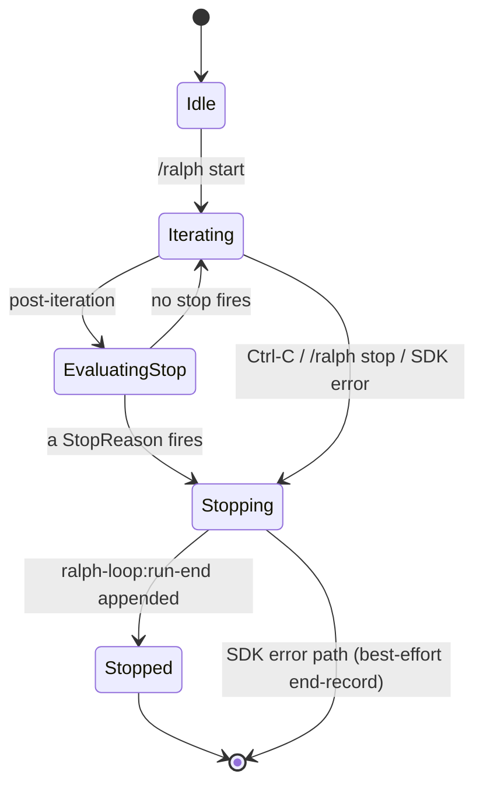

# Workshop: Stop condition catalog & defaults

**Type**: State Machine
**Plan**: 008-ralph-loop-extension
**Spec**: [`../ralph-loop-extension-spec.md`](../ralph-loop-extension-spec.md)
**Created**: 2026-05-15
**Status**: Draft

**Value Thesis**: Stop conditions ARE the product — every Ralph-loop horror story (40k-line PRs, runaway cost, infinite spinning) is a stop-condition failure. Encoding the closed taxonomy, default values, evaluation order, and the spinning-detection algorithm BEFORE code eliminates the largest class of design ambiguity in the build and gives the companion + tests a concrete contract to verify.

**Target Proof Level**: Implementation Ready
**Current Proof Level**: Implementation Ready

**Selected Value Axes**:
- **Implementation Readiness** — every StopReason has a TS shape, a default, an evaluator, and a test scenario.
- **Proof Quality** — the closed union enables exhaustive `switch` checks at compile time; safety is provable not aspirational.
- **Safety to Change** — adding/removing a StopReason has a single, obvious diff surface.
- **Agent Readiness** — the companion can spot drift from this taxonomy in any PR.

**Related Documents**:
- [`002-sdk-iteration-lifecycle.md`](002-sdk-iteration-lifecycle.md) — consumes `StopReason` to decide how to dispose each iteration's session.
- [`003-plan-file-format.md`](003-plan-file-format.md) — defines task-fingerprint computation consumed by spinning detection.
- [`004-compact-survival-smoke.md`](004-compact-survival-smoke.md) — verifies durability of the `RunRecord` (which carries the final `StopReason`).
- [Spec § AC-04](../ralph-loop-extension-spec.md) — the StopReason taxonomy is gated by this AC.
- [Research dossier § CD-03](../research-dossier.md) — "Stop conditions are the product".
- [External research § 5](../external-research/ralph-loop-provenance.md) — community defaults (snarktank `max_iterations = 10`; `<promise>COMPLETE</promise>` sigil).

**Domain Context**:
- **Primary Domain**: `agentic-loops` (NEW, formalized in Phase 0).
- **Related Domains**: none. Stop-condition vocabulary is a core contract of `agentic-loops`, not consumed by `_platform` or any other domain in pij.

---

## Purpose

Define the **closed taxonomy of reasons a Ralph run can stop**, the default value for every adjustable cap, the order in which conditions are evaluated, the algorithm for spinning detection, and the resolution rules when multiple conditions fire simultaneously. Make the safety story compile-time-checkable.

## Fresh Entrant Outcome

A fresh human or agent should be able to use this workshop to reach **Implementation Ready** with no additional context.

They should be able to:

- Implement `RalphLoopStore.evaluateStop()` directly from the decision table.
- Write the full `StopReason` tagged union without re-reading the spec.
- Choose sane defaults for every cap and explain the rationale.
- Spot whether a PR has added a new stop trigger that doesn't have a `StopReason` case.

## Key Questions Addressed

- What is the complete, closed set of StopReasons? (AC-04)
- What are the default values for every cap (max iterations, max USD, max wall-clock, spinning N, etc.)?
- In what order are stop conditions evaluated each iteration?
- When two conditions fire on the same iteration, which wins?
- How is "spinning" detected? What does "same task fingerprint" mean?
- How does the agent's `<promise>COMPLETE</promise>` sigil get from the SDK event stream to a `StopReason: "complete"`?
- How is the user's Ctrl-C (or `/ralph stop`) reflected as a `StopReason`?
- What's the difference between `manual_stop` (user wrote `STOP` in plan file) and `user_cancel` (user pressed Ctrl-C)?
- What does `unverified` mean and when does it fire?

---

## Value Frame

| Field | Selection | Why It Matters |
|-------|-----------|----------------|
| Target Proof Level | Implementation Ready | Stop conditions are too load-bearing to leave as prose; the build needs a TS spec it can copy. |
| Primary Value Axis | Implementation Readiness | Removes the single largest ambiguity in the build. |
| Supporting Value Axes | Proof Quality, Safety to Change, Agent Readiness | Compile-time exhaustiveness makes future PRs safer. |
| Downstream Loop Improved | Implementation + Review + Testing | Devs implement directly; reviewers diff against the table; tests cover every union case. |

## Evidence Ledger

| Evidence | Location | Supports | Status |
|----------|----------|----------|--------|
| Closed StopReason taxonomy | § StopReason tagged union | AC-04 | Ready |
| Default values table | § Defaults & overrides | AC-02, clarify Open Qs #3 #7 | Ready |
| State diagram | § State machine | clarify Q6 (Shape C lifecycle) | Ready |
| Decision table | § Decision table | every StopReason | Ready |
| Spinning algorithm | § Spinning detection | clarify Open Q #7 | Ready |
| Evaluation-order rules | § Evaluation order | edge case "two conditions at once" | Ready |
| Tie-breaking matrix | § Tie-breaking | edge case "two conditions same iteration" | Ready |
| Test scenario list | § Validation | store.test.ts coverage | Ready |

## Decision Space

### Closed vs open StopReason set

| Option | Description | Pros | Cons | Decision |
|--------|-------------|------|------|----------|
| Closed tagged union (8 cases) | Every reason is a literal in a TS discriminated union; `switch` is exhaustive. | Compile-time safety; reviewable; matches AC-04. | New reason requires a TS change; no plugin model. | **Selected** |
| Open string set + plugin registry | Extensions can register new reasons. | Future-proof; multi-Ralph swarm support. | Drift; un-reviewable; AC-04 mandates closed taxonomy. | Rejected for v1; revisit for v2 |

### Resolution when two conditions fire on the same iteration

| Option | Description | Pros | Cons | Decision |
|--------|-------------|------|------|----------|
| First-wins by fixed priority order | Conditions evaluated in priority order; first hit returns. | Deterministic; trivially testable. | One reason in the summary even if multiple fired. | **Selected**. Priority list in § Evaluation order. |
| Compound `stopReasons: StopReason[]` | All firing reasons recorded; primary = first. | More info for retros. | Bigger type; harder to reason about. | Rejected — adds noise; primary reason is what the user needs. |

### Spinning detection algorithm

| Option | Description | Pros | Cons | Decision |
|--------|-------------|------|------|----------|
| Same task fingerprint N times in a row | Pure last-N check on iteration log. | Trivial; fast; correct for "agent picks task X, fails X, picks X again". | Misses oscillation (X→Y→X→Y). | **Selected** for v1 — Huntley's framing is "one task per loop"; oscillation is a v2 problem if it shows up. |
| Frequency window (X seen >M times in last W iterations) | Catches oscillation. | Robust. | More state; more knobs; harder defaults. | Rejected for v1; revisit if real Ralph runs surface oscillation. |

---

## StopReason tagged union

```ts
// .pi/extensions/ralph-loop/store.ts
export type StopReason =
  | { kind: "complete"; reason: "sigil" | "plan_exhausted"; iteration: number }
  | { kind: "max_iterations"; limit: number; reached: number }
  | { kind: "budget_usd"; limitUsd: number; spentUsd: number }
  | { kind: "budget_wallclock"; limitMs: number; elapsedMs: number }
  | { kind: "spinning"; n: number; taskFingerprint: string; iterations: readonly number[] }
  | { kind: "manual_stop"; line: string; iteration: number }     // STOP token found in plan file
  | { kind: "user_cancel"; at: "iteration_boundary" | "mid_iteration"; iteration: number }
  | { kind: "unverified"; cause: "cost_unavailable" | "sigil_missing" | "session_error"; detail: string };
```

Why this shape:

- **Discriminator is `kind`** (not `reason` or `type`) — keeps it distinct from pi's own `entry.type` discriminator (P6 boundary discipline) and from the `customType` field.
- **Every case carries the evidence that made it fire** — defenses against "why did Ralph stop?" forensics and is exactly what the run-summary notification needs.
- **`complete.reason` is the v1.1 addition** that resolves cross-workshop drift caught by companion review F001: `"sigil"` (the agent emitted `<promise>COMPLETE</promise>`) vs `"plan_exhausted"` (no remaining undone tasks; the work is genuinely done, no agent output needed). Single `kind: "complete"` keeps the closed taxonomy at 8 cases per AC-04; the `reason` field is the forensic discriminator.
- **`complete.iteration` semantics**: for `reason: "sigil"` this is the iteration that produced the sigil. For `reason: "plan_exhausted"` this is the iteration whose POST-evaluator detected exhaustion (0 if pre-evaluator fires before any iteration; ≥1 if exhaustion is detected after an iteration that completed all remaining tasks).
- **`unverified` is the v1 escape hatch** when we want to stop but can't cleanly classify (e.g., cost accounting is unavailable per spec assumption #4). It is **never** silent — it is recorded with a cause string.

## State machine



| State | Entry | Valid exits |
|-------|-------|-------------|
| `Idle` | extension load, prior run finalised | `Iterating` via `/ralph start` |
| `Iterating` | `ralph-loop:run-start` appended; `Session.run()` invoked for iteration N | `EvaluatingStop` on iteration completion; `Stopping` on cancel/error |
| `EvaluatingStop` | iteration result captured | `Iterating` (loop again); `Stopping` (stop fires) |
| `Stopping` | a StopReason determined OR user cancel OR SDK error | `Stopped` after `ralph-loop:run-end` appended |
| `Stopped` | terminal | (none — next run starts a new state cycle) |

Note: pre-iteration stop checks (e.g. user pressed Ctrl-C while we were *between* iterations) still classify as `user_cancel` with `at: "iteration_boundary"`. This is the cleanest case because no session is mid-flight.

---

## Defaults & overrides

| Cap | Default | Configurable? | Source |
|-----|---------|---------------|--------|
| `maxIterations` | **10** | yes (per-run flag + per-extension setting) | snarktank/ralph published default; external research §A.1 |
| `maxUsd` | **`null` (cost cap OFF)** | yes (per-run flag) | clarify Open Q #3 — cost accounting may be partial per spec assumption #4. Off-by-default keeps v1 honest; users opt in. |
| `maxWallClockMs` | **`30 * 60 * 1000`** (30 min) | yes | matches the "overnight run" framing without enabling 8-hour-bills-by-accident |
| `spinningN` | **3** | yes | external research §A.5 — community guidance is "small N catches real loops"; 2 is too sensitive (one rebase noise), 5 too lax |
| `taskFingerprint` | **SHA-1 of the trimmed task title** | constants only (no live override) | clarify Open Q #7. Title is what the agent picks; file-set hash is too noisy (an iteration may touch many incidental files); diff-hash misses no-op iterations. |
| `stopMarkerLine` | **`STOP` on its own line, anywhere in plan file** | yes | user-controllable escape hatch; matches the user's mental model from snarktank's `<promise>COMPLETE</promise>` |
| `completionSigil` | **`<promise>COMPLETE</promise>`** | constants only (no live override) | external research §3 — community standard, attribution-friendly, do not invent our own |

CLI override surface (per-run):

```
/ralph start <plan-file> [maxIterations=N] [maxUsd=$X] [maxWallClock=Nm] [spinningN=N]
```

Per-extension defaults override built-ins via `settings.json#extensions.ralph-loop.defaults` (pi settings convention; document in `docs/how/ralph-loop.md`).

---

## Evaluation order

The evaluator runs **twice per iteration** to honour both pre-iteration terminal states (STOP marker in plan; plan exhausted; user cancel between iterations) and post-iteration caps (max iters, budgets, spinning, sigil). **First match wins** within each pass.

```ts
// Pre-iteration: check terminal states BEFORE spinning up the next agent session.
// Returns null when the loop should proceed to runIteration().
function evaluateStopPre(state: RunState): StopReason | null {
  // 1. User cancel between iterations—honour intent before doing more work.
  if (state.cancelRequested) {
    return { kind: "user_cancel", at: "iteration_boundary", iteration: state.iteration };
  }
  // 2. Manual STOP marker in plan file (explicit user override).
  const stopLine = findStopMarker(state.planSnapshot);
  if (stopLine) {
    return { kind: "manual_stop", line: stopLine, iteration: state.iteration };
  }
  // 3. Plan exhausted (no undone tasks remain).
  const next = nextUndoneTask(state.planModel);
  if (next === null) {
    return { kind: "complete", reason: "plan_exhausted", iteration: state.iteration };
  }
  // 4. Iteration cap reached BEFORE running the next iteration
  //    (state.iteration is the 1-based index we'd be about to run).
  if (state.iteration > state.config.maxIterations) {
    return { kind: "max_iterations", limit: state.config.maxIterations, reached: state.iteration - 1 };
  }
  // 5. Budget caps (wallclock + USD) checked pre-iteration too — don't start an
  //    iteration we'll just have to abort after.
  if (state.config.maxUsd !== null && state.spentUsd >= state.config.maxUsd) {
    return { kind: "budget_usd", limitUsd: state.config.maxUsd, spentUsd: state.spentUsd };
  }
  if (state.elapsedMs >= state.config.maxWallClockMs) {
    return { kind: "budget_wallclock", limitMs: state.config.maxWallClockMs, elapsedMs: state.elapsedMs };
  }
  return null; // proceed to runIteration
}

// Post-iteration: classify the outcome of the iteration that just ran.
// All cases are reachable AFTER an iteration has executed and an IterationRecord exists.
function evaluateStopPost(state: RunState): StopReason | null {
  // 1. User cancel during the iteration—honour first.
  if (state.cancelRequested) {
    return { kind: "user_cancel", at: state.midIteration ? "mid_iteration" : "iteration_boundary", iteration: state.iteration };
  }
  // 2. Completion sigil emitted by the agent.
  if (state.lastIterationOutput.includes(COMPLETION_SIGIL)) {
    return { kind: "complete", reason: "sigil", iteration: state.iteration };
  }
  // 3. Plan exhausted as a result of THIS iteration finishing every remaining task.
  const next = nextUndoneTask(state.planModel);
  if (next === null) {
    return { kind: "complete", reason: "plan_exhausted", iteration: state.iteration };
  }
  // 4. Iteration cap (post-check; the iteration that just ran was the last allowed).
  if (state.iteration >= state.config.maxIterations) {
    return { kind: "max_iterations", limit: state.config.maxIterations, reached: state.iteration };
  }
  // 5. Cost cap.
  if (state.config.maxUsd !== null && state.spentUsd >= state.config.maxUsd) {
    return { kind: "budget_usd", limitUsd: state.config.maxUsd, spentUsd: state.spentUsd };
  }
  // 6. Wall-clock cap.
  if (state.elapsedMs >= state.config.maxWallClockMs) {
    return { kind: "budget_wallclock", limitMs: state.config.maxWallClockMs, elapsedMs: state.elapsedMs };
  }
  // 7. Spinning detection (most expensive; evaluated last).
  const spin = detectSpinning(state.iterationLog, state.config.spinningN);
  if (spin) return spin;
  // 8. Unverified path — only flipped on by outer guard; not here.
  return null;
}
```

Why a pre/post split (resolution of companion review F001):

- The original draft of this workshop had a single `evaluateStop()` that ran only post-iteration. Workshop 003 § Examples 4 and 5 (STOP marker; all-done plan) said these stop on iteration 1 "before picking a task" — which contradicted the post-only evaluator. The pre/post split lets the implementation honour both contracts cleanly without running a wasted iteration when the terminal state is already true.
- Pre-iteration cases that can fire at `iteration === 1`: `manual_stop`, `complete.plan_exhausted`, `user_cancel.iteration_boundary`. All produce `iteration: 0` semantically (no iteration ran) — represented in code as the iteration counter that *would have* been the next index.
- Post-iteration cases require an `IterationRecord`: `complete.sigil`, `max_iterations`, `budget_*`, `spinning`, `user_cancel.mid_iteration`, `unverified` (forensic only).
- The same `StopReason.kind` (e.g., `manual_stop`, `user_cancel`) can fire either pre or post depending on when the trigger arrives — the union shape doesn't change.

Evaluation priority within each pass keeps the user-intent precedence intact: cancel → explicit done (manual stop or plan exhausted or sigil) → caps → spinning.

---

## Spinning detection algorithm

```ts
function detectSpinning(
  log: ReadonlyArray<IterationRecord>,
  n: number,
): Extract<StopReason, { kind: "spinning" }> | null {
  if (log.length < n) return null;
  const tail = log.slice(-n);
  const fingerprints = new Set(tail.map((r) => r.taskFingerprint));
  if (fingerprints.size !== 1) return null;
  const taskFingerprint = tail[0]!.taskFingerprint;
  return {
    kind: "spinning",
    n,
    taskFingerprint,
    iterations: tail.map((r) => r.iteration),
  };
}
```

**Fingerprint shape** (computed once per iteration, stored in `ralph-loop:iteration` entry):

```ts
import { createHash } from "node:crypto";

function taskFingerprint(taskTitle: string): string {
  return createHash("sha1")
    .update(taskTitle.trim().toLowerCase())
    .digest("hex")
    .slice(0, 12); // 12 hex chars = 48 bits, ample for collision-resistance at iteration scale
}
```

Notes:
- Case- and whitespace-insensitive — agent rephrasing the same task title doesn't reset the counter.
- 12-hex truncation is enough; full SHA-1 is excessive in entry payloads.
- The taskTitle is whatever the agent picked from the plan file. If the agent picks "(no title)" three times in a row, spinning fires. That's correct behavior.

---

## Decision table — every StopReason

| `kind` | When/where it fires | Default cap | Configurable | Companion concern? |
|--------|---------------------|-------------|--------------|--------------------|
| `complete` (`reason: "sigil"`) | Post-iter: agent output contains `<promise>COMPLETE</promise>` | n/a (event-driven) | no | review: was completion genuine or hallucinated? Check that tests passed in the final iteration. |
| `complete` (`reason: "plan_exhausted"`) | Pre-iter (iteration would-be-1 and plan has 0 undone) OR post-iter (last iteration finished the last task) | n/a (event-driven) | no | review: no remaining work in plan file; agent didn't have to do anything OR the last iteration cleared the queue |
| `max_iterations` | Post-iter: iteration counter ≥ `maxIterations` | 10 | yes | review: did the run plateau or genuinely run out? |
| `budget_usd` | Pre or post: spent ≥ `maxUsd` AND `maxUsd !== null` | OFF | yes | review: cost forensics row in retro |
| `budget_wallclock` | Pre or post: `Date.now() - runStartedAt ≥ maxWallClockMs` | 30 min | yes | review: progress-per-minute trend |
| `spinning` | Post-iter only: last `spinningN` iterations share a fingerprint | N=3 | yes | review: is the prompt giving the agent enough leverage to escape the task? |
| `manual_stop` | Pre or post: plan file contains `STOP` on its own line | n/a | yes (override the line) | review: was the override premature? |
| `user_cancel` | Pre (`iteration_boundary`) or post (`mid_iteration`): user pressed Ctrl-C or invoked `/ralph stop` | n/a | no | review: minimal — log the cancel context |
| `unverified` | Outer-guard fallback (rare; not the standard paths) | n/a | no | **critical** — the unverified path is a bug surface; companion should flag every occurrence |

---

## Tie-breaking matrix

When two conditions could fire on the same iteration. The "First wins" rule is implemented via § Evaluation order; this matrix is the user-facing explanation.

| Scenario | Wins | Why |
|----------|------|-----|
| Sigil + max_iterations both hit at iter 10 | `complete` | Agent said done; honor it. |
| Sigil + Ctrl-C in same iteration | `user_cancel` | User intent overrides agent claim. |
| Manual STOP + budget_usd in same iteration | `manual_stop` | User overrode; cost cap is moot. |
| Spinning + max_iterations on the same iteration | `max_iterations` | Cheaper to evaluate; result is identical for the user (run stopped). |
| Budget_usd + budget_wallclock simultaneously | `budget_usd` | First in eval order; financial cost is more user-actionable. |

Documented in `docs/how/ralph-loop.md` § "Why did Ralph stop?" so users understand the priority.

---

## Attention Reduction

| Future Loop | Before Workshop | After Workshop |
|-------------|-----------------|----------------|
| Implementation | "AC-04 says these 8 cases — invent the union shape, defaults, ordering, fingerprint, and tie-break" | Copy the TS union; implement evaluator from § Evaluation order; defaults from § Defaults table |
| Review | "Does this PR cover every StopReason? Is the fingerprint sensible?" | Diff `StopReason` union; check exhaustive `switch`; verify defaults table updates |
| Testing | "Write tests for each case" | 8 test files, one per `kind`, plus the tie-breaking matrix and 3 spinning-edge tests |
| Companion | "Watch for safety regressions" | Specific flags: new `kind` without case in `switch`; `unverified` firing without forensic detail; spinning with fingerprint = `''` |

---

## Validation / Acceptance

This workshop reaches Implementation Ready when:

- [ ] `StopReason` tagged union compiles with `exhaustiveCheck()` in store.ts (single `kind: "complete"` carrying `reason: "sigil" | "plan_exhausted"`).
- [ ] `evaluateStopPre()` and `evaluateStopPost()` both match § Evaluation order in implementation.
- [ ] `detectSpinning()` matches § Spinning detection — 12-hex SHA-1 of trimmed lowercase title; pure last-N check.
- [ ] One vitest case per `StopReason` `kind` in `store.test.ts` (≥8 tests) plus dedicated `complete.reason` coverage (≥2 tests for sigil vs plan_exhausted).
- [ ] Tie-breaking matrix has ≥3 dedicated tests (sigil-vs-cancel, manual-vs-budget, spinning-vs-max) PLUS ≥2 pre-evaluator tests (STOP-on-iter-1, plan-exhausted-on-iter-1).
- [ ] Default values table is copied into `store.ts` § P5 constants.
- [ ] `unverified` firing in a real run gets a difficulty ledger row; the cause string is the row's title.

---

## Open Questions

### Q1: Should the agent's tool result (vs raw output) be searched for `<promise>COMPLETE</promise>`?

**RESOLVED**: Search both — the SDK delivers structured messages and tool results; either may carry the sigil. The community pattern (snarktank, Anthropic plugin) treats agent output as one stream. Search the concatenated last-iteration text.

### Q2: Does `user_cancel.at: "mid_iteration"` need to abort the in-flight SDK call?

**OPEN — defer to 002-sdk-iteration-lifecycle workshop**. The cancel signal should propagate to `Session.dispose()` via `AbortSignal`, but the exact API and the cleanup contract belong to that workshop.

### Q3: Should `unverified` block ending the run, or end with a warning?

**RESOLVED**: End with `kind: "unverified"`, emit a `ctx.ui.notify` at level `"warning"`, append a `ralph-loop:run-end` entry, and document in `docs/how/ralph-loop.md` § Troubleshooting. Do **not** silently retry; do **not** block. The unverified path is rare and surfaces a real gap (cost unknown + every other cap unhittable). The difficulty ledger catches it.

### Q4: Does `max_iterations` count the iteration that fires the cap, or one beyond?

**RESOLVED**: The cap fires *before* iteration N+1 starts. `reached === limit`. AC-02 ("default 10") means iteration 10 runs and completes; iteration 11 does not start. `max_iterations.reached === 10 === limit`.
