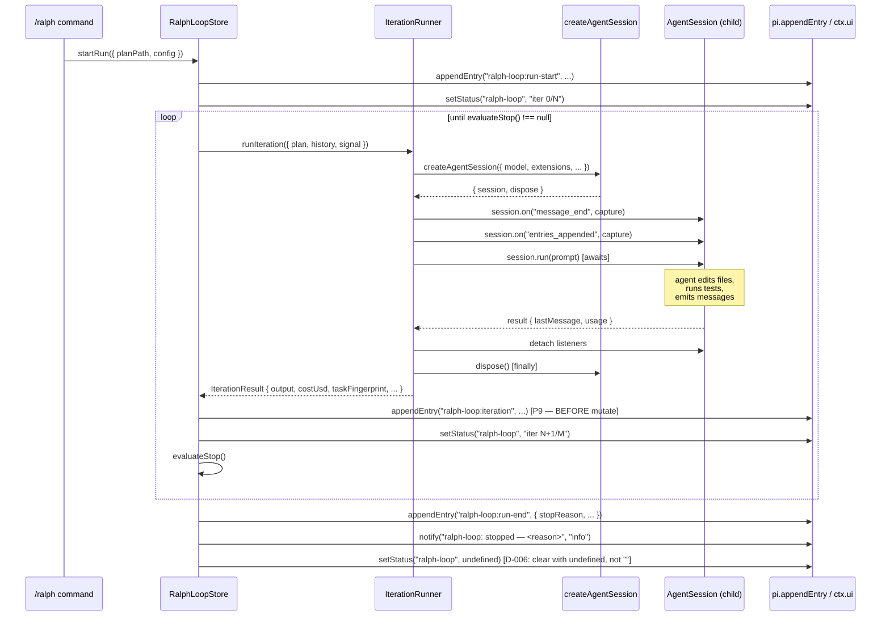

# Workshop: SDK iteration lifecycle (Shape C)

**Type**: Integration Pattern
**Plan**: 008-ralph-loop-extension
**Spec**: [`../ralph-loop-extension-spec.md`](../ralph-loop-extension-spec.md)
**Created**: 2026-05-15
**Status**: Draft

**Value Thesis**: Clarify Q6 chose Shape C (SDK `createAgentSession` per iteration) without pinning the per-iteration lifecycle. Locking the SDK contract now — invocation, event capture, cancellation, teardown, resource ownership — eliminates the second-largest design ambiguity in the build and makes the iteration runner directly testable.

**Target Proof Level**: Contract Ready
**Current Proof Level**: Contract Ready

**Selected Value Axes**:
- **Implementation Readiness** — the iteration runner can be written from this workshop without re-reading pi SDK docs.
- **Knowability** — every SDK side-effect per iteration is named.
- **Operational Reliability** — cancellation, leaks, and error paths are explicit.
- **Agent Readiness** — the companion can review iteration code against the named lifecycle.

**Related Documents**:
- [`001-stop-condition-catalog.md`](001-stop-condition-catalog.md) — consumed for `StopReason → disposal-mode` mapping.
- [`004-compact-survival-smoke.md`](004-compact-survival-smoke.md) — the smoke MUST exercise this lifecycle.
- pi SDK docs: `/Users/jordanknight/.npm-global/lib/node_modules/@earendil-works/pi-coding-agent/docs/sdk.md`.
- [Spec § R2 (NEW)](../ralph-loop-extension-spec.md) — "SDK session lifecycle bugs leak across iterations".

**Domain Context**:
- **Primary Domain**: `agentic-loops` — iteration runner is a core component.
- **Related Domains**: pi's SDK is the load-bearing dependency. The runner does not own model selection, auth, or session-file lifecycle.

---

## Purpose

Define the **per-iteration sequence** for Shape C: how `createAgentSession()` is invoked with a fresh context, how iteration events are captured, how the prompt is injected, how cancellation propagates, and how every resource (session, listeners, file handles, child shells) is reclaimed before the next iteration starts. Make resource-leak bugs detectable at the contract level, not via leak symptoms in long runs.

## Fresh Entrant Outcome

A fresh human or agent should be able to use this workshop to reach **Contract Ready** with no additional context.

They should be able to:

- Write `IterationRunner.runIteration(plan, history, signal)` matching the interface in this workshop.
- Identify every `await` boundary where state must be flushed.
- Hook cancellation correctly from `/ralph stop` or Ctrl-C down through `AbortSignal` to `Session.dispose()`.
- Recognize a session-leak symptom in a PR review.

## Key Questions Addressed

- What is the exact sequence for one iteration? (sequence diagram)
- What is the `IterationRunner` TS interface?
- How does cancellation propagate from `/ralph stop` (or Ctrl-C) to the in-flight SDK call?
- How are events from the SDK session captured for cost accounting and sigil detection?
- What is the resource-cleanup contract per iteration? What must be disposed?
- How is each `StopReason` mapped to a disposal mode (graceful vs abort)?
- What is the failure-mode catalogue (session hangs, fresh-start failures, mid-iteration crashes)?
- How does the in-process Shape C avoid the "shared context with user pi session" problem that worried Shape A?

---

## Value Frame

| Field | Selection | Why It Matters |
|-------|-----------|----------------|
| Target Proof Level | Contract Ready | Lower bar than Implementation Ready — we don't pre-stub every SDK call, but we pin the interface, the lifecycle, and the failure surface. Implementation reaches "Ready" during Phase 1.B. |
| Primary Value Axis | Implementation Readiness | The iteration runner is the riskiest single file in the build. |
| Supporting Value Axes | Knowability, Operational Reliability, Agent Readiness | Resource ownership is named; failure modes are catalogued. |
| Downstream Loop Improved | Implementation + Reviewer attention + Future migration to Shape A/B | The interface is shape-agnostic; v2 can swap the runner without touching the store. |

## Evidence Ledger

| Evidence | Location | Supports | Status |
|----------|----------|----------|--------|
| Sequence diagram | § Per-iteration sequence | clarify Q6 | Ready |
| `IterationRunner` interface | § Interface contract | every iteration-call-site test | Ready |
| Cancellation contract | § Cancellation | Spec R2; tie-break matrix in 001 | Ready |
| Resource ledger | § Resource ownership | Spec R2 ("listener/handle leaks") | Ready |
| StopReason → disposal map | § Disposal modes | 001's union | Ready |
| Failure mode catalogue | § Failure modes | difficulty-ledger preparedness | Ready |
| Cost-accounting tap | § Event capture | 001 Defaults `maxUsd` row | Draft (gated on SDK exposing per-message usage; flagged below) |

## Decision Space

### Where the IterationRunner lives

| Option | Description | Pros | Cons | Decision |
|--------|-------------|------|------|----------|
| Constructor-injected into store (P3) | `new RalphLoopStore(appendFn, iterationRunner)` | Pure store stays pure; tests mock the runner. | One more constructor arg. | **Selected**. P3 + P8 alignment. |
| Inlined in store | Store calls `createAgentSession` directly. | Fewer files. | Breaks P2 (store imports `@earendil-works/*`). | Rejected. |
| Top-level singleton in `index.ts` | Store calls a module-level function. | Easy. | Global mutable state; breaks P3. | Rejected. |

### Session-fork vs fresh-session per iteration

| Option | Description | Pros | Cons | Decision |
|--------|-------------|------|------|----------|
| Fresh `createAgentSession()` per iteration | Each iteration starts with no prior chat context. | Canonical Ralph; matches external research §1. | Per-iteration startup cost. | **Selected**. |
| Fork the user's existing pi session | Inherit auth/model, branch context. | Faster startup. | Shares context window (Shape A problem revived); violates "fresh context per iteration" invariant. | Rejected. |
| Reuse one long-lived session, `/compact` between iterations | One session, periodic compact. | Minimal startup cost. | Defeats the entire Ralph compaction-avoidance design intent (research § Huntley quote). | Rejected. |

### Event capture strategy

| Option | Description | Pros | Cons | Decision |
|--------|-------------|------|------|----------|
| Subscribe to `session.on("message_end")` + accumulate | Standard event-loop pattern. | Clean; SDK-documented. | Need to detach on cleanup. | **Selected**. |
| Poll `session.getEntries()` post-run | Read events after `session.run()` resolves. | Simpler. | Misses streaming sigil detection; can't cancel mid-stream. | Rejected. |

---

## Per-iteration sequence



Notes on the sequence:

- `appendEntry("ralph-loop:run-start", ...)` happens **before** `setStatus` and **before** the first iteration (P9 — persist before mutate).
- `dispose()` is in a `try/finally` so it runs even if `session.run()` throws.
- The status pill clear at the end uses `undefined` (D-006).
- The sequence is intentionally synchronous within one iteration (we await `session.run()`); concurrency between iterations is not supported in v1 (it would violate "one task per loop").

---

## Interface contract

### `IterationRunner` (constructor-injected into the store)

```ts
// .pi/extensions/ralph-loop/store.ts (or runner.ts if extracted)
export interface IterationRunner {
  /**
   * Run a single Ralph iteration in a fresh agent session.
   * Resources (session, listeners, child processes) are reclaimed before this
   * Promise resolves or rejects — callers do NOT manage cleanup.
   */
  runIteration(input: IterationInput): Promise<IterationResult>;
}

export interface IterationInput {
  /** Resolved absolute path to the plan file. Runner does NOT mutate it. */
  readonly planPath: string;
  /** Plan file contents at iteration start (snapshot — protects against mid-run edits). */
  readonly planSnapshot: string;
  /** Prior iteration log (for prompt construction; runner is free to ignore). */
  readonly history: readonly IterationRecord[];
  /** Iteration index (1-based; logged for fingerprint + reporting). */
  readonly iteration: number;
  /** Cancellation signal. Runner MUST forward to the SDK session. */
  readonly signal: AbortSignal;
  /** Run config (caps, fingerprint algorithm, sigil string, etc.). */
  readonly config: RalphLoopConfig;
}

export interface IterationResult {
  /** Agent's final-message text (used for sigil detection). */
  readonly output: string;
  /** Task title the agent worked on this iteration (used for fingerprint). */
  readonly taskTitle: string;
  /** Computed fingerprint (12-hex SHA-1, per 001 workshop). */
  readonly taskFingerprint: string;
  /** USD spend for this iteration, if the SDK exposed it; else null. */
  readonly costUsd: number | null;
  /** Wall-clock for this iteration. */
  readonly durationMs: number;
  /**
   * The iteration outcome. NOT a StopReason — runner only reports per-iteration
   * verdicts; full-run stop is the store's job via evaluateStop().
   */
  readonly verdict: "ok" | "agent_error" | "session_error";
  /** Optional diagnostic (populated when verdict !== "ok"). */
  readonly errorDetail?: string;
}
```

### `RalphLoopStore` constructor signature

```ts
export class RalphLoopStore {
  constructor(
    private readonly append: AppendFn,
    private readonly runner: IterationRunner,
    private readonly clock: () => number = Date.now,
  ) {}
  // ...
}
```

Injection points:
- `append` — P3 side-effect injection.
- `runner` — P3 side-effect injection. In tests, supply a `FakeIterationRunner` that returns deterministic `IterationResult`s. The smoke uses a real `SdkIterationRunner` instance.
- `clock` — P3 side-effect injection so tests can synthesize budget_wallclock without actual sleeps.

Why three injections, not one: each represents a distinct side-effect class (persistence, I/O, time). Bundling them creates a "god dependency" that tests can't selectively replace.

---

## Cancellation contract

Single source of truth: a per-run `AbortController`.

```ts
// inside the store's iterate-until-stop loop
const controller = new AbortController();
this.cancelHandlesByRunId.set(runId, controller);

try {
  while (true) {
    const result = await this.runner.runIteration({ ..., signal: controller.signal });
    // ...
    if (this.evaluateStop(...) !== null) break;
  }
} finally {
  this.cancelHandlesByRunId.delete(runId);
}
```

Cancel triggers:

| Trigger | Action |
|---------|--------|
| `/ralph stop` slash command | `controller.abort()`; evaluator sets `user_cancel.at` based on whether `runIteration` was pending |
| User Ctrl-C in pi TUI | pi's session-end hook fires `session_shutdown`; extension forwards to `controller.abort()` |
| SDK throws during `session.run()` | `runIteration` resolves with `verdict: "session_error"`; the outer loop appends an iteration entry with `verdict: "session_error"` then evaluates stop (will produce `unverified` if no other condition fired this iteration) |
| Plan file deleted mid-run | `IterationRunner.runIteration` reads `planSnapshot` (not the file); plan-deletion takes effect on the NEXT iteration, where reading the path returns ENOENT and the store ends the run with `manual_stop` (treat ENOENT as "stop requested"). Document in `docs/how/ralph-loop.md`. |

**The runner MUST forward `signal`** to the SDK session and to any child processes it spawns. In `SdkIterationRunner`:

```ts
async runIteration(input: IterationInput): Promise<IterationResult> {
  const startedAt = this.clock();
  const { session, dispose } = await createAgentSession({
    model: input.config.model,
    abortSignal: input.signal, // SDK accepts AbortSignal per sdk.md
    // ... other options
  });
  try {
    // ... attach listeners
    const result = await session.run(this.buildPrompt(input));
    // ... compute taskTitle, fingerprint, etc.
    return { output: result.lastMessage.text, ..., verdict: "ok" };
  } catch (err) {
    if (input.signal.aborted) {
      // Re-throw so the outer loop sees the cancellation.
      throw err;
    }
    return { output: "", ..., verdict: "session_error", errorDetail: String(err) };
  } finally {
    dispose();
  }
}
```

Race-safety: if `signal` aborts between `createAgentSession` resolving and the first `session.run()` call, the runner MUST still call `dispose()` and re-throw. The `try/finally` covers this.

---

## Event capture

The runner subscribes during the iteration and detaches before returning.

```ts
const events: SessionEvent[] = [];
const onMessageEnd = (e: MessageEndEvent) => events.push({ kind: "message_end", payload: e });
const onEntriesAppended = (e: EntriesAppendedEvent) => events.push({ kind: "entries_appended", payload: e });
session.on("message_end", onMessageEnd);
session.on("entries_appended", onEntriesAppended);
try {
  await session.run(prompt);
} finally {
  session.off("message_end", onMessageEnd);
  session.off("entries_appended", onEntriesAppended);
}
```

Captured for:
- **Sigil detection** (last `message_end` text → checked against `<promise>COMPLETE</promise>`).
- **Cost accounting** (if `message_end.payload.usage.costUsd` exists, sum across events). If not, `costUsd: null` in the result; spec's R4 fallback applies (iteration-cap-only enforcement).
- **Task title extraction** (if the agent's first `message_end` declares "Task: <title>", parse it; else use a heuristic from the plan file's first unchecked item).

---

## Resource ownership ledger

Per iteration, the runner is responsible for:

| Resource | Acquired in | Released in |
|----------|-------------|-------------|
| `AgentSession` | `createAgentSession({...})` | `dispose()` in `finally` |
| Event listeners (`message_end`, `entries_appended`) | `session.on(...)` | `session.off(...)` in `finally` |
| Per-iteration prompt buffer | constructed at iteration start | GC after `runIteration` returns |
| Child shells started by the agent | pi's bash tool inside the session | pi's bash tool's process-tree termination (pi handles this; runner doesn't) |
| Temp files in `process.cwd()` | none created by the runner | n/a (runner does not write to cwd) |

The store is responsible for:

| Resource | Acquired in | Released in |
|----------|-------------|-------------|
| `AbortController` | start of run | `finally` at run end |
| Status pill | `setStatus(..., "iter ...")` | `setStatus(..., undefined)` at run end (D-006) |
| `ralph-loop:*` entries | `appendEntry(...)` | n/a (durable; survives /compact per AC-05) |

Per-iteration assertion in tests: after `runner.runIteration()` resolves, `session` references must not appear in any GC root. Verified by node's `--expose-gc` + heap-snapshot test on a fixture run of 10 iterations.

---

## Disposal modes per StopReason

| StopReason | Disposal mode | Why |
|------------|---------------|-----|
| `complete` | graceful | iteration finished cleanly; `dispose()` already ran in `finally` |
| `max_iterations` | graceful | same |
| `budget_usd`, `budget_wallclock` | graceful | caps evaluated post-iteration; disposal already ran |
| `spinning` | graceful | same |
| `manual_stop` | graceful | detected post-iteration |
| `user_cancel.at === "iteration_boundary"` | graceful | no in-flight session |
| `user_cancel.at === "mid_iteration"` | **abort** | `AbortSignal` propagated; runner's `finally` runs `dispose()` |
| `unverified` | graceful | session already disposed; the run-end record carries forensic detail |

Implication for `001`'s union: every `StopReason` is reachable from a fully-disposed runner state. No `StopReason` requires special teardown.

---

## Failure mode catalogue

For each failure, the contract specifies behavior. The companion uses this list to spot regressions.

| Failure | Observable | Runner contract |
|---------|-----------|-----------------|
| `createAgentSession` rejects (auth failure, model not found) | exception | runner rethrows; store treats this iteration as `session_error`; outer loop evaluates stop (likely `unverified` unless another cap hit); difficulty row mandatory |
| Session hangs in `session.run()` for > `(maxWallClockMs - elapsedMs)` | wall-clock cap fires | `budget_wallclock` stops the run; the in-flight session is aborted via the same `signal` the cap-checker triggered |
| Mid-iteration crash in `session.run()` | exception | runner catches, returns `verdict: "session_error"`; iteration entry persisted (P9); next iteration starts fresh |
| Listener leak (event handler still attached after iteration) | heap-snapshot test | regression; reverts on PR |
| Plan file deletion mid-iteration | next iteration's snapshot read fails | runner returns `verdict: "session_error"` with errorDetail; store treats next iteration as `manual_stop` (no plan = stop) |
| Cost accounting unavailable | `costUsd: null` for every iteration | run completes; if user set `maxUsd`, the cap is silently skipped and the run-end record carries `unverified` instead if no other cap fired; difficulty row |
| User Ctrl-C during `session.run()` | signal abort | runner rethrows abort; store records `user_cancel.at: "mid_iteration"`; iteration entry NOT appended (P9 — we never partially commit) |

---

## Attention Reduction

| Future Loop | Before Workshop | After Workshop |
|-------------|-----------------|----------------|
| Implementation | "Use createAgentSession somehow, handle cancellation, capture events, clean up" | Copy the `IterationRunner` interface; implement against the sequence diagram; cover every Failure-Mode row with a test |
| Review | "Does this leak? Does cancellation work?" | Diff against Resource Ownership ledger; check `dispose()` is in `finally`; verify listeners are detached |
| Testing | "Test the runner — how?" | `FakeIterationRunner` for store tests; one integration test per Failure Mode row; one heap-snapshot test for listener leaks |
| Companion | "Look for SDK lifecycle issues" | Specific flags: `createAgentSession` outside `try/finally`; listeners not detached; missing AbortSignal forwarding; reused session across iterations |

---

## Validation / Acceptance

This workshop reaches Contract Ready when:

- [ ] `IterationRunner` interface compiles with `tsc --noEmit`.
- [ ] `SdkIterationRunner` implements every contract item in § Resource ownership.
- [ ] `FakeIterationRunner` exists in `harness/test-utils.ts` (or per-extension test utils) and returns deterministic `IterationResult`s.
- [ ] Every Failure-Mode row has a vitest case in `store.test.ts` (using `FakeIterationRunner`) OR a smoke scenario (for SDK-dependent failures).
- [ ] One heap-snapshot test asserts no `AgentSession` references survive `runIteration` across 10 iterations.
- [ ] `dispose()` is in `finally` in every code path within `SdkIterationRunner`.

---

## Open Questions

### Q1: Does `createAgentSession` accept `AbortSignal` directly?

**OPEN — verify against pi-mono source during Phase 0 prep**. The SDK doc references `AuthStorage`, `ModelRegistry`, `SessionManager`, `ResourceLoader` but I have not verified the `AbortSignal` parameter inline. If absent: signal forwarding requires a wrapper that holds `session` and calls `session.dispose()` on `signal.abort`. Either way the public `IterationRunner` interface is unchanged.

### Q2: Does the SDK expose per-message USD cost?

**OPEN — verify during Phase 0 prep**. If yes: cost accounting works. If no: `costUsd: null` permanently, `maxUsd` cap is unenforceable, spec's R4 fallback applies. Either way, the contract above is satisfied.

### Q3: Should mid-iteration `user_cancel` append a partial iteration entry?

**RESOLVED**: No. P9 says persist-before-mutate; if the iteration didn't complete, there is no `IterationResult` to persist. The `ralph-loop:run-end` record carries `user_cancel.at: "mid_iteration"` and the last completed iteration count. This keeps event-sourcing clean.

### Q4: Should iteration entries carry the agent's raw message stream?

**RESOLVED**: No. Iteration entries are summaries: `{ iteration, taskTitle, taskFingerprint, costUsd, durationMs, verdict }`. The full message stream lives in pi's session log already (rehydrated via `session.getEntries()` for forensics). Double-persistence bloats entries and complicates `/compact` survival.
