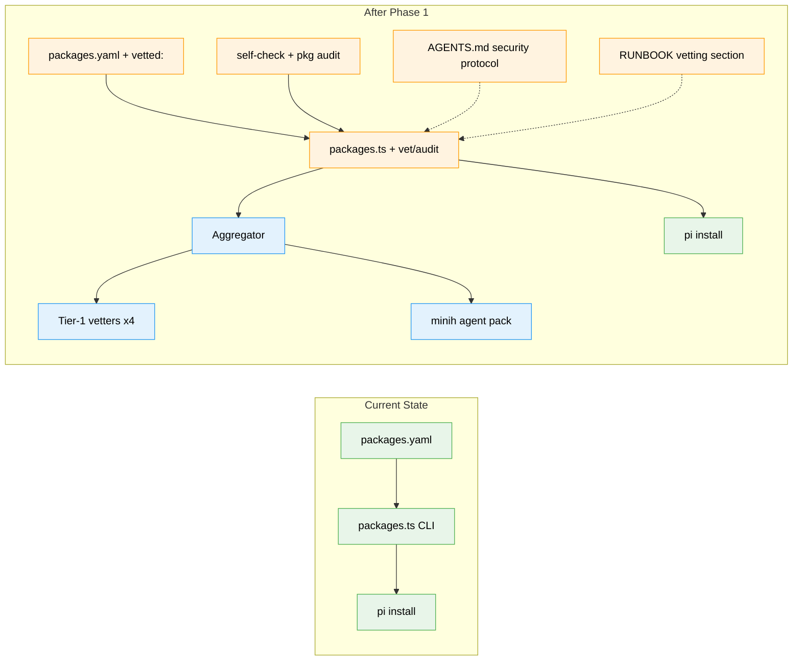

# Flight Plan: Supply-Chain Vetting for the Package Manifest

**Spec**: [extension-vetting-spec.md](./extension-vetting-spec.md)
**Plan**: [extension-vetting-plan.md](./extension-vetting-plan.md)
**Dossier**: [research-dossier.md](./research-dossier.md)
**Workshop**: [001-prompt-injection-rules.md](./workshops/001-prompt-injection-rules.md)
**Generated**: 2026-05-15
**Status**: Landed — all 6 tasks complete; `self-check` green
**Mode**: Simple
**Complexity**: CS-3 (medium)

---

## The Mission

**What we're building**: A vetter pipeline in pij's `pkg` CLI that screens every third-party pi extension before it lands in `.pi/packages.yaml` or gets installed by `pkg bootstrap`. Combines four deterministic Tier-1 vetters (`npm audit`, `lockfile-lint`, OpenSSF Scorecard, GitHub-trust) with a minih agent that judges extension markdown and tool descriptions for prompt-injection patterns via LLM reasoning. Each manifest entry carries a `vetted: { date, score }` block; stale (>30 d) or missing entries block `bootstrap` unless `--unsafe`.

**Why it matters**: Pi extensions run with the user's full system privileges and their `SKILL.md` / `AGENTS.md` / tool descriptions load straight into the LLM context. Pij installs four such extensions today with zero pre-flight. Reproducibility without vetting just makes the exposure portable.

---

## Where We Are → Where We're Headed

```
TODAY (un-vetted):                       AFTER this plan (vetted):

🔴 0/4 manifest entries vetted           🟢 4/4 entries vetted with recent dates
🔴 pkg add writes blindly                🟢 pkg add runs full pipeline, refuses on fail
🔴 pkg bootstrap installs blindly        🟢 pkg bootstrap refuses stale/unvetted
🔴 No CVE / lockfile / maintainer scan   🟢 npm audit + lockfile-lint + Scorecard + gh-trust
🔴 No prompt-injection defense           🟢 minih agent using workshop-001 rubric
🔴 No supply-chain step in self-check    🟢 self-check includes pkg audit
🔴 requires.install is silent vector     🟢 AGENTS.md "Security protocol" documents it
🔴 Transitive installs invisible         🟢 pkg audit cross-checks pi list (CD-02)
🔵 packages.ts: 229 LOC, 6 subcommands   🟡 packages.ts: + vet, audit subcommands
🔵 packages.yaml: 4 entries              🟡 packages.yaml: + per-entry vetted: block
❌ tests for vetters                     🔴 fixture-driven unit tests + agent snapshots
❌ agents/package-vetter/                🔴 minih pack with workshop-001 rubric
```

🔵 unchanged   🟡 modified   🔴 new   🟢 outcome reached



**Legend**: existing (green, unchanged) | changed (orange, modified) | new (blue, created)

---

## Scope

**Goals**:
- Every manifest entry has a recent `vetted:` block or a documented override
- `pkg add` / `pkg audit` / `pkg bootstrap` enforce the gate
- Uniform `Verdict` shape across all vetters and the agent; aggregate `level` is the install decision
- minih agent (`agents/package-vetter/`) applies workshop-001 rubric and returns stable verdicts on real packages
- All four currently-installed packages pass the pipeline at `level: ok`
- `requires.install` shell-injection vector is documented as a project rule
- `npm run self-check` includes the supply-chain step

**Non-Goals**:
- No sandboxing (Docker, bubblewrap, devcontainer profiles)
- Not vetting pij's own first-party extensions
- Not vetting `.mcp.json` MCP servers (separate surface)
- No GUI — CLI-only
- Not signing/publishing pij itself
- Not auto-patching dependencies
- Not blocking pi's session-start auto-install (known gap, deferred)
- No regex-based prompt-injection scanner (replaced by minih agent per clarification)
- No Tier-2 vetters (Socket, Semgrep, Snyk) in v1

---

## Journey Map


**Legend**: green = done | yellow = active | grey = not started

---

## Phases Overview

Single phase (Simple Mode); 6 inline tasks.

| Phase | Title | Tasks | CS | Status |
|---|---|---|---|---|
| 1 | Tier-1 vetter pipeline + novel-validation agent + bootstrap gate | 6 | CS-3 (medium, Σ=6) | **Complete** |

### Phase 1 task summary

| Task | CS | Done When |
|---|---|---|
| T001 — Schema + skeletons + types | CS-1 | `Entry.vetted` typed; `pkg vet`/`audit` stubs exist; typecheck green |
| T002 — Four Tier-1 vetter modules | CS-2 | Each returns `Verdict`; fixture-driven unit tests pass; Scorecard fail-soft on 404 |
| T003 — minih agent pack + adapter | CS-2 | Agent on `pi-askuserquestion` returns `level: ok`; snapshot stable over 3 runs (≤1 finding drift) |
| T004 — Aggregator + pipeline + bootstrap gate | CS-2 | `pkg add` runs pipeline + refuses on fail; `bootstrap` refuses stale; `--unsafe` works |
| T005 — Retro-vet the 4 installed packages | CS-1 | All 4 have `vetted:` blocks; `pkg audit` exits 0 |
| T006 — Docs + self-check integration | CS-1 | `self-check` runs `pkg audit`; AGENTS.md Security protocol section live |

---

## Acceptance Criteria

(Top 8 of 11 from spec; full list in `extension-vetting-spec.md`.)

- [ ] **AC-01**: `pkg add` runs full pipeline before write; refuses on `fail` without `--unsafe`; records `vetted:` block on success
- [ ] **AC-02**: `pkg audit` exits 0 on all-ok, 2 on any warn-or-fail (warn-as-fail-exit per spec — keeps self-check binary)
- [ ] **AC-03**: `pkg bootstrap` refuses entries with missing or stale (>30 d) `vetted.date`; `--unsafe` requires non-empty user-supplied reason
- [ ] **AC-04**: All four currently-installed packages pass the pipeline at `level: ok` (retro-vet via T005)
- [ ] **AC-05a (detection)**: minih agent classifies ≥6/7 positive-corpus files at intended severity; 0 misclassified as `ok`
- [ ] **AC-05b (stability)**: agent returns stable verdicts (same `level`, ≤1 finding drift) on the 4 real packages across 3 runs
- [ ] **AC-06**: All vetters + agent return uniform `Verdict` shape; aggregate composes; `--json` produces machine-readable output
- [ ] **AC-07**: AGENTS.md "Security protocol" section documents `requires.install` as a trusted-by-design shell vector
- [ ] **AC-08**: `npm run self-check` includes `pkg audit` step and remains green

---

## Key Risks

| Risk | Mitigation |
|---|---|
| minih agent gives inconsistent verdicts on the same package | Snapshot regression with ≤1 finding drift tolerance (AC-05); rubric checksum stored in `vetted.agentRubric` |
| OpenSSF Scorecard 404s for most small pi extensions | Vetter fail-soft per F-03: 404 → `info`, not gate |
| GitHub API rate-limit hit during `pkg audit` | Use `GH_TOKEN` from env; warn at startup if unset (F-07) |
| Vetter latency exceeds budget | Per-vetter wall-time assertions in tests (F-06); aggregator short-circuits on `fail` |
| Pi session-start auto-install bypasses our gate | Documented as known limitation (CD-02 / F-04); pi-side hook deferred |
| Vetted entries go stale → `bootstrap` becomes annoying | `pkg audit` regenerates `vetted.date` when findings unchanged; 30 d TTL is conservative |
| `npm audit` finds CVEs in the four currently-installed packages | T005 surfaces them; per-entry decision (override-with-reason vs remove) |

---

## Flight Log

<!-- Updated by /plan-6 and /plan-6a after each phase completes -->

### Phase 1: Tier-1 vetter pipeline + novel-validation agent + bootstrap gate — Complete (2026-05-15)

**What was done**: Shipped the full vetter pipeline (T001–T006) end-to-end in a single plan-6 turn. `npm run pkg vet <source>` runs four code-vetters + an optional minih agent and emits a uniform Verdict. `npm run pkg audit` cross-checks all enabled entries against `pi list`, respects `vetted.overrides` for warn-acceptance, and exits 0/2. `npm run pkg add` runs the pipeline before yaml-write; `pkg bootstrap` enforces 30d TTL; `--unsafe` requires a non-empty reason. The four currently-installed packages were retro-vetted: 3 ok, 1 (`ghoseb/pi-askuserquestion`) warn-via-no-LICENSE-finding (a true positive surfaced by the new pipeline), accepted with a documented `vetted.overrides`.

**Key changes**:
- `harness/scripts/vetters/` — 5 vetter modules (types, npm-audit, lockfile-lint, scorecard, github-trust, agent adapter), aggregator, pi-list path resolver. 15 unit/contract tests added.
- `agents/package-vetter/` — new minih agent pack with the workshop-001 rule taxonomy as `briefing.md`, plus 7-file positive corpus exercising R-01..R-07.
- `harness/scripts/packages.ts` — `cmdVet`, `cmdAudit`, `cmdAdd` gates pre-write, `cmdBootstrap` enforces TTL, `--unsafe` + reason validation, `--json` output flag.
- `.pi/packages.yaml` — all 4 entries now carry `vetted:` blocks; the askuserquestion entry has a documented override.
- `package.json#scripts.self-check` — chains `PIJ_VET_SKIP_AGENT=1 npm run pkg audit` as the final gate.
- Docs: AGENTS.md "Security protocol" section; RUNBOOK "Vetting third-party extensions" section; harness.md / registry.md / domain-map.md History rows.

**Decisions made**:
- Agent skipped by default in `self-check` (`PIJ_VET_SKIP_AGENT=1`) for determinism and to keep CI offline-friendly. Live agent runs are opt-in via clearing the env var.
- `pkg audit` respects `vetted.overrides` only for `warn` (downgrades to `ok`); `fail` is never auto-downgraded — `--unsafe` is the only path to install a failing package, and that records its own override.
- `pkg add` installs eagerly then vets, rolling back the install on `fail` without `--unsafe`. Cleaner UX than clone-to-tmp + vet + install dance.
- Agent positive-corpus snapshot regression (AC-05a/b live runs) deferred at Plan 009 landing; **closed by FX001-4** — committed via `npm run snapshots:refresh -- --corpus-only` and `npm run snapshots:refresh -- --pkg-only`. The historical command form (`minih run ... --input '{...}'`) referenced here is obsolete; the current adapter uses `minih run package-vetter -p packagePath=<path> -p source=<src>`.
- pi-askuserquestion warn (no LICENSE) is a **true positive** from the new pipeline — exactly the kind of signal the vetter exists to surface.

**Status**: Landed. Self-check green. Plan 009 complete.

### Fix FX001 — Audit-gate hardening — Complete (2026-05-15)

**What was done**: Closed 4 HIGH findings from a `code-review` minih agent run (`agents/code-review/runs/2026-05-15T16-35-28-225Z-409b`) that audited the Plan 009 landing. The fix landed in 5 sub-commits via companion-mode `/plan-6`. The gate's correctness gaps — over-broad overrides masking new findings, unmanifested installs ungated at audit time, audit not refreshing stale dates, AC-05 detection/stability evidence missing — are now closed with tests + committed snapshots.

**Sub-commits** (linear, each preceded by a companion-mode review-request):

- `eb1dc51` (FX001-1): typed `{ rules, reason }` `vetted.overrides`; single `parseOverrides()` reader; legacy free-text form parses fail-safe with a one-line deprecation warning. **Closes F004** — a new unrelated warn alongside an accepted-rule warn no longer downgrades.
- `ee86023` (FX001-2): synthetic `Verdict{vetter:"audit"}` for unmanifested project-scope installs, JSON `results` row uses `source:"<audit:unmanifested>"`. **Closes F002** — unmanifested installs now gate `pkg audit`'s exit code.
- `0f9fa3b` (FX001-3): `cmdAudit` write-back persists refreshed `vetted.date`/`score`/`agentRubric` when RAW `verdict.level === "ok"` (not `effective === "ok"` via override). In-place `YAMLMap.set()` + `lineWidth: 0` preserve comments + folded scalars. **Closes F001** + guards against F004-via-write-back (override entries age out).
- `b77de98` (FX001-4 infra): `snapshot-refresh.ts` + `snapshot-check.ts` + `agent.live.test.ts`; adapter rewritten for current minih CLI (`-p key=value` + `last-run`-based report path); `output-schema.json` `additionalProperties: true`.
- _(this commit)_ FX001-4 evidence + FX001-5 docs: 7 corpus + 12 raw package + 4 median snapshots; `.pi/packages.yaml` schema header + `RUNBOOK.md` § "Vetting third-party extensions" document the new `overrides.rules` shape; Plan Validation Record extended with the post-impl close-out.

**Discoveries**:

- The Plan 009 agent adapter targeted an outdated minih CLI surface (`--input <json>`); current minih is `-p key=value` with report in `runs/<id>/output/report.json`. This bug was invisible because every test path set `PIJ_VET_SKIP_AGENT=1`.
- `agents/package-vetter/output-schema.json` had `additionalProperties: false`, which conflicts with minih's system-required `summary` + `retrospective` envelope. The schema flip + the adapter now reading the canonical report.json regardless of run exit code makes the live path robust.

**Status**: FX001 closed. AC-04/AC-05/AC-10/AC-11 confidence flipped per the Validation Record's post-impl coverageMap table. Companion-mode reviews silent for all 5 sub-commits (silence = no findings per protocol).
