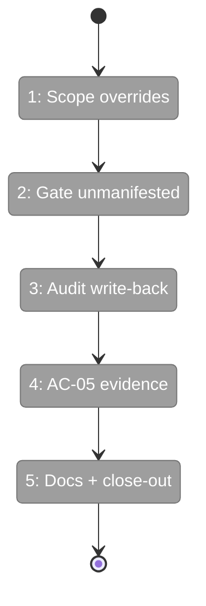
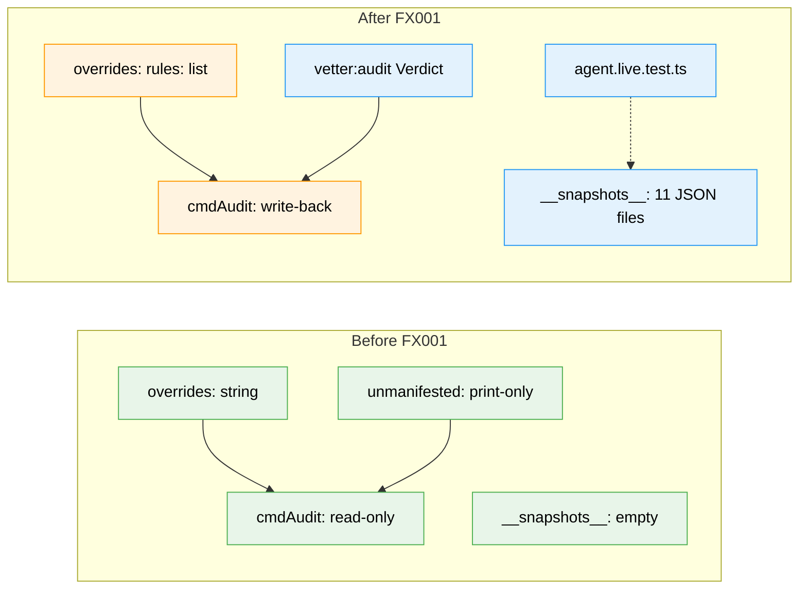

# Flight Plan: Fix FX001 — Audit-gate hardening

**Fix**: [FX001-audit-gate-hardening.md](./FX001-audit-gate-hardening.md)
**Status**: Ready
**Plan**: [extension-vetting-plan.md](../extension-vetting-plan.md)
**Source**: code-review agent run `2026-05-15T16-35-28-225Z-409b` — verdict `REQUEST_CHANGES`

---

## What → Why

**Problem**: Plan 009's supply-chain gate has four HIGH correctness gaps — over-broad overrides mask new findings, unmanifested installs don't gate audit exit, audit can't refresh stale `vetted.date`, and AC-05 detection/stability evidence was deferred.

**Fix**: Four targeted changes in `harness/scripts/packages.ts` + the package-vetter agent's snapshot evidence — no contract reshape.

---

## Domain Context

| Domain | Relationship | What Changes |
|---|---|---|
| `extension-authoring-harness` | modify | `packages.ts` (override scope, unmanifested→warn, audit write-back); `agents/package-vetter/__snapshots__/` (new live evidence); `agent.live.test.ts` (opt-in regression); `.pi/packages.yaml` (askuserquestion override reshape) |

No other domain touched. Contracts (`Verdict`, `Finding`, `Vetter`, `Entry.vetted`) extend rather than break.

---

## Flight Status

<!-- Updated by /plan-6-v2: pending → active → done. Use blocked for problems/input needed. -->

**Legend**: grey = pending | yellow = active | red = blocked/needs input | green = done

---

## Stages

<!-- Updated by /plan-6-v2 during implementation: [ ] → [~] → [x] -->

- [ ] **Stage 1: Scope `vetted.overrides` to a typed rule-slug set** — typed `{ rules: string[]; reason: string }`; single `parseOverrides()` helper used by all readers; reshape askuserquestion entry in same commit (`packages.ts`, `.pi/packages.yaml`, `override-scope.test.ts` — new file)
- [ ] **Stage 2: Convert unmanifested installs into warn findings** — `cmdAudit` synthesises a `vetter:audit` Verdict with `source: "<audit:unmanifested>"`; unexpected pi-list entries gate the exit code (`packages.ts`, `audit-unmanifested.test.ts` — new file)
- [ ] **Stage 3: Audit refresh write-back gated on RAW level=ok** — overrides age out; in-place `YAMLMap.set()` preserves comments; round-trip diff test (`packages.ts`, `audit-writeback.test.ts` — new file)
- [ ] **Stage 4: AC-05 live evidence with independent oracle** — staged-per-file corpus runs, 3-run median per package, workshop-001 rule cross-reference, opt-in live regression test, snapshot-staleness check in self-check (`agents/package-vetter/__snapshots__/` — new dir, `agent.live.test.ts` — new, `snapshot-refresh.ts` — new, execution log)
- [ ] **Stage 5: Docs + plan close-out** — `.pi/packages.yaml` schema-header + RUNBOOK document the new override shape; Plan 009 Validation Record + Flight Log carry FX001 close-out (`packages.yaml` header, `RUNBOOK.md`, `extension-vetting-plan.md`, `extension-vetting.fltplan.md`)

---

## Architecture: Before & After

**Legend**: existing (green, unchanged) | changed (orange, modified) | new (blue, created)

---

## Acceptance

- [ ] Override carrying `rules:["github-trust:no-license"]` does NOT mask a new `npm-audit:high` warn — `pkg audit` exits 2
- [ ] `piList()` returning one extra project-scope entry causes `pkg audit` to exit 2 with a `vetter:audit` warn Verdict
- [ ] Stale entry that re-vets ok gets its `vetted.date` advanced in `.pi/packages.yaml`
- [ ] `agents/package-vetter/__snapshots__/` carries ≥11 JSON files; corpus side shows ≥6/7 detection, package side shows ≤1 finding drift
- [ ] `PIJ_VET_LIVE=1 npx vitest run agent.live` passes
- [ ] `npm run self-check` still exits 0 with `PIJ_VET_SKIP_AGENT=1` (no regression)

## Goals & Non-Goals

**Goals**:
- Close 4 HIGH findings from the code-review agent run
- Make AC-04, AC-05, AC-10, AC-11 demonstrably true (not deferred)
- Preserve self-check determinism — live agent runs remain opt-in

**Non-Goals**:
- No new vetters (Tier-2 deferred per Plan 009 Non-Goals)
- No sandboxing (still Plan 009 Non-Goal)
- No change to `Verdict`/`Finding`/`Vetter` contracts (extend, don't break)
- No regex prompt-injection scanner (still Plan 009 Non-Goal)

---

## Checklist

- [ ] FX001-1: Scope `vetted.overrides` to a typed rule-slug set; reshape askuserquestion entry; single `parseOverrides()` helper
- [ ] FX001-2: Convert unmanifested project-scope installs into a `vetter:audit` warn Verdict with explicit synthetic `source`
- [ ] FX001-3: Audit refresh write-back gated on **raw** `verdict.level === "ok"`; in-place YAML mutation preserves comments
- [ ] FX001-4: AC-05 live evidence — staged corpus runs, 3-run median per package, workshop-001 oracle cross-reference, opt-in regression test, staleness alarm
- [ ] FX001-5: Docs + close-out — packages.yaml header, RUNBOOK section, Plan 009 Validation Record + Flight Log
