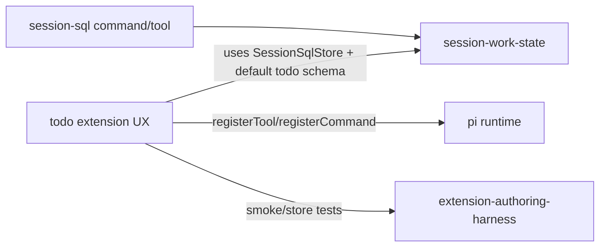

# Research Report: SQL-backed Todo Extension

**Generated**: 2026-05-15T06:25:47Z  
**Research Query**: "custom todo extension inspired by established pi todo extensions, but using our `session-sql` implementation"  
**Mode**: Pre-Plan  
**Location**: `docs/plans/010-sql-backed-todo-extension/research-dossier.md`  
**FlowSpace**: Not available in this session; used standard repo tools, GitHub CLI, local clones in `/tmp/pij-todo-research/`, and the live `sql` scratchpad.  
**Findings**: 37 synthesized findings

## Executive Summary

### What It Does

The proposed feature is a `todo` pi extension that provides an ergonomic task UI/tool layer while storing state in the existing `session-sql` SQLite database. The existing `session-sql` extension already owns session DB identity, persistence, default `todos` / `todo_deps` schema, row caps, and `/sql` debugging; the new todo extension should reuse that substrate instead of creating JSON, markdown, or tool-result-only persistence.

### Business Purpose

This turns `session-sql` from a generic workbench into a visible product experience: a todo dashboard/action layer for humans and agents. The sell is: **structured current-session state becomes both queryable (`sql`) and ergonomic (`todo`)**.

### Key Insights

1. **Best inspiration is `bwks/pi-todos` UX, not its storage**: steal statuses, assignees, `workon`, overlay, and renderers; replace project-local `.pi/todos.json` with session SQL.
2. **Do not split persistence**: if `/sql SELECT * FROM todos` and `/todo list` show different truth, the product becomes confusing. The SQL-backed todo extension must use the existing `todos` / `todo_deps` tables as source of truth.
3. **The main architecture decision is sharing `SessionSqlStore`**: todo can import the pi-free store from `session-sql`, but that turns `session-sql/store.ts` into a formal cross-extension contract that should be documented and tested.
4. **A small v1 is enough**: `/todo add|list|done|status|next|deps|clear` plus a model-facing `todo` tool gives most value; overlay UI and `workon` can be v1.1 if scope pressure appears.

### Quick Stats

- **External examples reviewed**: 5 repos / 10 core files.
- **Local components relevant**: `session-sql/store.ts`, `session-sql/index.ts`, `docs/how/session-sql.md`, domain docs, harness docs.
- **Test coverage pattern**: store tests for state logic; smoke through deterministic slash commands.
- **Complexity**: Medium (CS-2/CS-3): mostly CRUD/formatting, but cross-extension store dependency and UI rendering add risk.
- **Prior learnings surfaced**: 7 directly relevant gotchas.
- **Domains**: `session-work-state`, `agent-tooling-interface`, `extension-authoring-harness`.

## How Existing Todo Extensions Work

### Example Inventory

| Example | Source | Storage | Tool Surface | Command/UI | Key lesson |
|---------|--------|---------|--------------|------------|------------|
| `bwks/pi-todos` | `/tmp/pij-todo-research/pi-todos` / <https://github.com/bwks/pi-todos> | Project-local `.pi/todos.json` + migration fallback from tool history | One `todo` tool with `action` enum: `list`, `add`, `toggle`, `set_status`, `assign`, `workon`, `clear` | `/todo` popover + subcommands | Best UX/action model; storage not desired for pij. |
| `thegalexc/pi-extensions-oss/extensions/todo.ts` | `/tmp/pij-todo-research/pi-extensions-oss/extensions/todo.ts` | Tool result details replayed from branch history | One small `todo` tool: `list`, `add`, `toggle`, `clear` | `/todo` overlay | Minimal branch-aware reference; good for v1 simplicity. |
| `Fionoble/pi-status-line/todo` | `/tmp/pij-todo-research/pi-status-line/todo/index.ts` | Global markdown: `~/.pi/agent/todo.md` + done archive | One `todo` tool: add/complete/remove/list | Rich interactive UI, `/done`, `/briefing`, shortcut | Good section/dashboard/status ideas; too global for our current-session scope. |
| `5uck1ess/pikit` | `/tmp/pij-todo-research/pikit/src/todos` | Project memory store under `src/memory/store.js` | Split tools: `todo_add`, `todo_complete`, `todo_list` | `/todo add|done|list|clear` | Very simple command ergonomics; split tools are less attractive. |
| `IgorWarzocha/pi-todomaster` | `/tmp/pij-todo-research/pi-todomaster` | Markdown plan/spec files under `.pi/plans` | Command-oriented | `/todo` UI with completions | Ambitious plan/spec task manager; future inspiration, not v1. |

### Entry Points Observed

| Entry Point | Type | Location | Purpose |
|------------|------|----------|---------|
| `pi.registerTool({ name: "todo" })` | Model tool | `bwks/pi-todos/extensions/todos.ts`, `thegalexc/.../todo.ts`, `Fionoble/.../todo/index.ts` | Let the model mutate/list todos without raw file edits. |
| `pi.registerCommand("todo", ...)` | Slash command | all reviewed examples | Human-facing todo list and subcommands. |
| `pi.on("session_start", ...)` | Lifecycle | `bwks/pi-todos/extensions/todos.ts`, `thegalexc/.../todo.ts` | Rehydrate in-memory state before commands/tools use it. |
| `pi.on("before_agent_start", ...)` | Prompt hook | `bwks/pi-todos/extensions/todos.ts`, `Fionoble/.../todo/index.ts` | Add todo-specific guidance and/or guard storage internals. |
| `renderCall` / `renderResult` | Tool UI customization | `bwks/pi-todos/extensions/todos.ts`, `thegalexc/.../todo.ts` | Compact, readable tool transcript UI. |
| `ctx.ui.custom(...)` | TUI overlay | `bwks/pi-todos/extensions/todos.ts`, `thegalexc/.../todo.ts`, `Fionoble/.../todo/index.ts` | Interactive todo list. |

## Core Execution Flow to Emulate

### `bwks/pi-todos`: Rich action pipeline

1. Parse tool or command action.
   - File: `/tmp/pij-todo-research/pi-todos/src/todo-command.ts`
   - Actions: `add`, `list`, `assign`, `workon`, `status`, `done`, `clear`.
2. Load base state from storage.
   - File: `/tmp/pij-todo-research/pi-todos/src/todo-storage.ts`
   - Uses `.pi/todos.json`; normalizes legacy shape.
3. Apply pure todo action.
   - File: `/tmp/pij-todo-research/pi-todos/src/todo-state.ts`
   - Pure reducer returns `{ state, details, text }`.
4. Save state and update extension memory.
   - File: `/tmp/pij-todo-research/pi-todos/extensions/todos.ts`
   - `withFileMutationQueue(storagePath, async () => ...)` serializes file writes.
5. Render user/model result.
   - Same extension file, `renderCall`, `renderResult`, and `TodoListComponent`.

**For pij**: keep the pure reducer idea, but replace JSON load/save with SQL queries against `SessionSqlStore`.

### `thegalexc/pi-extensions-oss`: Minimal branch-aware session todo

1. On `session_start`/`session_tree`, scan `ctx.sessionManager.getBranch()` for prior `todo` tool results.
2. Use latest `details` snapshot as state.
3. Mutate local arrays in tool execution.
4. Store new snapshots in tool result details.

**For pij**: this is useful as a minimal v1 fallback, but `session-sql` makes replay unnecessary and more inspectable.

### `Fionoble/pi-status-line`: Operator dashboard feel

1. Inject prompt guidance so model knows todo list exists.
2. Parse markdown sections and checkbox items.
3. Render interactive sectioned list with keyboard navigation.
4. Maintain done archive and `/done` recap.
5. Register shortcut and briefing command.

**For pij**: steal dashboard/status ideas later, but avoid global `~/.pi/agent/todo.md` because Plan 006 intentionally scoped state to the current session.

## Proposed SQL-backed Architecture

### Product Shape

`session-sql` is the database; `todo` is the ergonomic layer.

```mermaid
graph LR
    Agent[LLM agent] --> TodoTool[todo tool]
    Human[Human operator] --> TodoCmd[/todo command]
    TodoTool --> TodoStore[TodoSqlStore]
    TodoCmd --> TodoStore
    TodoStore --> SessionSql[SessionSqlStore]
    SessionSql --> DB[(~/.pi/db/session-sql/<session>.sqlite)]
    Human --> SqlCmd[/sql debug]
    SqlCmd --> SessionSql
```

### Recommended File Layout

Use T2 layout:

```text
.pi/extensions/todo/
  AGENTS.md
  index.ts        # pi lifecycle, todo tool, /todo command, optional renderers
  store.ts        # pi-free TodoSqlStore wrapping SessionSqlStore
  store.test.ts   # real temp SQLite tests using SessionSqlStore memory/file location
  smoke.ts        # /todo add -> /todo list -> /reload -> /todo list
```

### Store Boundary

`todo/store.ts` should be pi-free and can wrap the existing SQL store:

```ts
import { type SessionSqlLocation, SessionSqlStore } from "../session-sql/store.js";
```

This makes `session-sql/store.ts` a consumed contract. If that feels too coupled, extract the store into a shared module later, but do not duplicate the SQLite implementation in v1.

### Data Model Options

#### Option A — Use existing default schema only (recommended v1)

Use `todos` and `todo_deps` exactly as created by `session-sql`:

```text
todos(id, title, description, status, priority, created_at, updated_at)
todo_deps(todo_id, depends_on)
```

Map UX terms:

| UX Action | SQL operation |
|-----------|---------------|
| add | `INSERT INTO todos(title, description, status, priority) ...` |
| list | `SELECT ... FROM todos ORDER BY status, priority DESC, id` |
| done | `UPDATE todos SET status='done', updated_at=CURRENT_TIMESTAMP WHERE id=?` |
| block | `UPDATE todos SET status='blocked', description=...` |
| start/workon | `UPDATE todos SET status='in_progress' ...` |
| next | dependency-aware ready query from workshop 007 |
| deps | `INSERT INTO todo_deps(todo_id, depends_on)` |
| clear | confirm, then `DELETE FROM todos` |

Pros: no schema migration; `/sql` and `/todo` naturally agree.  
Cons: no assignee/tag/category columns yet.

#### Option B — Add optional companion table (good v1.1)

Keep base todos, add metadata:

```sql
CREATE TABLE IF NOT EXISTS todo_meta (
  todo_id INTEGER PRIMARY KEY REFERENCES todos(id) ON DELETE CASCADE,
  assignee TEXT,
  tags TEXT,
  category TEXT,
  updated_at TEXT NOT NULL DEFAULT CURRENT_TIMESTAMP
);
```

Pros: supports `bwks` assignees/categories without altering default schema.  
Cons: `/sql SELECT * FROM todos` does not show full UX state unless joined.

#### Option C — Alter default `todos` table (defer)

`ALTER TABLE todos ADD COLUMN assignee TEXT`, etc.  
Avoid in v1: it turns the todo extension into a migration owner for the session-sql default schema.

## Findings

### IA-01: `bwks/pi-todos` has the best action vocabulary

**Evidence**: `/tmp/pij-todo-research/pi-todos/src/todo-state.ts`, `/tmp/pij-todo-research/pi-todos/src/todo-command.ts`  
**Description**: It supports `list`, `add`, `toggle`, `set_status`, `assign`, `workon`, and `clear`. This is richer than a checkbox list but still small enough for a single model-facing tool.  
**Recommendation**: Use a similar action enum but map statuses to the session-sql default: `pending`, `in_progress`, `blocked`, `done`. Defer `cancelled` or model it as delete/description until schema evolves.

### IA-02: Pure reducer pattern is worth copying

**Evidence**: `applyTodoAction(state, input)` in `bwks/pi-todos/src/todo-state.ts`  
**Description**: Pure state logic is easy to test and returns user text plus structured details.  
**Recommendation**: Build `TodoSqlStore` methods as pure-ish tagged operations over SQL: `add`, `list`, `setStatus`, `next`, `addDep`, `clear`. Test `store.ts`, not pi wiring.

### IA-03: Project-local JSON storage conflicts with pij's desired scope

**Evidence**: `bwks/pi-todos/README.md`, `src/todo-storage.ts`  
**Description**: `bwks` intentionally stores `.pi/todos.json` in the repo so todos are shared across sessions in the same project. Plan 006's contract says session SQL is private to the current session and outside repo files.  
**Recommendation**: Do not use `.pi/todos.json`. Use `~/.pi/db/session-sql/<session>.sqlite` through `SessionSqlStore`.

### IA-04: File guards are unnecessary if storage is not a file in the repo

**Evidence**: `/tmp/pij-todo-research/pi-todos/src/todo-guard.ts` and `extensions/todos.ts` `tool_call` guard  
**Description**: `bwks` blocks raw read/write/edit of `.pi/todos.json` unless the user explicitly asks.  
**Recommendation**: SQL-backed todo does not need read/write/edit guards because no repo-local todo file exists. Instead, docs/tool prompt should say `/sql` is the raw inspection surface.

### IA-05: `workon` can trigger actual work

**Evidence**: `buildWorkonPrompt()` in `bwks/pi-todos/src/todo-command.ts`; `pi.sendUserMessage(buildWorkonPrompt(updatedTodo))` in `extensions/todos.ts`  
**Description**: `/todo workon <id>` marks a todo in progress and sends a follow-up user message.  
**Recommendation**: Consider `workon` for v1 only if it can be made deterministic in smoke. Otherwise implement `/todo next` first and add `workon` in v1.1.

### IA-06: Minimal `thegalexc` implementation proves a small v1 is acceptable

**Evidence**: `/tmp/pij-todo-research/pi-extensions-oss/extensions/todo.ts`  
**Description**: A useful todo extension can be one file with a tool, command, renderer, and branch restoration.  
**Recommendation**: Avoid overbuilding. A SQL-backed v1 can skip custom overlay and still be valuable if `/todo list` is clear and `/sql` remains inspectable.

### IA-07: `Fionoble` shows the appeal of sections and briefings, but scope differs

**Evidence**: `/tmp/pij-todo-research/pi-status-line/todo/index.ts`  
**Description**: Sections, done recaps, stale/overdue markers, and briefing commands make a personal task manager compelling.  
**Recommendation**: Treat categories/briefings as future global todo product, not current-session todo v1.

### IA-08: `pikit` split tools are simple but increase tool clutter

**Evidence**: `/tmp/pij-todo-research/pikit/src/todos/tools.ts`  
**Description**: `todo_add`, `todo_complete`, and `todo_list` are easy for the model to call, but add several tools.  
**Recommendation**: Prefer one `todo` tool with an `action` enum to keep the tool surface compact and mirror existing `bwks`/`thegalexc` conventions.

### DC-01: The proposed extension depends on `session-sql` as a storage contract

**Evidence**: `.pi/extensions/session-sql/store.ts`  
**Description**: `SessionSqlStore` provides `open`, `execute`, `schema`, `reset`, `status`, path helpers, row caps, and native extension support.  
**Risk**: Cross-extension import from `../session-sql/store.js` is technically simple but formalizes a dependency that the domain map should acknowledge.  
**Recommendation**: Add `session-sql store API` as a contract in `session-work-state` if the plan proceeds.

### DC-02: The default schema already contains todo primitives

**Evidence**: `.pi/extensions/session-sql/store.ts` `DEFAULT_SCHEMA_SQL`; `docs/how/session-sql.md`  
**Description**: `todos` and `todo_deps` are created on every session DB.  
**Recommendation**: Do not create a separate todo table in v1. Use the defaults.

### DC-03: Same-session persistence is already solved

**Evidence**: Plan 006 validation and `docs/how/session-sql.md`  
**Description**: `session-sql` persists across reload/resume/process exit and starts fresh for new/fork.  
**Recommendation**: Todo extension should not replay tool history or use `appendEntry` for durable state. It should reopen the same SQL DB on `session_start`.

### DC-04: Multiple connections to the same SQLite file are plausible but should be tested

**Evidence**: proposed `todo` importing and opening its own `SessionSqlStore` while `session-sql` extension also has one open.  
**Description**: Node `DatabaseSync` can open the same file more than once, but write contention and timeout behavior should be validated.  
**Recommendation**: Add store tests or smoke that load both extensions and mutate via `/todo`, then inspect via `/sql`.

### PS-01: Keep T2 layout and pi-free store pattern

**Evidence**: `AGENTS.md` P1/P2/P8; `session-sql` implementation  
**Recommendation**: `.pi/extensions/todo/store.ts` should import no pi APIs and be tested directly. `index.ts` should own all TypeBox, command parsing, UI, and `pi.sendUserMessage` behavior.

### PS-02: Use tagged union returns, not throws

**Evidence**: `SessionSqlStore` result types; project patterns P4  
**Recommendation**: Todo store methods should return e.g. `{ ok: true, todo } | { ok: false, reason, message }`. `index.ts` formats errors.

### PS-03: Use command parsing as a testable pure function

**Evidence**: `bwks/pi-todos/src/todo-command.ts` and `tests/todo-command.test.ts`  
**Recommendation**: Put parsing helpers in `store.ts` only if pi-free, or a separate pi-free `store.ts` section; test `/todo add`, `done`, `status`, `dep`, `next`, invalid ids, invalid status.

### PS-04: Avoid hardcoded keybindings unless configurable

**Evidence**: project AGENTS rule; external examples hardcode overlay keys like escape/q/tab.  
**Recommendation**: If v1 ships an overlay, use configurable matching object or defer overlay. A command-only v1 avoids this risk.

### QT-01: Strong external tests exist for pure todo state

**Evidence**: `bwks/pi-todos/tests/todo-state.test.ts`, `todo-command.test.ts`, `todo-storage.test.ts`  
**Recommendation**: Match this testing style with Vitest store tests in pij: add/list/status/deps/next/clear/persistence/error cases.

### QT-02: Smoke should prove `/todo` and `/sql` agree

**Evidence**: session-sql smoke proves `/sql` across reload.  
**Recommendation**: Todo smoke should do: `/todo add X` → `/todo list` → `/sql SELECT title FROM todos WHERE title=X` → `/reload` → `/todo list`.

### QT-03: Test dependency-aware `next`

**Evidence**: `todo_deps` default schema and workshop 007 ready-query.  
**Recommendation**: Store tests should insert A/B dependency and prove `/todo next` excludes blocked-by-dependency tasks until prerequisites are done.

### IC-01: Recommended model-facing tool contract

Use one `todo` tool:

```ts
{
  action: "list" | "add" | "done" | "status" | "block" | "next" | "dep" | "clear";
  id?: number;
  text?: string;
  status?: "pending" | "in_progress" | "blocked" | "done";
  priority?: number;
  dependsOn?: number;
}
```

Rationale: combines `bwks` richness with session-sql's status vocabulary.

### IC-02: Recommended slash command contract

```text
/todo                       # list open todos
/todo list [all|done|open]
/todo add <title>
/todo done <id>
/todo status <id> <pending|in_progress|blocked|done>
/todo block <id> [reason]
/todo next
/todo dep <id> <depends_on_id>
/todo clear                 # confirm first
```

Keep `/sql` as raw debug/escape hatch.

### IC-03: `/todo clear` must confirm

**Evidence**: session-sql `/sql reset` asks confirmation; project safety pattern.  
**Recommendation**: Use `ctx.ui.confirm` for destructive clear. Do not include clear in smoke unless confirmation can be deterministic.

### DE-01: Docs should position todo as a view over SQL

**Evidence**: user explicitly wants SQL-backed todo; Plan 006 docs frame SQL as structured work state.  
**Recommendation**: README/how-to should say: `todo` is an ergonomic layer over `session-sql` default tables. Advanced users can inspect and repair state with `/sql`.

### DE-02: External todo repos favor docs-first discoverability

**Evidence**: `bwks/pi-todos/README.md` gives install, usage, command examples, how-it-works.  
**Recommendation**: Add `docs/how/todo.md` with commands, SQL backing, examples, and relationship to `/sql`.

## Prior Learnings

### PL-01: `setStatus(key, "")` leaves an empty footer pill

**Source**: `docs/difficulties.md` D-006  
**Relevance**: A todo extension likely wants status like `todo: 3 open`.  
**Action**: Clear with `undefined`, not `""`; smoke should tolerate footer status via D-024 fix.

### PL-02: `ctx.ui.notify(..., "success")` is invalid

**Source**: `docs/difficulties.md` D-018  
**Relevance**: External todo examples from older pi packages use `"success"`.  
**Action**: Use only `"info" | "warning" | "error"`.

### PL-03: `limit === 0` needs explicit handling

**Source**: `docs/difficulties.md` D-019  
**Relevance**: `/todo list --limit 0` or tool `maxRows: 0` could otherwise show all rows.  
**Action**: If any list limit exists, short-circuit zero and negative limits.

### PL-04: NodeNext requires `.js` relative imports

**Source**: `docs/difficulties.md` D-003  
**Action**: Imports like `../session-sql/store.js`, not `.ts` or extensionless.

### PL-05: Vitest needs the `node:sqlite` shim

**Source**: `docs/difficulties.md` D-022  
**Relevance**: Todo store tests that import `SessionSqlStore` transitively import `node:sqlite`.  
**Action**: Existing `vitest.config.ts` is now a prerequisite; keep tests inside current harness.

### PL-06: Generated smoke template is now fixed, but use current `Scenario` shape

**Source**: `docs/difficulties.md` D-023  
**Action**: New todo smoke should use `kind: "type"`, `press`, and `expect`, not legacy `{ send, delay }`.

### PL-07: `SessionSqlStore.execute()` multi-statement gotcha was just fixed

**Source**: `docs/plans/006-generic-sqlite-session-tool/reviews/fix-tasks.md` and execution log  
**Relevance**: Todo store may use batched SQL for setup or clear/deps.  
**Action**: It is now safe to use trusted multi-statement batches, but tests should verify exact results.

## Domain Context

| Domain | Relationship | Relevant Contracts | Action |
|--------|--------------|-------------------|--------|
| `session-work-state` | Primary storage provider | `SessionSqlStore`, `SessionSqlLocation`, default `todos`/`todo_deps`, result caps | Extend domain doc to list `todo` as a consumer of the store contract. |
| `agent-tooling-interface` | Primary UX domain | Tool/command formatting, prompt guidance, smoke-visible output | Add todo command/tool contract if built. |
| `extension-authoring-harness` | Validation provider | generator, store tests, smoke, self-check, difficulties/velocity | Use T2 generator and smoke harness. |

### Domain Map Position

`todo` should sit in `agent-tooling-interface` as a UX layer consuming `session-work-state`:



### Potential Domain Actions

- Formalize `SessionSqlStore` as a cross-extension contract before importing it from `todo`.
- Add `todo` source locations to `agent-tooling-interface` if implemented.
- Keep no new domain for v1; it is an application of existing session-work-state + tooling-interface domains.

## Critical Discoveries

### Critical Finding 01: The todo extension must not create a second source of truth

**Impact**: High  
**What**: External examples use file, markdown, or tool-result storage; our requirement is to use `session-sql`.  
**Why It Matters**: If `/todo` and `/sql` disagree, the core product story breaks.  
**Required Action**: Store all v1 todo state in `todos`/`todo_deps`; any metadata must be joined back to those rows.

### Critical Finding 02: Cross-extension store import needs to become a contract

**Impact**: High  
**What**: Reusing the implementation likely means importing `../session-sql/store.js`.  
**Why It Matters**: This is clean technically but is currently an internal file path.  
**Required Action**: Plan should update domain docs and tests to treat `SessionSqlStore` as a consumed contract, or extract a shared module.

### Critical Finding 03: Existing default status vocabulary differs from best external UX

**Impact**: Medium  
**What**: `bwks` uses `unassigned`, `assigned`, `in_progress`, `blocked`, `done`, `cancelled`; session-sql uses `pending`, `in_progress`, `done`, `blocked`.  
**Required Action**: v1 should use session-sql vocabulary to avoid migrations; model `assign`/`cancelled` later via metadata if needed.

## Modification Considerations

### Safe to Modify

1. **New `.pi/extensions/todo/` T2 extension**: isolated, generator-supported.
2. **Docs/how + README mention**: low risk, user-facing discoverability.
3. **Domain docs/map**: expected if cross-extension store contract is formalized.

### Modify with Caution

1. **`session-sql/store.ts` public surface**: consumers may rely on it; avoid breaking `execute()` or location helpers.
2. **Default schema**: adding columns to `todos` should be a separate schema-migration decision.
3. **Overlay UI**: keybindings and TUI custom components can add scope and test brittleness.

### Danger Zones

1. **Duplicating SQLite code**: violates “use our SQL impl.”
2. **Repo-local todo files**: conflicts with Plan 006 storage boundary.
3. **Global persistent todo**: Fionoble-style global todos are useful but not the same product as session SQL.

## Recommended v1 Scope

### Build

- New extension: `.pi/extensions/todo/`.
- Store: `TodoSqlStore` wrapping `SessionSqlStore`.
- Use default `todos` / `todo_deps` only.
- Tool: one `todo` action tool.
- Command: `/todo` with subcommands.
- Status: optional `todo: N open`; clear with `undefined`.
- Docs: `docs/how/todo.md`.
- Smoke: add/list/sql-inspect/reload/list.

### Defer

- Overlay UI.
- Assignees/categories/tags unless added through a companion `todo_meta` table.
- Global todo list / briefing / done archive.
- Keyboard shortcuts.
- Direct integration with subagents.

## External Research Opportunities

No blocking external research gaps remain. GitHub CLI/source review found enough pi-specific todo implementations for architecture planning.

Optional future research if scope grows:

### Research Opportunity 1: Best practices for task dependency UX in agent CLIs

**Why Needed**: If `/todo next` becomes a major feature, external task managers may have better dependency visualization patterns.  
**Impact on Plan**: Could influence overlay UI and dependency commands.  
**Ready-to-use prompt**:

```text
/deepresearch "Research task dependency UX patterns in CLI/TUI task managers and agent coding assistants. Context: pij is building a pi todo extension backed by SQLite tables todos/todo_deps. We need compact commands and optional TUI display for pending, blocked, and ready work. Focus on dependency visualization, next-task selection, blocked reasons, and status vocabularies."
```

## Appendix: File Inventory

### Local source of truth

| File | Purpose |
|------|---------|
| `.pi/extensions/session-sql/store.ts` | SQLite store, default schema, execution, caps. |
| `.pi/extensions/session-sql/index.ts` | Existing `sql` tool and `/sql` command. |
| `docs/how/session-sql.md` | Operator/agent guide for SQL workspace. |
| `docs/domains/session-work-state/domain.md` | Storage domain contract. |
| `docs/domains/agent-tooling-interface/domain.md` | Tool/command UX domain. |
| `docs/project-rules/harness.md` | BIO harness validation contract. |

### External examples cloned to `/tmp/pij-todo-research`

| Repo | Files read |
|------|------------|
| `bwks/pi-todos` | `README.md`, `extensions/todos.ts`, `src/todo-state.ts`, `src/todo-command.ts`, `src/todo-storage.ts`, `src/todo-sync.ts`, `src/todo-guard.ts`, `src/todo-ui.ts`, tests. |
| `thegalexc/pi-extensions-oss` | `extensions/todo.ts`. |
| `Fionoble/pi-status-line` | `todo/index.ts`. |
| `5uck1ess/pikit` | `src/todos/tools.ts`, `src/todos/manager.ts`, `src/todos/manager.test.ts`. |
| `IgorWarzocha/pi-todomaster` | `src/app/command/index.ts`. |

## Next Steps

1. Run `/plan-1b-specify "SQL-backed todo extension over session-sql"`.
2. In the spec, decide whether v1 includes only command/tool or also overlay UI.
3. In architecture, explicitly choose one of:
   - import `SessionSqlStore` as a formal contract, or
   - extract shared session SQL store module before building todo.
4. Workshop likely useful before implementation: command/tool UX and SQL dependency semantics.

**Research Complete**: 2026-05-15T06:25:47Z  
**Report Location**: `docs/plans/010-sql-backed-todo-extension/research-dossier.md`
