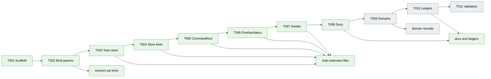

# SQL-backed Todo Extension Implementation Plan

**Mode**: Simple  
**Plan Version**: 1.0.0  
**Created**: 2026-05-15  
**Spec**: [sql-backed-todo-extension-spec.md](./sql-backed-todo-extension-spec.md)  
**Status**: DRAFT

## Summary

Build a first-party `todo` extension that gives humans and agents a full current-session task UX while keeping the existing SQL session work state as the source of truth. The implementation uses a pi-free todo store over the existing `SessionSqlStore`, then wires slash command, model tool, overlay, status signal, smoke, docs, and domain records. The expected outcome is that `/todo`, the `todo` tool, overlay, and `/sql` all show the same todo state across reload/resume, without project-local or global todo storage.

## Target Domains

| Domain | Status | Relationship | Role |
|--------|--------|--------------|------|
| `session-work-state` | existing | modify | Extend/reuse the current-session SQL store contract and default todo/dependency schema as canonical backing state. |
| `agent-tooling-interface` | existing | modify | Add the `/todo` command, `todo` model tool, overlay, status signal, result text, prompt guidance, and docs. |
| `extension-authoring-harness` | existing capability | consume | Use generator, store tests, smoke, self-check, difficulty ledger, and velocity logging. |

## Architecture Map



## Agent Harness Strategy

- **Current Maturity**: L2
- **Target Maturity**: L2
- **Boot Command**: `npm install`
- **Health Check**: `npm run self-check`
- **Interaction Model**: Terminal/TUI via `pi`; automated tmux smoke via `npm run smoke -- todo`
- **Evidence Capture**: terminal output from typecheck/lint/test/smoke/self-check plus smoke assertions
- **Pre-Phase Validation**: run the health check before implementation; if it fails from harness causes, fix the harness first or record unrelated pre-existing failures before proceeding.

## Domain Manifest

| File | Domain | Classification | Rationale |
|------|--------|----------------|-----------|
| `/Users/jordanknight/pi-hacking/pij/.pi/extensions/todo/AGENTS.md` | `agent-tooling-interface` | internal | Extension-local guidance for the todo UX implementation. |
| `/Users/jordanknight/pi-hacking/pij/.pi/extensions/todo/index.ts` | `agent-tooling-interface` | internal | Pi wiring for lifecycle, command, tool, overlay, status, and prompt guidance. |
| `/Users/jordanknight/pi-hacking/pij/.pi/extensions/todo/store.ts` | `session-work-state` | internal | Pi-free todo operations over the canonical SQL work-state schema. |
| `/Users/jordanknight/pi-hacking/pij/.pi/extensions/todo/store.test.ts` | `extension-authoring-harness` | internal | Store-level validation using real temporary SQLite/session stores. |
| `/Users/jordanknight/pi-hacking/pij/.pi/extensions/todo/smoke.ts` | `extension-authoring-harness` | internal | Deterministic TUI smoke proving `/todo`, overlay, `/sql`, and reload behavior. |
| `/Users/jordanknight/pi-hacking/pij/.pi/extensions/session-sql/store.ts` | `session-work-state` | contract | Extend the reusable store contract with safe parameter binding for first-party consumers. |
| `/Users/jordanknight/pi-hacking/pij/.pi/extensions/session-sql/store.test.ts` | `session-work-state` | internal | Regression coverage for the extended store contract. |
| `/Users/jordanknight/pi-hacking/pij/README.md` | `agent-tooling-interface` | cross-domain | Quick-start docs connecting `/todo` and `/sql`. |
| `/Users/jordanknight/pi-hacking/pij/docs/how/todo.md` | `agent-tooling-interface` | internal | Detailed user/agent guide for SQL-backed todos. |
| `/Users/jordanknight/pi-hacking/pij/docs/domains/session-work-state/domain.md` | `session-work-state` | contract | Document todo as a first-party consumer of the store/default schema contract. |
| `/Users/jordanknight/pi-hacking/pij/docs/domains/agent-tooling-interface/domain.md` | `agent-tooling-interface` | contract | Document todo command/tool/overlay/status UX contracts. |
| `/Users/jordanknight/pi-hacking/pij/docs/domains/domain-map.md` | `session-work-state` / `agent-tooling-interface` | cross-domain | Record todo UX as another consumer of session work state. |
| `/Users/jordanknight/pi-hacking/pij/docs/domains/registry.md` | `session-work-state` / `agent-tooling-interface` | cross-domain | Add a history row if domain responsibilities change. |
| `/Users/jordanknight/pi-hacking/pij/docs/difficulties.md` | `extension-authoring-harness` | cross-domain | Record any implementation friction and encoded fixes. |
| `/Users/jordanknight/pi-hacking/pij/docs/velocity.md` | `extension-authoring-harness` | cross-domain | Record phase output for compounding evidence. |
| `/Users/jordanknight/pi-hacking/pij/docs/plans/010-sql-backed-todo-extension/execution.log.md` | `extension-authoring-harness` | internal | Phase execution evidence and validation notes. |
| `/Users/jordanknight/pi-hacking/pij/package.json` | `extension-authoring-harness` | contract | Validation scripts consumed by the final check task. |

## Key Findings

| # | Impact | Finding | Action |
|---|--------|---------|--------|
| 01 | Critical | `session-work-state` already owns session DB identity and default `todos` / `todo_deps`; building separate todo persistence would create a second source of truth. | All todo state must live in the current session SQL DB; smoke must prove `/todo` and `/sql` agreement. |
| 02 | High | `SessionSqlStore` is reusable but currently exposes string-query execution only, which would push todo code toward unsafe interpolation. | Extend the store contract with parameter binding or a narrow prepared-statement helper before implementing `TodoSqlStore`. |
| 03 | High | Pi supports overlays through `ctx.ui.custom(..., { overlay: true })` with injected `theme` and `keybindings`. | Implement the smallest deterministic overlay using existing TUI primitives; avoid full-screen snapshot tests. |
| 04 | High | Extension shortcuts register raw key ids and can conflict with built-ins; project rules forbid hardcoded keybindings. | Use named `DEFAULT_TODO_KEYBINDINGS` constants and injected matching; register any global shortcut only through that configurable surface and avoid reserved defaults. |
| 05 | High | SQLite constraints already enforce canonical statuses, foreign keys, duplicate dependency primary key, and self-dependency checks. | Prevalidate for friendly errors, but rely on the canonical schema for integrity and add regression tests. |
| 06 | High | The existing L2 harness can scaffold, test, smoke, and self-check this extension. | Do not add a harness-building phase; consume the existing harness and only fix harness friction if smoke exposes a real bug. |

## Implementation

**Objective**: Deliver the SQL-backed todo extension in one simple-mode implementation pass while preserving existing domain boundaries.

**Testing Approach**: Hybrid. Use direct store tests with real temporary SQLite/session stores for state and dependency semantics, avoid mocks, and use deterministic smoke for pi command/overlay/SQL agreement.

### Tasks

| Status | ID | Task | Domain | Path(s) | Done When | Notes |
|--------|----|------|--------|---------|-----------|-------|
| [x] | T001 | Pre-flight harness check and scaffold `todo` with the generator. | `extension-authoring-harness` | `/Users/jordanknight/pi-hacking/pij/.pi/extensions/todo/` | `npm run new -- todo` has created T2 layout, pre-existing harness state is known, and generated files are ready to replace. | Use generator; do not hand-roll boilerplate. |
| [x] | T002 | Extend `SessionSqlStore` with safe bind-parameter support for first-party consumers. | `session-work-state` | `/Users/jordanknight/pi-hacking/pij/.pi/extensions/session-sql/store.ts`, `/Users/jordanknight/pi-hacking/pij/.pi/extensions/session-sql/store.test.ts` | Store supports bound positional/named parameters without breaking existing `/sql`; regression tests cover select, mutation, returning rows, and prior multi-statement behavior. | Finding 02. Use typed bind values; no `any`. |
| [x] | T003 | Implement pi-free `TodoSqlStore`, types, constants, command parser helpers, and formatters. | `session-work-state` | `/Users/jordanknight/pi-hacking/pij/.pi/extensions/todo/store.ts` | Store imports no pi APIs, wraps `SessionSqlStore`, exposes tagged-union results, and implements add/list/status/block/done/dep/next/counts/clear. | Use `todos` and `todo_deps` only; include `DEFAULT_TODO_KEYBINDINGS` if overlay matching lives in store. |
| [x] | T004 | Add store tests for data contract and dependency semantics. | `extension-authoring-harness` | `/Users/jordanknight/pi-hacking/pij/.pi/extensions/todo/store.test.ts` | Tests cover workshop matrices: SQL agreement both directions, invalid SQL-created rows, statuses, priority ordering, deps, duplicate/self/missing deps, limit zero, clear, and persistence reopen. | Avoid mocks; use temp SQLite/session locations. |
| [x] | T005 | Wire `/todo` command and `todo` model tool. | `agent-tooling-interface` | `/Users/jordanknight/pi-hacking/pij/.pi/extensions/todo/index.ts` | `/todo` supports list/add/done/status/block/dep/next/clear/overlay/help; `todo` tool supports matching action enum; clear confirms through UI; outputs use workshop anchors. | Use `StringEnum` for action/status enums when needed. |
| [x] | T006 | Implement overlay, status signal, and configurable key matching. | `agent-tooling-interface` | `/Users/jordanknight/pi-hacking/pij/.pi/extensions/todo/index.ts`, `/Users/jordanknight/pi-hacking/pij/.pi/extensions/todo/store.ts` | `/todo overlay` renders current todos via `ctx.ui.custom` overlay; status shows `todo: N open`; zero open clears with `undefined`; overlay keys use named defaults rather than inline literals. | Finding 03/04; global shortcut is optional unless conflict-safe. |
| [x] | T007 | Add deterministic smoke scenario. | `extension-authoring-harness` | `/Users/jordanknight/pi-hacking/pij/.pi/extensions/todo/smoke.ts` | `npm run smoke -- todo` drives empty list, add, list, `/sql` agreement, overlay anchor, reload, and post-reload list. | Use current Driver SDK `Scenario` / `Step` union shape. |
| [x] | T008 | Add extension-local guidance and user docs. | `agent-tooling-interface` | `/Users/jordanknight/pi-hacking/pij/.pi/extensions/todo/AGENTS.md`, `/Users/jordanknight/pi-hacking/pij/README.md`, `/Users/jordanknight/pi-hacking/pij/docs/how/todo.md` | README has quick start; how-to has command/tool/status/dependency/overlay/SQL examples; AGENTS documents extension-local constraints. | Hybrid docs from clarification. |
| [ ] | T009 | Update domain records for the todo consumer and store contract. | `session-work-state` / `agent-tooling-interface` | `/Users/jordanknight/pi-hacking/pij/docs/domains/session-work-state/domain.md`, `/Users/jordanknight/pi-hacking/pij/docs/domains/agent-tooling-interface/domain.md`, `/Users/jordanknight/pi-hacking/pij/docs/domains/domain-map.md`, `/Users/jordanknight/pi-hacking/pij/docs/domains/registry.md` | Domain docs mention todo source locations, contracts, and relationship to `SessionSqlStore`; map/history reflects todo as an additional UX consumer. | Finding 01/02/06. |
| [ ] | T010 | Capture execution evidence, velocity, and difficulties. | `extension-authoring-harness` | `/Users/jordanknight/pi-hacking/pij/docs/plans/010-sql-backed-todo-extension/execution.log.md`, `/Users/jordanknight/pi-hacking/pij/docs/difficulties.md`, `/Users/jordanknight/pi-hacking/pij/docs/velocity.md` | Execution log records task progress and validation outputs; difficulties are logged with workarounds/encoded fixes if encountered; velocity has phase row. | Harness is the product. |
| [ ] | T011 | Run full validation. | `extension-authoring-harness` | `/Users/jordanknight/pi-hacking/pij/package.json`, `/Users/jordanknight/pi-hacking/pij/.pi/extensions/todo/` | `npm run typecheck`, `npm test`, `npm run lint`, `npm run smoke -- todo`, and `npm run self-check` pass or any pre-existing unrelated failure is documented. | Include known Biome schema info only if still non-failing. |

### Acceptance Criteria

- [ ] A human can run a todo command that shows the current-session todo list, including empty-state text when no todos exist.
- [ ] A human can add a todo item and immediately see it in the todo list with a stable identifier and status.
- [ ] A model can use a todo action surface to add, list, update, and complete todo items without writing raw SQL for routine operations.
- [ ] A human can open an interactive todo overlay that renders the same current-session todos as the command list.
- [ ] The todo extension exposes a status signal that summarizes open work without leaving a stale empty status pill.
- [ ] Any keyboard shortcut or key matching introduced by the overlay is configurable rather than hardcoded.
- [ ] A todo added through the todo UX is visible through the existing SQL inspection surface in the same session.
- [ ] A todo row created through the SQL inspection surface is reflected by the todo list when it uses the supported todo schema.
- [ ] Todo state survives reload/resume of the same session.
- [ ] New or forked sessions begin with independent todo state except for the default empty schema.
- [ ] A human or model can mark a todo as done, blocked, pending, or in progress, and the list output reflects the change.
- [ ] A human or model can express that one todo depends on another, and the next-ready view excludes blocked-by-dependency items until prerequisites are done.
- [ ] Destructive clearing of todos requires explicit confirmation and does not run accidentally from a bare list command.
- [ ] Todo output remains compact enough for TUI/model use and gives stable phrases suitable for smoke assertions.
- [ ] README quick-start and `docs/how/todo.md` explain the relationship between the todo UX and SQL-backed session work state.
- [ ] Validation includes store-level tests, command/overlay smoke, type-checking, linting, and the existing self-check path.
- [ ] The domain map and relevant domain docs identify todo as a consumer/user-facing layer over session work state.

### Discoveries & Learnings

| ID | Task | Discovery | Action |
|----|------|-----------|--------|
| D010-001 | T001 | Pre-phase harness validation passed before implementation; existing known Biome schema info and Node SQLite warning are non-failing. | Proceed with implementation and keep final validation evidence explicit. |
| D010-002 | T001 | The generated extension scaffold is event-log based and intentionally disposable for this plan's SQL-backed store shape. | Keep the generator-created T2 layout, then replace store semantics in T003 rather than hand-rolling files. |
| D010-003 | T002 | `node:sqlite` supports positional and named binding on prepared statements, but multi-statement batches cannot be safely parameterized through `db.exec()`. | Support bind params only for single prepared statements and return a tagged sqlite error for bound multi-statement batches. |
| D010-004 | T002 | The branch advanced to an unrelated `HEAD` between commit and companion ping, so `git rev-parse HEAD` can be unsafe in concurrent sessions. | Use the SHA printed by `git commit` or resolve the intended commit explicitly before future companion pings. |
| D010-005 | T003 | Full `npm run typecheck` is currently blocked by non-todo harness/package type errors in `harness/driver/index.ts` and `harness/scripts/packages.ts`; todo store itself compiles under test and no longer appears in typecheck diagnostics. | Track as validation debt for T011 unless touched earlier by companion findings or harness-required fixes. |
| D010-006 | T004 | The existing schema already prevents invalid statuses and missing dependency edges, so invalid SQL-created-row coverage focuses on tolerated empty titles plus SQL-created supported rows. | Let the canonical session SQL constraints carry integrity and keep todo normalization defensive for display. |
| D010-007 | T005 | Opening a separate `SessionSqlStore` connection in `todo` keeps the extension independent from `session-sql` wiring while sharing the same session DB path. | Reuse `locationForSession(sessionId, defaultRootDir())` so `/todo` and `/sql` converge on the same file-backed source of truth. |
| D010-008 | T006 | `ctrl+t` is reserved by core thinking/tool filters, so the workshop's example shortcut would conflict. | Use a named default `ctrl+shift+y` for global open-overlay registration and keep all overlay keys in `DEFAULT_TODO_KEYBINDINGS`. |
| D010-009 | T007 | Smoke matched the `/reload` notification before pi was fully idle, so the immediate post-reload `/todo list` assertion raced. | Add an explicit Driver SDK `wait` step after `/reload` before issuing the post-reload command. |
| D010-010 | T008 | Todo docs need to explain both routine UX and raw SQL agreement, otherwise users may treat `/todo` as a second store. | README and `docs/how/todo.md` explicitly position `todo` as an ergonomic layer over `session-sql`. |

### Risks

| Risk | Likelihood | Impact | Mitigation |
|------|------------|--------|------------|
| Todo state drifts from `/sql` state | Medium | High | Use only `todos`/`todo_deps`; add SQL agreement tests and smoke. |
| Parameter binding extension accidentally breaks generic `/sql` | Low | High | Preserve existing `execute(query)` behavior and add regression tests for rows/change/exec/multi-statement. |
| Overlay/shortcut scope expands beyond Simple mode | Medium | Medium | Use minimal overlay and stable anchors; make rich mutations optional unless deterministic. |
| Extension shortcut collides with built-ins | Medium | Medium | Use configurable constants, avoid reserved defaults, and rely on `/todo overlay` as canonical open path. |
| SQL-created invalid rows crash `/todo` | Medium | Medium | Normalize supported rows, surface invalid rows as diagnostics, and test unknown status / bad title cases against actual schema constraints. |
| Store imports pi APIs | Low | High | Keep `store.ts` pi-free; typecheck and review against P2. |
| Clear operation deletes more than intended | Low | High | Scope `/todo clear` to todo tables only and require explicit confirmation. |

## Next Steps

Simple Mode implementation can start with:

```bash
/plan-6-v2-implement-phase --plan "/Users/jordanknight/pi-hacking/pij/docs/plans/010-sql-backed-todo-extension/sql-backed-todo-extension-plan.md"
```

---

## Validation Record (2026-05-15)

### Validation Thesis

**Raison d'être**: This plan exists to turn the SQL-backed todo spec, clarification decisions, and five workshops into an implementation-ready task sequence that can be executed in Simple mode without losing the core source-of-truth contract.

**Value claim**: Implementation should become safer, clearer, and more repeatable because task ordering, domain ownership, validation evidence, and high-risk integration points are explicit before coding starts.

**Artifact promise**: Future implementation agents and reviewers can rely on this plan for the canonical task list, domain manifest, key findings, acceptance criteria, and validation path for the SQL-backed todo extension.

**Intended beneficiaries**: Implementation agents, reviewers, the human operator, and future maintainers of `session-sql` consumers.

**Proof target**: Implementation.

**Evidence standard**: Concrete tasks with absolute paths and done criteria, alignment with spec/workshops, complete domain manifest, Plan-4 readiness review, forward-compatible next-step contract for `/plan-6-v2-implement-phase`.

**Thesis source**: Spec Summary and Goals in `sql-backed-todo-extension-spec.md`; workshops 001–005; user request to run architecture, Plan-4, and validation.

**Thesis verdict**: Advanced.

**Main thesis risk**: The implementation phase must keep overlay/shortcut scope bounded so Full UX does not overwhelm Simple-mode delivery.

---

| Agent | Lenses Covered | Thesis Axes Covered | Issues | Verdict |
|-------|----------------|---------------------|--------|---------|
| Coherence Validator | phase coherence, task ordering, downstream usefulness | Implementation Readiness, Agent Readiness | 0 | PASS |
| Risk & Completeness Validator | risks, edge cases, CS challenge, evidence sufficiency | Safety to Change, Evidence Sufficiency | 0 | PASS |
| Domain & Doctrine Validator | domain boundaries, project rules, harness contract | Cross-Domain Coordination, Review Compression | 0 | PASS |
| Forward-Compatibility Validator | plan-6 consumption, task shape, contract drift, test boundary | Downstream Usefulness, Contract Integrity | 0 | PASS |

### Forward-Compatibility Matrix

| Consumer | Requirement | Failure Mode | Verdict | Evidence |
|----------|-------------|--------------|---------|----------|
| `/plan-6-v2-implement-phase` | Simple-mode task table with status/id/task/domain/path/done-when/notes and executable next step. | Shape mismatch | ✅ | Plan has the seven-column task table and exact `/plan-6-v2-implement-phase --plan ...` invocation. |
| Implementation agent | Ordered tasks that prevent unsafe SQL interpolation and duplicate storage. | Contract drift | ✅ | T002 extends `SessionSqlStore` before T003 builds `TodoSqlStore`; Finding 01/02 require SQL source of truth and bind support. |
| Plan-4 readiness gate | Domain manifest, testing alignment, and target-domain coverage. | Test boundary | ✅ | Domain Manifest covers task paths; testing approach is Hybrid; Plan-4 review reports READY. |
| Reviewers | Testable acceptance criteria and risk mitigations tied to findings. | Encapsulation lockout | ✅ | Acceptance criteria from spec are present; Risks table references SQL agreement, parameter binding, overlay scope, shortcut collisions, invalid rows, pi-free store, and clear scope. |

**Thesis alignment**: Value claim advanced at Implementation proof level; the main thesis risk is keeping Full UX bounded during Simple-mode delivery.

**Outcome alignment**: The plan advances the spec outcome — “The todo experience exists to make pij's current-session work state feel like a product” — by sequencing SQL-store contract work before todo UX and requiring `/todo`/`/sql` agreement, overlay/status UX, docs, and full harness validation.

**Standalone?**: No — downstream `/plan-6-v2-implement-phase`, implementation files, Plan-4 review, and reviewer acceptance all consume this plan.

Overall: VALIDATED
