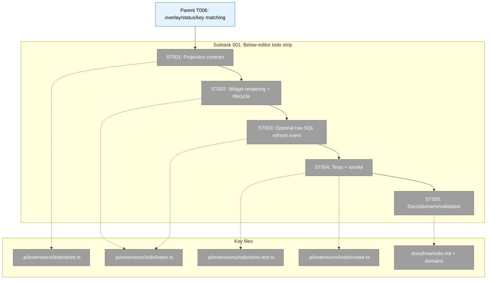
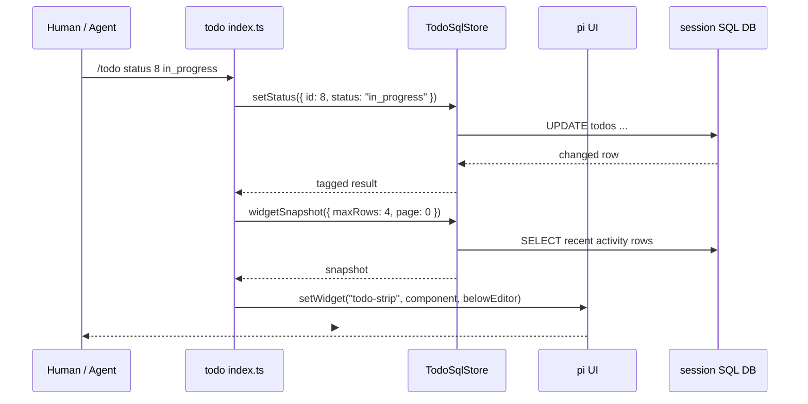

# Subtask 001: Claude Code-style Below-editor Todo Strip

**Created**: 2026-05-15  
**Status**: Proposed  
**Plan**: [SQL-backed Todo Extension](../../sql-backed-todo-extension-plan.md)  
**Phase**: Phase 1: Store, full UX, validation, docs, domains  
**Parent Task**: T006 — Implement overlay, status signal, and configurable key matching  
**Source Workshop**: [006-claude-code-style-below-editor-todo-strip.md](../../workshops/006-claude-code-style-below-editor-todo-strip.md)  
**Mode Note**: Plan 010 originally used Simple mode and did not have a `tasks/phase-*` dossier. This subtask uses the completed Plan 010 implementation table as parent context and creates the phase task directory for follow-up tracked work.

---

## Parent Context

Plan 010 has already landed the SQL-backed todo extension:

- `TodoSqlStore` owns pi-free todo operations over canonical `todos` / `todo_deps` tables.
- `/todo`, the `todo` model tool, a minimal overlay, footer status, docs, smoke, and domain records exist.
- Parent T006 delivered `/todo overlay`, `todo: N open` footer status, and named keybinding defaults.

This subtask extends T006 without changing the storage source of truth: add a persistent compact todo strip under the editor, inspired by Claude Code task visibility, while preserving `/todo overlay` as the full interactive surface.

---

## Executive Briefing

### Purpose

Deliver a below-editor todo strip that makes current-session work visible while the user is typing. It should show a small recent-activity window, identify the in-flight task, keep recent completions visible with strikethrough while work remains, and avoid cluttering the prompt area with all todos.

### What We're Building

A persistent `ctx.ui.setWidget(..., { placement: "belowEditor" })` widget backed by `TodoSqlStore`. The widget renders at most four task rows plus summary/overflow, supports optional configured paging shortcuts, refreshes after todo mutations/reload, and remains a read-only projection over SQL-backed state.

### Goals

- ✅ Show compact todo rows below the text editor.
- ✅ Prefer a 4-row recency window over full-list rendering.
- ✅ Mark `in_progress` rows as in flight.
- ✅ Strike through recently completed rows while open work remains.
- ✅ Clear the widget at zero open todos.
- ✅ Keep keybindings configurable; no hardcoded `ctrl+t` or paging keys.
- ✅ Validate with store/projection tests and deterministic smoke where observable.

### Non-Goals

- ❌ No new todo storage table or file.
- ❌ No project-wide or global personal task manager.
- ❌ No custom editor/footer replacement.
- ❌ No mandatory default paging shortcut until collision review.
- ❌ No full-screen snapshot or ANSI-byte-dependent smoke assertions.

---

## Pre-Implementation Check

| File | Exists? | Domain Check | Notes |
|------|---------|--------------|-------|
| `/Users/jordanknight/pi-hacking/pij/.pi/extensions/todo/store.ts` | yes | `session-work-state` | Add pi-free widget projection types/constants/query helpers here. No pi imports. |
| `/Users/jordanknight/pi-hacking/pij/.pi/extensions/todo/index.ts` | yes | `agent-tooling-interface` | Add `TodoStripWidget`, widget refresh lifecycle, below-editor placement, optional paging shortcut registration. |
| `/Users/jordanknight/pi-hacking/pij/.pi/extensions/todo/store.test.ts` | yes | `extension-authoring-harness` | Add projection/ordering/cap/paging tests with real temp SQLite stores. |
| `/Users/jordanknight/pi-hacking/pij/.pi/extensions/todo/smoke.ts` | yes | `extension-authoring-harness` | Add stable below-editor anchors only if Driver capture observes widget lines reliably. |
| `/Users/jordanknight/pi-hacking/pij/.pi/extensions/session-sql/index.ts` | yes | `agent-tooling-interface` contract | Optional: emit `session-sql:changed` event after successful mutating `/sql` or `sql` tool calls if immediate raw-SQL sync is in scope. |
| `/Users/jordanknight/pi-hacking/pij/docs/how/todo.md` | yes | `agent-tooling-interface` | Document below-editor strip, row cap, in-flight marker, strikethrough, and full-list overlay relationship. |
| `/Users/jordanknight/pi-hacking/pij/docs/domains/agent-tooling-interface/domain.md` | yes | `agent-tooling-interface` | Update if widget/event/paging contract changes public UX surface. |
| `/Users/jordanknight/pi-hacking/pij/docs/domains/session-work-state/domain.md` | yes | `session-work-state` | Update only if adding a new `TodoSqlStore` projection contract. |
| `/Users/jordanknight/pi-hacking/pij/docs/difficulties.md` | yes | `extension-authoring-harness` | Log widget/smoke/keybinding friction if encountered. |
| `/Users/jordanknight/pi-hacking/pij/docs/velocity.md` | yes | `extension-authoring-harness` | Add row after implementation completes. |

### Concept Duplication / Pattern Check

| Concept | Search Result | Decision |
|---------|---------------|----------|
| Below-editor widget | No `.pi/extensions` usage yet; pi docs and `examples/extensions/widget-placement.ts` confirm `setWidget(..., { placement: "belowEditor" })`. | Reuse pi primitive; do not invent custom editor/footer. |
| Strikethrough completed rows | Pi `plan-mode` example uses `theme.strikethrough(item.text)` inside a widget. | Follow this pattern for completed rows. |
| Todo widget projection | No `TODO_WIDGET`, `widgetSnapshot`, `belowEditor`, or paging keys in current todo extension. | New scoped contract needed in `store.ts` / `index.ts`. |
| Paging shortcuts | Existing `DEFAULT_TODO_KEYBINDINGS` has overlay/navigation keys only. | Add optional `widgetNextPage` / `widgetPreviousPage` arrays, default empty unless collision review selects defaults. |

### Agent Harness Health

- Engineering harness: L2 (`npm run self-check`) per `docs/project-rules/harness.md`.
- Agent harness: L2 + companion overlay per `docs/project-rules/agent-harness.md`.
- `minih doctor` result during dossier creation: `degraded`, with `errors: 0`, `healthy: 3`, `warnings: 2`; `code-review-companion` passed `prompt-state-vocabulary-drift`.
- Implementation MUST run pre-phase validation before edits: `npm run self-check` and companion-mode health/boot if using plan-6 companion.

---

## Architecture Map



---

## Tasks

| Status | ID | Task | Domain | Path(s) | Done When | Notes |
|--------|-----|------|--------|---------|-----------|-------|
| [ ] | ST001 | Add pi-free widget projection contract to `TodoSqlStore`. | `session-work-state` | `/Users/jordanknight/pi-hacking/pij/.pi/extensions/todo/store.ts` | Store exports `TODO_WIDGET_KEY`, `DEFAULT_TODO_WIDGET_OPTIONS`, widget snapshot types, optional paging key fields, and a projection method that returns a 4-row recent-activity window with `hidden`, `page`, and `pageCount`. | Must preserve SQL source of truth; no pi imports; order by in-flight first then recently modified/completed. |
| [ ] | ST002 | Render and refresh the below-editor widget in todo wiring. | `agent-tooling-interface` | `/Users/jordanknight/pi-hacking/pij/.pi/extensions/todo/index.ts` | `ctx.ui.setWidget("todo-strip", ..., { placement: "belowEditor" })` renders summary + rows; clears at zero open todos/shutdown; refreshes after `/todo`, `todo` tool, session start/reload, and turn end. | Use `theme.strikethrough` for completed rows; truncate every line; derive shortcut hints from defaults. |
| [ ] | ST003 | Add optional raw-SQL synchronization path if needed for immediate `/sql` agreement. | `agent-tooling-interface` | `/Users/jordanknight/pi-hacking/pij/.pi/extensions/session-sql/index.ts`, `/Users/jordanknight/pi-hacking/pij/.pi/extensions/todo/index.ts` | Either `session-sql:changed` is emitted/listened to for successful SQL mutations/resets, or the implementation documents why turn-end/next-todo refresh is the v1 fallback. | Higher review attention: cross-extension event contract. Keep event payload plain and session-scoped. |
| [ ] | ST004 | Add validation for projection, rendering, cap/overflow, paging, and smoke-visible widget anchors. | `extension-authoring-harness` | `/Users/jordanknight/pi-hacking/pij/.pi/extensions/todo/store.test.ts`, `/Users/jordanknight/pi-hacking/pij/.pi/extensions/todo/smoke.ts` | Tests cover empty, pending, in-progress, multiple in-progress, completed-while-open, all-done clear, blocked, overflow, recency window, paging, long titles, and SQL-created rows. Smoke checks stable visible text if Driver capture observes below-editor widgets. | Avoid ANSI-byte assertions; fake theme may expose `~~struck~~` for unit-level rendering. |
| [ ] | ST005 | Update docs/domain records and run validation. | `agent-tooling-interface` / `extension-authoring-harness` | `/Users/jordanknight/pi-hacking/pij/docs/how/todo.md`, `/Users/jordanknight/pi-hacking/pij/docs/domains/agent-tooling-interface/domain.md`, `/Users/jordanknight/pi-hacking/pij/docs/domains/session-work-state/domain.md`, `/Users/jordanknight/pi-hacking/pij/docs/difficulties.md`, `/Users/jordanknight/pi-hacking/pij/docs/velocity.md` | Docs explain below-editor strip, 4-row cap, paging policy, and overlay/full-list relationship; domain docs reflect new widget/projection contract if public; `npm run typecheck`, scoped tests, `npm run smoke -- todo`, and `npm run self-check` pass or unrelated failures are recorded. | Capture any TUI/widget friction in difficulties; do not skip harness validation. |

---

## Context Brief

### Key Findings from Plan / Workshop

- **KF-01 — SQL remains canonical**: Widget must project `todos` / `todo_deps`; no second store.
- **KF-03 — Pi overlay/widget APIs are available**: Workshop 006 selected `setWidget(..., { placement: "belowEditor" })` for always-visible content and retained overlay for full interaction.
- **KF-04 — Keybindings must be configurable**: Existing `ctrl+shift+y` overlay default is named; paging keys must be named and may remain unset.
- **Workshop 006 recency rule**: Default 4 task rows, in-flight first, then recently modified open rows, then recently completed rows while open work remains.
- **Plan 010 D010-009**: Post-`/reload` smoke can race; include explicit waits if extending smoke.
- **Fix 010 schema lesson**: Tool schemas need root `Type.Object`; avoid schema churn unless needed.

### Domain Dependencies

- `session-work-state`: `TodoSqlStore` and canonical `todos` / `todo_deps` schema — source of widget data.
- `agent-tooling-interface`: `ctx.ui.setWidget`, `ctx.ui.setStatus`, `/todo`, `todo` tool, overlay, shortcut registration — presentation and interaction layer.
- `extension-authoring-harness`: Store tests, Driver SDK smoke, `npm run self-check`, difficulty/velocity ledgers — proof and compounding loop.

### Domain Constraints

- `store.ts` must remain pi-free; no imports from `@earendil-works/*`.
- Relative imports need `.js` extension under NodeNext.
- Use tagged-union results, not throws, for store operations.
- Do not hardcode keybindings; add named defaults in `DEFAULT_TODO_KEYBINDINGS`.
- Clear UI status/widget with `undefined`, not `""`.
- Do not replace the core footer/editor for this feature.
- If adding `session-sql:changed`, keep event payload plain, session-scoped, and documented.

### Agent Harness Context

- **Boot**: `npm install`; agent overlay boot: `minih run code-review-companion` with `GH_TOKEN=$(gh auth token)`.
- **Interact**: `pi` for TUI; `npm run smoke -- todo` for automated tmux smoke; companion inbox pings at commit boundaries if using companion mode.
- **Observe**: `npm run self-check`; companion evidence under `agents/code-review-companion/runs/<runId>/`.
- **Maturity**: Engineering harness L2; agent harness L2 + companion overlay. `minih doctor` degraded with warnings only during dossier creation.
- **Pre-subtask validation**: Implementation agent MUST validate Boot → Interact → Observe before edits.

### Reusable from Parent Plan

- Existing `TodoSqlStore` CRUD/status/dependency methods.
- Existing `formatTodoRow` conventions and stable todo output phrases.
- Existing `/todo overlay` and `DEFAULT_TODO_KEYBINDINGS` constants.
- Existing todo smoke structure and reload wait pattern.
- Existing docs/domain placement for todo UX.

### Mermaid Flow Diagram

```mermaid
flowchart LR
    SQL[(session SQL todos)] --> Projection[Todo widget projection]
    Projection --> Strip[Below-editor widget]
    Strip --> Human[Human sees current work near prompt]
    TodoCmd[/todo command] --> SQL
    TodoTool[todo tool] --> SQL
    SqlTool[/sql or sql tool] -. optional event .-> Strip
    Overlay[/todo overlay] --> SQL
```

### Mermaid Sequence Diagram



---

## Discoveries & Learnings

_Populated during implementation by plan-6._

| Date | Task | Type | Discovery | Resolution | References |
|------|------|------|-----------|------------|------------|

**Types**: `gotcha` | `research-needed` | `unexpected-behavior` | `workaround` | `decision` | `debt` | `insight`

---

## After Subtask Completion

When this subtask is complete:

1. Return to Plan 010 as a landed follow-up under parent T006.
2. Update this dossier task statuses and execution log.
3. Update the flight plan status to complete.
4. If `session-sql:changed` becomes a durable cross-extension contract, update `agent-tooling-interface` and `session-work-state` domain docs.
5. Run final validation and record output in the execution log.
6. Summarize whether widget smoke was fully automated or partially covered by unit/manual evidence.
