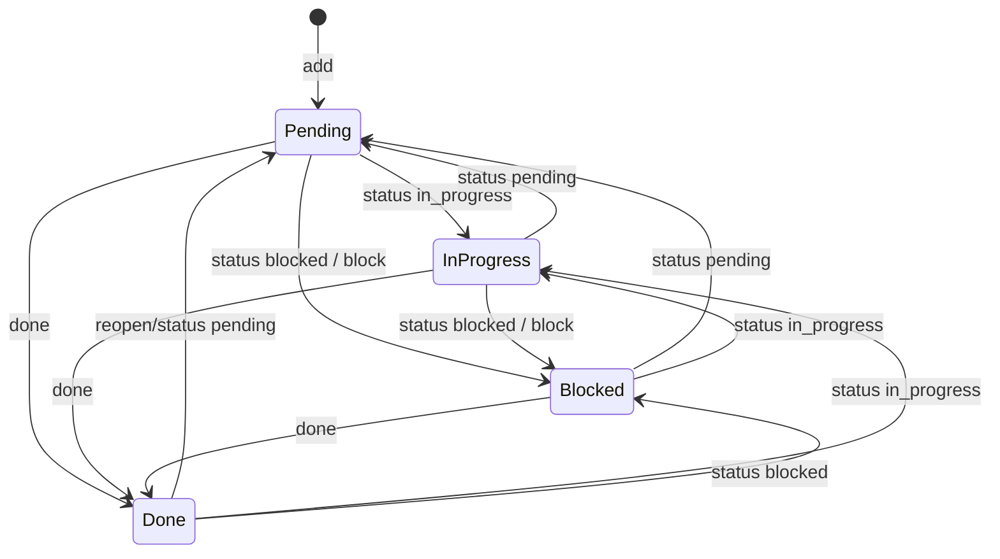

# Workshop: Dependency-aware Next-ready Semantics

**Type**: State Machine  
**Plan**: 010-sql-backed-todo-extension  
**Spec**: [sql-backed-todo-extension-spec.md](../sql-backed-todo-extension-spec.md)  
**Created**: 2026-05-15T06:37:42Z  
**Status**: Draft

**Value Thesis**: This workshop makes agent work safer and more inspectable by defining exactly when a todo is ready, blocked by dependencies, blocked by status, or complete.  
**Target Proof Level**: Implementation Ready  
**Current Proof Level**: Implementation Ready

**Selected Value Axes**:
- **Agent Readiness**: Agents can ask for next work without reconstructing dependency logic.
- **Proof Quality**: Ready/blocked behavior is specified as queries, tables, and test cases.
- **Safety to Change**: Dependency edge cases are explicit before implementation.
- **Operator Usability**: Humans can understand why a task is not selected as next.

**Related Documents**:
- [research-dossier.md](../research-dossier.md)
- [001-todo-command-and-model-action-contract.md](./001-todo-command-and-model-action-contract.md)

**Domain Context**:
- **Primary Domain**: `session-work-state`
- **Related Domains**: `agent-tooling-interface`

---

## Purpose

Define the todo status state machine and dependency-aware `next` semantics. This workshop decides what `ready` means, how dependency edges affect task selection, and how cycles/errors are reported.

## Fresh Entrant Outcome

A fresh human or agent should be able to use this workshop to reach **Implementation Ready** with no additional context.

They should be able to:

- Implement `next` as a deterministic store query.
- Write tests for dependency behavior and cycles.
- Explain why a task is ready or blocked.

## Key Questions Addressed

- What makes a task ready?
- How are cycles handled?
- How are blocked reasons shown?

---

## Core Concepts

| Concept | Meaning |
|---------|---------|
| Open todo | Status is not `done`. |
| Ready todo | Status is `pending` or `in_progress`, and every dependency is `done`. |
| Status-blocked todo | Status is `blocked`, regardless of dependency state. |
| Dependency-blocked todo | Status is `pending` or `in_progress`, but at least one dependency is not `done`. |
| Complete todo | Status is `done`. |
| Invalid edge | Edge points to missing todo or self. Self edges are rejected; missing edges should be surfaced in diagnostics. |

## State Diagram



Status changes are allowed in any direction in v1 because the todo list is a work-state tool, not an audit-compliance workflow.

## Readiness Decision Table

| Todo Status | Dependencies | Ready? | Reason |
|-------------|--------------|--------|--------|
| `pending` | none | yes | Work is available. |
| `pending` | all done | yes | Prerequisites complete. |
| `pending` | any open | no | Dependency-blocked. |
| `in_progress` | none | yes | Already active; can be surfaced. |
| `in_progress` | all done | yes | Active and unblocked. |
| `in_progress` | any open | no | Dependency-blocked despite status. |
| `blocked` | any | no | Status-blocked. |
| `done` | any | no | Complete. |

## `next` Ordering

Recommended deterministic order:

1. `status = 'in_progress'` before `pending`.
2. Higher `priority` first.
3. Older `created_at` first.
4. Lower `id` as final tie-break.

Rationale: continue active work first, then respect explicit priority, then FIFO.

## Canonical Ready Query

Use this shape in the store layer, adapted for parameterized limits:

```sql
SELECT t.id, t.title, t.description, t.status, t.priority, t.created_at, t.updated_at
FROM todos t
WHERE t.status IN ('pending', 'in_progress')
  AND NOT EXISTS (
    SELECT 1
    FROM todo_deps d
    JOIN todos dep ON dep.id = d.depends_on
    WHERE d.todo_id = t.id
      AND dep.status != 'done'
  )
ORDER BY
  CASE t.status WHEN 'in_progress' THEN 0 ELSE 1 END,
  t.priority DESC,
  t.created_at ASC,
  t.id ASC
LIMIT ?;
```

Important caveat: this treats edges to missing dependencies as not blocking because the join drops them. Implementation should either prevent missing dependency edges or add diagnostics for broken edges.

## Dependency Edge Rules

| Rule | Behavior | Error / Output |
|------|----------|----------------|
| Add valid edge | Insert into `todo_deps` | `todo: #A depends on #B` |
| Duplicate edge | No-op success | `todo: #A already depends on #B` |
| Self edge | Reject | `todo error: todo cannot depend on itself` |
| Missing dependent todo | Reject | `todo error: id #A not found` |
| Missing prerequisite todo | Reject | `todo error: id #B not found` |
| Edge to done todo | Allow | Dependency is already satisfied. |
| Edge from done todo | Allow but does not affect `next` | Useful if user reopens item later. |

## Cycle Policy

### Decision: reject direct self-cycles, allow larger cycles but surface no-ready state clearly in v1

| Option | Pros | Cons | Decision |
|--------|------|------|----------|
| Reject only self-cycles | Simple, uses current schema, easy to test | Larger cycles can make tasks permanently blocked | Selected for v1. |
| Detect all cycles on insert | Better UX, prevents stuck graphs | More implementation logic | Defer unless easy. |
| Allow all cycles silently | Simplest | Confusing no-ready results | Rejected. |

If no ready tasks exist but open tasks remain, output should distinguish causes:

```text
todo: no ready todos
2 open todos are blocked by status or dependencies
Tip: /todo list blocked or /todo list all
```

Optional diagnostic command for later:

```text
/todo blocked
```

Not required in v1 unless architecture chooses it.

## Examples

### Linear dependency

```text
#1 pending  Write store tests
#2 pending  Implement command
#2 depends on #1
```

`/todo next` returns #1 only. After `/todo done 1`, `/todo next` returns #2.

### Active work preferred

```text
#1 pending      p10  Update docs
#2 in_progress  p0  Implement store
```

Both are ready. `/todo next` returns #2 before #1 because active work is preferred.

### Status-blocked beats dependency readiness

```text
#1 done     Decide contract
#2 blocked  Implement command
#2 depends on #1
```

#2 is not ready because status is `blocked`, even though dependency is done.

## Test Matrix

| Case | Setup | Expected `/todo next` |
|------|-------|------------------------|
| Empty | no todos | no ready todos |
| One pending | #1 pending | #1 |
| One done | #1 done | none |
| One blocked | #1 blocked | none + blocked message |
| Pending depends on pending | #2 depends on #1, both pending | #1 only |
| Pending depends on done | #2 pending, #1 done | #2 |
| In-progress ready | #2 in_progress, #1 pending | #2 first |
| Priority order | #1 p0, #2 p5 | #2 first |
| Duplicate dep | insert same edge twice | no duplicate; stable output |
| Self dep | #1 depends on #1 | reject |
| Missing dep id | #1 depends on #99 | reject |
| Limit zero | ready tasks exist, limit 0 | no rows; not all rows |

## Output Contract

### Ready rows exist

```text
todo: 2 ready
#2 in_progress p0  Implement store
#1 pending     p5  Update docs
```

### No todos

```text
todo: no open todos
```

### Open but not ready

```text
todo: no ready todos
2 open todos are blocked by status or dependencies
```

## Validation / Acceptance

This workshop reaches Implementation Ready when:

- Store tests cover every row in the test matrix.
- `/todo next` uses deterministic ordering.
- Dependency insert rejects missing/self ids.
- No-ready output explains whether open work still exists.
- Architecture decides whether cycle detection beyond self-cycles is deferred or added opportunistically.
