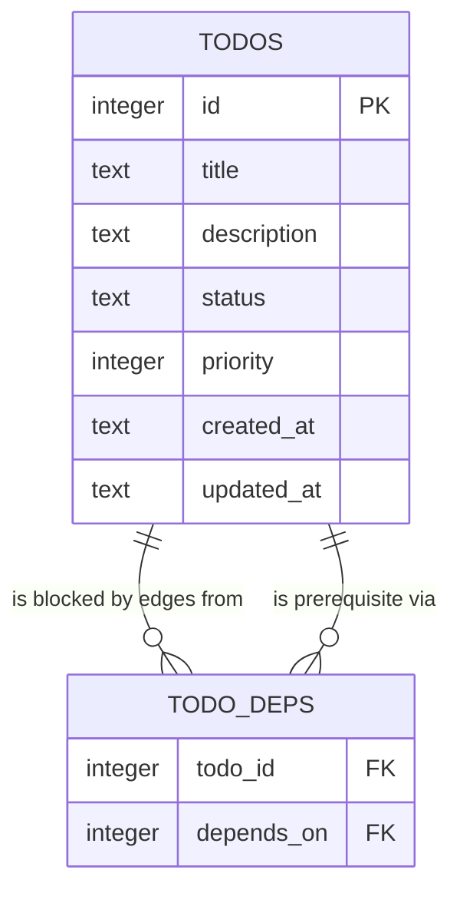

# Workshop: SQL-backed Todo Data Contract

**Type**: Data Model  
**Plan**: 010-sql-backed-todo-extension  
**Spec**: [sql-backed-todo-extension-spec.md](../sql-backed-todo-extension-spec.md)  
**Created**: 2026-05-15T06:37:42Z  
**Status**: Draft

**Value Thesis**: This workshop prevents a second source of truth by making the SQL-backed todo data contract explicit before any todo UX code is written.  
**Target Proof Level**: Implementation Ready  
**Current Proof Level**: Implementation Ready

**Selected Value Axes**:
- **Cross-Domain Coordination**: `todo` UX consumes `session-work-state`; boundaries must be explicit.
- **Safety to Change**: Schema assumptions and normalization rules are recorded before reuse.
- **Proof Quality**: The contract includes SQL examples, TypeScript shapes, and validation scenarios.
- **Review Compression**: Reviewers can verify that implementation does not invent parallel storage.

**Related Documents**:
- [research-dossier.md](../research-dossier.md)
- [002-dependency-aware-next-ready-semantics.md](./002-dependency-aware-next-ready-semantics.md)
- [docs/domains/session-work-state/domain.md](../../../domains/session-work-state/domain.md)

**Domain Context**:
- **Primary Domain**: `session-work-state`
- **Related Domains**: `agent-tooling-interface`

---

## Purpose

Specify the data contract between the todo UX and the current-session SQL work state. This workshop decides canonical fields, normalization rules, invalid row handling, and how `/todo` and `/sql` stay aligned.

## Fresh Entrant Outcome

A fresh human or agent should be able to use this workshop to reach **Implementation Ready** with no additional context.

They should be able to:

- Build a `TodoSqlStore` over the existing session work-state tables.
- Avoid creating duplicate todo storage.
- Normalize SQL-created rows into safe todo view rows.
- Write tests proving `/todo` and `/sql` agreement.

## Key Questions Addressed

- Which fields are canonical?
- How is SQL-created data normalized?
- How should invalid rows be reported?

---

## Source of Truth Decision

`todos` and `todo_deps` in the current session SQL database are the only v1 source of truth.

Rejected sources:

| Source | Reason Rejected |
|--------|-----------------|
| `.pi/todos.json` | Project-local storage conflicts with session-scoped SQL requirement. |
| `~/.pi/agent/todo.md` | Global personal task storage, not current-session state. |
| Tool result details replay | Less inspectable than SQL and duplicates session-sql persistence. |
| Separate todo SQLite DB | Duplicates session work-state identity/reset semantics. |

## Conceptual Model



## Canonical Tables

### `todos`

| Column | Canonical? | UX Meaning | v1 Rules |
|--------|------------|------------|----------|
| `id` | yes | Stable displayed id | Positive integer assigned by SQLite. |
| `title` | yes | Main todo text | Required, non-empty after trim for todo-created rows. |
| `description` | yes | Optional detail/block reason | May be empty/null; command output usually omits unless needed. |
| `status` | yes | Lifecycle state | Canonical statuses: `pending`, `in_progress`, `blocked`, `done`. |
| `priority` | yes | Sort weight | Integer; default `0`; higher first. |
| `created_at` | yes | Ordering/audit | Store-managed timestamp. |
| `updated_at` | yes | Mutation audit | Updated on mutations. |

### `todo_deps`

| Column | Canonical? | UX Meaning | v1 Rules |
|--------|------------|------------|----------|
| `todo_id` | yes | Todo being blocked | Must refer to existing todo for UX-created edge. |
| `depends_on` | yes | Prerequisite todo | Must refer to existing todo for UX-created edge. |

## View Type

```ts
type TodoStatus = "pending" | "in_progress" | "blocked" | "done";

type TodoViewRow = {
  id: number;
  title: string;
  description: string;
  status: TodoStatus;
  priority: number;
  createdAt: string;
  updatedAt: string;
  dependencyIds: number[];
  blockedByIds: number[];
};
```

The store can expose lighter rows for list output, but this is the canonical review shape.

## Store Contract

Recommended pi-free store methods:

```ts
type TodoStoreResult<T> =
  | { ok: true; value: T; message: string }
  | { ok: false; code: TodoErrorCode; message: string };

type TodoSqlStore = {
  add(input: { title: string; description?: string; priority?: number }): TodoStoreResult<TodoViewRow>;
  list(input?: { view?: "open" | "all" | "done" | "blocked"; limit?: number }): TodoStoreResult<TodoViewRow[]>;
  setStatus(input: { id: number; status: TodoStatus; reason?: string }): TodoStoreResult<TodoViewRow>;
  addDependency(input: { id: number; dependsOn: number }): TodoStoreResult<{ id: number; dependsOn: number; duplicate: boolean }>;
  next(input?: { limit?: number }): TodoStoreResult<TodoViewRow[]>;
  counts(): TodoStoreResult<{ open: number; done: number; blocked: number; total: number }>;
  clear(): TodoStoreResult<{ cleared: number }>;
};
```

## SQL-created Row Normalization

Because `/sql` remains a power-user surface, `/todo` must handle supported SQL-created rows.

| Condition | Behavior |
|-----------|----------|
| Valid title/status/priority | Show normally. |
| `title` empty/null | Display as `<untitled #id>` and include warning in diagnostics, or filter only if SQL schema forbids null. |
| Unknown `status` | Treat as invalid and show in `/todo list all` diagnostics; do not include in `next`. |
| `priority` null/non-integer | Normalize to `0` for view; store-created rows should always write integer. |
| Missing timestamps | Display empty/unknown if schema permits; store-created rows should set timestamps. |
| Dependency edge to missing row | Exclude from ready-blocking query only if prevented at insert; otherwise surface as broken dependency diagnostic. |

Architecture should check actual session-sql schema constraints before finalizing the exact invalid-row path. The product contract is: **do not crash; do not silently create a second store; make suspicious SQL-created data inspectable.**

## Insert/Update SQL Patterns

### Add

```sql
INSERT INTO todos (title, description, status, priority, created_at, updated_at)
VALUES (?, ?, 'pending', ?, CURRENT_TIMESTAMP, CURRENT_TIMESTAMP)
RETURNING id, title, description, status, priority, created_at, updated_at;
```

If the existing schema already provides defaults for timestamps/status, explicit values are still acceptable for stable behavior.

### Set status

```sql
UPDATE todos
SET status = ?,
    description = COALESCE(?, description),
    updated_at = CURRENT_TIMESTAMP
WHERE id = ?
RETURNING id, title, description, status, priority, created_at, updated_at;
```

### Add dependency

```sql
INSERT OR IGNORE INTO todo_deps (todo_id, depends_on)
VALUES (?, ?);
```

Validate both ids and self-edge before insert.

## `/todo` and `/sql` Agreement Scenarios

### Todo-created row visible in SQL

```text
> /todo add Write docs

todo: added #1 pending — Write docs

> /sql SELECT id, title, status FROM todos WHERE id = 1;

sql: 1 row
{"id":1,"title":"Write docs","status":"pending"}
```

### SQL-created row visible in todo

```text
> /sql INSERT INTO todos(title, status, priority) VALUES ('SQL row', 'pending', 0);

sql: ok, statement executed

> /todo list all

todo: 1 total
#1 pending p0  SQL row
```

## Metadata Decision

Clarification selected **dependencies only** for v1. Do not add assignee/tag/category storage.

| Option | Decision | Why |
|--------|----------|-----|
| Existing `todos` + `todo_deps` only | Selected | Fastest path, no source-of-truth ambiguity. |
| Companion `todo_meta` table | Deferred | Useful later for assignees/tags/categories. |
| Alter `todos` with metadata columns | Rejected for v1 | Makes todo extension own broader session-sql migration. |

## Reset/Clear Semantics

| Operation | Scope | Owner |
|-----------|-------|-------|
| `/todo clear` | Deletes todo rows and dependency edges only after confirmation | Todo UX/store. |
| `/sql reset` | Resets full session SQL DB | Session-sql command. |
| New/fork session | Starts independent DB | Session work-state. |

## Validation / Acceptance

This workshop reaches Implementation Ready when:

- Store implementation uses only current-session SQL tables as source of truth.
- Tests prove todo-created rows are visible through SQL.
- Tests prove SQL-created supported rows are visible through todo.
- Invalid SQL-created rows do not crash list/next operations.
- No v1 metadata table or project-local todo file is introduced.
