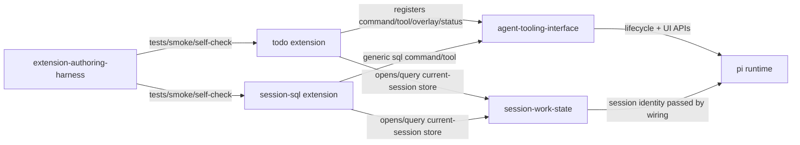

# Workshop: Cross-domain Contract Review

**Type**: Integration Pattern  
**Plan**: 010-sql-backed-todo-extension  
**Spec**: [sql-backed-todo-extension-spec.md](../sql-backed-todo-extension-spec.md)  
**Created**: 2026-05-15T06:37:42Z  
**Status**: Draft

**Value Thesis**: This workshop makes the todo feature safer to build by identifying which contracts belong to session storage, which belong to UX, and which are merely harness validation concerns.  
**Target Proof Level**: Contract Ready  
**Current Proof Level**: Contract Ready

**Selected Value Axes**:
- **Cross-Domain Coordination**: The feature spans storage, UX, and validation without needing a new domain.
- **Safety to Change**: Cross-extension store reuse becomes explicit instead of an accidental file import.
- **Review Compression**: Reviewers can check boundary changes against this contract table.
- **Learning Compounding**: Future extensions can reuse the same pattern for SQL-backed UX layers.

**Related Documents**:
- [sql-backed-todo-extension-spec.md](../sql-backed-todo-extension-spec.md)
- [docs/domains/registry.md](../../../domains/registry.md)
- [docs/domains/domain-map.md](../../../domains/domain-map.md)
- [docs/domains/session-work-state/domain.md](../../../domains/session-work-state/domain.md)
- [docs/domains/agent-tooling-interface/domain.md](../../../domains/agent-tooling-interface/domain.md)

**Domain Context**:
- **Primary Domain**: `agent-tooling-interface`
- **Related Domains**: `session-work-state`, `extension-authoring-harness`, pi runtime

---

## Purpose

Validate the domain boundaries for a todo UX layer over session SQL. This workshop decides what contracts must be modified or consumed, and what documentation/tests should encode the relationship.

## Fresh Entrant Outcome

A fresh human or agent should be able to use this workshop to reach **Contract Ready** with no additional context.

They should be able to:

- Update domain docs without inventing a new domain.
- Identify the store contract consumed by todo.
- Avoid coupling UX concerns into the session storage domain.
- Plan validation using the existing extension harness.

## Key Questions Addressed

- Is the current contract stable enough?
- What docs/tests must be added?
- Does the domain map need a new node or only updated edges/history?

---

## Confirmed Domain Decision

Clarification confirmed:

- Use existing `session-work-state` and `agent-tooling-interface` domains.
- Consume `extension-authoring-harness`.
- Create no new todo domain in v1.

Rationale: todo is a productized UX over existing current-session work state, not a separate business/domain boundary.

## Domain Responsibility Table

| Concern | Owning Domain | Todo Plan Action |
|---------|---------------|------------------|
| Session DB identity | `session-work-state` | Consume existing semantics. |
| DB path/root/session location | `session-work-state` | Consume existing `SessionSqlLocation` contract. |
| SQLite open/close/reset/status/schema | `session-work-state` | Reuse through store contract; do not duplicate. |
| `todos` / `todo_deps` schema | `session-work-state` | Treat as canonical todo backing model; document todo as consumer. |
| Todo action semantics | `agent-tooling-interface` plus todo store | Add UX-level operations over canonical data. |
| `/todo` command | `agent-tooling-interface` | Add new command surface and stable output. |
| `todo` model tool | `agent-tooling-interface` | Add new model-facing action surface. |
| Overlay/status/shortcut UX | `agent-tooling-interface` | Add full UX surface with configurable key defaults. |
| Store/unit tests | `extension-authoring-harness` consumed by plan | Follow existing store-test conventions. |
| Smoke/self-check | `extension-authoring-harness` consumed by plan | Add deterministic todo smoke. |

## Contract Flow



Note: this diagram is conceptual. Source docs can represent todo as part of `agent-tooling-interface`, not as a formal new domain node.

## Cross-extension Store Reuse Decision

### Preferred direction

Todo store wraps/imports the existing pi-free session SQL store rather than duplicating SQLite implementation.

Potential implementation path:

```ts
import { type SessionSqlLocation, SessionSqlStore } from "../session-sql/store.js";
```

### Contract implication

`SessionSqlStore` becomes a first-party reusable contract, not only an internal detail of the `session-sql` extension.

### Required encoding

- Update `docs/domains/session-work-state/domain.md`:
  - list `.pi/extensions/todo/store.ts` as a consumer after implementation;
  - mention todo as a domain dependent using default work schema;
  - clarify `SessionSqlStore` is reusable by first-party SQL-backed extensions.
- Update `docs/domains/agent-tooling-interface/domain.md`:
  - list `.pi/extensions/todo/index.ts`, smoke, and docs after implementation;
  - add todo tool/command/overlay/status contracts.
- Update `docs/domains/domain-map.md` history and maybe diagram labels:
  - show todo as an additional UX surface consuming session work state.

## Boundary Rules

### `session-work-state` must not own

- `/todo` command wording.
- Tool descriptions or model prompt guidance.
- Overlay layout or keybindings.
- Human-facing error formatting beyond structured store result codes.

### `agent-tooling-interface` must not own

- SQLite connection implementation.
- Session DB identity/path semantics.
- Reset semantics for the whole session SQL database.
- Schema version policy for default session tables.

### `extension-authoring-harness` must not own

- Product behavior.
- Domain contracts.
- Todo data semantics.

It provides validation loops and templates only.

## Contract Tests / Evidence

| Evidence | Owner | Purpose |
|----------|-------|---------|
| Todo store tests with temp SQLite | feature implementation | Prove operations over real session SQL store. |
| `/todo` + `/sql` smoke | harness consumed | Prove UX and SQL agree in real pi. |
| Reload smoke | harness consumed | Prove same-session persistence through UI layer. |
| Domain doc updates | plan docs | Prove boundary is encoded. |
| Difficulty/velocity rows | harness process | Capture friction/compounding evidence. |

## Risk Register

| Risk | Boundary Symptom | Mitigation |
|------|------------------|------------|
| Store import breaks if session-sql reorganizes | todo depends on internal path | Treat store as contract in domain docs; consider shared module if second consumer appears. |
| Todo duplicates state for convenience | `/todo` and `/sql` disagree | Test agreement; reject project-local/global files. |
| UX logic leaks into store | store imports pi APIs or TUI types | Enforce pi-free store rule and tests. |
| Harness changes are made unnecessarily | scope creep | Consume harness only unless smoke exposes real harness bug. |
| Overlay keybindings hardcoded | violates project rule | Configurable defaults and tests/review check. |

## Architecture Guidance

During `/plan-3-v2-architect`, include tasks to:

1. Scaffold `.pi/extensions/todo` with T2 layout.
2. Build pi-free `TodoSqlStore` over `SessionSqlStore`.
3. Add store tests proving SQL agreement and dependency semantics.
4. Add `index.ts` command/tool/overlay/status wiring.
5. Add smoke proving `/todo`, `/sql`, overlay, reload.
6. Update README, `docs/how/todo.md`, and domain docs.
7. Log any friction in `docs/difficulties.md` and phase output in `docs/velocity.md`.

## Validation / Acceptance

This workshop reaches Contract Ready when:

- No new domain is introduced in the spec or plan.
- Domain docs are scheduled for update in architecture.
- `SessionSqlStore` reuse is either accepted as a contract or architecture chooses a shared extraction.
- Validation tasks prove `/todo` and `/sql` agreement.
- Store remains pi-free and UX wiring remains in `index.ts`.
