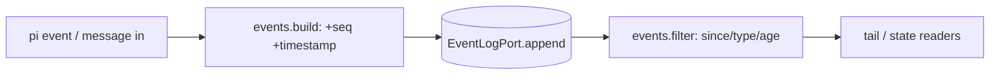
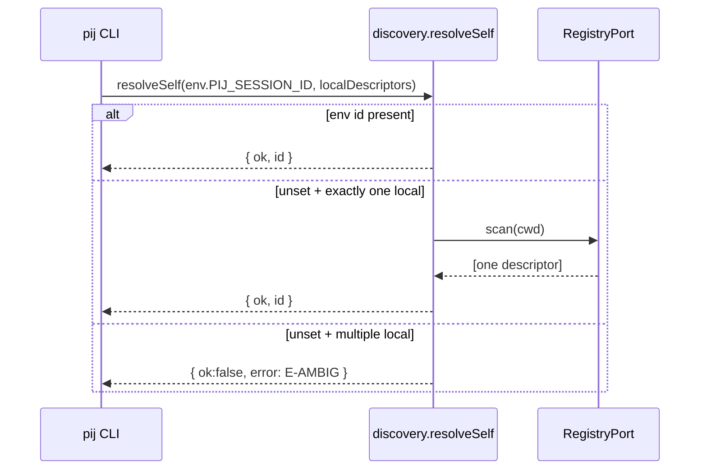

# Phase 1 — Domain + pure core + ports + fakes — Tasks

**Plan**: [pi-session-messaging-plan.md](../../pi-session-messaging-plan.md)
**Phase**: Phase 1: Domain + pure core + ports + fakes
**Status**: Proposed — awaiting GO

## Executive Briefing

- **Purpose**: Stand up the NEW `pij-messaging` domain and a fully unit-tested,
  **pi-free** core (session identity, monotonic `seq`, timestamped events, state +
  liveness, command allow-list, discovery + self-resolution, message framing) behind
  ports, with in-memory fakes. This is the foundation both entry points (extension +
  CLI) wire later.
- **What we're building**: `docs/domains/pij-messaging/domain.md` + registry/map
  entries; `.pi/extensions/pij/core/{types,ports,seq,events,state,commands,discovery,message}.ts`;
  `.pi/extensions/pij/adapters/fakes.ts`; a passing vitest suite written **first**.
- **Goals**:
  - ✅ Pure core compiles with **zero** `@earendil-works/*` imports (P2).
  - ✅ Tests written before implementation (spec Testing Strategy = Hybrid/TDD on core).
  - ✅ `seq` monotonic + crash-safe; every event carries an ISO-8601 `timestamp`.
  - ✅ Liveness verdict reuses `active/stale/dead` vocabulary (AW alignment, finding 04).
  - ✅ Command allow-list rejects unknown names (finding 05).
  - ✅ Self-identification helper resolves "me" from an injected env value (finding 07).
- **Non-Goals**:
  - ❌ No real fs / fs.watch / pid / pi-runtime adapters (Phase 2).
  - ❌ No extension wiring or CLI (Phases 3–4).
  - ❌ No I/O of any kind in `core/` — only `adapters/fakes.ts` simulates it in memory.

## Prior Phase Context

_None — this is Phase 1._

## Pre-Implementation Check

| File | Exists? | Domain Check | Notes |
|------|---------|-------------|-------|
| `docs/domains/pij-messaging/domain.md` | No → create | pij-messaging (NEW) | New domain doc + §Concepts |
| `docs/domains/registry.md` | Yes → modify | — | Add `pij-messaging` row + history line |
| `docs/domains/domain-map.md` | Yes → modify | — | Add node + consume/align edges |
| `.pi/extensions/pij/core/types.ts` | No → create | pij-messaging (contract) | Event/message/command/descriptor/state types + tagged-union results (P4) |
| `.pi/extensions/pij/core/ports.ts` | No → create | pij-messaging (contract) | 5 ports; no pi imports |
| `.pi/extensions/pij/core/seq.ts` | No → create | pij-messaging (internal) | Monotonic seq + crash recovery |
| `.pi/extensions/pij/core/events.ts` | No → create | pij-messaging (internal) | Build (seq+ts), filter, age |
| `.pi/extensions/pij/core/state.ts` | No → create | pij-messaging (internal) | State machine + liveness verdict |
| `.pi/extensions/pij/core/commands.ts` | No → create | pij-messaging (internal) | Allow-list (`compact`) |
| `.pi/extensions/pij/core/discovery.ts` | No → create | pij-messaging (internal) | Descriptor + folder filter + self-resolution |
| `.pi/extensions/pij/core/message.ts` | No → create | pij-messaging (internal) | `[pij from <id>] …` framing + announce/role text |
| `.pi/extensions/pij/core/receipts.ts` | No → create | pij-messaging (internal) | `MessageReceipt` (`queued|delivered`) model + steered-delivery correlation helper |
| `.pi/extensions/pij/adapters/fakes.ts` | No → create | pij-messaging (internal) | In-memory all ports |
| `.pi/extensions/pij/core/*.test.ts` | No → create | pij-messaging (internal) | vitest, written first |

> **Harness availability**: Router present — `/eng-harness-flow` routing is available; the
> implement verb fires the pre-implement seam before any code (T000) and the phase-end seam at close (T012).

## Architecture Map

```mermaid
flowchart TD
    classDef pending fill:#9E9E9E,stroke:#757575,color:#fff
    classDef test fill:#FFB74D,stroke:#F57C00,color:#000

    subgraph Phase["Phase 1: Domain + pure core + ports + fakes"]
        T001["T001: domain setup"]:::pending
        T002["T002: failing tests (TDD)"]:::test
        T003["T003: types + ports"]:::pending
        T004["T004: seq"]:::pending
        T005["T005: events"]:::pending
        T006["T006: state + liveness"]:::pending
        T007["T007: commands"]:::pending
        T008["T008: discovery + self-resolve"]:::pending
        T009["T009: message framing"]:::pending
        T010["T010: fakes"]:::pending
        T011["T011: green + lint + typecheck"]:::pending
        T002 --> T003 --> T004 --> T005 --> T006 --> T007 --> T008 --> T009 --> T010 --> T011
        T001 --> T002
    end
```



## Tasks

| Status | ID | Task | Domain | Path(s) | Done When | Notes |
|--------|-----|------|--------|---------|-----------|-------|
| [x] | T000 | **Harness pre-flight** — `/eng-harness-flow --event pre-implement --phase "Phase 1: Domain + pure core + ports + fakes" --plan-dir docs/plans/014-pi-session-messaging` | — | — | Router envelope handled; verdict narrated verbatim before any code | Harness seam |
| [x] | T001 | Create domain: **bootstrap the extension via `just new pij`** (AGENTS P1 — never hand-roll T2 boilerplate; gives the registered scaffold + `.generated` marker), then evolve the generated `store.ts`/`test.ts` into the `core/` + `adapters/` layout; write `domain.md` (boundary, contracts, §Concepts); add registry row + domain-map node/edges (consume→pi runtime, harness; align→agent-workbench) | pij-messaging | `/Users/jordanknight/pi-hacking/pij/docs/domains/pij-messaging/domain.md`, `/Users/jordanknight/pi-hacking/pij/docs/domains/registry.md`, `/Users/jordanknight/pi-hacking/pij/docs/domains/domain-map.md`, `/Users/jordanknight/pi-hacking/pij/.pi/extensions/pij/` | `just new pij` ran; domain.md + registry + map updated; `core/`+`adapters/` dirs exist | NEW-domain setup (G7); AGENTS P1; plan task 1.1 |
| [x] | T002 | **Write failing tests first** for the whole core: seq monotonicity + crash-recovery; event build (seq+ISO timestamp) + filters (`since`/`type`/present-minus-N) + age; state transitions; liveness verdict (active/stale/dead); command allow-list (accept `compact`, reject unknown); discovery folder-filter + self-exclusion + self-resolution; message framing + announce/role; **receipt model (`queued|delivered`) + steered-delivery correlation (next turn_start after an input(steer))** | pij-messaging | `/Users/jordanknight/pi-hacking/pij/.pi/extensions/pij/core/*.test.ts` | vitest runs, all new specs present and **failing** (red) | TDD per spec Testing Strategy (G6); covers findings 02,04,05,07,08 |
| [x] | T003 | Define `types.ts` (Event `{seq,type,timestamp,data}`, Descriptor, Message, Command, State, tagged-union `Result`) + `ports.ts` (`RegistryPort`,`EventLogPort`,`DeliveryPort`,`PiRuntimePort`,`ProcessPort`). **`EventLogPort` must expose `lastSeq()`/`count()`** so `seq.ts` can recover its counter (T004) and Phase 2 can satisfy it | pij-messaging | `…/core/types.ts`, `…/core/ports.ts` | Compiles; **no** `@earendil-works/*` import in `core/` (P2); structural entry types (P6); `EventLogPort` exposes last-seq/length | plan task 1.3; forward-dep for T004 + Phase 2 |
| [x] | T004 | Implement `seq.ts`: assign monotonic seq from a persisted counter validated against `EventLogPort.lastSeq()`; recover correctly after a simulated reload | pij-messaging | `…/core/seq.ts` | T002 seq tests green; seq strictly increasing across reload | Finding 02; depends on T003 port shape |
| [x] | T005 | Implement `events.ts`: build event (stamp `seq`+ISO `timestamp`), filter by `since`/`type`, present-minus-N, compute age from `timestamp` | pij-messaging | `…/core/events.ts` | T002 event tests green; age derived from timestamp | Findings 02; AC-7/7a/8 |
| [x] | T006 | Implement `state.ts`: state machine (`idle|in-progress|paused|reviewing|complete|error`) + liveness verdict `active|stale|dead` from pid-alive + lastEventAt age (clock injected) | pij-messaging | `…/core/state.ts` | T002 state/liveness tests green | Finding 04 (AW vocabulary); AC-9/10 |
| [x] | T007 | Implement `commands.ts`: allow-list map `{compact}` → resolve name to action token; reject unknowns with `E-CMD` result | pij-messaging | `…/core/commands.ts` | T002 command tests green; unknown rejected before any side effect | Finding 05 (security); AC-6 |
| [x] | T008 | Implement `discovery.ts`: build descriptor, folder-filter (`--here`), self-exclusion, and `resolveSelf(envId, localDescriptors)` — env id wins; lone local session fallback; else `E-AMBIG` | pij-messaging | `…/core/discovery.ts` | T002 discovery tests green incl. shared-cwd self-resolution | Finding 07 (HIGH); AC-1/5 |
| [x] | T009 | Implement `message.ts`: frame `[pij from <id>] <body>`, parse sender id back out, build boot self-announce + role (PARENT/WORKER) text | pij-messaging | `…/core/message.ts` | T002 message tests green; round-trip from-id parse | AC-2/3/5; workshop 001 |
| [x] | T009b | Implement `receipts.ts`: `MessageReceipt` state (`queued|delivered` + timestamps); pure correlation helper `deliveredOn(events)` mapping an `input(steer)` to the next `turn_start` (and `input(idle)` to immediate delivery) | pij-messaging | `…/core/receipts.ts` | T002 receipt tests green; steered case resolves to next turn_start, idle case immediate | **Finding 08**; AC-13; runtime wiring is Phase 3 task 3.8 |
| [x] | T010 | Implement `adapters/fakes.ts`: in-memory implementations of all 5 ports (registry map, event-log array, delivery queue, fake pi-runtime idle flag, fake process/clock) | pij-messaging | `…/adapters/fakes.ts` | Core exercised end-to-end in tests with zero I/O (P8) | Mock-free seam (spec: avoid mocks) |
| [x] | T011 | Run `just test` (vitest green), `just lint` (Biome), `just typecheck` — fix to clean | pij-messaging | — | All three exit 0; full red→green for T002 specs | Phase gate |
| [x] | T012 | **Harness phase-end** — `/eng-harness-flow --event phase-end --plan-dir docs/plans/014-pi-session-messaging` | — | — | Router envelope handled at phase end | Harness seam |

## Context Brief

**Key findings from plan**:
- **Finding 01 (Critical)** — inject primitive proven; not exercised in Phase 1 (no pi-runtime yet) but `PiRuntimePort` shape must match the prototype's `sendUserMessage`/`isIdle`/`compact` so Phase 2/3 lift it verbatim.
- **Finding 02 (Critical)** — pij owns `seq` + ISO `timestamp`; seq crash-safe (counter validated vs log length). Tested in T004.
- **Finding 04 (High)** — reuse `active/stale/dead` + state names (AW vocabulary); vocabulary alignment only, no code reuse. T006.
- **Finding 05 (High)** — command allow-list is a tiny data map; reject unknowns before side effects. T007.
- **Finding 07 (High)** — shared-cwd self-identification: `resolveSelf(envId, localDescriptors)` is pure core (env value injected by caller); `E-AMBIG` when unset + multiple local. T008.
- **Finding 08 (High)** — delivery receipts (proven in `scratch/receipt_test/`): `input.streamingBehavior` classifies queued vs immediate; steered delivery = next `turn_start`. Pure model + correlation in `receipts.ts` (T009b); runtime emission in Phase 3.

**Domain dependencies** (this phase consumes none at runtime — pure core):
- `pij-messaging`: this phase *creates* the domain; consumes only TS/vitest from `extension-authoring-harness`.

**Domain constraints**:
- `core/` imports **nothing** from `@earendil-works/*` (P2). The only pi-importing file (`pi-runtime.ts`) is Phase 2.
- Side effects injected via constructor / function params (P3) — core takes ports + plain data, never reaches for globals.
- Tagged-union returns (`{ok,...}`) over throws (P4); constants colocated with the data they constrain (P5); `.js` ESM import specifiers (P7).
- Tests target the core, not wiring (P8).

**Harness context** (router installed):
- **Entry point**: `/eng-harness-flow --event <seam> [--phase <id>] [--plan-dir <p>] --json` — single door; child skills never named.
- **Pre-implement seam**: fired by the implement verb at phase start (T000); verdict narrated verbatim from the router envelope (`healthy/SLOW/UNHEALTHY/UNAVAILABLE`; `UNAVAILABLE` → standard testing).
- **Phase-end seam**: fired at phase close (T012).
- **Backpressure**: no `backpressure-coverage.md` in the plan dir — standard testing.

**Reusable from prior phases**: none (Phase 1). Reference implementation for later phases: `scratch/messenger_test/{messenger.ts,send.ts}` (the proven inject + atomic-channel logic to graduate in Phases 2–3).

**Mermaid flow diagram** (core data shape):


**Mermaid sequence diagram** (self-resolution, finding 07):


## Discoveries & Learnings

_Populated during implementation by the implement verb._

| Date | Task | Type | Discovery | Resolution | References |
|------|------|------|-----------|------------|------------|

---

```
docs/plans/014-pi-session-messaging/
  ├── pi-session-messaging-plan.md
  └── tasks/phase-1-domain-pure-core-ports-fakes/
      ├── tasks.md
      └── execution.log.md   # created by the implement verb
```

---

## Validation Record (2026-06-16)

### Validation Thesis

**Raison d'être**: Give the implementer an ordered, domain-aware Phase-1 task list with enough detail to build the pure core **test-first** without re-reading the whole plan.

**Value claim**: Implementation is cheaper/safer — the pure core is fully proven against fakes before any I/O adapter exists.

**Artifact promise**: The implement verb can execute T001–T012 and produce a green, pi-free core + fakes; Phase 2 builds adapters against the T003 port contract.

**Intended beneficiaries**: implementing agent; Phase 2 (adapters).

**Proof target**: Implementation.

**Evidence standard**: every plan task 1.1–1.5 mapped to T-tasks; absolute paths; testable Done-When; TDD ordering; harness seams present.

**Thesis source**: `pi-session-messaging-plan.md` Phase 1.

**Thesis verdict**: Advanced.

**Main thesis risk**: Phase 1 is broad (12 tasks); mitigated by strict red→green ordering and the fakes seam.

| Agent (lens, inline) | Lenses Covered | Issues | Verdict |
|---|---|---|---|
| Source Truth | path validity, file existence (all create), plan-task mapping | 0 | ✅ |
| Cross-Reference | plan 1.1–1.5 ↔ T-tasks, finding refs, AC coverage | 0 (1.1→T001, 1.2→T002, 1.3→T003, 1.4→T004–T009, 1.5→T010) | ✅ |
| Completeness | TDD ordering, done-when testability, process compliance | 2 MEDIUM fixed | ⚠️→✅ |
| Thesis Alignment | thesis drift, proof-level fit | 0 | ✅ |
| Forward-Compatibility | Phase-2 port contract, fakes reuse | 1 MEDIUM fixed (EventLogPort.lastSeq) | ⚠️→✅ |

### Thesis Verdict

- **Thesis understood?** Yes
- **Thesis source**: plan Phase 1
- **Value claim advanced?** Yes
- **Proof level**: Target = Implementation; Actual = Implementation
- **Evidence quality**: Strong (every plan task + relevant AC mapped; TDD-first)
- **Main thesis risk**: breadth of Phase 1; contained by red→green order.

### Forward-Compatibility Matrix

| Consumer | Requirement | Failure Mode | Verdict | Evidence |
|----------|-------------|--------------|---------|----------|
| Implement verb | 7-col table, abs paths, testable Done-When | shape mismatch | ✅ | Tasks table complete; T011 gate |
| Phase 2 (adapters) | Stable `ports.ts` incl. `EventLogPort.lastSeq()`/`count()` for seq recovery | shape mismatch | ✅ (fixed) | T003 now pins last-seq/length; T004 consumes it |
| AGENTS P1 (harness) | New extension bootstrapped via `just new`, not hand-rolled | contract drift | ✅ (fixed) | T001 now runs `just new pij` first |

**Thesis alignment**: The dossier advances the value claim (proven pure core before I/O) at Implementation proof level; main risk is breadth, contained by TDD ordering.

**Outcome alignment**: The dossier advances the spec's North Star — *"parent (expensive) reviews while worker (cheaper) generates, followed via the event stream"* — by first nailing the seq+timestamp event model and self-resolution that the whole observability/messaging loop depends on.

**Standalone?**: No — implement verb + Phase 2 consume this; both satisfied above.

**Overall: VALIDATED WITH FIXES** — 2 MEDIUM found and fixed inline (`just new` bootstrap; `EventLogPort.lastSeq` contract); no open CRITICAL/HIGH.

## Execution Log (Phase 1 — implemented 2026-06-16)

| Task | Outcome |
|------|---------|
| T000 | Pre-implement harness seam: `harness doctor` = `degraded` (CLI installed, repo unadopted — no governance doc/boot). Best-effort seam, narrated, proceeded on pij's own `just` gates. |
| T001 | `just new pij` scaffolded T2 layout; evolved to `core/`+`adapters/`; removed generic `store.ts`/`store.test.ts`; `index.ts` left a Phase-3 stub (keeps `/pij` smoke string). domain.md + registry row added. |
| T002–T009b | Wrote 8 core modules + 8 test files; all pure (no `@earendil-works` import under `core/`). |
| T010 | `adapters/fakes.ts` — in-memory all five ports, mock-free. |
| T011 | Gate: `just typecheck` clean, `just lint` clean (excluded gitignored `scratch/` from Biome), **50/50 vitest green**. |
| Commits | `f46748e` (T001 scaffold+docs), `d549dfe` (core+fakes+tests); both pinged to `code-review-companion` as review-requests. |

### Discoveries & Learnings

- **`noUncheckedIndexedAccess` is on** — index/regex-group/array-head accesses need explicit guards (`discovery.resolveSelf`, `events.latestEventAgeMs`, `message.parseFrame`). Encoded in the code; worth remembering for Phases 2–4.
- **Biome was linting `scratch/`** (gitignored throwaway) — added `!scratch` to `biome.json#files.includes`. Removes noise from the harness's own experiments.
- **Scaffold left a generic `store.ts`** that didn't fit the hexagonal core; deleting it + stubbing `index.ts` kept the tree honest (no dead scaffold) while deferring real wiring to Phase 3 cleanly.
- **`just new`'s smoke expects `/pij` → "not implemented"** — the Phase-1 index stub preserves that string so `just smoke` stays green before Phase 5.
