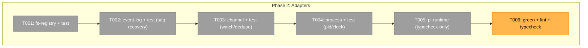

# Phase 2 — Adapters — Tasks

**Plan**: [pi-session-messaging-plan.md](../../pi-session-messaging-plan.md)
**Phase**: Phase 2: Adapters
**Status**: Proposed — awaiting GO

## Executive Briefing

- **Purpose**: Implement the **real** fs/process/pi adapters that satisfy the
  five Phase-1 port interfaces (`RegistryPort`, `EventLogPort`, `DeliveryPort`,
  `ProcessPort`, `PiRuntimePort`). Phase 1 proved the pure core against in-memory
  fakes; this phase makes it touch the disk, the OS, and (for one file only) pi.
- **What we're building**: `.pi/extensions/pij/adapters/{fs-registry,event-log,channel,process,pi-runtime}.ts`
  plus per-adapter tests over a tmp-fs (and a real `fs.watch`).
- **Goals**:
  - ✅ Every adapter is structurally substitutable for its fake (same port type) — the
    core + existing 50 specs stay untouched and green.
  - ✅ `event-log.ts` persists `seq` (counter) + ISO `timestamp` and recovers `lastSeq()`
    across a simulated reload (finding 02/06).
  - ✅ `channel.ts` writes atomically (tmp→copy) and the read side debounces + dedupes
    rapid writes (finding 03 — the proven prototype path).
  - ✅ `pi-runtime.ts` is the **only** file under `.pi/extensions/pij/` importing
    `@earendil-works/*` (finding 01); logic lifted from `scratch/messenger_test/messenger.ts`.
  - ✅ Data lives under `~/.pij/<id>.json` + `~/.pij/<id>/events.ndjson` (finding 06).
- **Non-Goals**:
  - ❌ No extension wiring / `session_start` / boot announce (Phase 3).
  - ❌ No `pij` CLI (Phase 4).
  - ❌ No two-window smoke (Phase 5).
  - ❌ No changes to `core/` or the Phase-1 fakes (adapters conform to the existing ports).

## Prior Phase Context

Phase 1 (commits `f46748e`, `d549dfe`, `6203775`) delivered the pi-free core + fakes +
50 green vitest specs; companion review = **APPROVE** on the core. The port contracts
this phase implements are frozen in `core/ports.ts`:

| Port | Methods (frozen) | Real adapter (this phase) |
|------|------------------|---------------------------|
| `RegistryPort` | `list()` · `read(id)` · `write(desc)` · `remove(id)` | `adapters/fs-registry.ts` |
| `EventLogPort` | `append(e)` · `read(query?)` · `lastSeq()` · `count()` | `adapters/event-log.ts` |
| `DeliveryPort` | `deliver(message): Result<{messageId}>` | `adapters/channel.ts` (writer) |
| `ProcessPort` | `pid()` · `isAlive(pid)` · `now()` · `env(key)` | `adapters/process.ts` |
| `PiRuntimePort` | `isIdle()` · `inject(text,mode)` · `compact()` | `adapters/pi-runtime.ts` |

> The receive/watch side of the channel (dir `fs.watch` + debounce/dedupe) is **not** a
> core port (the receive loop is wired in Phase 3). `channel.ts` therefore exports the
> `DeliveryPort` writer **plus** a `watch(dir, onMessage)` subscriber helper that Phase 3
> consumes; its dedupe/debounce is tested here.

## Pre-Implementation Check

| File | Exists? | Domain Check | Notes |
|------|---------|-------------|-------|
| `.pi/extensions/pij/adapters/fs-registry.ts` | No → create | pij-messaging (internal) | `~/.pij/<id>.json` read/write/scan/remove |
| `.pi/extensions/pij/adapters/event-log.ts` | No → create | pij-messaging (internal) | `~/.pij/<id>/events.ndjson` append/read/lastSeq/count |
| `.pi/extensions/pij/adapters/channel.ts` | No → create | pij-messaging (internal) | atomic tmp→copy writer + dir-watch subscriber |
| `.pi/extensions/pij/adapters/process.ts` | No → create | pij-messaging (internal) | pid/isAlive/now/env |
| `.pi/extensions/pij/adapters/pi-runtime.ts` | No → create | pij-messaging (**cross-domain**) | **only** `@earendil-works/*` importer |
| `.pi/extensions/pij/adapters/*.test.ts` | No → create | pij-messaging (internal) | tmp-fs + real `fs.watch` |
| `.pi/extensions/pij/core/ports.ts` | Yes → read-only | pij-messaging (contract) | frozen contract — adapters conform, do not edit |
| `.pi/extensions/pij/adapters/fakes.ts` | Yes → read-only | pij-messaging (internal) | reference shape for the real adapters |

> **Harness availability**: Router present — the implement verb fires the pre-implement seam
> before any code (T000) and the phase-end seam at close (T007). Phase-1 observed verdict =
> `degraded` (CLI installed, repo unadopted) → best-effort, narrated, ran on `just` gates.

## Architecture Map



```mermaid
flowchart LR
    Core[pure core] -->|RegistryPort| R[fs-registry.ts → ~/.pij/&lt;id&gt;.json]
    Core -->|EventLogPort| E[event-log.ts → ~/.pij/&lt;id&gt;/events.ndjson]
    Core -->|DeliveryPort| C[channel.ts → atomic tmp→copy]
    C -.dir fs.watch.-> Rx[Phase-3 receive loop]
    Core -->|ProcessPort| P[process.ts → pid/clock/env]
    Core -->|PiRuntimePort| PI[pi-runtime.ts → @earendil-works only]
```

## Tasks

| Status | ID | Task | Domain | Path(s) | Done When | Notes |
|--------|-----|------|--------|---------|-----------|-------|
| [x] | T000 | **Harness pre-flight** — `/eng-harness-flow --event pre-implement --phase "Phase 2: Adapters" --plan-dir docs/plans/014-pi-session-messaging` | — | — | Router envelope handled; verdict narrated verbatim before any code | Harness seam; plan 2.0 |
| [x] | T001 | Implement `fs-registry.ts` (`RegistryPort`): write/read/scan/remove `~/.pij/<id>.json` descriptors; base dir injected (constructor) for tmp-fs tests; tolerate a corrupt/stale descriptor file (skip, don't throw — P4) | pij-messaging | `/Users/jordanknight/pi-hacking/pij/.pi/extensions/pij/adapters/fs-registry.ts`, `.../adapters/fs-registry.test.ts` | tmp-fs test: `write`→`list`/`read` returns descriptor; `remove` deletes; a malformed file is skipped not fatal | Finding 06; plan 2.1; conforms to frozen `RegistryPort` |
| [x] | T002 | Implement `event-log.ts` (`EventLogPort`): append one ndjson line per event (core already stamps `seq`+ISO `timestamp`); `read(query?)` honours `since`/`type`/`last`; `lastSeq()` derives from the file (highest seq / 0 when empty); `count()` = line count; base dir injected | pij-messaging | `.../adapters/event-log.ts`, `.../adapters/event-log.test.ts` | tmp-fs test: append N → `read({since:K})` returns only `seq>K`; **`lastSeq()` correct after re-opening a fresh adapter over the same dir (simulated reload)**; `count()`=N | Findings 02,06; plan 2.2; the crash-recovery proof |
| [x] | T003 | Implement `channel.ts`: `DeliveryPort.deliver` writes the framed message atomically to the recipient's inbox **`~/.pij/<to>/inbox/msg-<id>.json`** (write a tmp file in that same dir → `copyFileSync`/`rename` into place) returning `Result<{messageId}>`; export `watch(inboxDir,onMessage)` subscriber that dir-`fs.watch`es **`~/.pij/<self>/inbox/`**, debounces, and dedupes by message id; `pijHome` base injected | pij-messaging | `.../adapters/channel.ts`, `.../adapters/channel.test.ts` | tmp-fs test: N rapid `deliver`s to `<to>/inbox/` all surface through `watch` **exactly once**, in order; partial/tmp files never delivered | Finding 03 (proven prototype path); plan 2.3; **inbox path `~/.pij/<id>/inbox/` is the writer↔watcher↔CLI contract** |
| [x] | T004 | Implement `process.ts` (`ProcessPort`): `pid()`=`process.pid`; `isAlive(pid)` via `process.kill(pid,0)` (ESRCH→dead, EPERM→alive); `now()`=`Date.now()`; `env(key)`=`process.env[key]` | pij-messaging | `.../adapters/process.ts`, `.../adapters/process.test.ts` | test: own pid → alive; an unused/bogus pid → dead; `env` round-trips a set var | Finding 04; plan 2.4 |
| [x] | T005 | Implement `pi-runtime.ts` (`PiRuntimePort`): wrap `sendUserMessage`(idle→immediate / busy→`{deliverAs:"steer"}`), `isIdle()`, `compact()`; **the only file importing `@earendil-works/*`**; logic lifted verbatim from `scratch/messenger_test/messenger.ts` | pij-messaging | `.../adapters/pi-runtime.ts` | `just typecheck` clean against the shipped `types.d.ts`; structurally satisfies `PiRuntimePort`; no runtime unit test (exercised live in Phase 3 wiring + Phase 5 smoke) | Finding 01; plan 2.5; pi-import boundary |
| [x] | T006 | Run `just test` (vitest green incl. the existing 50 + new adapter specs), `just lint` (Biome), `just typecheck`; assert **no** `@earendil-works/*` import outside `adapters/pi-runtime.ts` | pij-messaging | — | All three exit 0; grep proves the single-pi-importer invariant | Phase gate; AC-12 (partial) |
| [x] | T007 | **Harness phase-end** — `/eng-harness-flow --event phase-end --plan-dir docs/plans/014-pi-session-messaging` | — | — | Router envelope handled at phase end | Harness seam; plan 2.z |

## Context Brief

**Key findings from plan** (Phase-2-relevant):
- **Finding 01 (Critical)** — inject primitive proven; `pi-runtime.ts` lifts
  `scratch/messenger_test/messenger.ts` verbatim. The only pi importer (T005).
- **Finding 02 (Critical)** — pij owns `seq`+ISO `timestamp`; `event-log.ts` must make
  `lastSeq()` survive a fresh adapter over an existing log (T002 reload test).
- **Finding 03 (High)** — `fs.watch` is flaky on files → watch the **directory**, write
  atomically (tmp→copy), debounce + dedupe by message id (T003).
- **Finding 04 (High)** — pid liveness + clock injected for deterministic tests (T004).
- **Finding 06 (High)** — data under `~/.pij/<id>.json` + `~/.pij/<id>/events.ndjson`;
  the **base dir is constructor-injected** so tests run on a tmp dir (T001–T003).

**Domain dependencies** (runtime):
- `pij-messaging`: this phase implements its own ports — no other domain consumed except
  `pi runtime` (via the single `pi-runtime.ts` boundary) and `extension-authoring-harness`
  (vitest/Biome/tsc).

**Domain constraints**:
- Adapters conform to the **frozen** `core/ports.ts` — do not edit ports/types/fakes.
- Side effects (fs, OS, pi) live **only** in adapters (P3); the **one shared `pijHome` base
  path (`~/.pij`) is constructor-injected** into `fs-registry`, `event-log`, and `channel`
  so a single tmp dir backs all three in tests; never hard-read `os.homedir()` in the hot path.
- **On-disk layout (the cross-phase contract)**: descriptor `~/.pij/<id>.json`; per-session
  dir `~/.pij/<id>/{events.ndjson, inbox/}`. `deliver` writes `~/.pij/<to>/inbox/msg-<id>.json`;
  the receiver watches `~/.pij/<self>/inbox/`. Phase 3 (receive) + Phase 4 (`pij send`) both bind to this.
- Tagged-union returns over throws at the boundary (P4); `.js` ESM specifiers (P7).
- **`@earendil-works/*` imports allowed in exactly one file**: `adapters/pi-runtime.ts`.
- Tests target the adapters over a tmp-fs + real `fs.watch` (no mocks of node:fs).

**Harness context** (router installed):
- **Pre-implement seam** (T000) → narrate verdict verbatim (`healthy/SLOW/UNHEALTHY/UNAVAILABLE`).
- **Phase-end seam** (T007). Phase-1 observed `degraded` → best-effort, ran on `just` gates.
- **Backpressure**: no `backpressure-coverage.md` → standard testing.

**Reusable from prior phases**:
- `core/ports.ts` + `core/types.ts` (frozen contract).
- `adapters/fakes.ts` — the in-memory reference each real adapter must match shape-for-shape.
- `scratch/messenger_test/{messenger.ts,send.ts}` — proven inject + atomic-channel logic to
  graduate into `pi-runtime.ts` (T005) and `channel.ts` (T003).

**Mermaid sequence** (channel dedupe, finding 03):
```mermaid
sequenceDiagram
    participant S as sender (deliver)
    participant FS as ~/.pij/&lt;to&gt;/inbox
    participant W as watch(dir,onMessage)
    S->>FS: write tmp → copy msg-<id>.json (atomic)
    S->>FS: write tmp → copy msg-<id>.json (rapid, same id?)
    FS-->>W: fs.watch fires (maybe N times)
    W->>W: debounce + dedupe by message id
    W-->>W: onMessage(msg) exactly once
```

## Discoveries & Learnings

_Populated during implementation by the implement verb._

| Date | Task | Type | Discovery | Resolution | References |
|------|------|------|-----------|------------|------------|

---

```
docs/plans/014-pi-session-messaging/
  └── tasks/phase-2-adapters/
      ├── tasks.md
      └── execution.log.md   # created by the implement verb
```

---

## Validation Record (2026-06-16)

### Validation Thesis

**Raison d'être**: Give the implementer an ordered, contract-bound task list to build the five real adapters against the frozen Phase-1 ports, without re-reading the whole plan or re-deriving the on-disk layout.

**Value claim**: Implementation is cheaper/safer — each adapter is a drop-in for its fake (same port type), so the proven core + 50 specs stay green while I/O is added behind tmp-fs tests.

**Artifact promise**: The implement verb can execute T000–T007 and produce green fs/process/pi adapters; Phases 3–4 wire them with no contract surprises (inbox path + port shapes pinned here).

**Intended beneficiaries**: implementing agent; Phase 3 (receive loop consumes `channel.watch` + all adapters); Phase 4 (CLI consumes registry/event-log/process + `deliver`).

**Proof target**: Implementation.

**Evidence standard**: every plan task 2.1–2.5 mapped to a T-task; absolute paths; testable Done-When; adapters conform to the **frozen** `core/ports.ts`; single-pi-importer invariant asserted; on-disk layout pinned for downstream phases.

**Thesis source**: `pi-session-messaging-plan.md` Phase 2 + `core/ports.ts` (frozen) + findings 01–06.

**Thesis verdict**: Advanced.

**Main thesis risk**: `fs.watch` flakiness (the historical hazard) — contained by dir-watch + atomic write + dedupe (the proven prototype path) and a rapid-write tmp-fs test.

| Agent (lens, inline) | Lenses Covered | Issues | Verdict |
|---|---|---|---|
| Source Truth | path validity (all create under adapters/), frozen-contract files read-only | 0 | ✅ |
| Cross-Reference | plan 2.1–2.5 ↔ T001–T005, finding refs (01–06), port-method conformance | 0 (2.1→T001, 2.2→T002, 2.3→T003, 2.4→T004, 2.5→T005) | ✅ |
| Completeness | done-when testability, seq-reload proof, single-pi-importer assertion, channel watch helper | 1 MEDIUM fixed (inbox path unpinned) | ⚠️→✅ |
| Risk & Security | fs.watch mitigation, no-shell adapters, pi-import boundary | 0 | ✅ |
| Thesis Alignment | thesis drift, proof-level fit | 0 | ✅ |
| Forward-Compatibility | Phase-3 watch/inject consumers, Phase-4 CLI consumers, shared `pijHome` | 1 MEDIUM fixed (inbox path is the writer↔watcher↔CLI contract) | ⚠️→✅ |

### Thesis Verdict

- **Thesis understood?** Yes
- **Thesis source**: plan Phase 2 + frozen ports
- **Value claim advanced?** Yes
- **Proof level**: Target = Implementation; Actual = Implementation
- **Evidence quality**: Strong (every plan task mapped; adapters bound to frozen ports; layout pinned)
- **Main thesis risk**: `fs.watch` reliability; contained by the proven dir-watch+atomic+dedupe path and T003's rapid-write test.

### Forward-Compatibility Matrix

| Consumer | Requirement | Failure Mode | Verdict | Evidence |
|----------|-------------|--------------|---------|----------|
| Implement verb | 7-col table, abs paths, testable Done-When | shape mismatch | ✅ | Tasks table complete; T006 gate |
| Phase 3 (receive loop) | `channel.watch(inboxDir,onMessage)` + `pi-runtime` inject/isIdle/compact | encapsulation lockout | ✅ | T003 exports `watch`; T005 satisfies `PiRuntimePort` |
| Phase 4 (`pij send`/`tail`/`state`) | `deliver` routes to a known inbox; `event-log.read(since/type)`; `process.env`/pid | path/contract drift | ✅ (fixed) | Inbox path `~/.pij/<id>/inbox/` pinned; ports frozen |
| Existing 50 core specs + fakes | Real adapters substitutable for fakes (same port types) | regression | ✅ | Adapters conform to frozen `core/ports.ts`; T006 reruns full suite |
| Harness router | Pre-implement/phase-end seams per phase | lifecycle ownership | ✅ | T000/T007 rows + plan Harness Seams |

**Thesis alignment**: The dossier advances the value claim (drop-in real adapters behind frozen ports) at Implementation proof level; main risk (`fs.watch`) is contained by the proven path.

**Outcome alignment**: Advances the spec's North Star — the seq+timestamp event log and the atomic delivery channel are exactly the I/O the parent's incremental observation + the worker's message receipt depend on.

**Standalone?**: No — implement verb + Phases 3/4 consume this; all satisfied above.

**Overall: VALIDATED WITH FIXES** — 1 MEDIUM found and fixed inline (channel inbox path `~/.pij/<id>/inbox/` pinned as the writer↔watcher↔CLI contract + shared `pijHome` injection); no open CRITICAL/HIGH.

## Execution Log (Phase 2 — implemented 2026-06-16)

| Task | Outcome |
|------|---------|
| T000 | Pre-implement harness seam fired (`harness doctor` envelope) — same `degraded`-class as Phase 1 (CLI installed, repo unadopted). Best-effort, narrated, ran on `just` gates. |
| T001 | `adapters/fs-registry.ts` + 6 tests — write/read/list/remove over `<pijHome>/<id>.json`; atomic write (dot-tmp → `renameSync`); malformed file + `<id>/` subdir skipped; reload-safe. |
| T002 | `adapters/event-log.ts` + 5 tests — ndjson append/read (reuses pure `filterEvents`); **`lastSeq()`/`count()` recover from disk in a fresh adapter (reload proof)**; since/type/last filters. |
| T003 | `adapters/channel.ts` + 4 tests — `deliver` writes `<pijHome>/<to>/inbox/msg-<id>.json` atomically; `watch()` dir-watches `<self>/inbox/`, debounces (20ms), dedupes by id; **real `fs.watch` test green** (drain + live + routing). |
| T004 | `adapters/process.ts` + 4 tests — pid / `process.kill(pid,0)` liveness (ESRCH→dead, EPERM→alive) / clock / env. |
| T005 | `adapters/pi-runtime.ts` — the **only** `@earendil-works` importer; lifts the proven `messenger.ts` inject (idle→send, busy→steer); typecheck-only (live in Phase 3/5). |
| T006 | Gate: `just typecheck` clean, `just lint` clean, **full suite 379 pass / 4 skip** (26 in pij/adapters: 19 new + 7 fakes). Invariant asserted: `grep 'from "@earendil-works'` → only `index.ts` + `adapters/pi-runtime.ts`; **core/ zero**. |

### Discoveries & Learnings

- **`@earendil-works` appears in `core/` comments** ("imports NOTHING from @earendil-works") → a bare `grep -l @earendil-works` false-positives. The real invariant check is `grep 'from "@earendil-works'` (import specifier), not the bare string.
- **Atomic delivery via `renameSync`, not `copyFileSync`**: the dossier allowed either; `rename` within the inbox dir is truly atomic, so the watcher never reads a partial file and the dot-tmp prefix (`.tmp-*`) is naturally excluded by the `msg-*.json` filter. Strictly safer than the prototype's `copyFileSync`.
- **`fs.watch` test is fast + reliable when you drain on subscribe**: `watch()` runs an initial synchronous `scan()`, so messages written *before* subscribe are picked up without waiting on an OS event; only the live-write case depends on `fs.watch` timing (debounced 20ms). 202ms for the whole channel suite.
- **`ctx.compact(options?)` is optional-arg** (verified in shipped `types.d.ts:238`) → `ctx.compact()` typechecks with no payload; no need to fabricate `{onComplete}`.
