# Phase 3 — pij extension (receive + serve) — Tasks

**Plan**: [pi-session-messaging-plan.md](../../pi-session-messaging-plan.md)
**Phase**: Phase 3: pij extension (receive + serve)
**Status**: Proposed — awaiting GO

## Executive Briefing

- **Purpose**: Wire the Phase-1 pure core + Phase-2 real adapters into the live pi
  extension (`.pi/extensions/pij/index.ts`, currently a stub). On boot the session
  announces itself + role, exports its id into the process env, captures its own pi
  activity into `events.ndjson`, receives peer messages/commands off its inbox channel
  (idle→inject / busy→steer), runs the `compact` allow-list, emits delivery receipts,
  and cleans up on shutdown.
- **Testability backbone (design decision)**: all decision logic lives in a **new pure
  coordinator `core/session.ts` (`PijSession`)** that takes the five ports + plain data
  (no pi types). `index.ts` is a thin translator: it maps pi events (`session_start`,
  `input`, `turn_start`, `tool_*`, `message_*`, `session_shutdown`) into `PijSession`
  calls and the `FsChannel.watch` subscription. `PijSession` is unit-tested against the
  fakes (P8); `index.ts` stays pi-only and typecheck-only (proven live in Phase 5 smoke),
  exactly like `adapters/pi-runtime.ts`.
- **Goals**:
  - ✅ One `session_start` handler for **all** reasons (startup/reload/new/resume/fork) — P10.
  - ✅ `seq` recovers across `/reload`: `new SeqCounter(eventLog.lastSeq())` at boot (finding 04).
  - ✅ Self-id resolves even when parent+worker share a cwd: `PIJ_SESSION_ID`/`PIJ_ROLE`
    exported into the process env at boot (finding 07).
  - ✅ Inject path matches the proven prototype exactly (idle→immediate, busy→steer; finding 01).
  - ✅ Delivery receipts: classify via `input.streamingBehavior`, resolve `delivered` on the
    next `turn_start`, send receipts back as ordinary pij messages (finding 08, AC-13).
  - ✅ `compact` allow-list only; unknown commands rejected before any pi call (finding 05).
- **Non-Goals**:
  - ❌ No `pij` CLI (Phase 4 — separate entry point over the same core+adapters).
  - ❌ No *new* two-window smoke scenarios / CI / docs (Phase 5); T011 only reconciles the existing `/pij` stub assertion.
  - ❌ No changes to `core/{types,ports}` (frozen) or the Phase-2 adapter contracts.
  - ❌ No new remote commands beyond `compact`.

## Prior Phase Context

- **Phase 1** (`d549dfe`): pure core + 5 ports + fakes. Coordinator will call:
  `resolveSelf(envId, locals)`, `new SeqCounter(lastSeq)`, `buildEvent(seq,type,now,data)`,
  `frame(from,body)`/`announceText(self,role)`, `validateCommand(name)`,
  `classifyOnInject(idle)`/`initialReceipt(...)`/`markDelivered(...)`/`correlateDeliveredAt(injectIso,steer,turnStartIsos)`,
  `liveness(...)`.
- **Phase 2** (`98ea59c`): real adapters. Coordinator is constructed with
  `FsRegistry`, `FsEventLog`, `FsChannel` (its `deliver` = `DeliveryPort`; its `watch` is
  consumed by `index.ts`), `NodeProcess`, `PiRuntimeAdapter(pi,ctx)`. Inbox contract:
  `~/.pij/<id>/inbox/msg-<id>.json` (writer↔watcher↔CLI).

## Pre-Implementation Check

| File | Exists? | Domain Check | Notes |
|------|---------|-------------|-------|
| `.pi/extensions/pij/core/session.ts` | No → create | pij-messaging (internal) | **NEW** pure `PijSession` coordinator (ports-only; pi-free) |
| `.pi/extensions/pij/core/session.test.ts` | No → create | pij-messaging (internal) | vitest vs fakes — the real unit coverage for Phase 3 |
| `.pi/extensions/pij/index.ts` | Yes → rewrite | pij-messaging (internal) | replace the Phase-1 stub with thin pi→coordinator wiring |
| `.pi/extensions/pij/core/ports.ts` | Yes → read-only | pij-messaging (contract) | frozen |
| `.pi/extensions/pij/adapters/*.ts` | Yes → read-only | pij-messaging (internal) | constructed by `index.ts`; not edited |
| `.pi/extensions/pij/smoke.ts` (the `/pij` scenario; `harness/scripts/smoke.ts` is only the runner) | Yes → update | extension-authoring-harness | Phase-1 asserts `/pij` → `not implemented`; wiring replaces it, so the `expect` regex must move to the pinned wired `/pij` status line (T011) |

> **Harness availability**: Router present — pre-implement seam (T000) before code, phase-end (T012)
> at close. Phases 1–2 observed `degraded` (CLI installed, repo unadopted) → best-effort, ran on `just` gates.

## Architecture Map

```mermaid
flowchart TD
    classDef pending fill:#9E9E9E,stroke:#757575,color:#fff
    classDef test fill:#FFB74D,stroke:#F57C00,color:#000
    classDef wire fill:#64B5F6,stroke:#1976D2,color:#000

    subgraph Phase["Phase 3: pij extension (receive + serve)"]
        T001["T001: PijSession tests (TDD)"]:::test
        T002["T002: core/session.ts coordinator"]:::pending
        T003["T003: session_start boot (P10)"]:::wire
        T004["T004: announce + role inject"]:::wire
        T005["T005: event capture"]:::wire
        T006["T006: delivery injector"]:::wire
        T007["T007: command exec (compact)"]:::wire
        T008["T008: PIJ_SESSION_ID env export"]:::wire
        T009["T009: delivery receipts"]:::wire
        T010["T010: session_shutdown cleanup"]:::wire
        T011["T011: green + lint + typecheck + smoke"]:::test
        T001 --> T002 --> T003 --> T004 --> T005 --> T006 --> T007 --> T008 --> T009 --> T010 --> T011
    end
```



```mermaid
sequenceDiagram
    participant PI as pi runtime
    participant IDX as index.ts (thin)
    participant S as PijSession (pure)
    participant CH as FsChannel
    PI->>IDX: session_start (any reason)
    IDX->>S: boot(envId, role) → descriptor + SeqCounter(lastSeq)
    S-->>IDX: announce text → pirt.inject(immediate)
    IDX->>PI: export PIJ_SESSION_ID / PIJ_ROLE
    CH-->>IDX: watch(self/inbox) → DeliveredMessage
    IDX->>S: onInbound(msg)  (command? compact : frame+inject idle/steer)
    S-->>IDX: receipt(queued|delivered) → deliver back to msg.from
    PI->>IDX: turn_start(iso)
    IDX->>S: onTurnStart(iso) → correlate queued → delivered receipts
    PI->>IDX: tool_call / tool_result / message_* (+ sampled usage via getContextUsage)
    IDX->>S: capture(type,data) → buildEvent(seq++) → eventLog.append
    PI->>IDX: session_shutdown
    IDX->>S: shutdown() → registry.remove(self); close watcher
```

## Tasks

| Status | ID | Task | Domain | Path(s) | Done When | Notes |
|--------|-----|------|--------|---------|-----------|-------|
| [x] | T000 | **Harness pre-flight** — `/eng-harness-flow --event pre-implement --phase "Phase 3: pij extension (receive + serve)" --plan-dir docs/plans/014-pi-session-messaging` | — | — | Router envelope handled; verdict narrated verbatim before any code | Harness seam; plan 3.0 |
| [x] | T001 | **Tests first** for `PijSession` (vs fakes): `boot(sessionId,role)` derives a stable self-id from pi's session identity (first boot mints + writes the descriptor; reload reuses the same id — no `E-AMBIG`, no duplicate descriptor) + returns the `(id,role)` the wiring exports + seeds `SeqCounter` from `lastSeq()`; `capture` appends `buildEvent` with monotonic seq+timestamp; `onInbound` text → frame (surfacing `msg.from` so a reply needs no lookup, AC-5) + idle/steer inject + emits `queued|delivered` receipt; `onInbound` command → `compact` accepted / unknown rejected (`E-CMD`, no pi call); `onTurnStart` correlates queued receipts → `delivered`; `shutdown` removes descriptor | pij-messaging | `/Users/jordanknight/pi-hacking/pij/.pi/extensions/pij/core/session.test.ts` | vitest red: all `PijSession` specs present and failing | TDD (G6); covers findings 01,04,05,07,08; AC-2/3/4/5/6/13 |
| [x] | T002 | Implement **`core/session.ts`** `PijSession`: ctor takes the 5 ports (`RegistryPort`,`EventLogPort`,`DeliveryPort`,`PiRuntimePort`,`ProcessPort`); methods `boot(sessionId,role)` (mints/persists the descriptor on first boot, reuses on reload, returns `(id,role)` to export — does NOT call `resolveSelf`, which is the Phase-4 CLI's "which am I" resolver), `capture(type,data)`, `onInbound(msg)`, `onTurnStart(iso)`, `shutdown()`. **Pi-free** (ports + plain data only); tagged-union results (P4); constants colocated (P5) | pij-messaging | `/Users/jordanknight/pi-hacking/pij/.pi/extensions/pij/core/session.ts` | T001 green; **no `@earendil-works/*` import in `core/`** (P2); logic reuses Phase-1 core helpers verbatim | plan 3.1–3.5/3.7/3.8 logic; the testable backbone |
| [x] | T003 | `index.ts` `session_start` (**all reasons**, P10): construct adapters (`pijHome=~/.pij`); derive the session id from **pi's own session identity** (available in `session_start`, e.g. `ctx.sessionManager` — always present, even on first boot), `PijSession.boot(sessionId, role)`, write descriptor, init `SeqCounter` from `eventLog.lastSeq()`; reload reuses the same id (no duplicate descriptor, no replay). Session **state is derived on read** — no `state.json` written in Phase 3. `resolveSelf` is **not** used here (it is the CLI's resolver) | pij-messaging | `/Users/jordanknight/pi-hacking/pij/.pi/extensions/pij/index.ts` | typecheck clean; **first boot with unset env still yields a valid id + descriptor (never E-AMBIG)**; reload-safe | plan 3.1; P10; finding 04 |
| [x] | T004 | `index.ts` boot self-announce + role: inject `announceText(self, role)` via `PiRuntimeAdapter.inject(text,"immediate")` once per session | pij-messaging | `/Users/jordanknight/pi-hacking/pij/.pi/extensions/pij/index.ts` | typecheck clean; announce delegated to coordinator (tested in T001) | plan 3.2; AC-2 |
| [x] | T005 | `index.ts` event capture: subscribe to pi `tool_call`/`tool_result`/`message_*` events → `PijSession.capture(type,data)` (→ `buildEvent(seq.next(), …)` → `eventLog.append`). **There is no pi `usage` event** — if usage/context is wanted, sample `ctx.getContextUsage()` on `message_end`. **Also capture each receipt (`type:"receipt"`)** so AC-13 is visible via `pij tail`/`state` | pij-messaging | `/Users/jordanknight/pi-hacking/pij/.pi/extensions/pij/index.ts` | typecheck clean (no `pi.on("usage")`); each subscribed pi event maps to one `capture` call | plan 3.3; AC-7/7a/13 |
| [x] | T006 | `index.ts` delivery injector: `FsChannel.watch(self, onMsg, seen)` where `seen: Set<string>` is pre-seeded at boot with the filenames already in `~/.pij/<self>/inbox/` (so reload doesn't replay) → `PijSession.onInbound(msg)`; idle→immediate, busy→steer (matches prototype) | pij-messaging | `/Users/jordanknight/pi-hacking/pij/.pi/extensions/pij/index.ts` | typecheck clean; watcher started in `session_start`, not the factory; framed inject exposes `msg.from` (AC-5) | plan 3.4; AC-3/4/5; finding 01 |
| [x] | T007 | `index.ts` command exec: an inbound message with `command` routes through `PijSession.onInbound` → `validateCommand` → `PiRuntimeAdapter.compact()`; unknown → rejected (no pi call), surfaced as a `receipt`/log | pij-messaging | `/Users/jordanknight/pi-hacking/pij/.pi/extensions/pij/index.ts` | typecheck clean; only `compact` reaches pi | plan 3.5; AC-6; finding 05 |
| [x] | T008 | `index.ts` export `PIJ_SESSION_ID` (+`PIJ_ROLE`) into the session **process env** at boot (`process.env.PIJ_SESSION_ID = <id minted by PijSession.boot in T003>`) so a child `pij` CLI inherits it and resolves "self" unambiguously when two sessions share a cwd | pij-messaging | `/Users/jordanknight/pi-hacking/pij/.pi/extensions/pij/index.ts` | typecheck clean; env vars set before any child spawn; consumed by Phase-4 `whoami`. **The env→child inheritance is not fakes-testable (mutation lives in the typecheck-only `index.ts`) → proven by a named Phase-5 smoke assertion** | plan 3.7; **finding 07 (HIGH)**; AC-1 |
| [x] | T009 | `index.ts` + coordinator delivery receipts: on `onInbound` classify via `input.streamingBehavior` (**`undefined`→idle→`delivered`; `"steer"` or `"followUp"`→busy→`queued`**); subscribe pi `input`(`streamingBehavior`) + `turn_start`(`timestamp` — a **number** epoch ms; convert `new Date(ts).toISOString()`); `PijSession.onTurnStart(iso)` resolves queued→`delivered` via `correlateDeliveredAt(injectIso, steer, turnStartIsos)`; send each receipt back to `msg.from` as `[pij receipt <id>] queued|delivered` **tagged `source:"extension"` and also appended to `events.ndjson` (`type:"receipt"`) so the sender sees it via `pij tail`/`state` without auto-triggering a turn in the (expensive) parent** | pij-messaging | `/Users/jordanknight/pi-hacking/pij/.pi/extensions/pij/index.ts`, `/Users/jordanknight/pi-hacking/pij/.pi/extensions/pij/core/session.ts` | typecheck clean; T001 receipt specs green; idle→single `delivered`, busy→`queued` then `delivered` | plan 3.8; **finding 08**; AC-13 |
| [x] | T010 | `index.ts` `session_shutdown`: close the channel watcher + any timers; `registry.remove(self)` (or flag inactive) so `pij list` stops showing it active | pij-messaging | `/Users/jordanknight/pi-hacking/pij/.pi/extensions/pij/index.ts` | typecheck clean; no leaked watchers/timers; descriptor removed | plan 3.6; P-cleanup |
| [x] | T011 | Gate: `just test` (green incl. new `session.test.ts`), `just lint`, `just typecheck`; assert single-pi-importer invariant still holds (`core/` zero; only `index.ts` + `adapters/pi-runtime.ts`); **`just smoke` pij case** — the assertion lives in **`.pi/extensions/pij/smoke.ts`** (not `harness/scripts/smoke.ts`, the runner); update its `expect` regex from `not implemented` to the **pinned wired `/pij` status line**: `pij: <id> · role=<role> · peers <n> · events <m>` | pij-messaging | — | All gates exit 0; smoke pij case green against the pinned `/pij` status line | Phase gate; AC-12 (partial); smoke-string reconciliation |
| [x] | T012 | **Harness phase-end** — `/eng-harness-flow --event phase-end --plan-dir docs/plans/014-pi-session-messaging` | — | — | Router envelope handled at phase end | Harness seam; plan 3.z |

## Context Brief

**Key findings from plan** (Phase-3-relevant):
- **Finding 01 (Critical)** — inject primitive proven; T006 uses `PiRuntimeAdapter` (idle→immediate, busy→steer) exactly as `messenger.ts`.
- **Finding 04 (High)** — `SeqCounter(eventLog.lastSeq())` at boot keeps seq monotonic across `/reload` (T003).
- **Finding 05 (High)** — `compact` allow-list; unknown rejected before any pi call (T007).
- **Finding 07 (High)** — `PIJ_SESSION_ID`/`PIJ_ROLE` exported into process env so the CLI resolves self under a shared cwd (T008).
- **Finding 08 (High)** — receipts: `input.streamingBehavior` classifies; delivery = next `turn_start` after an `input(steer)`; no `before_agent_start` for a steered inject (T009).

**Domain constraints**:
- `core/session.ts` imports **nothing** from `@earendil-works/*` (P2/P9) — it is pure core.
- The only pi importers remain `index.ts` (wiring) + `adapters/pi-runtime.ts` (T011 asserts this).
- One `session_start` handler, all reasons (P10); watchers started in `session_start`, closed in `session_shutdown` (per pi docs + prototype).
- Tagged-union results (P4); constants colocated (P5); `.js` ESM specifiers (P7).
- Tests target `PijSession`, not the wiring (P8); `index.ts` is typecheck-only, proven in Phase 5 smoke.

**Harness context**: pre-implement (T000) verdict narrated verbatim; phase-end (T012); no `backpressure-coverage.md` → standard testing.

**Reusable**: `core/*` (Phase 1), `adapters/*` (Phase 2), `scratch/receipt_test/receipt-probe.ts` (the proven `streamingBehavior`/`turn_start` correlation reference for T009).

## Design Decisions (for the validator)

1. **New file `core/session.ts` (`PijSession`)** — not in the plan's manifest, which put all wiring in `index.ts`. Introduced so Phase-3 decision logic is unit-testable against fakes without a live pi (honours P8 + the spec's Hybrid testing). `index.ts` shrinks to a pi-event translator. This is a decomposition of plan tasks 3.1–3.8, not new scope.
2. **`index.ts` is typecheck-only** (no unit test), same rationale as `adapters/pi-runtime.ts`: it only touches pi APIs. Behaviour is covered by `PijSession` unit tests now + the two-window Driver smoke in Phase 5.
3. **`/pij` smoke string** — wiring replaces the Phase-1 "not implemented" stub, so the existing smoke assertion (in `.pi/extensions/pij/smoke.ts`, not the runner) must change (T011). A pinned literal `pij: <id> · role=<role> · peers <n> · events <m>` is chosen now so the Phase-5 smoke asserts against a stable surface, not an implement-time accident.
4. **Boot mints the id; `resolveSelf` does not** (fix from validation): the extension is the *producer* of `PIJ_SESSION_ID`, so it cannot read its own id from the env on first boot. `PijSession.boot` derives a stable id from pi's session identity (always present in `session_start`), persists the descriptor, then T008 exports it. `resolveSelf` (env→lone-local→E-AMBIG) is reserved for the **Phase-4 CLI's** "which am I" resolution — it never gates the extension's boot.
5. **Receipts are events-only + `source:"extension"`** (fix from validation): a receipt is appended to the sender's `events.ndjson` (`type:"receipt"`, satisfying AC-13's "visible in `pij tail`/`state`") and tagged `source:"extension"` so it does **not** auto-trigger a turn in the receiving session. This keeps the expensive parent from being woken (and billed) by every receipt of its own outbound messages — preserving the North Star.

## Discoveries & Learnings

_Populated during implementation by the implement verb._

| Date | Task | Type | Discovery | Resolution | References |
|------|------|------|-----------|------------|------------|

---

```
docs/plans/014-pi-session-messaging/
  └── tasks/phase-3-pij-extension-receive-serve/
      ├── tasks.md
      └── execution.log.md   # created by the implement verb
```

---

## Validation Record (2026-06-16)

_Ran the `validate-v2` skill: 4 parallel `flowspace-research-v2` agents (Source-Truth, Cross-Reference+Completeness, Thesis Alignment, Forward-Compatibility) against the live source + plan + spec + scratch evidence._

### Validation Thesis

**Raison d'être**: Give the implementer an ordered, contract-bound task list to wire the proven core+adapters into the live pi extension (announce, capture events, receive messages/commands, emit receipts, self-identify) without re-deriving the integration design.

**Value claim**: Phase-3 implementation is cheaper/safer because the pi-coupled wiring is decomposed into a pure unit-tested coordinator (`core/session.ts` `PijSession`) + a thin typecheck-only `index.ts`, so logic is proven against fakes before any live-pi smoke.

**Artifact promise**: the implement verb can execute T000–T012 to a green pi-free coordinator + wired extension; Phase 4 CLI + Phase 5 smoke consume the same core+adapters with no contract surprises (env self-id, inbox path, receipt protocol pinned).

**Intended beneficiaries**: implementing agent; Phase 4 (CLI); Phase 5 (smoke); the parent reviewer.

**Proof target**: Implementation.

**Evidence standard**: every plan task 3.1–3.8 → a T-task; testable Done-When; pi-free coordinator (P2/P8); findings 01/04/05/07/08 + AC-2/3/4/5/6/13 covered; harness seams present.

**Thesis source**: `pi-session-messaging-plan.md` Phase 3 + spec ACs + findings 01/04/05/07/08.

**Thesis verdict**: Advanced (with fixes).

**Main thesis risk**: the shared-cwd self-id env export (finding 07) and the pi-event translation in `index.ts` are typecheck-only — their behavioural proof is deferred to Phase-5 smoke; this is now explicit + named in T008/T011, not hidden.

---

| Agent | Lenses Covered | Thesis Axes | Issues | Verdict |
|-------|---------------|-------------|--------|---------|
| Source Truth | Concept Documentation, Technical Constraints, Hidden Assumptions | Evidence Sufficiency | 1 CRITICAL + 1 MEDIUM + 3 LOW — all fixed | ⚠️→✅ |
| Cross-Reference + Completeness | Integration & Ripple, Edge Cases, Domain Boundaries | Implementation Readiness | 1 HIGH + 1 MEDIUM + 2 LOW — all fixed | ⚠️→✅ |
| Thesis Alignment | Thesis Alignment, Evidence Sufficiency, Proof-Level Fit | Thesis, Proof-Level Fit | 1 MEDIUM + 3 LOW — fixed/accepted | ✅ |
| Forward-Compatibility | Forward-Compatibility, Deployment & Ops, Security & Privacy | Downstream Usefulness, Safety to Change | 3 MEDIUM + 3 LOW — fixed/accepted | ⚠️→✅ |

**Lens coverage**: 12/15 (Thesis Alignment ✓, Forward-Compatibility ✓, Evidence Sufficiency, Proof-Level Fit, Concept Documentation, Technical Constraints, Hidden Assumptions, Integration & Ripple, Edge Cases, Domain Boundaries, Deployment & Ops, Security & Privacy).

### Fixes Applied (CRITICAL/HIGH + mechanical MEDIUM/LOW)

- **C1 (CRITICAL)** — removed the non-existent pi `usage` event from T005/sequence diagram (it would fail the typecheck Done-When); added `ctx.getContextUsage()` sampling on `message_end` as the alternative.
- **HIGH-1 / M2** — fixed the boot id source: `PijSession.boot(sessionId,role)` mints/derives the id from pi's session identity (first boot) and reuses on reload; `resolveSelf` reserved for the Phase-4 CLI (no longer a circular env dependency / `E-AMBIG` on first boot). New Design Decision #4.
- **M1** — corrected `correlateDeliveredAt(injectIso, steer, turnStartIsos)` (3-arg) everywhere.
- **MEDIUM-1** — corrected the smoke-string target to `.pi/extensions/pij/smoke.ts` (the runner `harness/scripts/smoke.ts` holds no assertion) and pinned the wired `/pij` literal.
- **FC Issue 2/3** — receipts now append to `events.ndjson` (`type:"receipt"`, satisfies AC-13 `pij tail`/`state`) and carry `source:"extension"` so they don't wake/bill the expensive parent. New Design Decision #5.
- **L1** — `streamingBehavior` is `undefined` (idle) and `"steer"|"followUp"` (busy), not `null`/`"steer"`.
- **L2** — `turn_start.timestamp` is a `number` (epoch ms) → convert to ISO at the thin layer.
- **L3** — `FsChannel.watch`'s third param is `seen: Set<string>` of inbox filenames, not a single watermark.
- **LOW-1** — noted session state is **derived** (no `state.json` written in Phase 3).
- **LOW-2** — moved the AC-5 tag from T008 (env export) to T006 (inbound framing).
- **Issue 5** — expanded all `.../` path shorthands to absolute paths (implement-verb requirement).

### Forward-Compatibility Matrix

| Consumer | Requirement | Failure Mode | Verdict | Evidence |
|----------|-------------|--------------|---------|----------|
| Phase 4 CLI | `PIJ_SESSION_ID`/`PIJ_ROLE` env export + `~/.pij/<id>/inbox/` path + displayable receipt format | encapsulation lockout / shape mismatch | ✅ | T008 exports env (from the id minted in T003); inbox path re-pinned; receipt literal `[pij receipt <id>] queued|delivered` + `type:"receipt"` events record (fixed) |
| Phase 5 smoke | stable `/pij` surface + two-window observable boot/announce/inject/receipt | contract drift / test boundary | ✅ | T011 pins the `/pij` literal + correct smoke file; observables (descriptor, events.ndjson, announce, receipts) all exist; index.ts behaviour proven by smoke (named) |
| implement verb | 7-col table, absolute paths, testable Done-When | shape mismatch | ✅ | 7-col table; `.../` expanded to absolute; TDD red→green; wiring Done-When typecheck-only by design |

**Thesis alignment**: The dossier advances the value claim (pure tested coordinator + thin wiring reduces implementation ambiguity) at Implementation proof level; main risk — env self-id + pi-event translation are typecheck-only, proven in Phase-5 smoke — is now explicit and named, not hidden.

**Outcome alignment**: The dossier as written advances the North Star — *"parent (expensive) reviews/orchestrates while worker (cheaper) generates, followed incrementally via the event stream"* — because it pins the env-export self-id, the inbox channel, the boot announce/event-capture/inject/receipt wiring, and watcher/timer cleanup the parent's incremental observation depends on; the prior drag (auto-injected receipts waking the billed parent) is removed by routing receipts to events-only/`source:"extension"`.

**Standalone?**: No — Phase 4 CLI + Phase 5 smoke + the implement verb consume this; all satisfied above.

**Overall: VALIDATED WITH FIXES** — 1 CRITICAL + 1 HIGH found and fixed inline, plus 9 MEDIUM/LOW corrected; no open CRITICAL/HIGH.
