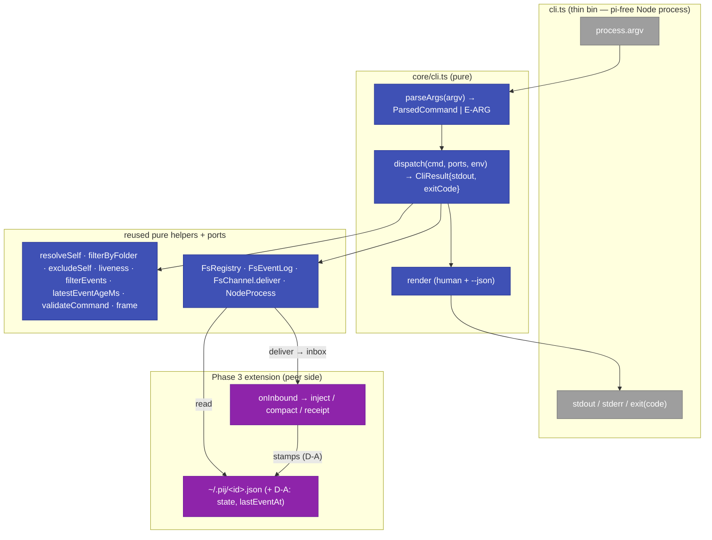
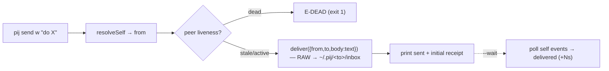

# Phase 4 — pij CLI (act + observe) — Tasks & Context Brief

**Plan**: [`../../pi-session-messaging-plan.md`](../../pi-session-messaging-plan.md) · **Phase**: 4 of 5 · **Domain**: `pij-messaging`
**Depends on**: Phase 2 (core + adapters) — can run parallel to Phase 3; Phase 3 is in fact **already done**, so Phase 4 builds on a live extension.
**Mode**: Full · **Complexity**: CS 3 (mechanical surface over a proven core; the only nuance is the descriptor-state gap below).

> Generated by the `tasks` verb. **STOPS before implementation** — terminal output is this dossier; wait for human GO.

---

## Executive Briefing

- **Purpose**: Build the `pij` Node CLI — the *working surface* an agent (or human) types to act on and observe peer sessions. The extension (Phase 3) is the receive/serve side; this is the act/observe side, over the **same** pure core + fs adapters.
- **What We're Building**: A single `pij` bin with six verbs — `whoami`, `list`, `send` (text or `--command`), `tail`, `state`, `path` — each with `--json`, stable exit/error codes, and the delivery-receipt surfacing from workshop 001. Argv-parse + dispatch + render live in a **pure `core/cli.ts`** (tested vs fakes, Pattern P8); `cli.ts` is a thin bin that wires the real adapters to `process.argv`/stdout and `process.exit`.
- **Goals**:
  - ✅ Six verbs matching workshop 001's locked contract (names, flags, output, codes).
  - ✅ `whoami`/`list`/`state`/`tail`/`path` read peers through `FsRegistry`/`FsEventLog` + the pure `discovery`/`state`/`events` helpers — no new logic.
  - ✅ `send` writes a framed message (text) or a `command`-bearing message into the peer's inbox via `FsChannel.deliver`; surfaces the receipt; honours `E-NOID/E-SELF/E-CMD/E-DEAD`, warn-on-stale.
  - ✅ `--json` shapes finalized (workshop left field names "Draft → finalize in architect/CLI").
  - ✅ Per-command tests vs fakes; `cli.ts` stays a pi-free Node process (single-pi-importer invariant intact).
- **Non-Goals**:
  - ❌ No two-window end-to-end smoke / CI / docs — that is **Phase 5**.
  - ❌ No new transport — reuses Phase 2 `FsChannel` (atomic write + dir-watch) verbatim.
  - ❌ No `--as` alias / short-slug ids — ids are whatever the extension wrote (`pij-<pid>`); alias deferred (workshop OQ, "lean: later").
  - ❌ `cli.ts` does **not** import `@earendil-works/*` — remote `compact` rides the channel as a `command` message that the *peer's* extension executes; the CLI never holds a pi handle.

---

## Prior Phase Context

> Synthesized directly from in-hand artifacts (the core/adapter sources were read this session while implementing Phase 3) rather than via fan-out subagents — the review step exists to recover context an implementor lacks; here it is current and precise. Sources: `core/*.ts`, `adapters/*.ts`, the three phases' `execution.log.md`.

### Phase 1 — domain + pure core + ports + fakes
- **A. Deliverables**: `core/{types,seq,events,state,commands,discovery,message,receipts}.ts`, `core/ports.ts` (5 ports), `adapters/fakes.ts` (in-memory `FakeRegistry/FakeEventLog/FakeDelivery/FakePiRuntime/FakeProcess`). 50 specs.
- **B. Dependencies exported** (the CLI consumes these verbatim):
  - `resolveSelf(envId: string|undefined, locals: readonly SessionDescriptor[]) → Result<SessionId>` (env wins → lone-local → `E-AMBIG`).
  - `filterByFolder(descs, folder) → SessionDescriptor[]`; `excludeSelf(descs, selfId) → SessionDescriptor[]`.
  - `liveness(pidAlive: boolean, latestEventAgeMs: number|null, staleAfterMs=60_000) → "active"|"stale"|"dead"`; `isWorking(state)`, `isStalled(state, ageMs, staleAfterMs)`; `STALE_AFTER_MS = 60_000`.
  - `filterEvents(events, query: EventQuery{since?,type?,last?}) → PijEvent[]`; `eventAgeMs(event, nowMs)`; `latestEventAgeMs(events, nowMs) → number|null`.
  - `validateCommand(name) → Result<AllowedCommand>` (`ALLOWED_COMMANDS = ["compact"]`, else `E-CMD`).
  - `frame(from, body)`, `parseFrame`, `roleLabel`, `announceText`, `receiptBody(messageId, state)`.
  - Types: `SessionDescriptor{id, role?, folder, dataDir, eventsPath, pid, startedAt}`, `PijEvent{seq, timestamp, type, data}`, `PijMessage{from, to, body, command?, kind?:"receipt"}`, `Result<T>` (`{ok:true,value}` / `{ok:false,code,message}`).
- **C. Gotchas & debt**: `Result` is a tagged union — **never throw across the core boundary**; the CLI maps `err.code` → exit code. `SessionDescriptor` carries **no `state` / `lastEventAt`** field (see the gap in Pre-Impl Check D-A).
- **D. Incomplete**: none.
- **E. Patterns**: P2 pi-free core; P4 tagged-union returns; P8 tests target core vs fakes; constants beside data (P5).

### Phase 2 — adapters
- **A. Deliverables**: `adapters/{fs-registry,event-log,channel,process,pi-runtime}.ts` + 4 test files (19 specs).
- **B. Dependencies exported** (CLI wiring targets):
  - `new FsRegistry(pijHome)` → `list(): SessionDescriptor[]`, `read(id): SessionDescriptor|null`, `write(desc)`, `remove(id)`.
  - `new FsEventLog(pijHome, id)` → `append(e)`, `read(query?): PijEvent[]`, `lastSeq(): number`, `count(): number`.
  - `new FsChannel(pijHome)` → `deliver(msg): Result<{messageId}>` (atomic tmp→rename into `<pijHome>/<to>/inbox/`), `watch(id, onMessage, seen?)` (receive side — extension only).
  - `new NodeProcess()` → ProcessPort: pid + `now()` clock + pid-alive probe (used for `liveness`).
  - `PiRuntimeAdapter(pi, ctx)` — **extension-only**, the lone pi importer.
- **C. Gotchas & debt**: `FsChannel` keys the messageId on `Date.now()-seq-pid`; the **receiver** dedupes by filename. The CLI only ever calls `deliver` (write) — never `watch`.
- **D. Incomplete**: none.
- **E. Patterns**: `pijHome` is constructor-injected (tests run on a tmp dir); adapters are real (no mocks).

### Phase 3 — pij extension (receive + serve) — DONE this session
- **A. Deliverables**: `core/session.ts` `PijSession` (pure coordinator, 10 specs) + thin `index.ts` translator. Commits `0e30b2c`/`8e37432`/`b5e7e8a`.
- **B. Dependencies exported / contract facts the CLI must match**:
  - **Session ids are `pij-<pid>`** (stable, reload-safe) — the registry holds `pij-<pid>`, *not* the workshop's illustrative `w3`/`a1`. `whoami`/`list` print real ids.
  - The extension **exports `PIJ_SESSION_ID` (+ `PIJ_ROLE`)** into its env at boot → a child `pij` invoked from that session resolves self via `resolveSelf(process.env.PIJ_SESSION_ID, locals)`.
  - On-disk layout (the CLI's read/write contract): descriptor `~/.pij/<id>.json`; per-session dir `~/.pij/<id>/{events.ndjson, inbox/}`; `deliver` drops `~/.pij/<to>/inbox/msg-*.json`.
  - **Command path**: the extension's `onInbound` runs `validateCommand` then `PiRuntime.compact()` for a `command:"compact"` message → so `pij send <id> --command compact` is just a `deliver({from, to, command:"compact"})`; the CLI needs **no pi handle**.
  - **Receipts**: when a peer consumes a message it emits a `receipt` event (`queued`→`delivered`) and rides a `kind:"receipt"` message back into the *sender's* inbox (recorded, never injected) → the `delivered` receipt is observable in the sender's own `events.ndjson` / `pij tail <self> --type receipt`.
- **C. Gotchas & debt**: the extension captures `tool_call`/`tool_result`/`message`/`receipt` events and consumes `turn_start` (for receipt correlation) but **does not record turn boundaries as events** and **does not stamp working/idle into the descriptor** → see gap D-A. There is **no pi `usage` event** (don't offer `--type usage`).
- **D. Incomplete**: descriptor lacks `state`/`lastEventAt` (D-A); short-slug ids deferred.
- **E. Patterns**: pure coordinator + thin wiring; reload-safe top-level listeners; receipts events-only + `source:extension` (never wake the billed parent).

---

## Pre-Implementation Check

| File | Exists? | Domain | Notes |
|------|---------|--------|-------|
| `.pi/extensions/pij/core/cli.ts` | **new** | pij-messaging | Pure argv-parse + dispatch + render. P8 test target. |
| `.pi/extensions/pij/core/cli.test.ts` | **new** | pij-messaging | Per-command specs vs fakes. |
| `.pi/extensions/pij/cli.ts` | **new** | pij-messaging (contract) | Thin bin: real adapters → `dispatch` → stdout/exit. **Must NOT import `@earendil-works/*`** (single-pi-importer invariant). |
| `.pi/extensions/pij/core/types.ts` | modify | pij-messaging (**contract change**) | **D-A**: add `state?: "working"\|"idle"` + `lastEventAt?: string` to `SessionDescriptor`. |
| `.pi/extensions/pij/core/session.ts` + `index.ts` | modify | pij-messaging | **D-A**: stamp `state`/`lastEventAt` into the descriptor on `turn_start`/`turn_end`/`capture`. Small, additive; subscribe `turn_end`. |
| `package.json` / `justfile` | modify | extension-authoring-harness | `bin: { pij }` (or a `just pij` recipe) so the CLI is invokable. |

**⚠️ Decision D-A — the descriptor-state gap (the one real design call; flagged for validation).**
AC-9 requires `pij state <id>` to report *working/static + latest-event age* **"without stream parse"**, and AC-7a requires a **stall** (working **but** newest event old) to be detectable. The descriptor today carries neither a working/idle flag nor `lastEventAt`, and the extension records no turn boundaries — so a *healthy idle* session and a *stalled mid-work* session are indistinguishable from the event tail alone (both = alive + quiet).
**Resolution (primary)**: enrich the descriptor — the extension stamps `state:"working"` on `turn_start`, `state:"idle"` on `turn_end`, and `lastEventAt` on every `capture`. The CLI then reads state + liveness + age from the **single descriptor file** (cheap, satisfies "without stream parse"), and a stall = `state:"working"` ∧ `liveness:"stale"`. This is **additive** to `SessionDescriptor` and a handful of coordinator/index lines, but it **touches the Phase-3 extension** (contract change → higher risk).
**Fallback (if validation rules Phase-4 must stay CLI-only)**: derive age from the events tail (last line) and report **liveness only** (`active/stale/dead`); `state` collapses to `working≈active` and AC-7a degrades to "alive + stale events". Weaker, but zero extension change.
→ **This is the item the validate step should pressure-test first.**

**Harness availability**: `/eng-harness-flow` router is installed but the pij repo is unadopted (same `degraded` posture as Phases 1–3). Seam rows T000/T0z are advisory/best-effort; the phase uses standard vitest + `just` gates.

---

## Architecture Map



---

## Tasks

| Status | ID | Task | Domain | Path(s) | Done When | Notes |
|--------|-----|------|--------|---------|-----------|-------|
| [x] | T000 | **Harness pre-flight** — `/eng-harness-flow --event pre-implement --phase "Phase 4" --plan-dir docs/plans/014-pi-session-messaging` | — | — | Router envelope handled; verdict narrated verbatim before any code | Harness seam; degraded/best-effort (router installed, repo unadopted) |
| [x] | T001 | **D-A descriptor enrichment** (extension touch): add `state?:"working"\|"idle"` + `lastEventAt?:string` to `SessionDescriptor`; coordinator stamps `working` on `turn_start`, `idle` on `turn_end`, `lastEventAt` on every `capture`; `index.ts` subscribes `turn_end`. Specs in `session.test.ts`. | pij-messaging | `/Users/jordanknight/pi-hacking/pij/.pi/extensions/pij/core/types.ts`, `…/core/session.ts`, `…/core/session.test.ts`, `…/index.ts` | Descriptor reflects working/idle + lastEventAt; reload-safe; existing specs green | **CONTRACT CHANGE** (additive). Validation gates whether this stays in Phase 4 or the fallback is taken. AC-9/7a/10 |
| [x] | T002 | **`core/cli.ts` parser (RED→GREEN)**: `parseArgs(argv) → Result<ParsedCommand>`; grammar = `whoami \| list[--here] \| send <id> (<text> \| --command <name>) \| tail <id> [--since N --type T --lines N --follow] \| state <id> \| path <id> [--events\|--state\|--dir]`, all `+ --json`; bad invocation → `E-ARG` (exit 64). Tests first. | pij-messaging | `/Users/jordanknight/pi-hacking/pij/.pi/extensions/pij/core/cli.ts`, `…/core/cli.test.ts` | Every verb+flag parses; unknown verb/flag/arity → `E-ARG`; `--json` recognised on all | P4 tagged-union; P8 vs fakes |
| [x] | T003 | **`core/cli.ts` dispatch core**: `dispatch(cmd, ports, env) → CliResult{stdout, stderr?, exitCode}`; pure, takes `{registry, eventLogFor(id), delivery, process, env}` so tests inject fakes. Routes each verb; maps `Result.err.code` → exit (NOID/SELF/CMD=2, DEAD=1, NOREG=3, ARG=64). | pij-messaging | `/Users/jordanknight/pi-hacking/pij/.pi/extensions/pij/core/cli.ts`, `…/core/cli.test.ts` | Dispatch table covers 6 verbs; code→exit mapping verified vs fakes; never throws | finding 07; codes from workshop 001 |
| [x] | T004 | **`whoami` + `list [--here]`** (human + `--json`): `whoami` = `resolveSelf(env.PIJ_SESSION_ID, locals)` → id/folder/dataDir/state/pid (`E-AMBIG`/`E-NOREG`); `list` = registry.list → `filterByFolder` (when `--here`) → mark self `★`, columns id/state/liveness/folder; `--json` = descriptor array (+ liveness, lastEventAt). | pij-messaging | `/Users/jordanknight/pi-hacking/pij/.pi/extensions/pij/core/cli.ts`, `…/core/cli.test.ts` | Two local sessions → `list --here` shows both w/ self starred; `whoami` resolves via env, else lone-local, else `E-AMBIG` | AC-1, workshop 001 |
| [x] | T005 | **`send <id> "<text>"` + `--command <name>`**: stamp `from = self`; text → `deliver({from:self, to:id, body:text})` with the **RAW** text (⚠️ do **not** `frame()` it — the *receiver* frames on inject at `session.ts:144`; pre-framing double-stamps `[pij from …]`); command → `validateCommand` then `deliver({from,to,command})` (no body, no pi handle). Guards: `E-NOID` (unknown), `E-SELF` (==self), `E-CMD` (bad name), **`E-DEAD` blocks** / `stale` **warns + sends**. Receipt: print initial classification from the peer's liveness; `--wait [ms]` polls *self* `events.ndjson` for the `type:"receipt"` event whose `body` (a `receiptBody(<origMessageId>, state)` string) carries the `deliver()`-returned messageId at state `delivered`, printing `queued`→`delivered (+Ns)`. | pij-messaging | `/Users/jordanknight/pi-hacking/pij/.pi/extensions/pij/core/cli.ts`, `…/core/cli.test.ts`, (+ additive `…/core/message.ts` `parseReceiptBody` for `--wait`) | Message reaches the peer inbox with `from` stamped + body **unframed**; codes correct; stale warns-not-blocks; receipt surfaced (or noted in `tail`) | AC-3/4/5/6/13. **F1 (validation): receiver-frames contract** |
| [x] | T006 | **`tail <id> [--since N --type T --lines N --follow]`** (+`--json`): `eventLogFor(id).read({since,type,last})` — **the port filters** (no separate `filterEvents` call needed); columns `seq · ts · age · type · summary` (`age` from `eventAgeMs`); trailer `(next: --since <maxSeq> · newest event <age> ago)`. **`--follow` is NOT in the pure `dispatch`** (it can't return a single string) — `dispatch` returns one batch + the next cursor; the imperative ~200ms poll-loop lives in the **bin** (T009), re-calling the pure batch-render each tick. `--json` = raw `{seq,type,timestamp,data}`. | pij-messaging | `/Users/jordanknight/pi-hacking/pij/.pi/extensions/pij/core/cli.ts`, `…/core/cli.test.ts` | `--since N` returns only `seq>N`; `--type` filters; `--lines N` = present-minus-N (`EventQuery.last`); age rendered; trailer copy-paste-able | AC-7/7a/8. No `usage` type. **F2: follow-loop in bin** |
| [x] | T007 | **`state <id>`** (+`--json`): read descriptor → `state` (D-A) + `liveness(process.isAlive(pid), latestEventAgeMs, STALE_AFTER_MS)` + latest-event age; human `"<id>: <state> · <liveness> (last event Ns ago, pid <p> <alive>)"`; `--json` `{id,state,liveness,lastEventAt,pid,ageMs}`. | pij-messaging | `/Users/jordanknight/pi-hacking/pij/.pi/extensions/pij/core/cli.ts`, `…/core/cli.test.ts` | Reports working/idle + active/stale/dead + age without parsing the whole stream; stall = working∧stale | AC-9/10/7a |
| [x] | T008 | **`path <id> [--events\|--state\|--dir]`**: no flag → data dir; `--events` → `<dir>/events.ndjson`; `--state` → `~/.pij/<id>.json`; `--dir` → data dir. `E-NOID` if absent. | pij-messaging | `/Users/jordanknight/pi-hacking/pij/.pi/extensions/pij/core/cli.ts`, `…/core/cli.test.ts` | Prints the correct on-disk path for a direct file read | AC-11 |
| [x] | T009 | **Thin `cli.ts` bin** + invocation wiring: shebang; parse `process.argv`; build real adapters (`FsRegistry(pijHome)`, `id→FsEventLog(pijHome,id)`, `FsChannel(pijHome)`, `NodeProcess()`); read env via `ProcessPort.env` (or `process.env`); call `dispatch`; write `stdout`/`stderr`; `process.exit(exitCode)`. **The `--follow` poll-loop lives here** (reuses the pure batch-render from T006). Register `bin: { "pij": ".pi/extensions/pij/cli.ts" }` (tsx) or a `just pij` recipe. **Zero `@earendil-works` imports.** | pij-messaging | `/Users/jordanknight/pi-hacking/pij/.pi/extensions/pij/cli.ts`, `/Users/jordanknight/pi-hacking/pij/package.json`, `/Users/jordanknight/pi-hacking/pij/justfile` | `pij whoami` runs end-to-end against `~/.pij`; **`pij` resolves on PATH exactly as the boot announce claims** (bare `pij`, via npm `bin` + link or a documented shim); bin resolves; `--follow` streams | single-pi-importer invariant must still hold |
| [x] | T010 | **Phase gate**: `just typecheck` + `just lint` + `just test` green (incl. new `core/cli.test.ts`); single-pi-importer check (`grep 'from "@earendil-works'` → only `index.ts` + `adapters/pi-runtime.ts`; **`cli.ts` absent**); manual `pij list --here` sanity. Smoke/CI deferred to Phase 5. | pij-messaging | `/Users/jordanknight/pi-hacking/pij/.pi/extensions/pij/` | All gates green; invariant holds; per-command specs pass | AC-12 (CI part is Phase 5) |
| [x] | T0z | **Harness phase-end** — `/eng-harness-flow --event phase-end --plan-dir docs/plans/014-pi-session-messaging` | — | — | Router envelope handled at phase end | Harness seam; degraded/best-effort |

---

## Context Brief

**Key findings from plan (applied)**:
- **Finding 07 (self-resolution)**: env `PIJ_SESSION_ID` → lone-cwd → `E-AMBIG`. `whoami`/`send`-`from` route through `resolveSelf` verbatim — do not re-implement.
- **Finding 01 (proven inject)**: the CLI does **not** inject — it writes to the inbox; the *extension* injects. Keep that boundary.
- **Finding 03 (fs.watch dir-only)**: only the receiver watches; the CLI is write-only via `deliver` (atomic tmp→rename).
- **Finding 08 / receipts**: the `delivered` receipt is produced by the peer and observed in the sender's own event stream — `send --wait` polls *self* events; without `--wait` it points the user at `pij tail <self> --type receipt`.
- **Validation C1 (no `usage` event)**: never advertise `--type usage`; real types are `tool_call`/`tool_result`/`message`/`receipt`.

**Domain dependencies** (consumed from `pij-messaging`):
- `core/discovery`: `resolveSelf` (self id), `filterByFolder` (`--here`), `excludeSelf` (peer list).
- `core/state`: `liveness` (active/stale/dead), `isStalled`, `STALE_AFTER_MS`.
- `core/events`: `filterEvents` (`--since`/`--type`/`--lines`), `eventAgeMs`/`latestEventAgeMs` (age column + trailer).
- `core/commands`: `validateCommand` (`--command` allow-list).
- `core/message`: `parseFrame`/`roleLabel`/`announceText` (whoami context) + `parseReceiptBody` (added, for `send --wait`). **NB `frame()` is receiver-side only** — the CLI `send` delivers the **raw** body; the extension frames on inject (`session.ts:144`).
- `adapters`: `FsRegistry` (list/read), `FsEventLog` (read/lastSeq/count), `FsChannel.deliver`, `NodeProcess` (pid-alive + clock).

**Domain constraints**:
- `cli.ts` + `core/cli.ts` live under `pij-messaging`; **neither may import `@earendil-works/*`** (P2/P9 — the CLI is a plain Node process; the only pi importers stay `index.ts` + `adapters/pi-runtime.ts`).
- All cross-boundary returns are tagged-union `Result` — the bin maps `code`→exit, never catches a throw (P4).
- `pijHome` injected (default `~/.pij`) so `core/cli.test.ts` runs on a tmp dir.

**Harness context** (router installed, repo unadopted → degraded/best-effort):
- **Entry point**: `/eng-harness-flow --event <seam> --phase "Phase 4" --plan-dir docs/plans/014-pi-session-messaging` — the single door; child skills never named.
- **Pre-implement seam** (T000) fired by the implement verb at phase start; **phase-end seam** (T0z) at phase end. Verdicts narrated verbatim. No backpressure file present for this plan.

**Reusable from prior phases**:
- `adapters/fakes.ts` (`FakeRegistry`/`FakeEventLog`/`FakeDelivery`/`FakeProcess`) — the CLI test seam (no tmp-fs needed for `core/cli.test.ts`).
- `core/session.test.ts` patterns (boot/capture/inbound vs fakes) — mirror for `core/cli.test.ts`.

**Mermaid flow (a `send`)**:


**Mermaid sequence (remote command)**:
```mermaid
sequenceDiagram
    participant CLI as pij send --command compact
    participant Inbox as ~/.pij/&lt;peer&gt;/inbox
    participant Ext as peer extension
    CLI->>CLI: validateCommand(compact)
    CLI->>Inbox: deliver({from,to,command:compact})
    Ext->>Inbox: watch picks up msg
    Ext->>Ext: onInbound → validateCommand → PiRuntime.compact()
    Ext-->>Inbox: kind:receipt → sender inbox (recorded, not injected)
```

---

## Discoveries & Learnings

_Populated during implementation by the implement verb._

| Date | Task | Type | Discovery | Resolution | References |
|------|------|------|-----------|------------|------------|

**Types**: `gotcha` | `research-needed` | `unexpected-behavior` | `workaround` | `decision` | `debt` | `insight`

---

## Directory layout

```
docs/plans/014-pi-session-messaging/
  ├── pi-session-messaging-plan.md
  └── tasks/phase-4-pij-cli/
      ├── tasks.md           # this dossier
      └── execution.log.md   # created by the implement verb
```

---

## Validation Record (2026-06-16)

> **Method note**: subagent fan-out was **unavailable this turn** — both foreground and async `flowspace-research-v2` dispatch failed with `Agent is already processing` (the session was mid-turn with no user-message boundary; a canary `b45ac0e8` confirmed the block, not an agent-tool fault). Per the validate-v2 contract the lenses were therefore executed **inline against source** (the core/adapter/extension files were read this turn). The independent parallel-agent pass can be re-run at the next turn boundary if desired — but the highest-value finding (F1) was a source-grounded contract check that inline review caught.

### Validation Thesis

**Raison d'être**: Give the implement-stage agent an unambiguous, source-grounded build sheet for the `pij` CLI (the act/observe surface) so it is built from the proven Phase 1–3 core/adapters/extension without re-litigating command names, output shapes, codes, or self-resolution.

**Value claim**: Implementation is faster + safer because every verb maps to an existing pure helper/adapter, and the one real gap (D-A: descriptor lacks an idle/working signal) is surfaced and decided up front rather than discovered mid-build.

**Artifact promise**: An agent can implement T001–T010 with minimal clarification, producing a **pi-free** CLI that satisfies AC-1/3/4/5/6/7/7a/8/9/10/11 and keeps the single-pi-importer invariant.

**Intended beneficiaries**: implement-stage agent (primary), reviewer, Phase 5 (smoke/CI/docs consumes the CLI surface), the Phase-3 extension (consumes the CLI's delivered messages).

**Proof target**: Implementation.

**Evidence standard**: every verb → a cited existing signature; every Phase-4 AC → a task; codes/flags match workshop 001; reconciled to Phase-3 reality (ids `pij-<pid>`, command-via-channel, receiver-frames, receipts-via-self-stream).

**Thesis source**: `pi-session-messaging-plan.md` (Phase 4 rows + ACs + Domain Manifest) + `workshops/001-pij-cli-shape.md` + Phase-3 `core/session.ts`.

**Thesis verdict**: Advanced (at Implementation proof level, after F1 fix).

**Main thesis risk**: D-A's fallback (liveness-only) would leave AC-9's idle/working distinction only partially met — the primary (descriptor-enrich) path must be taken to fully satisfy AC-9/7a.

| Agent (lens, inline) | Lenses Covered | Thesis Axes | Issues | Verdict |
|---|---|---|---|---|
| Source-Truth | Concept Docs, Technical Constraints, Hidden Assumptions | Evidence Sufficiency, Implementation Readiness | 1 LOW (port-filter/env clarity, folded) | ✅ all cited signatures match source |
| Cross-Reference + Completeness | Integration & Ripple, Edge Cases, Domain Boundaries | Implementation Readiness, Agent Readiness | 2 MEDIUM fixed (F2 follow-loop, F3 receipt-parse), 1 LOW | ⚠️→✅ |
| Thesis Alignment | Thesis Alignment, Proof-Level Fit | Value preservation | 0 (D-A flagged, not drift) | ✅ |
| Forward-Compatibility | Forward-Compatibility, Contract Integrity | Downstream Usefulness, Cross-Domain | **1 CRITICAL fixed (F1 double-frame)** | ⚠️→✅ |

### Forward-Compatibility Matrix

| Consumer | Requirement | Failure Mode | Verdict | Evidence |
|---|---|---|---|---|
| Phase-3 extension (peer) | CLI delivers an **unframed** body (`{from,to,body:text}`) so the receiver frames exactly once | contract drift | ✅ (after F1) | `session.ts:144` frames `frame(msg.from, msg.body)`; T005 now delivers raw text |
| Phase-3 extension (peer) | remote `compact` arrives as `{command:"compact"}`, no pi handle in the CLI | encapsulation lockout | ✅ | `session.ts:130` reads `msg.command`; T005 delivers command field; cli.ts pi-free (T010 invariant check) |
| Phase 5 smoke | stable verbs/flags/exit codes to drive `list/send/--command/tail/state` deterministically | shape mismatch | ✅ | workshop-001-locked surface; codes table in T002/T003 |
| Phase 5 docs | final command names + boot-announce text | contract drift | ✅ | names final; announce is AC-2 (Phase 3) |
| `send --wait` (self) | the delivered receipt is parseable from self's event stream | test boundary | ✅ (after F3) | receipt event `body = receiptBody(origId, state)` (`session.ts:185`); `parseReceiptBody` added to T005 |

**Thesis alignment**: The dossier advances its value claim at Implementation proof level — every verb is bound to a verified signature and the descriptor-state gap is decided up front; the residual risk is that taking D-A's fallback only partially satisfies AC-9.

**Outcome alignment**: Quoting the North-Star ("two live pi sessions converse … with an observable per-session event stream + state/liveness"), the CLI is the literal surface that makes converse+observe usable; as specified (post-F1) it advances that outcome — the receiver-frames fix prevents a garbled message channel that would have undermined "converse".

**Standalone?**: No — downstream consumers (Phase 5 smoke/docs, the Phase-3 extension) named above.

Overall: ⚠️ **VALIDATED WITH FIXES** — 1 CRITICAL (F1 double-frame) + 2 MEDIUM (F2/F3) fixed inline; D-A is a flagged design decision for the implementor, not a blocker.
