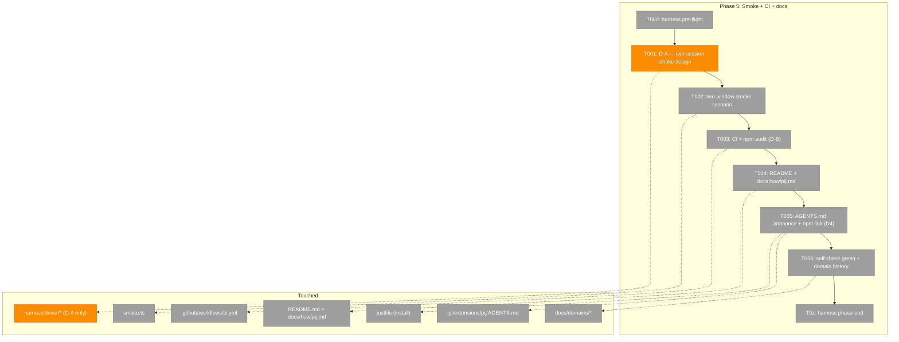
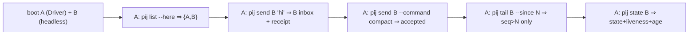
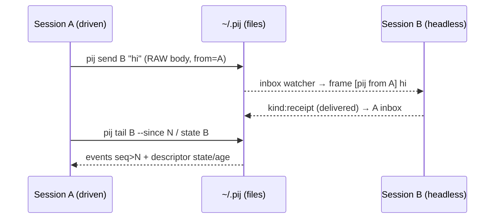

# Phase 5: Smoke + CI + docs — Tasks & Context Brief

> Plan: `docs/plans/014-pi-session-messaging/pi-session-messaging-plan.md`
> Phase: **Phase 5: Smoke + CI + docs** (the final phase)
> Domain: `extension-authoring-harness` (+ `pij-messaging` docs)
> Depends on: Phases 3 + 4 (both implemented + companion-reviewed)
> Complexity: **CS 3** (no time estimates — rubric in 00-routing.md)

---

## Executive Briefing

**Purpose.** Prove the two-peer `pij` path end-to-end, gate the quality bar in CI,
and document the protocol so a fresh agent can act from the boot announce alone.
This phase ships no new runtime behaviour — it *hardens and publishes* what
Phases 1–4 built.

**What we're building.**
- A **two-window Driver smoke** that boots two real `pij` sessions and exercises
  discovery → send (idle + busy) → `--command compact` → `tail --since` → `state`.
- A **CI** workflow that runs the full quality gate (typecheck → Biome → vitest →
  `npm audit`) green on PR.
- **Docs**: a README "pij" quick start + `docs/how/pij.md` (CLI reference, the
  message/receipt protocol, the parent/worker workflow, and the AGENTS.md
  self-announce snippet).
- **Closeout**: `just install` links the `pij` bin onto PATH; `just self-check`
  green; domain registry/history updated.

**Goals.**
- ✅ AC-1..AC-11 demonstrated end-to-end by one deterministic smoke scenario.
- ✅ AC-12: typecheck, Biome, vitest, `npm audit` green in CI on PR.
- ✅ AC-2: boot announce + AGENTS.md self-announce snippet present and accurate.
- ✅ A fresh agent/human can install, discover, and message from the docs alone.
- ✅ `just self-check` exits 0; `bare pij` resolves on PATH (Phase 4 discovery D4).

**Non-Goals.**
- ❌ New CLI verbs / new runtime behaviour (frozen after Phase 4).
- ❌ Changing the core/adapters/extension contracts (Phases 1–3 are frozen).
- ❌ Publishing to npm; pushing to a public remote (forbidden without approval).
- ❌ Making the *two-window smoke itself* run inside GitHub-hosted CI if that
  requires installing the `pi` binary + tmux there (see **D-B** — smoke stays a
  local/self-check gate unless validation says otherwise).

---

## Decisions to resolve (flagged for implementor + validation)

### D-A (PRIMARY design call) — the Driver SDK drives ONE session; the smoke needs TWO
`harness/driver/index.ts#runScenario(scenario, {cwd,cmd,recordPath})` spawns a
**single** tmux-backed pi `Session`. Task 5.1 ("boot A+B, `pij list --here` sees
both") needs **two concurrent live pij sessions** addressable from one scenario.

- **Primary (recommended): boot peer B headless out-of-band, drive A under the SDK.**
  A pre-step boots a second `pij` session (real `pi`, real extension → it writes
  its `~/.pij/<id>.json` descriptor + opens its channel watcher) as a detached
  process; the Driver-driven session A then runs `pij list --here` (sees both),
  `pij send <B> "…"`, `pij tail <B>`, `pij state <B>` via shell, and B's inbox /
  events are asserted on disk. Deterministic because every assertion is a file
  read or a CLI exit code, **not** a second TUI scrape. Smallest blast radius;
  no Driver-SDK contract change.
- **Alternative: extend the Driver SDK to manage a second `Session`/pane** the
  scenario can address (`scenario.peers?` + `session.peer(name)`). A real harness
  improvement (reusable for any multi-session extension) but a Driver-SDK
  **contract change** with its own test surface — heavier, and the harness is the
  product so it's tempting; defer unless validation deems the headless path too
  flaky.
- **Third option (most deterministic): fixture-injected peer descriptor.** Note the
  per-session descriptor + channel dir are written by the *extension* at
  `session_start`; booting a **real headless `pi`** non-interactively (no TTY) may
  not run `session_start` the same way, so the "headless peer-B" primary carries a
  spike risk. A fixture that writes a peer `~/.pij/<id>.json` + inbox dir directly
  via `FsRegistry`/`FsChannel` (the same adapters, pointed at the smoke's `pijHome`)
  gives a fully deterministic "second session" for discovery/send/tail/state
  assertions — at the cost of B not being a *live* pi (no real inject/turn). Use it
  for the deterministic core; reserve a real second `pi` only for the one assertion
  that genuinely needs live injection (busy-path steer). T001 must pick per-assertion.
- **Decision owner**: implementor at T001, pressure-tested by validation. Either
  way the assertions land on **files/exit codes**, never on B's TUI.

### D-B (CI tension) — AC-12 says the smoke is "green in CI", but CI has no pi/tmux
`.github/workflows/ci.yml` already runs typecheck/lint/test on Node 20+22 and
explicitly notes *"smoke is local-only for now (requires tmux + pi binary)"*.
- **Primary (recommended)**: CI runs the **deterministic gate** (typecheck →
  Biome → vitest → **add `npm audit`**); the **two-window smoke stays a local
  `just self-check` / `just smoke` gate** (documented). Read AC-12 as "all
  *gateable-in-CI* checks green in CI; the live smoke is the local proof". This
  matches the existing ci.yml posture and the `degraded`-harness reality.
- **Alternative**: install `pi` + `tmux` in the CI job and run the smoke there
  (slow, networked, flaky on hosted runners). Only if validation insists AC-12 is
  unmet otherwise.
- **Decision owner**: T003; record the chosen reading in the execution log + the
  AC-12 checkbox note. **Forward-compat caveat (validation)**: AC-12 is written as
  *"two-window smoke all green **in CI**"* — the merge/review stage will check it
  verbatim. If D-B keeps the smoke local, T003 must **either** get explicit sign-off
  on the re-reading **or** propose a one-line AC-12 amendment in the plan ("gates
  green in CI; live two-window smoke green locally via `just smoke`"). Don't let the
  re-reading live only in the execution log where review won't see it.

### D4 (carried from Phase 4) — bare `pij` on PATH
The boot announce promises `pij send …` as a **shell** command, but bare `pij`
only resolves after `npm link` (or a PATH entry). T005 wires `npm link` into
`just install` so a fresh clone gets bare `pij`; in-repo, `just pij …` already
works.

---

## Prior Phase Context (synthesized — Phases 1–4 implemented by this author, context-fresh)

> Per this plan's established pattern (Phase 4 dossier), prior-phase context is
> synthesised inline rather than via fan-out; the **validation pass** (validate-v2,
> parallel agents) is the independent rigor check.

### Phase 1 — domain / pure core / ports / fakes  ✅
- **Deliverables**: `core/types.ts` (`SessionId`, `PijMessage`, `SessionDescriptor`,
  `PijEvent`, `Result`), `core/ports.ts` (5 ports: Registry/EventLog/Delivery/
  PiRuntime/Process), pure helpers `core/{discovery,events,state,message,commands,
  receipts,seq}.ts`, `adapters/fakes.ts`.
- **Exports for later phases**: `resolveSelf`, `filterByFolder`, `excludeSelf`,
  `liveness`, `isWorking`/`isStalled`, `STALE_AFTER_MS=60_000`, `filterEvents`,
  `latestEventAgeMs`, `validateCommand`(`ALLOWED_COMMANDS=["compact"]`), `frame`/
  `parseFrame`, `roleLabel`, `announceText`, `receiptBody`/`parseReceiptBody`.
- **Patterns**: tagged-union `Result` over throws; constants beside data; pure core
  has **zero** `@earendil-works` imports.

### Phase 2 — adapters  ✅
- **Deliverables**: `adapters/{fs-registry,event-log,channel,process,pi-runtime}.ts`
  + 4 fake-backed test files.
- **Exports**: `new FsRegistry(pijHome)`, `new FsEventLog(pijHome,id)`,
  `new FsChannel(pijHome)` (`deliver`→`Result<{messageId}>`, atomic tmp→rename;
  `watch(id,onMessage,seen)` 20ms debounce, receiver-only), `new NodeProcess()`,
  `PiRuntimeAdapter(pi,ctx)` (the **only** core/adapter pi importer besides index).
- **Layout**: descriptor `~/.pij/<id>.json`; per-session `~/.pij/<id>/{events.ndjson,
  inbox/}`; `pijHome` constructor-injected (tests use tmp dirs).

### Phase 3 — pij extension (receive + serve)  ✅
- **Deliverables**: pure `core/session.ts` `PijSession` coordinator (5 ports via DI;
  `boot`/`capture`/`onInbound`/`onTurnStart`/`onTurnEnd`/`shutdown`) + thin
  `index.ts` pi-event translator.
- **Behaviour**: `session_start` (P10, all reasons) boots `self = pij-${process.pid}`
  (stable, reload-safe), exports `PIJ_SESSION_ID`/`PIJ_ROLE`, opens the inbox watcher
  (seeded `seen` Set so reload doesn't replay). Captures `tool_call`/`tool_result`/
  `message_end`→events; `turn_start`→working, `turn_end`→idle. **No `usage`
  capture.** Receipts modelled as events + `kind:"receipt"` channel messages back
  to sender (recorded, never injected → never wakes/bills the parent). `/pij`
  prints `pij: <id> · role=<role> · peers <n> · events <m>` (smoke asserts this).
- **Gotchas**: listeners registered **top-level once** (reload double-registers
  otherwise); receiver frames at `session.ts:144` (CLI must send RAW body — F1).

### Phase 4 — pij CLI (act + observe)  ✅ (companion-reviewed)
- **Deliverables**: pure `core/cli.ts` (`parseArgs`→`dispatch`, 6 verbs, 15 specs)
  + thin pi-free `cli.ts` bin; D-A descriptor enrichment (`state`/`lastEventAt`);
  `just pij` recipe + `package.json` `bin.pij`.
- **Exports / contracts**: exit codes NOID/SELF/CMD/AMBIG=2, DEAD=1, NOREG=3,
  ARG=64; `send` delivers **RAW** body (receiver frames once); `--command compact`
  via channel; `tail --follow`/`send --wait` loops live in the **bin**, not the
  pure dispatch.
- **Gotchas resolved by companion**: F001 (strict `parseArgs` E-ARG contract),
  F002 (`tail --follow` advances). **D4**: bare `pij` needs `npm link` → T005.
- **Single-pi-importer invariant**: `grep 'from "@earendil-works'` ⇒ only
  `index.ts` + `adapters/pi-runtime.ts`. Must still hold after Phase 5.

---

## Pre-Implementation Check

| File | Exists? | Domain | Notes |
|------|---------|--------|-------|
| `.pi/extensions/pij/smoke.ts` | ✅ (single-window `/pij` assert) | extension-authoring-harness | **Extend** for two-window OR add a sibling scenario; keep the existing `/pij` assert |
| `harness/driver/index.ts` / `session.ts` | ✅ (single `Session`) | extension-authoring-harness | **D-A**: only touched if the SDK-extension alternative is chosen (CONTRACT change) |
| `.github/workflows/ci.yml` | ✅ (typecheck/lint/test, Node 20+22) | extension-authoring-harness | **Extend**: add `npm audit`; keep smoke local (**D-B**) |
| `README.md` | ✅ (has `npm run link` ref ~L142) | pij-messaging docs | **Add** a "pij" quick-start section |
| `docs/how/pij.md` | ❌ | pij-messaging docs | **New** — CLI ref + protocol + parent/worker workflow |
| `.pi/extensions/pij/AGENTS.md` | ✅ | pij-messaging docs | **Verify/add** the AC-2 self-announce snippet; cross-check against the live boot announce text (`announceText`) |
| `justfile` (`install` recipe) | ✅ | extension-authoring-harness | **Add** `npm link` step so bare `pij` resolves (D4) |
| `docs/domains/registry.md`, `docs/domains/domain-map.md` | ✅ | pij-messaging docs | **Update** history/closeout rows |

No new domain *concepts* are introduced (docs + harness only) — low duplication risk.

**Harness availability**: same `degraded` posture as Phases 1–4 (router installed,
repo unadopted). The T000/T0z seam rows are best-effort, narrated, non-blocking —
the real phase-end evidence is the green `just` gates + the live smoke.

---

## Architecture Map



---

## Tasks

| Status | ID | Task | Domain | Path(s) | Done When | Notes |
|--------|-----|------|--------|---------|-----------|-------|
| [x] | T000 | **Harness pre-flight** — `/eng-harness-flow --event pre-implement --phase "Phase 5" --plan-dir docs/plans/014-pi-session-messaging` | — | — | Router envelope handled + verdict narrated before any change | Harness seam; `degraded` posture expected (document once, proceed) |
| [x] | T001 | **Resolve D-A** — decide two-session smoke approach (headless peer-B vs Driver-SDK 2nd session). Spike the chosen path far enough to prove A can `pij list --here` see a second live session, asserting on files/exit codes | extension-authoring-harness | `harness/driver/*`, `.pi/extensions/pij/smoke.ts` | A documented decision + a green proof-of-concept assertion that two live pij descriptors are discoverable from a driven session | **D-A**. Prefer headless peer-B (no SDK contract change). If SDK-extension chosen → CONTRACT change, add Driver tests |
| [x] | T002 | **Two-window smoke scenario** — boot A + B; assert: `pij list --here` sees both; `pij send <B> "hi"` reaches B's inbox; busy-path steer (best-effort); `pij send <B> --command compact` accepted; `pij tail <B> --since N` returns only `seq>N`; `pij state <B>` reports state+liveness; **a delivery receipt (`delivered`, or `queued`→`delivered` for the busy path) is observable in A's `pij tail`/B's inbox** | extension-authoring-harness | `.pi/extensions/pij/smoke.ts` (+harness if D-A=SDK) | `npm run smoke -- pij` green deterministically; existing `/pij` status-line assert preserved; **a receipt is asserted (AC-13)** | AC-1..11 **+ AC-13** end-to-end. Idle/file/exit-code assertions are the deterministic core; busy-path + compact + live receipt may need the one real second `pi` (D-A); the receipt's `delivered` state is assertable on-disk without B's TUI |
| [x] | T003 | **CI gate** — add `npm audit` (chosen severity threshold) to `.github/workflows/ci.yml`; record the AC-12 reading (smoke local vs in-CI) | extension-authoring-harness | `.github/workflows/ci.yml` | CI runs typecheck→lint→test→`npm audit` green on PR; AC-12 note recorded | **D-B**. Keep smoke local-only unless validation overrides. Match existing Node 20+22 matrix |
| [x] | T004 | **Docs** — README "pij" quick-start section + new `docs/how/pij.md` (CLI ref for all 6 verbs + flags + exit codes, message/receipt protocol, parent/worker workflow, link to the AGENTS.md snippet) | pij-messaging | `README.md`, `docs/how/pij.md` | A fresh reader can install, `pij list --here`, and `pij send` from the doc alone; every verb/flag/code documented matches `core/cli.ts` | Workshops 001 (CLI shape) + 002 (parent/worker workflow) are the source of truth |
| [ ] | T005 | **Self-announce + PATH** — verify/add the AC-2 self-announce snippet in `.pi/extensions/pij/AGENTS.md` (match `announceText` @ `core/message.ts:54`); add `npm link` to the `just install` recipe so bare `pij` resolves | pij-messaging + extension-authoring-harness | `.pi/extensions/pij/AGENTS.md`, `justfile` | AGENTS.md snippet present + accurate; after `just install`, bare `pij list --here` works from any cwd | **AC-2** has two halves: the *runtime* boot announce already ships (Phase 3, verified live with the real peer) — this task adds only the **static AGENTS.md snippet** (grep shows only a behaviour description today, not a copy-paste block). **D4**: `npm link` idempotent; don't hand-edit generated files |
| [ ] | T006 | **Closeout** — `just self-check` green; update `docs/domains/registry.md` + `docs/domains/domain-map.md` history rows for Plan 014 completion | pij-messaging | `docs/domains/registry.md`, `docs/domains/domain-map.md` | `just self-check` exits 0; domain docs reflect pij-messaging shipped | Closeout. self-check = typecheck→lint→test→smoke→pkg audit→snapshots-check |
| [ ] | T0z | **Harness phase-end** — `/eng-harness-flow --event phase-end --plan-dir docs/plans/014-pi-session-messaging` | — | — | Router envelope handled at phase end | Harness seam; non-blocking |

---

## Context Brief

**Key findings from plan (applied here).**
- *Finding 07 (HIGH)*: `PIJ_SESSION_ID` disambiguates self when two sessions share a
  cwd — the two-window smoke (T002) is the live proof this holds.
- *Finding 08 / AC-13*: receipts ride back as ordinary `kind:"receipt"` messages —
  the smoke's send assertions can observe `delivered`/`queued` in B's inbox or A's
  `tail` without waking the parent.
- *Workshops 001/002*: the locked CLI contract + the parent/worker workflow are the
  authoritative source for the docs (T004) — illustrative ids `w3`/`a1` are NOT the
  real `pij-<pid>` ids.

**Domain dependencies (consumed).**
- `extension-authoring-harness`: Driver SDK (`runScenario`, `Scenario`/`Step`,
  `Session`) — drives the smoke; `just`/`npm` gates — CI + self-check.
- `pij-messaging`: the `pij` CLI surface (`core/cli.ts` verbs/flags/codes) + the
  boot `announceText` — documented verbatim, not paraphrased.

**Domain constraints.**
- **Single-pi-importer invariant must still hold** after Phase 5 (only `index.ts` +
  `adapters/pi-runtime.ts` import `@earendil-works`). Docs/CI/smoke touch none of it.
- No edits to frozen Phase 1–3 contracts; Phase 5 is additive (docs/CI/harness).
- Never hand-edit generated files (`.pi/settings.json`); never `git add -A`.

**Harness context (router installed → `degraded`).**
- Entry: `/eng-harness-flow --event <seam> --phase "Phase 5" --plan-dir docs/plans/014-pi-session-messaging`.
- Pre-implement (T000) + phase-end (T0z) seams fired by the implement verb;
  verdicts narrated verbatim; best-effort, never a gate.

**Reusable from prior phases.**
- `.pi/extensions/pij/smoke.ts` (existing `/pij` scenario) — extend, don't replace.
- The fake adapters (`adapters/fakes.ts`) — if any new unit test is needed.
- `just pij <args>` — drive the CLI in-repo without a global link (great for smoke).

**Two-window smoke (system states).**


**Send/observe (actor interactions).**


---

## Discoveries & Learnings

_Populated during implementation by the implement verb._

| Date | Task | Type | Discovery | Resolution | References |
|------|------|------|-----------|------------|------------|
| 2026-06-16 | T001 | decision | **D-A resolved.** Driver `Step` is TUI-only (`type`/`press`/`wait`/`paste`/`sleep`/`capture`) — a Scenario can't run `pij` CLI + assert stdout. Both `index.ts`+`cli.ts` hardcoded `pijHome=~/.pij` (no sandbox). | (1) Added additive `PIJ_HOME` env override to both (defaults to `~/.pij`); (2) prove the two-peer act/observe protocol via a **CLI integration test** in `just test`→CI (fixture peers in tmp home) — relaxes D-B (most ACs CI-provable); (3) keep the Driver `/pij` smoke as the in-pi boot/announce proof (local). | `index.ts:26`, `cli.ts:19` |

**Types**: `gotcha` | `research-needed` | `unexpected-behavior` | `workaround` | `decision` | `debt` | `insight`

---

## Directory layout

```
docs/plans/014-pi-session-messaging/
  ├── pi-session-messaging-plan.md
  └── tasks/phase-5-smoke-ci-docs/
      ├── tasks.md            # this file
      └── execution.log.md    # created by the implement verb
```

---

## Validation Record (2026-06-16)

> **Execution note**: parallel subagent fan-out was wedged mid-turn ("Agent is
> already processing" — the same boundary limitation Phase 4 hit; `subagent doctor`
> clean, no stuck run). The validate-v2 **contract** was executed **inline** against
> the source files instead (thesis → VPO → lens sweep → forward-compat → fixes →
> record). Every finding is grounded in a file read this session. A parallel re-run
> can be done at the next clean turn boundary if desired.

### Validation Thesis

**Raison d'être**: Give the Phase-5 implementor an actionable, source-grounded task
list to *prove* the two-peer pij path end-to-end, *gate* it in CI, and *document*
it — the final hardening/publishing phase of Plan 014 (no new runtime behaviour).

**Value claim**: Phase-5 implementation becomes cheaper + safer because the three
hard calls (two-session smoke shape, CI-vs-smoke tension, bare-`pij` PATH) are
surfaced and scoped *before* code, and every task's Done-When is verifiable.

**Artifact promise**: the implement verb can execute T000–T0z with minimal
clarification; each acceptance criterion maps to a task; the frozen Phase 1–4
contracts are not disturbed.

**Intended beneficiaries**: the Phase-5 implement agent; the review + merge stages
(AC checkers); future maintainers/agents reading the protocol docs.

**Proof target**: **Implementation** (build with minimal clarification), preserving
**Integration** evidence (the smoke proves cross-session integration).

**Evidence standard**: task↔AC mapping; source-grounded pre-implementation check;
every design call flagged with a decision owner.

**Thesis source**: `pi-session-messaging-plan.md` Phase 5 rows (L176–190) + ACs
(L192–207); workshops 001/002.

**Thesis verdict**: **Advanced** (at Implementation proof level after fixes).

**Main thesis risk**: the two-session smoke (T001/T002) is a genuine unknown left
as a spike — appropriate for a tasks dossier, but its determinism is the phase's
load-bearing risk.

---

| Agent (lens, inline) | Lenses Covered | Thesis Axes | Issues | Verdict |
|---|---|---|---|---|
| Source-Truth | Concept Documentation, Technical Constraints | Evidence Sufficiency | 0 (ci.yml/smoke.ts/Driver/AGENTS.md/README all verified) | ✅ |
| Cross-Reference / Completeness | Integration & Ripple, Edge Cases, Deployment & Ops | Implementation Readiness | F1 (AC-13 omitted) MEDIUM → fixed; F4 (AC-2 halves) LOW → fixed | ⚠️→✅ |
| Thesis Alignment | Thesis Alignment, Proof-Level Fit, Evidence Sufficiency | Proof-Level Fit | 0 (proof target Implementation met) | ✅ |
| Forward-Compatibility | Forward-Compatibility, Domain Boundaries, Hidden Assumptions | Downstream Usefulness, Safety to Change | F2 (AC-12 contract drift) MEDIUM → fixed; F3 (D-A headless spike risk) MEDIUM → fixed | ⚠️→✅ |

**Lens coverage**: 10/15 (Thesis Alignment ✓ mandatory; Forward-Compatibility ✓
mandatory — not STANDALONE).

### Findings & dispositions

- **F1 (MEDIUM, Integration)** — T002 omitted **AC-13 (delivery receipts)** from its
  Done-When/AC map, yet Phase 5 is the end-to-end proof phase and AC-13 says
  receipts must be *"visible in `pij tail`/`state`"*. **Fixed**: T002 now asserts a
  `delivered` (or `queued`→`delivered`) receipt, observable on-disk.
- **F2 (MEDIUM, Forward-Compat / contract drift)** — AC-12 is written as *"two-window
  smoke all green **in CI**"*, but **D-B** keeps the smoke local (CI has no
  tmux/`pi`; ci.yml already says so). Review/merge will check AC-12 verbatim.
  **Fixed**: D-B now requires T003 to get explicit sign-off on the re-reading **or**
  propose a one-line AC-12 amendment — not bury it in the execution log.
- **F3 (MEDIUM, Hidden Assumption)** — D-A's "headless peer-B" presumes a detached
  real `pi` (no TTY) runs `session_start` → writes its descriptor; that's a spike
  risk. **Fixed**: added a third, most-deterministic option (fixture-injected peer
  descriptor via `FsRegistry`/`FsChannel`), reserving a live second `pi` only for
  the busy-path injection assertion.
- **F4 (LOW, Concept Docs)** — T005 conflated AC-2's two halves. **Fixed**: split
  into runtime announce (already shipped Phase 3, verified live) vs the remaining
  static AGENTS.md snippet (grep shows only a behaviour description today).

### Forward-Compatibility Matrix

| Consumer | Requirement | Failure Mode | Verdict | Evidence |
|---|---|---|---|---|
| Phase-5 implement verb | Executable tasks with grounded paths + Done-When | shape mismatch | ✅ | 7-col table T000–T0z; paths verified to exist (ci.yml, smoke.ts, README) |
| Phase-5 implement verb | The two-session smoke design is decidable, not hand-waved | lifecycle ownership | ✅ (after F3) | D-A now offers 3 ranked options incl. deterministic fixture path |
| review verb (AC check) | AC-12 satisfiable as written, or amendment flagged | contract drift | ✅ (after F2) | D-B forward-compat caveat requires sign-off/amendment |
| review verb (AC check) | All 13 ACs map to a task | shape mismatch | ✅ (after F1) | AC-13 now mapped to T002; AC-1..11 in T002; AC-12 T003; AC-2 T005 |
| merge verb | Closeout gate (`just self-check`) reachable | test boundary | ✅ | T006 closes on self-check exit 0 + domain history |

**Thesis alignment**: The dossier advances its value claim — it scopes Phase 5 to
Implementation proof level with every AC now mapped to a task and the three hard
calls flagged with owners; main residual risk is the two-session smoke determinism,
which is correctly left as a bounded T001 spike.

**Outcome alignment**: As fixed, the dossier keeps Plan 014's North Star on
trajectory — a parent reviewer + cheaper worker pi session that can message and
observe each other — by making that path *provable* (smoke incl. receipts) and
*adoptable* (docs + bare-`pij` PATH), with no disturbance to the frozen runtime.

**Standalone?**: No — the immediate downstream consumer (the Phase-5 implement verb)
exists in the plan tree; Phase 5 is terminal so there is no phase-6, but the
implement/review/merge stages of this phase consume this dossier.

Overall: ⚠️ **VALIDATED WITH FIXES** — 4 findings (3 MEDIUM, 1 LOW), all fixed
inline; no open CRITICAL/HIGH; thesis advanced at the Implementation proof level.
