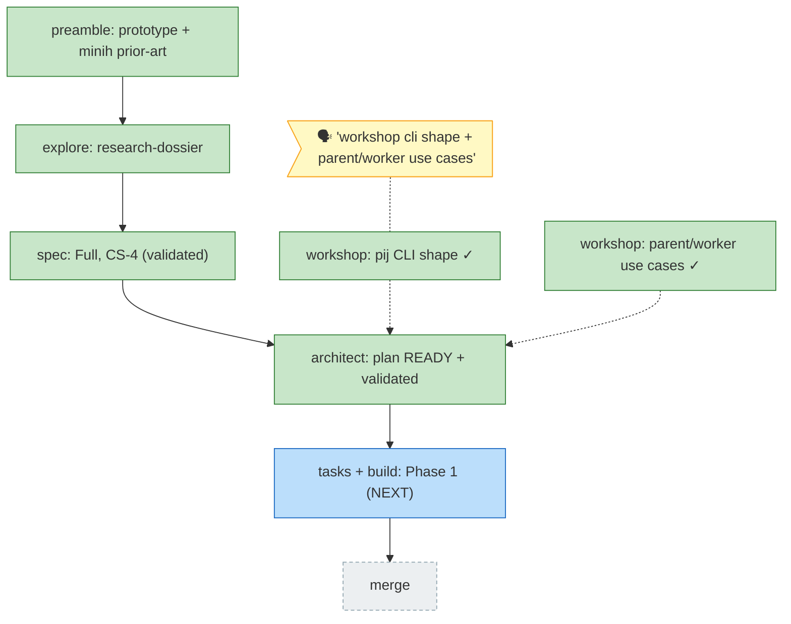

<!-- GENERATED from the-flow.json — never hand-edit as primary. -->
# Flight plan — pi-session-messaging

Legend: 🟩 done · 🟧 in progress · 🟥 blocked · 🟦 known · ⬜ assumed · 🗣 user input · `-.->` workshops feed the architect (authoritative)
