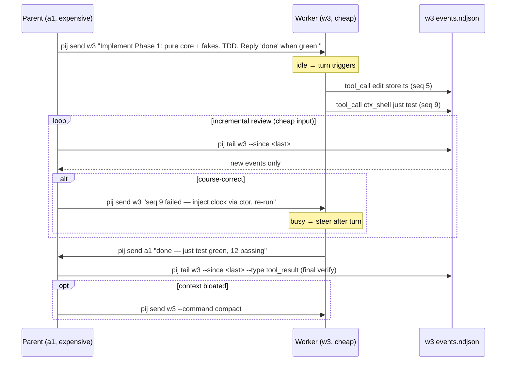

# Workshop: Parent/Worker Collaboration Use Cases

**Type**: Integration Pattern
**Plan**: 014-pi-session-messaging
**Spec**: [pi-session-messaging-spec.md](../pi-session-messaging-spec.md)
**Created**: 2026-06-16
**Status**: Draft

**Value Thesis**: Make the *product* concrete — the loop where an expensive **parent**
reviewer instructs a cheaper **worker** generator, follows its event stream, and fires
feedback. Fixes who-does-what, the message cadence, how work is observed, and how "done"
and failure are signalled — so the architect plans real workflows, not just plumbing.
**Target Proof Level**: Preferred Direction → Contract Ready

**Current Proof Level**: Decision Space → Preferred Direction

**Selected Value Axes**:
- **Strategic Value**: the economic case (cheap tokens generate, expensive tokens review) is the reason to build this.
- **Cross-Domain Coordination**: parent/worker is a contract — instruction in, events out, feedback in.
- **Operational Reliability**: the loop must survive a wedged/dead worker (liveness).
- **Agent Readiness**: both roles must know their script from the boot announce.

**Related Documents**:
- Sibling: [001-pij-cli-shape.md](./001-pij-cli-shape.md) (the verbs this workflow uses)
- [research-dossier.md](../research-dossier.md) §Economic model

**Domain Context**:
- **Primary Domain**: pij-messaging (NEW)
- **Related Domains**: pi runtime (consumed), agent-tooling-interface (consumed)

---

## Purpose

Specify the **collaboration patterns** between a parent (reviewer) and worker
(generator) pi session: the instruct→generate→observe→review→feedback loop, the
roles, the message/observe cadence, done/failure signalling, and the compact use.
This is the "what is pij *for*" document.

## Fresh Entrant Outcome

A fresh human/agent reaches **Preferred Direction**: they understand the two roles,
the canonical loop, and which `pij` commands each side runs at each step — enough to
drive a real parent/worker session and for the architect to plan the workflow glue.

## Key Questions Addressed

- What exactly does the parent do vs the worker? Why split them?
- How does the parent instruct, then observe without re-ingesting the worker's context?
- When does the parent *read* (`tail`/`path`) vs *react* (`send`)?
- How is "task done" signalled? How is a wedged/dead worker handled?
- Where does `--command compact` fit?

---

## Value Frame

| Field | Selection | Why It Matters |
|-------|-----------|----------------|
| Target Proof Level | Preferred Direction (→ Contract Ready on cadence) | Architect needs the loop + roles fixed; exact polling tuned later. |
| Primary Value Axis | Strategic Value | The cost asymmetry is the entire justification. |
| Supporting Value Axes | Cross-Domain Coordination, Operational Reliability, Agent Readiness | Roles are a contract; the loop must survive failure; agents follow a script. |
| Downstream Loop Improved | Agent execution + Review | Cheap generation + cheap incremental review replace expensive re-reads. |

## The economic thesis (the why)

```
PARENT  = expensive model (e.g. Opus-class)   → mostly INPUT tokens (reads + reviews)
WORKER  = cheaper model   (e.g. a mid model)  → mostly OUTPUT tokens (generates code)
```
- Generation (the token-heavy part) runs on the cheap model.
- Review/judgement (where the expensive model earns its keep) runs on the parent —
  but the parent **reads the worker's event stream incrementally** (`tail --since`),
  so it pays input tokens only for *new* activity, never re-ingesting full context.
- Net: high-quality direction + review at a fraction of doing it all on the expensive model.

## Roles

| | **Parent (reviewer/orchestrator)** | **Worker (generator)** |
|---|---|---|
| Model | expensive / high-judgement | cheaper / fast |
| Verb it lives in | `tail`, `state`, `path`, `send` (feedback) | does the actual edits/tests; `send` (status back) |
| Reads | worker's `events.ndjson` incrementally | the parent's instructions (injected) |
| Writes | instructions + feedback to worker | code, tests, and its own event stream |
| Boot role line | `You are the PARENT: instruct, observe, review.` | `You are the WORKER: do the work, keep going.` |

Roles are set per session (a flag/env at extension boot) and injected via the
self-announce (workshop 001).

## The canonical loop



### Step-by-step

| # | Actor | Action | pij command |
|---|-------|--------|-------------|
| 1 | Parent | Instruct the worker with a scoped task + a done-signal contract | `pij send w3 "…"` |
| 2 | Worker | Work; every tool call/result lands in its event stream | (automatic) |
| 3 | Parent | Follow incrementally; pay input only for new events | `pij tail w3 --since N` |
| 4 | Parent | If off-track, fire targeted feedback (steers if busy) | `pij send w3 "fix …"` |
| 5 | Worker | On completion, message the parent the agreed done-signal | `pij send a1 "done — …"` |
| 6 | Parent | Final verify against `tool_result`/tests | `pij tail w3 --since N --type tool_result` |
| 7 | Parent | If worker context heavy, request compact | `pij send w3 --command compact` |

## Use-case catalogue

### UC-1 — Delegated implementation (primary)
Parent assigns a phase, worker implements TDD, parent reviews the event stream and
nudges. **This is the headline use case.** Done-signal: worker sends `done — <evidence>`.

### UC-2 — Live code review
Worker is mid-task; parent tails `--type tool_call`/`tool_result`, spots a bad edit,
and steers a correction *before* the worker compounds it. Cheap because the parent
reads deltas, not the whole file history.

### UC-3 — Stuck-worker rescue
`pij state w3` shows `working` but the newest event's age (now − its `timestamp`) keeps
growing / `tail` shows a repeated failing command. Parent sends a concrete unblock
("you're looping on X; try Y"). If `state` shows `dead`, parent restarts the worker and
re-instructs.

### UC-4 — Context hygiene
Long worker run → parent issues `--command compact` at a safe seam so the worker keeps
going cheaply without the parent re-explaining the task.

### UC-5 — Deep-dive read
Summarised `tail` isn't enough; parent runs `pij path w3 --events` and reads
`events.ndjson` directly with file tools to inspect exact tool args/outputs.

## Cadence & "when to read vs react"

| Signal | Parent does | Why |
|--------|-------------|-----|
| New `tool_call` events flowing | `tail --since` periodically (or `--follow`) | cheap delta review |
| `tool_result` shows error | `send` targeted fix | catch early, steer |
| `state = working`, no new events for a while | `state` then `send` unblock | detect a wedge (newest event `timestamp` age is the stall signal) |
| `state = complete` / worker `done` message | `tail --type tool_result` final pass | verify before accepting |
| `liveness = dead` | restart + re-instruct | worker crashed |

> Guidance, not gating: the parent agent decides cadence. No thresholds enforced.

## Done & failure signalling

- **Done**: convention, not protocol — the parent's instruction *names the done-signal*
  ("reply `done` with test output"). The worker's `pij send a1 "done — …"` is just a
  message; optionally the worker's `state` flips to `complete`/`idle`.
- **Failure**: worker messages `blocked — <reason>`; or parent infers from `tail`
  (repeated failing `tool_result`) or `state`/`liveness`.
- No acks, no delivery receipts (fire-and-forget) — the *event stream* is the source of
  truth, messages are nudges.

## Decision Space

| Option | Description | Pros | Cons | Decision |
|--------|-------------|------|------|----------|
| Parent reviews via event stream (`tail --since`) | incremental delta reads | cheap input; no re-ingest; the core value | parent must poll/follow | **Selected** |
| Parent reviews by asking worker to summarise | worker self-reports | less parent reading | worker spends output tokens; less trustworthy; slower | Rejected |
| Done = convention in the instruction | parent names the signal | zero protocol; flexible | not machine-enforced | **Selected (v1)** |
| Done = structured `complete` state + required ack | formal handshake | machine-checkable | adds protocol, against fire-and-forget ethos | Deferred |
| Roles fixed at boot (parent/worker) | role injected in announce | clear scripts; simple | a session can't switch role live | **Selected (v1)** |

## Attention Reduction

| Future Loop | Before Workshop | After Workshop |
|-------------|-----------------|----------------|
| Implementation | "what's the workflow glue for?" unclear | the 7-step loop + 5 use cases are explicit |
| Review | reviewers reconstruct intended interaction | sequence diagram + cadence table are the spec |
| Agent execution | both agents improvise their role | boot role lines + done-signal convention scripted |

## Evidence Ledger

| Evidence | Location | Supports | Status |
|----------|----------|----------|--------|
| Sequence diagram | this doc | the canonical loop | Ready |
| Role table + boot role lines | this doc | Agent Readiness | Ready |
| Use-case catalogue (UC1–5) | this doc | scope of workflow glue | Ready |
| Cadence / read-vs-react table | this doc | observability AC #7–10 | Draft |
| Done/failure convention | this doc | "done" handling | Preferred Direction (not yet contract) |

## Validation / Acceptance

Reaches its proof level when:
- The architect can name the "workflow glue" phase scope from UC-1…UC-5.
- Every step in the loop maps to a real `pij` command in workshop 001. ✅
- Done/failure handling has a stated v1 convention (it does: instruction-named signal + event-stream truth).

## Open Questions

- **Q: role switching** — can one session be parent *and* worker to different peers? **OPEN** (v1: role is per-session; revisit if needed).
- **Q: machine-checkable done** — promote `complete` state to a required handshake later? **DEFERRED** (v1 = convention).
- **Q: multi-worker** — one parent fanning out to N workers? **OPEN** (CLI supports N peers; workflow doc covers 1:1 for v1).
- **Q: feedback storms** — many rapid `send`s while worker streams → all steer-queued; is ordering guaranteed? **OPEN** (architect: confirm steer-queue FIFO).
