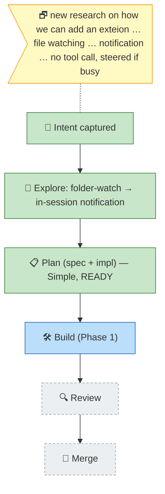

# Flight plan — file-watch-notify

> Generated from `the-flow.json` — do not hand-edit as the primary.

**Legend**: 🟩 done · 🟧 in-progress · 🟥 blocked · 🟦 known (designed) · ⬜ assumed (speculative) · 🗗 user input
