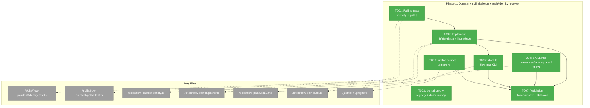
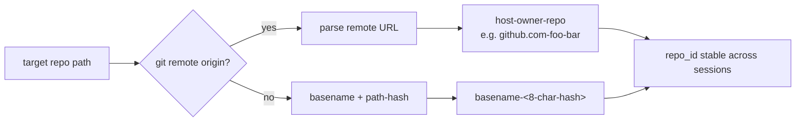
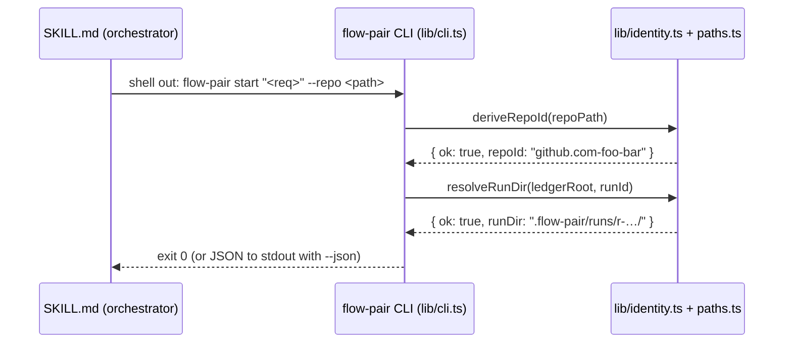

# Phase 1: Domain + skill skeleton + path/identity resolver

**Plan**: `docs/plans/016-flow-pair/flow-pair-plan.md`
**Phase**: Phase 1 of 8
**Generated**: 2026-06-17
**Status**: Ready

---

## Executive Briefing

- **Purpose**: Establish the `flow-pair` domain and a runnable skill shell with a tested, pi-free foundation. This phase is the base layer every subsequent phase builds on — no Phase 2+ work should begin until Phase 1 delivers its contracts.
- **What We're Building**: A tested repo-identity + path-layout resolver (`lib/identity.ts` + `lib/paths.ts`), the `flow-pair` domain doc (already done), a skeleton orchestrator skill (`skills/flow-pair/SKILL.md` + `references/` + `templates/` stubs), a thin CLI entrypoint (`lib/cli.ts`) that the skill shells out to, and `justfile` discovery wiring so the skill is pi-loadable.
- **Goals**:
  - ✅ Verified repo-identity derivation (git remote → `host-owner-repo`; fallback basename+path-hash) — AC-09
  - ✅ Pi-free helper lib passes `just self-check` — AC-10 (Phase 1 contribution)
  - ✅ Skill discoverable in pi after `just flow-pair-link` — Finding 02
  - ✅ CLI surface answers `flow-pair --help`; subcommands dispatch to lib — Finding 08
  - ✅ Runtime ledger root gitignored
  - ✅ Domain doc + registry + domain-map entries present (already done)
- **Non-Goals**:
  - ❌ No ledger writers (Phase 2)
  - ❌ No context-pack compiler (Phase 3)
  - ❌ No packet generation or delivery (Phase 4)
  - ❌ No observe/diff/review/learning (Phases 5–7)
  - ❌ No end-to-end dogfood (Phase 8)

---

## Prior Phase Context

_Phase 1 is the first phase — no prior phases to review._

---

## Pre-Implementation Check

| File | Exists? | Domain Check | Notes |
|------|---------|-------------|-------|
| `docs/domains/flow-pair/domain.md` | ✅ **exists** | flow-pair | Written in dlg-0001; DONE |
| `docs/domains/registry.md` | ✅ **exists** | cross-domain | flow-pair entry added by orchestrator; DONE |
| `docs/domains/domain-map.md` | ✅ **exists** | cross-domain | flow-pair node + edges added by orchestrator; DONE |
| `skills/flow-pair/test/identity.test.ts` | ❌ create | flow-pair | New — TDD first (T001) |
| `skills/flow-pair/test/paths.test.ts` | ❌ create | flow-pair | New — TDD first (T001) |
| `skills/flow-pair/lib/identity.ts` | ❌ create | flow-pair | New — impl after tests pass (T002) |
| `skills/flow-pair/lib/paths.ts` | ❌ create | flow-pair | New — impl after tests pass (T002) |
| `skills/flow-pair/SKILL.md` | ❌ create | flow-pair | New router skill (T004) |
| `skills/flow-pair/references/architecture.md` | ❌ create | flow-pair | Stub (T004) |
| `skills/flow-pair/references/orchestrator-worker-protocol.md` | ❌ create | flow-pair | Stub (T004) |
| `skills/flow-pair/references/ledger-schema.md` | ❌ create | flow-pair | Stub (T004) |
| `skills/flow-pair/references/prompt-taxonomy.md` | ❌ create | flow-pair | Stub (T004) |
| `skills/flow-pair/references/context-packs.md` | ❌ create | flow-pair | Stub (T004) |
| `skills/flow-pair/references/review-rubrics.md` | ❌ create | flow-pair | Stub (T004) |
| `skills/flow-pair/references/templates/worker-implement.md` | ❌ create | flow-pair | Stub (T004) |
| `skills/flow-pair/references/templates/worker-fix.md` | ❌ create | flow-pair | Stub (T004) |
| `skills/flow-pair/references/templates/review-synthesis.md` | ❌ create | flow-pair | Stub (T004) |
| `skills/flow-pair/references/templates/learning-synthesis.md` | ❌ create | flow-pair | Stub (T004) |
| `skills/flow-pair/references/templates/orchestrator-stage.md` | ❌ create | flow-pair | Stub (T004) |
| `skills/flow-pair/lib/cli.ts` | ❌ create | flow-pair | New thin CLI entrypoint (T005) |
| `justfile` | ✅ **exists** | extension-authoring-harness | Modify — add `flow-pair-link` + `flow-pair-test` recipes (T006) |
| `.gitignore` | ✅ **exists** | flow-pair | Modify — add `.flow-pair/` (entire runtime root) entry (T006) |
| `tsconfig.json` | ✅ **exists** | extension-authoring-harness | Modify — add `"skills/**/*.ts"` to `include` array so `just typecheck` covers Phase 1 code (T006) |
| `vitest.config.ts` | ✅ **exists** | extension-authoring-harness | Modify — add `"skills/**/*.test.ts"` to `test.include`, OR T006 recipe invokes `vitest run skills/flow-pair/test/` explicitly (T006) |

---

## Architecture Map



---

## Tasks

| Status | ID | Task | Domain | Path(s) | Done When | Notes |
|--------|-----|------|--------|---------|-----------|-------|
| [x] | T003 | Create `docs/domains/flow-pair/domain.md` + register in `registry.md` + add node+edges in `domain-map.md` | flow-pair | `/Users/jordanknight/pi-hacking/pij/docs/domains/flow-pair/domain.md` `/Users/jordanknight/pi-hacking/pij/docs/domains/registry.md` `/Users/jordanknight/pi-hacking/pij/docs/domains/domain-map.md` | `domain.md` has 8 sections; registry lists `flow-pair`; domain-map has node + 3 consume edges (pij-messaging, ATI, harness) | **Already done** (dlg-0001 + orchestrator). Resequenced first (was plan 1.3) to reflect completion order. |
| [x] | T001 | Write **failing** vitest tests for `lib/identity.ts` + `lib/paths.ts` | flow-pair | `/Users/jordanknight/pi-hacking/pij/skills/flow-pair/test/identity.test.ts` `/Users/jordanknight/pi-hacking/pij/skills/flow-pair/test/paths.test.ts` | Tests cover: git-remote → `host-owner-repo`; basename+path-hash fallback; stable across repeated calls; run-dir layout (`.flow-pair/runs/<run-id>/…` paths resolve correctly); tests **fail** before impl | TDD-first (Finding 05, AC-09); use real tmp git fixtures — no mocks; P3 constructor-inject fakes for git calls. Fixture sketch: `const dir = await mkdtemp(join(tmpdir(), 'fp-test-'))`; `execSync('git init', { cwd: dir })`; add remote for HTTPS (`https://github.com/foo/bar.git`) and SSH (`git@github.com:foo/bar.git`) variants; non-git fallback: plain tmpdir with no .git dir. |
| [x] | T002 | Implement `lib/identity.ts` + `lib/paths.ts` (pi-free) | flow-pair | `/Users/jordanknight/pi-hacking/pij/skills/flow-pair/lib/identity.ts` `/Users/jordanknight/pi-hacking/pij/skills/flow-pair/lib/paths.ts` | T001 tests pass; zero `@earendil-works/*` imports; `.js` ESM relative imports; tagged-union returns `{ ok, … }` (P4); constants in lib files not inline (P5); exports `deriveRepoId(repoPath: string): { ok: boolean; repoId: string; error?: string }` from `identity.ts` and `resolveRunDir(ledgerRoot: string, runId: string): { ok: boolean; runDir: string; error?: string }` from `paths.ts` (Phase 2 contract surface) | After T001 is green-failing; P2 pi-free (AC-10); P7 `.js` ESM |
| [x] | T004 | Create `skills/flow-pair/SKILL.md` router + `references/` stubs + `templates/` stubs | flow-pair | `/Users/jordanknight/pi-hacking/pij/skills/flow-pair/SKILL.md` `/Users/jordanknight/pi-hacking/pij/skills/flow-pair/references/architecture.md` `/Users/jordanknight/pi-hacking/pij/skills/flow-pair/references/orchestrator-worker-protocol.md` `/Users/jordanknight/pi-hacking/pij/skills/flow-pair/references/ledger-schema.md` `/Users/jordanknight/pi-hacking/pij/skills/flow-pair/references/prompt-taxonomy.md` `/Users/jordanknight/pi-hacking/pij/skills/flow-pair/references/context-packs.md` `/Users/jordanknight/pi-hacking/pij/skills/flow-pair/references/review-rubrics.md` `/Users/jordanknight/pi-hacking/pij/skills/flow-pair/references/templates/worker-implement.md` `/Users/jordanknight/pi-hacking/pij/skills/flow-pair/references/templates/worker-fix.md` `/Users/jordanknight/pi-hacking/pij/skills/flow-pair/references/templates/review-synthesis.md` `/Users/jordanknight/pi-hacking/pij/skills/flow-pair/references/templates/learning-synthesis.md` `/Users/jordanknight/pi-hacking/pij/skills/flow-pair/references/templates/orchestrator-stage.md` | SKILL.md states: orchestrator decision protocol states (ASK_USER/RUN_LOCAL/DELEGATE/REVIEW/FIX/ACCEPT), hard invariants (flow-state non-write, forbidden paths, pointer-delivery), invocation modes, reference links; all stubs exist as non-empty placeholder `.md` files | Skill is a router, not a mega-prompt; stubs need enough content to be linked (not empty files); the six `references/*.md` and five `templates/*.md` stubs are Phase-1 scaffolding — filled out in later phases |
| [x] | T005 | Implement `lib/cli.ts` thin `flow-pair` CLI entrypoint | flow-pair | `/Users/jordanknight/pi-hacking/pij/skills/flow-pair/lib/cli.ts` | `flow-pair --help` prints intent list; subcommands (`start`, `dispatch`, `observe`, `review`, `fix`, `accept`, `ledger`) dispatch to lib stubs and exit 0; `--json` flag accepted; exit codes: 0=success, 1=usage error, 2=runtime error; pi-free (no `@earendil-works/*`) | Finding 08 — the skill shells out to this CLI; it is never imported into pi (P2 boundary); mirrors `pij` CLI shape; stubs for Phase-2+ subcommands are fine here |
| [x] | T006 | Add `flow-pair-link` + `flow-pair-test` recipes to `justfile`; add `.flow-pair/` to `.gitignore`; extend `tsconfig.json` + `vitest.config.ts` | extension-authoring-harness | `/Users/jordanknight/pi-hacking/pij/justfile` `/Users/jordanknight/pi-hacking/pij/.gitignore` `/Users/jordanknight/pi-hacking/pij/tsconfig.json` `/Users/jordanknight/pi-hacking/pij/vitest.config.ts` | `just flow-pair-link` runs `mkdir -p .pi/skills && ln -sf "$(pwd)/skills/flow-pair" .pi/skills/flow-pair` (Finding 02: pi auto-discovers from `.pi/skills/`); `just flow-pair-test` invokes `vitest run skills/flow-pair/test/` explicitly; `.flow-pair/` (entire runtime root) in `.gitignore`; `tsconfig.json` `include` has `"skills/**/*.ts"`; `vitest.config.ts` `test.include` covers `"skills/**/*.test.ts"` (or recipe uses explicit path) | Finding 02 — symlink target is `.pi/skills/flow-pair` (project-local, NOT `~/.pi/agent/extensions/` which is for global extensions — different path class); prompt-lab committed assets live under `skills/flow-pair/prompt-lab/`, not `.flow-pair/`, so gitignoring `.flow-pair/` entirely is safe |
| [x] | T007 | Validation: `just flow-pair-test` green + manual skill-load check | flow-pair | — | `just flow-pair-test` exits 0 (T001+T002 specs pass); after `just flow-pair-link`, `pi` session can invoke the skill or it appears in skills list; `flow-pair --help` exits 0 | Lightweight validation for the markdown/stub parts; T002 lib tests are the primary gate; just checks both lib and discovery wiring together |

---

## Context Brief

### Key findings from plan

- **Finding 01 (Critical)**: `the-flow` guided mode is the **sole** writer of `.the-flow-state.json` / `the-flow.json` / `the-flow.md`. Any dual-writer corrupts resume/adopt. → Worker packets hard-forbid those paths; `SKILL.md` must encode this invariant prominently.
- **Finding 02 (Critical)**: Pi skills are auto-discovered from `.pi/skills/` only. A bare top-level `skills/` dir is silently ignored. → `just flow-pair-link` symlinks `skills/flow-pair/` into the pi-loaded skills dir. T006 gates T007.
- **Finding 05 (High)**: pij house rules P1–P10 apply: pi-free store (P2), constructor-inject fakes (P3), tagged-union returns (P4), constants in lib (P5), `.js` ESM imports (P7), tests target the lib not wiring (P8), persist-before-mutate (P9). → T001/T002 follow P2/P3/P4/P7/P8.
- **Finding 08 (High)**: A markdown skill cannot call a TS lib directly. → Expose the lib via `lib/cli.ts` (T005); the skill/agent shells out; the CLI is never imported into pi.
- **Finding 09 (High)**: pij messages are short fire-and-forget text. Full packet bodies are unwieldy. → Pointer-delivery: packet saved to ledger, `pij send` sends a path. SKILL.md must encode this. (Phase 4 impl, but the SKILL.md stub should reference it.)

### Domain dependencies

- `flow-pair`: Owns everything here — identity, paths, skill surface, CLI. No cross-domain runtime consumption in Phase 1.
- `extension-authoring-harness`: `justfile` + vitest + `just self-check` are the validation gates. T006/T007 depend on this domain's tooling.
- `pij-messaging`: Referenced in SKILL.md stubs for pointer-delivery invariant — consumed in Phase 4, described here.

### Domain constraints

- P2: `lib/identity.ts`, `lib/paths.ts`, `lib/cli.ts` must have zero `@earendil-works/*` imports.
- P7: All relative imports in `lib/` must use `.js` extension (NodeNext/ESM).
- P8: Tests in `skills/flow-pair/test/` target the lib functions directly, not via the CLI wiring.
- P3: `identity.ts` must accept injected deps for the git-call side effects (no global `execSync` at module scope); `nodeGitDeps()` is the production binding.

### Reusable from prior phases

_Phase 1 is the base — nothing to reuse yet. Reference pij's existing T2 extension layout (`.pi/extensions/file-watch-notify/`) as the canonical pattern for pi-free store + injected deps + tagged-union returns._

### Flow: identity derivation



### Sequence: skill → CLI → lib



---

## Discoveries & Learnings

_Populated during implementation by the implement verb._

| Date | Task | Type | Discovery | Resolution | References |
|------|------|------|-----------|------------|------------|

**Types**: `gotcha` | `research-needed` | `unexpected-behavior` | `workaround` | `decision` | `debt` | `insight`

---

## Directory Layout

```
docs/plans/016-flow-pair/
  ├── flow-pair-plan.md
  └── tasks/
      └── phase-1-domain-skill-skeleton-path-identity-resolver/
          ├── tasks.md              ← this file
          └── execution.log.md     ← created by the implement verb
```

---

## Validation Record (2026-06-17)

### Validation Thesis

**Raison d'être**: Enable an implementer to execute Phase 1 cold, without re-reading the plan or making architectural decisions.

**Value claim**: TDD-ordered, plan-grounded task table with checkable Done-When criteria removes ambiguity from Phase 1 execution.

**Artifact promise**: Any agent/human can implement T001–T007 in sequence with correct TDD ordering, correct absolute paths, and verifiable completion criteria without plan clarification.

**Intended beneficiaries**: Implementation agents (next worker packet), human reviewers, Phase 2+ implementers.

**Proof target**: Implementation

**Evidence standard**: 7-col task table with concrete Done-When; grounded absolute paths; finding references; TDD sequencing; domain constraints; exported function signatures.

**Thesis source**: `docs/plans/016-flow-pair/flow-pair-plan.md` §Phase 1 task table, §Key Findings, §Acceptance Criteria

**Thesis verdict**: Advanced (after fixes applied)

**Main thesis risk**: T006 symlink target and tsconfig/vitest config omissions were highest-impact gaps — resolved by this validation pass.

---

| Agent | Lenses Covered | Issues | Verdict |
|-------|---------------|--------|--------|
| Source Truth + Plan Alignment | Source Truth, Domain Boundaries, Hidden Assumptions | 1 MEDIUM (gitignore path), 2 LOW | ✅ |
| Cross-Reference + Completeness | Technical Constraints, Integration & Ripple, Concept Docs | 2 CRITICAL fixed, 1 HIGH fixed, 2 MEDIUM, 2 LOW | ⚠️ → ✅ |
| Thesis Alignment | Thesis Alignment, Evidence Sufficiency, Proof-Level Fit, Agent Readiness | 2 HIGH fixed, 3 MEDIUM, 2 LOW | ⚠️ → ✅ |
| Forward-Compatibility | Forward-Compatibility, Integration & Ripple, Deployment & Ops | 1 CRITICAL fixed, 1 HIGH fixed, 1 MEDIUM, 2 LOW | ⚠️ → ✅ |

### Forward-Compatibility Matrix

| Consumer | Requirement | Mode | Verdict | Evidence |
|----------|-------------|------|---------|----------|
| `/the-flow 6 implement` verb | 7-col table, TDD order, absolute paths | — | ✅ PASS | All cols present; T001→T002→T005 arch map arrows; abs paths throughout |
| `just flow-pair-link` recipe | Correct symlink target `.pi/skills/flow-pair` | encapsulation lockout | ✅ FIXED | T006 Done-When names exact `mkdir -p .pi/skills && ln -sf` command |
| `just flow-pair-test` recipe | Explicit vitest path | contract drift | ✅ PASS | Done-When specifies `vitest run skills/flow-pair/test/` |
| Phase 2 (`lib/ledger.ts`) | `deriveRepoId` + `resolveRunDir` signatures | shape mismatch | ✅ FIXED | T002 Done-When names both function signatures with return types |
| Phase 7+ (prompt-lab runtime) | `.flow-pair/` fully gitignored | contract drift | ✅ FIXED | T006 uses `.flow-pair/` broad entry; committed assets under `skills/flow-pair/prompt-lab/` |
| `just typecheck` / `just self-check` | `skills/**/*.ts` in tsconfig include | encapsulation lockout | ✅ FIXED | tsconfig.json + vitest.config.ts added to Pre-Impl Check; T006 Done-When covers them |

**Thesis alignment**: Value claim advanced at Implementation proof level after fixes; residual MEDIUM gaps (T004 SKILL.md format ref, T007 concrete pi command) do not block execution.

**Outcome alignment**: The VPO Outcome is “Reduce coordination cost of orchestrating expensive sessions for bounded tasks” — the dossier now advances this for all seven tasks; CRITICAL gaps that would have blocked cold-execution of T006/T007 are resolved.

**Standalone?**: No — downstream: `/the-flow 6 implement` (immediate consumer), Phase 2 ledger lib (T002 contract surface), `just` tooling (T006/T007).

**Overall: ⚠️ VALIDATED WITH FIXES** — 3 CRITICAL + 3 HIGH resolved; remaining MEDIUM/LOW are improvement opportunities, not blockers.
