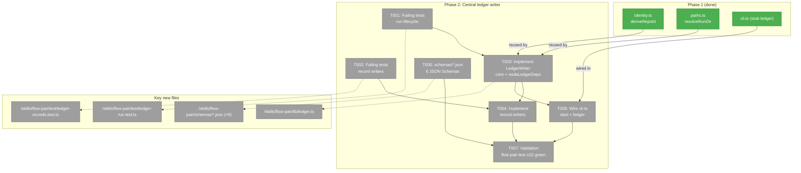

# Phase 2: Central ledger writer

**Plan**: `docs/plans/016-flow-pair/flow-pair-plan.md`
**Phase**: Phase 2 of 8
**Generated**: 2026-06-17
**Status**: Ready

---

## Executive Briefing

- **Purpose**: Build the durable, append-only ledger that every downstream phase writes into and reads from. Phase 2 is the persistence backbone — no Phase 3+ work should start until this layer delivers its contracts.
- **What We're Building**: `lib/ledger.ts` — a `LedgerWriter` class (P3 injectable fs deps) that creates run directories, maintains `events.jsonl` (one JSON object per line, append-only), and writes discrete per-record JSON files for delegations, prompt trials, reviews, and learnings. Six `schemas/*.json` files formalize the record shapes. `lib/cli.ts` `start` and `ledger` subcommands are wired to the real writers.
- **Goals**:
  - ✅ `createRun` scaffolds `.flow-pair/runs/<id>/` with `run.json` + `events.jsonl` (`run.started` appended — AC-01)
  - ✅ `appendEvent` is the only write path to `events.jsonl` (append-only integrity)
  - ✅ P9 persist-before-mutate: event line written BEFORE state file for every operation
  - ✅ P3 injectable `LedgerDeps` via constructor (testable without a real filesystem)
  - ✅ Record writers produce stable, inspectable JSON files in named subdirectories
  - ✅ ID allocator produces stable monotonic IDs per record type per run
  - ✅ Zero `@earendil-works/*` imports (AC-10, P2)
- **Non-Goals**:
  - ❌ No context-pack compiler (Phase 3)
  - ❌ No packet generation or pij-messaging delivery (Phase 4)
  - ❌ No observe/diff capture (Phase 5)
  - ❌ No review rubric runner or learning writer (Phase 6–7); only the *record writer* that saves a pre-computed result
  - ❌ No end-to-end dogfood wiring (Phase 8)

---

## Prior Phase Context

### Phase 1 contracts (reuse, do not reinvent)

| Export | File | Signature | Notes |
|--------|------|-----------|-------|
| `deriveRepoId` | `skills/flow-pair/lib/identity.ts` | `deriveRepoId(repoPath: string, deps?: GitDeps): { ok: boolean; repoId: string; error?: string }` | Used in `createRun` to form the run-id prefix |
| `resolveRunDir` | `skills/flow-pair/lib/paths.ts` | `resolveRunDir(ledgerRoot: string, runId: string): { ok: boolean; runDir: string; error?: string }` | Phase 2 writers call this for every run directory lookup |
| `nodeGitDeps` | `skills/flow-pair/lib/identity.ts` | `nodeGitDeps(): GitDeps` | Production binding; injected in `createRun` |
| `LEDGER_ROOT` | `skills/flow-pair/lib/paths.ts` | `".flow-pair"` constant | Default `ledgerRoot` for `LedgerWriter` constructor |
| `RUNS_DIR` | `skills/flow-pair/lib/paths.ts` | `"runs"` constant | Used in `resolveRunDir` internally |

### Dogfooded ledger layout (formalise in Phase 2)

```
.flow-pair/runs/<run-id>/
  run.json              ← RunRecord (written by createRun)
  events.jsonl          ← append-only; one JSON object per line
  delegations/          ← <dlg-NNNN>.json per writeDelegation call
  prompt-trials/        ← <trial-NNNN>.json per writePromptTrial call
  reviews/              ← <rev-NNNN>.json per writeReview call
  learnings/            ← <learn-NNNN>.json per writeLearning call
  prompts/              ← packet files (written by Phase 4)
  worker-reports/       ← worker report files (Phase 4)
  diffs/                ← git patches (Phase 5)
```

Phase 2 creates and owns: `run.json`, `events.jsonl`, `delegations/`, `prompt-trials/`, `reviews/`, `learnings/`. The remaining subdirs (`prompts/`, `worker-reports/`, `diffs/`) are scaffolded by `createRun` but written by later phases.

---

## Pre-Implementation Check

| File | Exists? | Action | Notes |
|------|---------|--------|-------|
| `skills/flow-pair/lib/identity.ts` | ✅ exists | read-only | Phase 1 contract; import `deriveRepoId` + `nodeGitDeps` |
| `skills/flow-pair/lib/paths.ts` | ✅ exists | read-only | Phase 1 contract; import `resolveRunDir` + `LEDGER_ROOT` |
| `skills/flow-pair/lib/ledger.ts` | ❌ create | T001 stub → T003 impl | Core writer; P3 class |
| `skills/flow-pair/test/ledger-run.test.ts` | ❌ create | T001 | Run lifecycle tests |
| `skills/flow-pair/test/ledger-records.test.ts` | ❌ create | T002 | Record writer tests |
| `skills/flow-pair/schemas/run.schema.json` | ❌ create | T005 | JSON Schema **draft-07** |
| `skills/flow-pair/schemas/event.schema.json` | ❌ create | T005 | JSON Schema draft-07 |
| `skills/flow-pair/schemas/delegation.schema.json` | ❌ create | T005 | JSON Schema draft-07 |
| `skills/flow-pair/schemas/prompt-trial.schema.json` | ❌ create | T005 | JSON Schema draft-07 |
| `skills/flow-pair/schemas/review.schema.json` | ❌ create | T005 | JSON Schema draft-07 |
| `skills/flow-pair/schemas/learning.schema.json` | ❌ create | T005 | JSON Schema draft-07 |
| `skills/flow-pair/lib/cli.ts` | ✅ exists | T006 modify | Wire `start` + `ledger` subcommands |
| `skills/flow-pair/references/ledger-schema.md` | ✅ exists (stub) | T005/T006 fill-in | Upgrade from stub to real schema doc |
| `tsconfig.json` | ✅ exists | verify | `"skills/**/*.ts"` already in include (Phase 1) |
| `vitest.config.ts` | ✅ exists | verify | `"skills/**/*.test.ts"` already in test.include (Phase 1) |
| `justfile` | ✅ exists | verify | `flow-pair-test` recipe already present (Phase 1) |

---

## Architecture Map



---

## Tasks

| Status | ID | Task | Domain | Path(s) | Done When | Notes |
|--------|-----|------|--------|---------|-----------|-------|
| [x] | T001 | Write **failing** vitest tests for `lib/ledger.ts` run lifecycle (createRun, appendEvent, closeRun, id allocation) | flow-pair | `/Users/jordanknight/pi-hacking/pij/skills/flow-pair/test/ledger-run.test.ts` (new) `/Users/jordanknight/pi-hacking/pij/skills/flow-pair/lib/ledger.ts` (stub) | 6+ tests covering: `createRun(repoId)` produces `run.json` with correct shape + appends `run.started` event; `appendEvent` writes exactly one JSON line per call; `closeRun` appends `run.closed` event AND updates `run.json` with `status: "closed"`; ids are stable (same repoId + same mock time → same runId prefix); **P9 ordering asserted**: fake `LedgerDeps.appendFileSync` and `writeFileSync` both push to a shared `callLog: string[]`; test asserts `callLog.indexOf("appendFileSync") < callLog.indexOf("writeFileSync")` for each writer; all tests **fail** before impl (`throw new Error("not implemented — T003")`); exit non-zero (red phase verified) | TDD-first; stub `lib/ledger.ts` exports `LedgerWriter` class + `nodeLedgerDeps()` with all method signatures present (so tests can import), but all methods throw; real tmp dirs via `mkdtemp`; inject fake `LedgerDeps` via constructor for isolation (P3); fake records calls in `callLog` to enable P9 order assertions |
| [x] | T002 | Write **failing** vitest tests for `lib/ledger.ts` record writers (delegation, prompt-trial, review, learning) | flow-pair | `/Users/jordanknight/pi-hacking/pij/skills/flow-pair/test/ledger-records.test.ts` (new) | 8+ tests: `writeDelegation(runId, {...})` writes `delegations/dlg-0001.json` with `taskRef` + `packetPath` + `runId` + appends `delegation.created` event; `writePromptTrial(runId, delegationId, {...})` writes `prompt-trials/trial-0001.json`; `writeReview(runId, delegationId, {...})` writes `reviews/rev-0001.json` with `verdict` + `delegationId` field; `writeLearning(runId, delegationId, {...})` writes `learnings/learn-0001.json`; sequential ids (`dlg-0001`, `dlg-0002`) are monotonic; all tests **fail** on stub (red phase verified) | TDD-first; import from same stub ledger.ts created in T001; use real tmp dirs + fake `LedgerDeps` (P3); use a **pre-fabricated runId** + manually call `deps.mkdirSync` to create run dir subdirs — do NOT call `createRun` (which throws on stub); this avoids a T003 dependency in T002 fixture setup |
| [x] | T003 | Implement `LedgerWriter` core in `lib/ledger.ts`: run lifecycle + `nodeLedgerDeps()` | flow-pair | `/Users/jordanknight/pi-hacking/pij/skills/flow-pair/lib/ledger.ts` | All T001 tests pass (green); `createRun(repoId)` scaffolds run dir (7 subdirs: delegations, prompt-trials, reviews, learnings, prompts, worker-reports, diffs) + appends `run.started` to `events.jsonl` THEN writes `run.json` (P9); `closeRun(runId)` appends `run.closed` THEN writes updated `run.json` with `status: "closed"` and `closedAt` (P9: event first, state second); `appendEvent` appends one minified JSON line (newline-terminated); `nodeLedgerDeps()` returns real `node:fs` binding; zero `@earendil-works/*` imports (P2); P7 `.js` ESM imports | P9 is non-negotiable: event line written before any state file in every code path; `runId` format: `<YYYY-MM-DDTHH-MM-SSZ>-<repoId[0:20]>` (same as Phase 1 cli.ts); **Phase 3 note**: LedgerWriter is write-only — Phase 3 reads ledger files directly via `fs.readFileSync(join(runDir, "run.json"), "utf8")` etc. using the documented path layout (no read API in Phase 2) |
| [x] | T004 | Implement record writers in `lib/ledger.ts` (delegation, prompt-trial, review, learning) | flow-pair | `/Users/jordanknight/pi-hacking/pij/skills/flow-pair/lib/ledger.ts` | All T002 tests pass (green); each writer: (a) resolves run dir via `resolveRunDir(ledgerRoot, runId)`, (b) allocates monotonic ID from `readdirSync` count, (c) appends typed event (P9 first), (d) writes JSON record; **Corrected method signatures**: `writeDelegation(runId, {taskRef, packetPath})` → `DelegationRecord`; `writePromptTrial(runId, delegationId, {templateRef, promptHash})` → `PromptTrialRecord`; `writeReview(runId, delegationId, {verdict, findings: ReviewFinding[]})` → `ReviewRecord`; `writeLearning(runId, delegationId, {cluster, candidatePath})` → `LearningRecord`; all records include `runId` field; child records include `delegationId`; tagged-union returns `{ok, <record>}` (P4) | `writeReview`/`writePromptTrial`/`writeLearning` each take `(runId, delegationId, opts)` — not `(delegationId, opts)` — so Phase 6/7 callers don't need a reverse-lookup; ID: `readdirSync(subdir).filter(f => f.endsWith('.json')).length + 1` zero-padded to 4 digits; P9 per-writer |
| [x] | T005 | Create `skills/flow-pair/schemas/*.json` (6 JSON Schema files) | flow-pair | `/Users/jordanknight/pi-hacking/pij/skills/flow-pair/schemas/run.schema.json` `/Users/jordanknight/pi-hacking/pij/skills/flow-pair/schemas/event.schema.json` `/Users/jordanknight/pi-hacking/pij/skills/flow-pair/schemas/delegation.schema.json` `/Users/jordanknight/pi-hacking/pij/skills/flow-pair/schemas/prompt-trial.schema.json` `/Users/jordanknight/pi-hacking/pij/skills/flow-pair/schemas/review.schema.json` `/Users/jordanknight/pi-hacking/pij/skills/flow-pair/schemas/learning.schema.json` | Each file is valid **JSON Schema draft-07**; `$id`, `title`, `type: object`, `required`, `properties` fields present; schemas match the TypeScript record types in the Context Brief field table exactly; `event.schema.json` uses `oneOf` with a `type` discriminator to cover all 6 event variants; `review.schema.json` includes a `findings` array with the `ReviewFinding` sub-schema; `references/ledger-schema.md` updated from stub to real content referencing these files; `just typecheck` still clean | Use draft-07 consistently (not draft-2020-12 — pick one); `event.schema.json` needs discriminated union for: `run.started`, `run.closed`, `delegation.created`, `prompt_trial.created`, `review.created`, `learning.created` — each discriminated by the `type` string |
| [x] | T006 | Wire `lib/cli.ts` `start` + `ledger` subcommands to real `lib/ledger.ts` | flow-pair | `/Users/jordanknight/pi-hacking/pij/skills/flow-pair/lib/cli.ts` | `flow-pair start` calls `new LedgerWriter(ledgerRoot, nodeLedgerDeps()).createRun(repoId)` and creates `.flow-pair/runs/<id>/run.json` on disk; `flow-pair ledger --run-id <id>` reads `run.json` and prints it; `flow-pair start --json` emits structured output and exits 0; existing `--json` flag + exit codes unchanged; `just flow-pair-test` still green after wiring | Previous stub in `runStart` called `deriveRepoId` + `resolveRunDir` directly — replace with `LedgerWriter.createRun` which calls those internally; test that `flow-pair start` produces `run.json` with correct shape in a tmp ledger root |
| [x] | T007 | Validation: Phase 2 spec suite green + typecheck + lint | flow-pair | `docs/plans/016-flow-pair/tasks/phase-2-central-ledger-writer/tasks.md` (this file, status update) | `just flow-pair-test` exits 0 with ≥22 tests passing (Phase 1: 14 + Phase 2: ≥8 new); `just typecheck` clean (0 errors); `just lint` exits 0; `flow-pair start --json` from a tmp ledger root produces readable `run.json` + non-empty `events.jsonl` with `run.started` line | Run `just flow-pair-test` and paste the `Test Files N passed` line as evidence; do not claim green without running |

---

## Context Brief

### Key constants (P5 — must live in `lib/ledger.ts`)

```typescript
// Record-type sub-directory names
const DELEGATIONS_DIR = "delegations" as const;
const PROMPT_TRIALS_DIR = "prompt-trials" as const;
const REVIEWS_DIR = "reviews" as const;
const LEARNINGS_DIR = "learnings" as const;
// Subdirs scaffolded by createRun (Phase 4–5 write into prompts/worker-reports/diffs/)
const RUN_SUBDIRS = [
  "delegations", "prompt-trials", "reviews", "learnings",
  "prompts", "worker-reports", "diffs",
] as const;
// ID prefixes
const ID_PREFIXES = { delegation: "dlg", promptTrial: "trial", review: "rev", learning: "learn" } as const;
```

### P3 interface (inject for testing, `nodeLedgerDeps()` for production)

```typescript
export interface LedgerDeps {
  mkdirSync(path: string, opts?: { recursive?: boolean }): void;
  writeFileSync(path: string, data: string): void;
  appendFileSync(path: string, data: string): void;
  readFileSync(path: string, enc: "utf8"): string;
  existsSync(path: string): boolean;
  readdirSync(path: string): string[];
}
```

**P9 testability**: fake `LedgerDeps` must include a `callLog: string[]` that both `appendFileSync` and `writeFileSync` push into (e.g. `"appendFileSync"` / `"writeFileSync"`). Tests assert `callLog.indexOf("appendFileSync") < callLog.indexOf("writeFileSync")` for every writer.

### Record types and required fields

| Record type | Required fields |
|-------------|----------------|
| `RunRecord` | `runId`, `repoId`, `runDir`, `createdAt`, `status: "open" \| "closed"` |
| `DelegationRecord` | `delegationId`, `runId`, `taskRef`, `packetPath`, `createdAt`, `status: "pending" \| "accepted" \| "fix_required"` |
| `PromptTrialRecord` | `trialId`, `runId`, `delegationId`, `templateRef`, `promptHash`, `createdAt` |
| `ReviewRecord` | `reviewId`, `runId`, `delegationId`, `verdict: "ACCEPT" \| "FIX_REQUIRED"`, `findings: ReviewFinding[]`, `createdAt` |
| `LearningRecord` | `learningId`, `runId`, `delegationId`, `cluster`, `candidatePath`, `createdAt` |
| `ReviewFinding` (sub-type) | `dimension: string`, `severity: "critical" \| "high" \| "medium" \| "low" \| "info"`, `message: string` |

**Link fields**: every child record carries `runId`; delegation-scoped records also carry `delegationId`. These enable Phase 3–7 to join records without a reverse-lookup API.

### events.jsonl line format

Each appended event is one minified JSON object followed by `\n`. Required fields per event type:

| `type` | Additional required fields |
|--------|---------------------------|
| `run.started` | `runId`, `repoId`, `at` (ISO 8601) |
| `run.closed` | `runId`, `at` |
| `delegation.created` | `runId`, `delegationId`, `at` |
| `prompt_trial.created` | `runId`, `delegationId`, `trialId`, `at` |
| `review.created` | `runId`, `delegationId`, `reviewId`, `at` |
| `learning.created` | `runId`, `delegationId`, `learningId`, `at` |

### Phase 3 read strategy (write-only LedgerWriter)

`LedgerWriter` is **write-only** in Phase 2. Phase 3+ consumers read ledger files directly via `node:fs`:

```typescript
// Phase 3 example — not a Phase 2 deliverable
const run = JSON.parse(fs.readFileSync(join(runDir, "run.json"), "utf8")) as RunRecord;
const events = fs.readFileSync(join(runDir, "events.jsonl"), "utf8")
  .split("\n").filter(Boolean).map(l => JSON.parse(l));
```

Phase 3 tasks.md will specify the read strategy; it is out of scope for Phase 2.

### P9 ordering in every writer

```
appendEvent(runDir, { type: "X.created", ... })   // ← first
writeFileSync(recordPath, JSON.stringify(record))   // ← second (can throw without data loss)
```

### House-rule checklist

- P2: `import` zero `@earendil-works/*`
- P3: `LedgerWriter(ledgerRoot, deps?)` — deps injected via constructor
- P4: every public method returns `{ ok: boolean; <record>?: T; error?: string }`
- P5: all constants at module scope in `lib/ledger.ts`
- P7: `import … from "./identity.js"` (`.js` even for `.ts` source)
- P8: tests target `LedgerWriter` directly, never `cli.ts`
- P9: append event before writing state file

---

## Discoveries

| # | Finding | Severity | Source | Impact on Phase 2 |
|---|---------|----------|--------|-------------------|
| D-01 | `vitest run <path>` only filters files already matched by `test.include` — a bare path arg does NOT override the include list | high | Phase 1 T001 red-phase attempt | Pre-condition: update `vitest.config.ts` include OR verify `skills/**/*.test.ts` is already present (it is — Phase 1 added it) before running red-phase |
| D-02 | `resolveRunDir` rejects runIds with `/`, `..`, absolute paths, whitespace-only (Phase 1 fix) | medium | dlg-0005 review | Phase 2 `createRun` generates runIds that never contain these characters (timestamp + repoId slug) — no special handling needed, but tests should assert generated IDs are valid inputs |
| D-03 | `just lint` exits 0 on biome `info`-level diagnostics (`useLiteralKeys`, `useTemplate`) but `--write` doesn't auto-apply them | low | Phase 1 dlg-0005 fix | Apply manually in `lib/ledger.ts` before running `just lint` (use dot notation where possible; use template literals instead of `+ "\n"`) |
| D-04 | P9 (persist-before-mutate) is the single highest-risk rule in Phase 2: any code path that writes `run.json` before calling `appendEvent` breaks event-sourced recovery | critical | plan §Phase 2 key risks | Every method implementation must be reviewed against the P9 ordering before marking done |
| D-05 | Monotonic IDs from `readdirSync` count are safe for single-writer v1 but not concurrent writers | low | design review | Document the single-writer assumption in `lib/ledger.ts` JSDoc; note as Phase 2 Open Question |

---

## Directory Layout

```
skills/flow-pair/
  lib/
    identity.ts       ← Phase 1 (read-only in Phase 2)
    paths.ts          ← Phase 1 (read-only in Phase 2)
    ledger.ts         ← Phase 2 CREATE (T001 stub → T003/T004 impl)
    cli.ts            ← Phase 1; Phase 2 modifies (T006)
  test/
    identity.test.ts  ← Phase 1 (read-only)
    paths.test.ts     ← Phase 1 (read-only)
    ledger-run.test.ts        ← Phase 2 CREATE (T001)
    ledger-records.test.ts    ← Phase 2 CREATE (T002)
  schemas/
    run.schema.json           ← Phase 2 CREATE (T005)
    event.schema.json         ← Phase 2 CREATE (T005)
    delegation.schema.json    ← Phase 2 CREATE (T005)
    prompt-trial.schema.json  ← Phase 2 CREATE (T005)
    review.schema.json        ← Phase 2 CREATE (T005)
    learning.schema.json      ← Phase 2 CREATE (T005)
  references/
    ledger-schema.md          ← Phase 1 stub; Phase 2 fills in (T005)
    [other stubs — read-only in Phase 2]
  SKILL.md            ← Phase 1 (read-only)
```

**Docs**:
```
docs/plans/016-flow-pair/tasks/
  phase-1-*/tasks.md    ← read-only
  phase-2-central-ledger-writer/
    tasks.md            ← THIS FILE
    execution.log.md    ← Phase 2 implement worker creates this
```

---

## Validation Record (2026-06-17)

**Thesis source**: `docs/plans/016-flow-pair/flow-pair-plan.md` Phase 2, tasks 2.1–2.4
**Proof target**: Implementation | **Thesis verdict**: VALIDATED WITH FIXES
**Main thesis risk**: P9 and record link fields were unspecified before fixes; all mechanical fixes applied.

| Agent | Lenses | Issues found | Status |
|-------|--------|-------------|--------|
| Source Truth (parent) | Source Truth, Technical Constraints | 1 HIGH: "9 subdirs" off-by-2 | fixed |
| Forward-Compat (delegate) | Forward-Compat, Contract Integrity | 1 CRITICAL + 3 HIGH | fixed |
| Schema (parent) | Evidence Sufficiency, Proof-Level Fit | 2 HIGH (ReviewFinding undef, event oneOf missing), 1 MEDIUM (draft inconsistency) | fixed |
| Thesis/P9 (parent) | Thesis Alignment, Edge Cases | 2 HIGH (P9 untestable, events.jsonl fields absent), 1 HIGH (T002 fixture contradiction) | fixed |

### Forward-Compatibility Matrix

| Consumer | Requirement | Failure Mode | Verdict |
|----------|-------------|--------------|--------|
| Phase 3 context-pack compiler | Read run.json + events.jsonl via documented paths | encapsulation lockout (pre-fix) | ✅ Phase 3 read strategy section added |
| Phase 4 packet gen | `writeDelegation(runId,…)`; `prompts/` subdir | shape mismatch | ✅ |
| Phase 5 observe/diff | `createRun` returns `runDir`; `diffs/` scaffolded | — | ✅ |
| Phase 6 review/learning | `writeReview(runId, delegationId, …)` + link fields | shape mismatch CRITICAL (pre-fix) | ✅ signatures corrected |
| Phase 7 accept/close | `closeRun` appends event + updates `run.json` status | contract drift (pre-fix) | ✅ T003 Done-When updated |

**Overall**: ⚠️ VALIDATED WITH FIXES (1 CRITICAL + 6 HIGH fixed; 1 MEDIUM open: Phase 4 prompt-packet write ownership documented in Notes, not a Phase 2 impl blocker).
