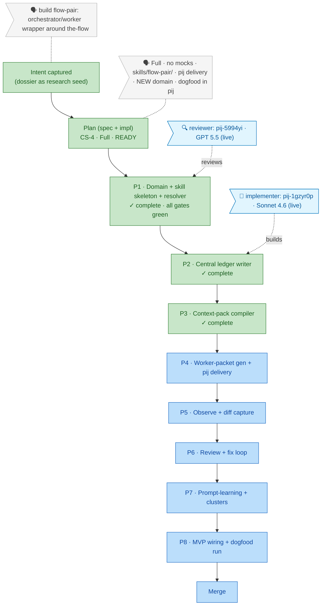

# Flight plan — flow-pair

> Generated from `the-flow.json` — do not hand-edit. Re-rendered every guided turn.

**Legend**: 🟩 done · 🟧 in progress · 🟥 blocked · 🟦 known (designed future) · ⬜ assumed (speculative) · 🗣 your words · 🤝 worker

**Now**: Phase 3 ✓ COMPLETE (context-pack compiler; APPROVE WITH NOTES; tests mutation-proven — worker self-mutation caught a vacuous P9 test; findings in follow-ups.md) · **Next**: Phase 4 — Worker-packet generation + pij delivery (tasks)
