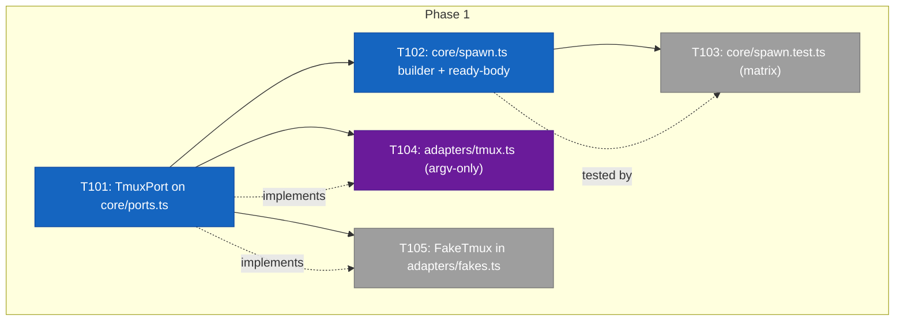
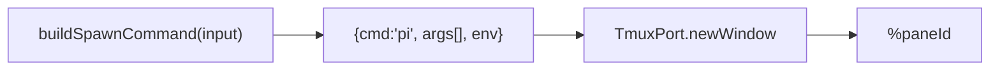
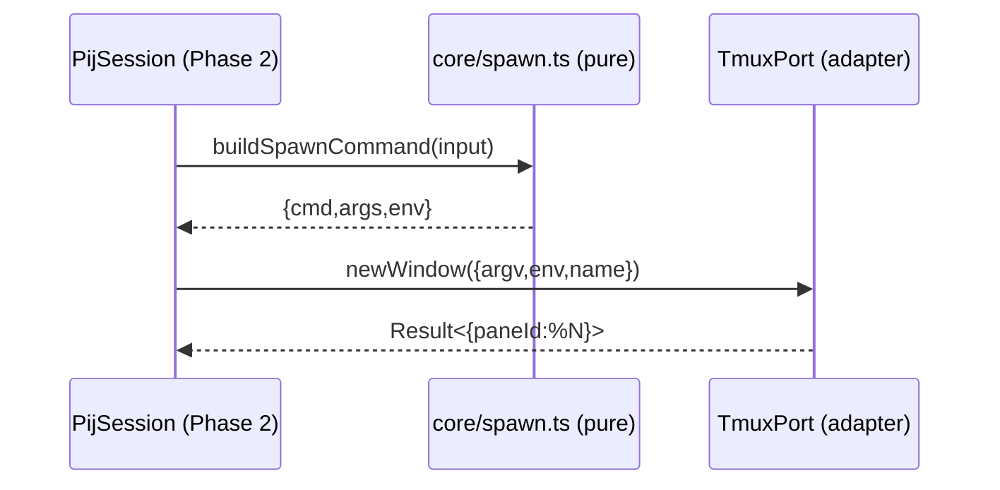

# Phase 1 — Tasks & Context Brief

**Plan**: `docs/plans/017-pij-spawn-tmux-windows/pij-spawn-tmux-windows-plan.md`
**Phase**: Phase 1 — Pure spawn core + TmuxPort + tmux adapter
**Domain**: pij-messaging · **Depends on**: none (first phase) · **CS**: 3

---

## Executive Briefing

- **Purpose**: Stand up the testable, pi-free *core* of the spawn/close feature and the one new impure seam (tmux), before any session wiring. This is the bug-prone argv/env surface — built behind fakes so Phase 2 wires against a proven contract.
- **What We're Building**: a pure `core/spawn.ts` argv/env builder + ready-body codec; a `TmuxPort` interface on `core/ports.ts`; the real `adapters/tmux.ts` (argv-only `execFileSync`); and `FakeTmux` in `adapters/fakes.ts`.
- **Goals**:
  - ✅ `buildSpawnCommand(...)` deterministically maps `{model?, task?, …}` → `{cmd:"pi", args[], env}`.
  - ✅ `readyBody`/`parseReadyBody` round-trip the ready ping payload.
  - ✅ `TmuxPort` seam defined; real adapter captures `%N`; `FakeTmux` records calls.
  - ✅ `core/` stays free of `@earendil-works/*` and `child_process` (AC-08).
- **Non-Goals**:
  - ❌ No `PijSession.spawn()/close()` wiring (Phase 2).
  - ❌ No `pij_spawn`/`pij_close` tools or `index.ts` changes (Phase 2).
  - ❌ No descriptor field changes (Phase 2). No smoke (Phase 3).

## Prior Phase Context

_None — Phase 1 is the first phase._

## Pre-Implementation Check

| File | Exists? | Domain Check | Notes |
|------|---------|-------------|-------|
| `.pi/extensions/pij/core/ports.ts` | ✅ modify | pij core (pi-free) | Add `TmuxPort` next to the existing 5 ports; no pi imports |
| `.pi/extensions/pij/core/spawn.ts` | ❌ create | pij core (pi-free) | New pure module — **must not** import `@earendil-works/*` or `child_process` (AC-08) |
| `.pi/extensions/pij/core/spawn.test.ts` | ❌ create | pij core | vitest; argv/env matrix + ready-body round-trip |
| `.pi/extensions/pij/adapters/tmux.ts` | ❌ create | pij adapter (impure) | argv-only `execFileSync`; the **only** new impure seam (P2) |
| `.pi/extensions/pij/adapters/fakes.ts` | ✅ modify | pij adapter | Add `FakeTmux` alongside existing `Fake*` ports |

Contract-change flags: `core/ports.ts` gains a 6th port (additive — existing `PijPorts` consumers unaffected; Phase 2 adds it to the wiring).

## Architecture Map



## Tasks

| Status | ID | Task | Domain | Path(s) | Done When | Notes |
|--------|-----|------|--------|---------|-----------|-------|
| [ ] | T101 | Add `TmuxPort` interface to `core/ports.ts`: `newWindow(opts) → Result<{paneId}>`, `killWindow(paneId) → Result<void>`, `currentSession() → string \| null` | pij-messaging | `.pi/extensions/pij/core/ports.ts` | Interface compiles; pi-free; tagged-union `Result<>` (P4); placed beside the existing 5 ports | Plan task 1.1. `opts` carries the argv/env from `buildSpawnCommand` + window name |
| [ ] | T102 | Write `core/spawn.ts`: `buildSpawnCommand({model?, task?, spawnId, announceTo, paneId?, cwd, role}) → {cmd:"pi", args:string[], env:Record<string,string>}` + `readyBody(spawnId, model, cwd)` + `parseReadyBody(body)` | pij-messaging | `.pi/extensions/pij/core/spawn.ts` | Pure module; **no** `@earendil-works/*` or `child_process` import (AC-08); `--model` arg present iff `model` given; env carries `PIJ_ANNOUNCE_TO`/`PIJ_SPAWN_ID`/`PIJ_SPAWN_TASK?`/`PIJ_PANE_ID?`/`PIJ_ROLE` | Plan tasks 1.2; findings 01/06. Task delivered via env, never positional `pi "<task>"` |
| [ ] | T103 | Write `core/spawn.test.ts` — matrix: model ± → `--model` ±, task ± (incl. special chars / quotes / newlines), ready-body round-trip (`parseReadyBody(readyBody(x)) === x`) | pij-messaging | `.pi/extensions/pij/core/spawn.test.ts` | `just test` green; asserts argv arrays (no shell strings, AC-09); special-char task survives env round-trip; covers AC-02 | Plan task 1.3 — **write alongside/just-before T102** (Hybrid testing, G6) |
| [ ] | T104 | Implement `adapters/tmux.ts` — argv-only `execFileSync`: `newWindow` via `new-window -P -F '#{pane_id}' -n pi:<spawnId> -e KEY=VAL … pi …` capturing `%N`; `killWindow` via `kill-window -t <paneId>` swallowing missing; `currentSession()` from `$TMUX_PANE` / `display-message` | pij-messaging | `.pi/extensions/pij/adapters/tmux.ts` | Captures `%N`; **no** shell command strings — argv arrays only (AC-09); the only new impure seam (P2); mirrors `harness/driver/tmux.ts` discipline (cannot import it) | Plan task 1.4; finding 05 |
| [ ] | T105 | Add `FakeTmux` to `adapters/fakes.ts` implementing `TmuxPort` — records `newWindow`/`killWindow` calls, returns a synthetic `%N` (e.g. `%900+n`) | pij-messaging | `.pi/extensions/pij/adapters/fakes.ts` | Implements `TmuxPort`; exposes recorded calls for assertions; usable by Phase 2 `session.test.ts` | Plan task 1.5. Mirror the existing `Fake*` port style |

## Context Brief

**Key findings from plan** (Phase 1 relevant):
- **Finding 01 / CF-01**: task must ride env (`PIJ_SPAWN_TASK`) + child self-inject — never positional `pi "<task>"` — to dodge the announce-vs-initial-prompt race. `buildSpawnCommand` therefore puts `task` in `env`, not `args`.
- **Finding 05**: tmux argv discipline copied from `harness/driver/tmux.ts` (argv-only `execFileSync`, no shell). Cannot import that module (it's in the harness, not the extension) — re-implement the pattern.
- **Finding 06**: the argv/env matrix is the bug-prone surface → fakes-testable pure builder is the whole point of splitting `core/spawn.ts` out.
- **AC-08 / AC-09**: `core/` free of `@earendil-works/*` + `child_process`; all tmux calls are argv arrays.

**Domain dependencies** (this phase consumes):
- `core/ports.ts` (existing `Result<>` tagged-union convention, P4) — `TmuxPort` follows the same shape as the other 5 ports.
- `adapters/fakes.ts` (existing `Fake*` pattern) — `FakeTmux` slots in beside them.

**Domain constraints**:
- P2: impurity confined to `adapters/tmux.ts` only; `core/` imports nothing from pi or `child_process`.
- P4: ports return `{ ok, ... }` tagged unions, never throw.
- P7: `.js` extension on relative imports (NodeNext/ESM).
- P8: tests target the pure store/core, not the wiring.

**Reusable from prior phases**: none (first phase). For later phases: `TmuxPort` interface + `buildSpawnCommand` signature + `FakeTmux` are the contracts Phase 2 wires against.

**Spawn env contract (the codec under test)**:
```
PIJ_ANNOUNCE_TO = <spawner pij id to ping ready>
PIJ_SPAWN_ID    = <correlation token>
PIJ_SPAWN_TASK  = <optional first task, verbatim>   # omitted when no task
PIJ_PANE_ID     = %N                                 # set post-newWindow (Phase 2 persists to descriptor)
PIJ_ROLE        = worker
```

> ⚠️ **Open for implementor (validation MEDIUM)**: `PIJ_PANE_ID` / the `paneId?`
> param are ambiguous. The *spawner* learns `%N` from `TmuxPort.newWindow()`'s
> return and persists it to the descriptor for `close()` — the *child* does not
> obviously need its own pane id at spawn (it can't be known before the window
> exists). In Phase 1, treat `paneId?` as an optional pass-through and **do not**
> require it for the env; resolve in Phase 2 whether the child ever reads
> `PIJ_PANE_ID` (e.g. for self-close) or it's spawner-only state. Flag, don't guess.





## Discoveries & Learnings

_Populated during implementation by the implement verb._

| Date | Task | Type | Discovery | Resolution | References |
|------|------|------|-----------|------------|------------|

---

## Validation Record (2026-06-23)

### Validation Thesis

**Raison d'être**: Make Phase 1 (the pi-free spawn core + the one new tmux seam) implementable with minimal clarification — exact files, signatures, env contract, and a test matrix for the bug-prone argv/env surface.

**Value claim**: Phase 1 implementation becomes faster and lower-risk; Phase 2 wires against a proven, enumerated contract instead of inventing one.

**Artifact promise**: The implementor can build T101–T105 from this dossier alone; Phase 2 can consume `TmuxPort` + `buildSpawnCommand(...)` + `FakeTmux` without refactor.

**Intended beneficiaries**: the Phase 1 implement agent; Phase 2 (session wiring); future maintainers.

**Proof target**: Implementation.

**Evidence standard**: source-verified create/modify paths, 1:1 plan↔dossier task mapping, AC cross-refs, env-contract codec, diagrams.

**Thesis source**: `pij-spawn-tmux-windows-plan.md` § Phase 1 + Acceptance Coverage Map.

**Thesis verdict**: Advanced.

**Main thesis risk**: `PIJ_PANE_ID`/`paneId?` ambiguity could cost one clarification round in Phase 2 (surfaced above; non-blocking for Phase 1).

---

| Agent (lens, parent-run) | Lenses Covered | Issues | Verdict |
|--------------------------|----------------|--------|---------|
| Source Truth | Concept Docs, Hidden Assumptions | 0 (5 ports + 5 fakes + create/modify paths verified) | ✅ |
| Cross-Reference | Integration & Ripple | 0 (1.1–1.5 ↔ T101–T105; AC-02/08/09; findings 01/05/06) | ✅ |
| Thesis Alignment | Thesis, Proof-Level Fit, Evidence Sufficiency | 0 | ✅ |
| Forward-Compatibility | Forward-Compatibility, Contract Integrity | 1 MEDIUM open (advisory) | ⚠️ |

_Note: validation run **as parent** — builtin subagents are read-blind in this session (canary: scout exposed only `write`, `ctx_read`/`read` absent), so a fan-out would have produced ungrounded output._

### Forward-Compatibility Matrix

| Consumer | Requirement | Failure Mode | Verdict | Evidence |
|----------|-------------|--------------|---------|----------|
| Phase 2 § session wiring | `TmuxPort` interface | encapsulation lockout | ✅ | T101 + plan §Delivers enumerate `newWindow`/`killWindow`/`currentSession` |
| Phase 2 § spawn() | `buildSpawnCommand(...)` signature | shape mismatch | ✅ | T102 reproduces the plan's exact param/return shape |
| Phase 2 § session.test.ts | `FakeTmux` recording calls | test boundary | ✅ | T105 records `newWindow`/`killWindow`, returns synthetic `%N` |
| Phase 2 § descriptor/env | `PIJ_PANE_ID` ownership (child vs spawner) | contract drift | ⚠️ | env contract note above — resolve in Phase 2; not blocking Phase 1 |

**Thesis alignment**: Value claim advanced at proof level Implementation; main risk is the `PIJ_PANE_ID` ownership ambiguity, surfaced as an advisory for Phase 2.

**Outcome alignment**: As written the dossier advances the outcome — "spawn a fleet of pis, work, then close them" — because Phase 1 delivers the exact `TmuxPort` + builder + `FakeTmux` contracts Phase 2 consumes, with the lifecycle's first half (build→window→capture `%N`) fully specified and source-verified.

**Standalone?**: No — Phase 2 is the named downstream consumer.

Overall: ⚠️ VALIDATED WITH FIXES (1 MEDIUM advisory surfaced in-dossier; 0 CRITICAL/HIGH)

---

```
docs/plans/017-pij-spawn-tmux-windows/
  ├── pij-spawn-tmux-windows-plan.md
  └── tasks/phase-1-pure-spawn-core/
      ├── tasks.md
      └── execution.log.md   # created by the implement verb
```
