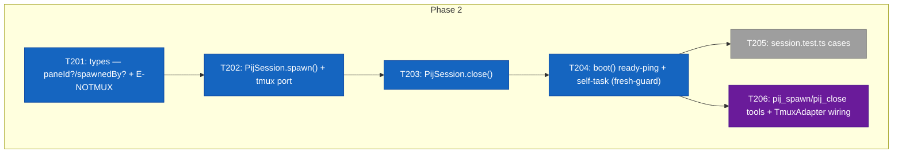
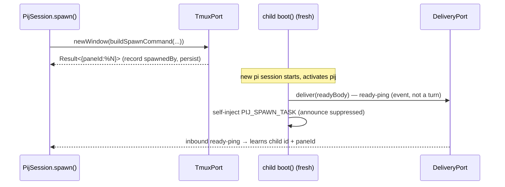

# Phase 2 — Tasks & Context Brief

**Plan**: `docs/plans/017-pij-spawn-tmux-windows/pij-spawn-tmux-windows-plan.md`
**Phase**: Phase 2 — Session wiring + tools + ready-ping
**Domain**: pij-messaging · **Depends on**: Phase 1 (done) · **CS**: 4

---

## Executive Briefing

- **Purpose**: Wire the Phase 1 spawn core + `TmuxPort` into `PijSession`, expose `pij_spawn`/`pij_close` tools, and make a freshly-spawned child announce "ready" exactly once — with the CF-01-safe task path and reload-idempotent ready-ping.
- **What We're Building**: descriptor fields (`paneId?`, `spawnedBy?`) + `E-NOTMUX`; `PijSession.spawn()`/`close()` against `TmuxPort`; a `fresh`-guarded ready-ping + self-task in `boot()` (with announce suppression when a task is present); and the two thin tools + `TmuxAdapter` wiring in `index.ts`.
- **Goals**:
  - ✅ `spawn(input)` opens one window via `TmuxPort.newWindow`, records `spawnedBy`, returns `{ spawnId, paneId }`; returns immediately (fire-and-forget).
  - ✅ `close(id)` kills by `paneId`, removes the descriptor, warns if not spawned-by-self, clean error on missing/dead.
  - ✅ A fresh child with `PIJ_ANNOUNCE_TO` set: persists `paneId`, delivers a ready-ping (an event, **not** a turn), self-injects `PIJ_SPAWN_TASK` — and fires **only ONE** `inject` at boot (announce suppressed when a task is present; finding 07).
  - ✅ Reload does **not** re-ping (fresh-guard; finding 04).
  - ✅ `pij_spawn` returns `E-NOTMUX` when `$TMUX`/tmux session is absent (AC-07).
- **Non-Goals**:
  - ❌ No smoke test (Phase 3). No `docs/how/pij.md` (Phase 3).
  - ❌ No new tmux primitives (Phase 1 owns `adapters/tmux.ts`).

## Prior Phase Context (Phase 1 — APPROVED)

**A. Deliverables** (all under `.pi/extensions/pij/`):
- `core/spawn.ts` — `buildSpawnCommand(input: SpawnInput): SpawnCommand` (`{cmd:"pi", args[], env}`); `readyBody(spawnId, model, cwd): string`; `parseReadyBody(body): ReadyPayload | null`. Pure, pi-free.
- `core/ports.ts` — `TmuxPort { newWindow(opts: NewWindowOpts): Result<{paneId}>; killWindow(paneId): Result<void>; currentSession(): string | null }` + `NewWindowOpts { cmd, args, env, name, cwd? }`.
- `adapters/tmux.ts` — `TmuxAdapter implements TmuxPort` (argv-only `execFileSync`; `%N` validated via `/^%\d+$/`; `killWindow` idempotent; `currentSession()` gated on `process.env.TMUX_PANE`).
- `adapters/fakes.ts` — `FakeTmux implements TmuxPort` with `readonly windows[]` (`{opts, paneId}`) + `readonly killed[]`, constructor `{ paneStart=900, sessionName="fake-session" }`, synthetic `%N`.

**B. Dependencies exported (consume these — do not re-derive)**:
- `SpawnInput` fields: `{ model?, task?, spawnId, announceTo, paneId?, cwd, role }`. `--model` emitted iff `model`; `task`→`PIJ_SPAWN_TASK` (never positional); env always carries `PIJ_ANNOUNCE_TO`/`PIJ_SPAWN_ID`/`PIJ_ROLE`, `PIJ_PANE_ID` iff `paneId`.
- `ReadyPayload` = `{ spawnId, model, cwd }`; `parseReadyBody` null-guards malformed/missing/typed-wrong fields.
- `TmuxPort.newWindow` takes `NewWindowOpts` (= the `SpawnCommand` `{cmd,args,env}` + `name` + optional `cwd`).

**C. Gotchas & debt**:
- `PIJ_PANE_ID` ownership is **unresolved** (Phase 1 advisory) — Phase 2 must DECIDE: the spawner learns `%N` from `newWindow()`'s return and persists it to the descriptor for `close()`; the child likely does **not** need its own pane id at spawn. Recommended: `spawn()` does NOT pass `paneId` into `buildSpawnCommand` (so `PIJ_PANE_ID` is not in the child env); persist `paneId` to the spawner-side descriptor only.
- `tmux.ts` uses error code `E-ARG` for tmux failures; the **tool-level** `$TMUX`-absent gate is the new `E-NOTMUX` (added in T201).

**D. Incomplete items**: none — Phase 1 closed clean (typecheck + 664 tests green, Dim-0 mutation passed).

**E. Patterns to follow**: P2 (impurity only in adapters/*), P3 (ports by DI), P4 (`Result<>` tagged unions via `ok()`/`err()`), P7 (`.js` ESM imports), P8 (tests target `session.ts` against fakes), P9 (persist before mutate), P10 (one `boot()` for all `session_start` reasons).

## Pre-Implementation Check

| File | Exists? | Domain Check | Notes |
|------|---------|-------------|-------|
| `.pi/extensions/pij/core/types.ts` | ✅ modify | pij core (pi-free) | Add `paneId?`/`spawnedBy?` to `SessionDescriptor` (both `readonly`, optional → old descriptors still parse); add `"E-NOTMUX"` to `PijErrorCode` union |
| `.pi/extensions/pij/core/session.ts` | ✅ modify | pij core (pi-free) | Add `tmux: TmuxPort` to `PijPorts`; add `spawn()`/`close()`; extend `boot()` ready-ping; widen `persist()` Pick to include `paneId`/`spawnedBy` |
| `.pi/extensions/pij/core/session.test.ts` | ✅ modify | pij core | Add spawn/close/ready/self-task/reload-no-reping cases (uses `FakeTmux` + `FakeProcess.vars` for env) |
| `.pi/extensions/pij/index.ts` | ✅ modify | pij wiring (impure boundary) | Register `pij_spawn`/`pij_close` (thin, mirror `pij_send`); add `tmux: new TmuxAdapter()` to the `new PijSession({...})` constructor |

Contract-change flags: `PijPorts` gains a 6th member (every `new PijSession({...})` call site + every test constructing `PijPorts`/fakes must add `tmux`). `BootInput`/boot env: read spawn env via the existing `ProcessPort.env()` seam (testable with `FakeProcess` `vars`) — **do not** read `process.env` inside `core/` (P2).

## Architecture Map



## Tasks

| Status | ID | Task | Domain | Path(s) | Done When | Notes |
|--------|-----|------|--------|---------|-----------|-------|
| [x] | T201 | Add `paneId?: string` + `spawnedBy?: SessionId` to `SessionDescriptor` (both `readonly`, optional); add `"E-NOTMUX"` to the `PijErrorCode` union | pij-messaging | `.pi/extensions/pij/core/types.ts` | `just typecheck` green; old descriptors still parse (additive); `E-NOTMUX` usable via `err()` | Plan 2.1; AC-05/AC-07 |
| [x] | T202 | Add `tmux: TmuxPort` to `PijPorts`; implement `PijSession.spawn(input): Result<{spawnId; paneId}>` — `buildSpawnCommand` → `ports.tmux.newWindow` → record `spawnedBy: this.self` on the new child's tracking; return immediately (fire-and-forget) | pij-messaging | `.pi/extensions/pij/core/session.ts` | Returns `Result`; opens exactly one window (FakeTmux `windows[]` len 1); records `spawnedBy`; child self-records its paneId (see Validation Resolutions §H1) so `spawn()` does NOT pass paneId to `buildSpawnCommand`; widen `persist()` Pick to add `paneId`/`spawnedBy` (M7); generate `spawnId` deterministically via `ports.process` (M4) | Plan 2.2; AC-01/AC-02; resolves Phase 1 advisory + H1/M4/M7 |
| [x] | T203 | Implement `PijSession.close(id): Result<void>` — read descriptor → `ports.tmux.killWindow(descriptor.paneId)` → `ports.registry.remove(id)`; warn (capture event) if `descriptor.spawnedBy !== this.self`; clean `err("E-NOID"/"E-DEAD")` on missing | pij-messaging | `.pi/extensions/pij/core/session.ts` | Kills by `paneId`; removes descriptor; warn-if-not-mine path covered; clean error on missing/dead | Plan 2.3; AC-05/AC-06 |
| [x] | T204 | Extend `boot()`: on `fresh && ports.process.env("PIJ_ANNOUNCE_TO")` → persist `paneId` read from the child's **own** `ports.process.env("TMUX_PANE")` (tmux sets it natively in the new pane — supersedes `PIJ_PANE_ID`; see §H1) + `spawnedBy`(=announceTo), `ports.delivery.deliver` a ready-ping (`readyBody`, model read from `PIJ_SPAWN_MODEL` env — see §H2 — an event, never an inject), and self-inject `PIJ_SPAWN_TASK` if set. When a spawn-task is present, **suppress** the generic `announceText` inject so only ONE `inject` fires at boot | pij-messaging | `.pi/extensions/pij/core/session.ts` | Pings once via `delivery` (no turn); reload (`!fresh`) does NOT re-ping; exactly one `inject` at boot when task present | Plan 2.4; AC-03/AC-04; findings 01/04/07 — the CF-01 mitigation |
| [x] | T205 | Add `session.test.ts` cases: spawn (one window + spawnedBy), close (kill+remove, warn-if-not-mine, missing→error), ready-ping fires once on fresh via `FakeDelivery`, self-task injected, **reload does NOT re-ping** (boot twice, assert one ping), announce-suppressed-when-task | pij-messaging | `.pi/extensions/pij/core/session.test.ts` | `just test` green; uses `FakeTmux` + `FakeProcess` vars for `PIJ_*` env | Plan 2.5; covers AC-03/04/05/06 |
| [x] | T206 | Register `pij_spawn` + `pij_close` tools in `index.ts` (thin, mirror `pij_send`): `pij_spawn` params `{ task?, model? }` → gate on tmux (`ports.tmux.currentSession()` null → `E-NOTMUX`) → `session.spawn`; `pij_close` param `{ to }` → `session.close`. Add `tmux: new TmuxAdapter()` to the `new PijSession({...})` constructor | pij-messaging | `.pi/extensions/pij/index.ts` | `just typecheck` green; `E-NOTMUX` returned when `$TMUX` unset (AC-07); tools mirror `pij_send` shape | Plan 2.6; AC-07 |

## Context Brief

**Key findings from plan** (Phase 2 relevant):
- **Finding 01 / CF-01**: the central risk — an announce `inject` racing pi startup → "Agent is already processing". Mitigation lives here (T204): task via env + self-inject **and** suppress the generic announce when a task is present (only ONE `inject` at boot). The ready-ping rides `delivery.deliver` (a channel event), never an inject.
- **Finding 04**: fresh/reload idempotency — the ready-ping must be `fresh`-guarded (`existing === null`) so `/reload` never re-pings. Explicit reload-no-reping test (T205).
- **Finding 07**: announce suppression (the HIGH fix from plan validation) — when a spawn-task is present, the generic `announceText` inject is skipped so the boot fires exactly one `sendUserMessage`.

**Domain dependencies** (this phase consumes):
- `core/spawn.ts` (Phase 1): `buildSpawnCommand`, `readyBody`, `SpawnInput`.
- `core/ports.ts` (Phase 1): `TmuxPort`, `NewWindowOpts`.
- `adapters/tmux.ts` (Phase 1): `TmuxAdapter` (wired in `index.ts` only — `core/` never imports it).
- `adapters/fakes.ts` (Phase 1): `FakeTmux` (+ existing `FakeDelivery`/`FakeProcess`) for `session.test.ts`.
- `core/message.ts`: `announceText` (the inject being conditionally suppressed).

**Domain constraints**:
- P2: `core/session.ts` stays pi-free; only `index.ts` constructs `TmuxAdapter` and touches `process.env`/`$TMUX`. Inside `core/`, read env via `ports.process.env()`.
- P9: persist `paneId`/`spawnedBy` to the descriptor **before** the ready-ping (event-sourced consistency).
- P10: one `boot()` handles all `session_start` reasons — the ready-ping branch is purely additive inside it, gated on `fresh`.

**Reusable from prior phases**: `FakeTmux` (assert `windows[]`/`killed[]`), `FakeDelivery` (assert ready-ping `deliver` call), `FakeProcess` `vars` (inject `PIJ_ANNOUNCE_TO`/`PIJ_SPAWN_TASK`/`PIJ_PANE_ID` env for boot tests).



## Discoveries & Learnings

_Populated during implementation by the implement verb._

| Date | Task | Type | Discovery | Resolution | References |
|------|------|------|-----------|------------|------------|
| 2026-06-23 | T201 | Gotcha | `PijErrorCode` is used as a `Record<PijErrorCode, number>` key exhaustive map in `core/cli.ts:84`. Adding `"E-NOTMUX"` to the union requires adding it to that map too (exit-code 2, like `E-NOID`). | Added `"E-NOTMUX": 2` to the exit-code map in `cli.ts`. | TS2741 compile error |
| 2026-06-23 | FT-002 | AC gap | `close()` returned `Result<void>` — the internal `warn-close-not-mine` event was captured but never exposed to the caller, so AC-06 was only half-satisfied. Also: `spawnedBy === undefined` (unknown origin, paneId present) should also warn per AC-06 logic. | Changed return to `Result<{ warning?: string }>`; widened condition to `spawnedBy !== this.self`; included `warning` text in `pij_close` tool result. Added 3 new close tests (caller-visible warning, unknown-origin warning, no-warning-when-mine). |
| 2026-06-23 | FT-003 / §H2 | Spec drift | `buildSpawnCommand` emitted `PIJ_SPAWN_MODEL` only via argv `--model`; `PijSession.spawn()` post-processed the env to add it. §H2 says the pure builder should own this. | Moved `PIJ_SPAWN_MODEL` emission into `core/spawn.ts`; removed the post-process in `session.ts`. Added 3 builder-level tests for model±env in `spawn.test.ts`. |

---

```
docs/plans/017-pij-spawn-tmux-windows/
  ├── pij-spawn-tmux-windows-plan.md
  └── tasks/phase-2-session-wiring/
      ├── tasks.md
      └── execution.log.md   # created by the implement verb
```

---

## Validation Record (2026-06-23)

**Validator**: pij-1x210ln (PEER), AS-PARENT read pass — no fan-out subagents.
**Sources checked**: `core/types.ts`, `core/session.ts` (257 L), `core/ports.ts` (103 L), `core/spawn.ts` (116 L), `adapters/fakes.ts` (198 L), `index.ts` (222 L), `core/message.ts` (69 L), `core/session.test.ts` (266 L).
**Verdict**: ⚠️ **VALIDATED WITH FIXES** — 3 HIGH + 4 MEDIUM findings; no CRITICAL. HIGH findings are contradictions/TypeScript-hard-errors that will block compilation; resolve before coding.

---

### HIGH — Must Resolve Before Implementation

**H1 · paneId persistence loop: T202 contradicts T203/T204**

- T202 done-when: \"**does not** pass `paneId` into `buildSpawnCommand`\" → `PIJ_PANE_ID` absent from child env.
- T204: \"persist `paneId` (from `PIJ_PANE_ID` if present)\" → since it's never present, child's `descriptor.paneId` stays `undefined`.
- T203: calls `ports.tmux.killWindow(descriptor.paneId)` → TypeScript error (`string | undefined` vs `string`).
- There is no other path that puts `paneId` into the child's registry descriptor before `close()` needs it. The spawner doesn't know the child's `SessionId` at spawn time, so it can't pre-populate the registry.

**Recommended resolution (choose one):**
1. Reverse the T202 done-when: `spawn()` **does** pass `paneId` to `buildSpawnCommand` (so `PIJ_PANE_ID` is in child env) → child persists it in T204 → T203 works. This is the simplest path consistent with the existing `SpawnInput.paneId?` field.
2. Or: `spawn()` returns `{spawnId, paneId}` to the caller and the SPAWNER updates the child's descriptor after the ready-ping correlates `spawnId` → `childSessionId`. But that requires async Phase-3-level work and a ready-ping shape change (add child `SessionId` to `ReadyPayload`).

---

**H2 · `readyBody()` model gap: no env path for child to read its own model**

- `core/spawn.ts:readyBody(spawnId, model, cwd)` requires `model: string` (non-optional — `ReadyPayload.model: string`).
- `buildSpawnCommand` puts model in `--model` argv, **not** in env. No `PIJ_SPAWN_MODEL` env var exists anywhere in Phase 1.
- T204 calls `readyBody(...)` inside `boot()` where `core/session.ts` can only read env via `ports.process.env()`. There is no env var to read.

**Recommended resolution (choose one):**
1. Add `PIJ_SPAWN_MODEL` to `buildSpawnCommand`'s env output (amend `core/spawn.ts` in T202 scope): when `input.model` is set, also write `env.PIJ_SPAWN_MODEL = input.model`. Child reads it via `ports.process.env("PIJ_SPAWN_MODEL") ?? ""`. Small additive change.
2. Make `ReadyPayload.model` optional (`model?: string`) and `readyBody`'s second arg optional (defaults to `""`). Lossy but unblocks Phase 2; the parent just won't know the child's model until it provides it out-of-band.

---

**H3 · `close()` TypeScript error: `descriptor.paneId` is `string | undefined`**

- After T201, `SessionDescriptor.paneId?: string` (optional).
- T203 calls `ports.tmux.killWindow(descriptor.paneId)` — TypeScript rejects `string | undefined` for `killWindow(paneId: string)`. This is an unconditional hard compile error.
- The expected behavior when `paneId` is absent is unspecified.

**Required addition to T203 done-when**: guard the paneId access — e.g., `if (!descriptor.paneId) return err("E-ARG", "session has no paneId — not a spawnable session")` — and add it to the test matrix in T205.

---

### MEDIUM — Should Resolve or Acknowledge

**M4 · `spawnId` generation unspecified (T202)**
`spawn()` must generate a correlation token but no mechanism is specified. `crypto.randomUUID()` is non-injectable (breaks deterministic tests). Recommended: generate via `String(ports.process.now()) + "-" + counter` (testable through `FakeProcess.advance()`), or accept `spawnId` as a parameter to `spawn(input)` so tests can control it.

**M5 · E-NOTMUX check location ambiguous (T206 vs T202/T205)**
T206 description places the gate in the tool flow (\"gate on tmux … → `E-NOTMUX`\" before calling `session.spawn`), but for Pattern P8 the check should live in `session.spawn()` so T205 can assert `err("E-NOTMUX")` against `FakeTmux`. Clarify in T202: either `spawn()` checks `ports.tmux.currentSession()` itself, or the tool-layer check is the intended design and T205 can't cover this case (acceptable if documented).

**M6 · `pij_spawn` tool `cwd` param implicit (T206)**
T206 declares tool params as `{ task?, model? }` but `SpawnInput.cwd` is required. The value comes from `ctx.cwd` (tool execute callback context), mirroring the pattern in `pij_send`. Should state explicitly: \"cwd from `ctx.cwd`\" in T206 to prevent the implementor guessing.

**M7 · `persist()` widening not in any numbered task done-when**
The Pre-Implementation Check says \"widen `persist()` Pick to include `paneId`/`spawnedBy`\" (`session.ts:229`). This is required for T202/T204 to compile but doesn't appear in T202 or T203 done-when criteria. TypeScript will catch it, but it should be explicit. Add to T202 done-when: \"widen `persist()` Pick to `"state" | "lastEventAt" | "pid" | "paneId" | "spawnedBy"`\".

---

### LOW — Advisory

**L8 · harness() update not explicit in T205**
After T202 adds `tmux: TmuxPort` to `PijPorts`, the existing `harness()` helper in `session.test.ts` (line 34) and its `ports` object literal (line 41) must be updated to include `tmux: new FakeTmux()`. T205 says \"add cases\" but should also say \"update existing harness() helper\" to avoid a silent typecheck failure on the pre-existing tests.

---

### Lens Summary

| Lens | Findings | Verdict |
|------|----------|--------|
| Source-Truth | H3 (persist type mismatch); H2 (readyBody model gap); H1 (paneId loop); M7 (persist() Pick) | ⚠️ |
| Cross-Reference | T201–T206 ↔ Plan 2.1–2.6: ✅ 1:1. AC-01..07 ↔ tasks: ✅. Findings 01/04/07: ✅. H1 exposed by T202/T203/T204 cross-check. | ⚠️ |
| Thesis Alignment | Thesis value claim is correct once H1/H2/H3 resolved. Implementation not ready as-written. | ⚠️ |
| Forward-Compat | Phase 3 smoke consumes `pij_spawn`/`pij_close` tools + ready-ping: ✅ delivered. `close()` only works if H1 resolved. | ⚠️ |

**Agent**: pij-1x210ln · **Run**: 2026-06-23T07-50-42Z-github.com-AI-Substr · **Delegation**: dlg-0002

---

## Validation Resolutions (applied by orchestrator pij-70pmv1)

All 3 HIGH + 4 MEDIUM + 1 LOW verified against source and resolved below. The task table above is amended; these are the authoritative contracts.

**§H1 — paneId persistence (resolves the T202/T203/T204 loop)**: the child reads its **own** pane id from `ports.process.env("TMUX_PANE")` at boot (tmux sets `$TMUX_PANE` natively in every pane; Phase 1's `currentSession()` already relies on it) and persists `descriptor.paneId` itself in T204. `spawn()` therefore does **not** pass `paneId` to `buildSpawnCommand` (it can't — `%N` isn't known until `newWindow()` returns), and `PIJ_PANE_ID` is **dead/superseded** (leave Phase 1's optional branch unused). `close(childId)` then reads the child's self-recorded `descriptor.paneId` from the shared registry. No async ready-ping correlation needed.

**§H2 — readyBody model**: amend `core/spawn.ts` (in T202 scope) so `buildSpawnCommand` also writes `env.PIJ_SPAWN_MODEL = input.model` **when `model` is given**. In T204, `boot()` builds the ready-ping model via `ports.process.env("PIJ_SPAWN_MODEL") ?? ""` (empty string when the child runs pi's default model — acceptable; parent learns "default"). Keep `ReadyPayload.model: string`.

**§H3 — close() paneId guard (T203)**: guard before kill — `if (!descriptor.paneId) return err("E-NOID", "session <id> has no paneId — not a spawned window")`. Add this case to the T205 matrix (close on a non-spawned descriptor → clean error, no `killWindow` call).

**§M5 — E-NOTMUX lives in `session.spawn()`** (not only the tool), so T205 can assert it against `FakeTmux`: `spawn()` first checks `ports.tmux.currentSession() === null → return err("E-NOTMUX", …)`. The T206 tool is a thin pass-through of that result. Add to T202 done-when + T205 matrix.

**§M6 — `pij_spawn` cwd**: T206 tool params are `{ task?, model? }`; `SpawnInput.cwd` comes from the tool callback's `ctx.cwd` (mirror `pij_send`). State explicitly in T206.

**§M4 — spawnId**: generate via `ports.process.now()` + a per-session counter (deterministic under `FakeProcess.advance()`); do **not** use `crypto.randomUUID()`.

**§M7 — persist() widening**: T202 must widen the `persist()` `Pick` to `"state" | "lastEventAt" | "pid" | "paneId" | "spawnedBy"` (required for T202/T204 to compile).

**§L8 — test harness**: T205 must update the existing `session.test.ts` `harness()` helper + its `ports` object literal to include `tmux: new FakeTmux()` (else the pre-existing tests fail typecheck once `PijPorts` gains the 6th member).

**§F004 (from Phase-1 stage-7 review) — `FakeTmux` nullable session**: `FakeTmux.currentSession()` currently always returns a string, so the M5 `E-NOTMUX` path (`spawn()` checks `currentSession() === null`) can't be unit-tested. Amend `adapters/fakes.ts` (T205 scope) so `FakeTmux` accepts `sessionName: string | null` (e.g. `new FakeTmux({ sessionName: null })`) and `currentSession()` returns it; add the not-in-tmux → `E-NOTMUX` case to the T205 matrix.

**Net effect**: the dossier is now implementation-ready (proof target Implementation). Verdict upgraded ⚠️ → ✅ **VALIDATED** for dispatch.
