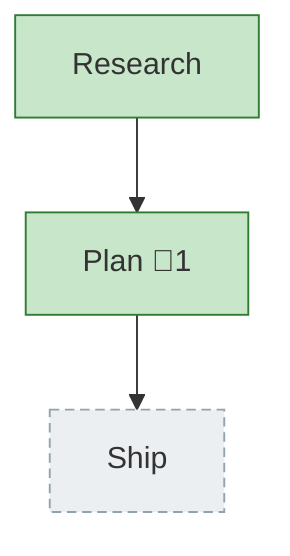

<!-- GENERATED by `harness flow render` — do not hand-edit; regenerate from the flow JSON. -->
# Flow · pij-spawn-tmux-windows

**Kind**: flight-plan · **Now**: plan · **Next**: ship · **Intent**: Extend the pij extension to spawn a new pi instance in a new tmux window under the current session (settable model), have it report ready, and close/remove it when done · **Nodes**: 3 · **Events**: 13

**Rail**: ◆─◆─◇  ◆ Research · ◆ Plan · ◇ Ship

**Legend**: 🟩 done · 🟧 in-progress · 🟥 blocked · 🟦 known (designed) · ⬜ assumed (speculative) · 🔶 decision · 🗣 user input · 🟪 harness loop · 🤖 companion · 🛠 worker · 🧰 chore (upkeep).

## Node log

### plan · Plan
- `2026-06-23T05:04:56.158Z` · — · validation — Source-truth re-verified: core/ pi-free + child_process-free (grep), exactly 5 ports, boot() fresh flag, FsChannel.deliver, SessionDescriptor optional fields, isSubagentChild all confirmed. Overall VALIDATED WITH FIXES.
