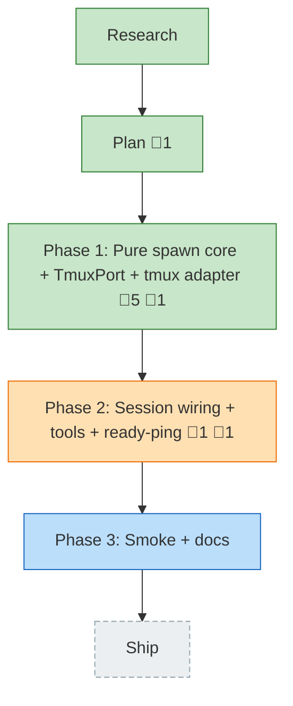

<!-- GENERATED by `harness flow render` — do not hand-edit; regenerate from the flow JSON. -->
# Flow · pij-spawn-tmux-windows

**Kind**: flight-plan · **Now**: phase-2 · **Next**: phase-3 · **Intent**: Extend the pij extension to spawn a new pi instance in a new tmux window under the current session (settable model), have it report ready, and close/remove it when done · **Nodes**: 6 · **Events**: 35

**Rail**: ◆─◆─[ ◆─◐─◇ ]─◇  ◆ Research · ◆ Plan · [ ◆ Phase 1: Pure spawn core + TmuxPort + tmux adapter · ◐ Phase 2: Session wiring + tools + ready-ping · ◇ Phase 3: Smoke + docs ] · ◇ Ship

**Legend**: 🟩 done · 🟧 in-progress · 🟥 blocked · 🟦 known (designed) · ⬜ assumed (speculative) · 🔶 decision · 🗣 user input · 🟪 harness loop · 🤖 companion · 🛠 worker · 🧰 chore (upkeep).

## Node log

### plan · Plan
- `2026-06-23T05:04:56.158Z` · — · validation — Source-truth re-verified: core/ pi-free + child_process-free (grep), exactly 5 ports, boot() fresh flag, FsChannel.deliver, SessionDescriptor optional fields, isSubagentChild all confirmed. Overall VALIDATED WITH FIXES.

### phase-1 · Phase 1: Pure spawn core + TmuxPort + tmux adapter
- 📄 artifacts: docs/plans/017-pij-spawn-tmux-windows/tasks/phase-1-pure-spawn-core/tasks.md
- `2026-06-23T07:16:52.832Z` · — · note — Stage 5 (tasks) complete for Phase 1: 5 tasks T101-T105, no prior phase, CS-3.
- `2026-06-23T07:21:18.578Z` · — · validation — validate-v2 (parent-run; subagents read-blind): VALIDATED WITH FIXES. Source Truth/Cross-Ref/Thesis ✅; 1 MEDIUM advisory (PIJ_PANE_ID ownership) surfaced in-dossier for Phase 2. 0 CRITICAL/HIGH.
- `2026-06-23T07:58:52.180Z` · — · validation — flow-pair dlg-0001 review (orchestrator): APPROVE. Dim-0 mutation PASSED (--model guard flips 2 tests RED, GREEN on restore); typecheck clean; 664/664; AC-08/09 clean (core pi-free, argv-only tmux); P2/P3/P4/P7 honored; scope = exactly the 5 allowed files; no forbidden paths.
- `2026-06-23T08:34:02.718Z` · — · review — Stage-7 review (pij-1vru9uw, /the-flow 7, as-parent): REQUEST_CHANGES. F001 HIGH — just lint/Biome FAILS on changed files (unused Role import in ports.ts; FakeTmux fmt in fakes.ts). F002/F003 MED (stale domain docs; no execution.log). F004 LOW (FakeTmux nullable sessionName for Phase 2 E-NOTMUX). Confirmed real by orchestrator. NOTE: my earlier flow-pair APPROVE missed this — it ran typecheck+test but not lint.
- `2026-06-23T08:36:55.815Z` · — · validation — F001 RESOLVED: removed unused Role import (ports.ts) + biome-formatted fakes.ts → all 5 Phase 1 files biome-clean; typecheck clean; 675 tests pass. Also fixed my own boot extension lint debt. Remaining repo just-lint failure (flow-pair/test/ledger-records.test.ts) is peer work, not Phase 1. F002 (domain docs)/F003 (execution log)/F004 (FakeTmux nullable for Phase-2 E-NOTMUX) deferred.

### phase-2 · Phase 2: Session wiring + tools + ready-ping
- 📄 artifacts: docs/plans/017-pij-spawn-tmux-windows/tasks/phase-2-session-wiring/tasks.md
- `2026-06-23T08:16:56.261Z` · — · validation — Companion validation (dlg-0002, pij-1x210ln as-parent): VALIDATED WITH FIXES — 3 HIGH + 4 MEDIUM + 1 LOW, all real (H1 paneId loop, H2 readyBody model gap, H3 close() type error). Orchestrator verified + applied resolutions (H1 via child $TMUX_PANE self-read; H2 PIJ_SPAWN_MODEL env; H3 guard; M4-M7/L8). Dossier now implementation-ready.
