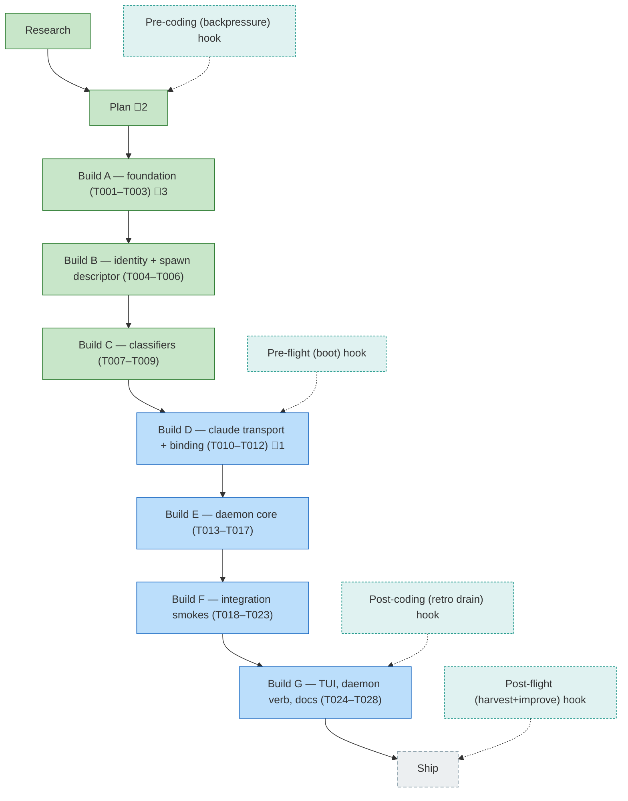

<!-- GENERATED by `harness flow render` — do not hand-edit; regenerate from the flow JSON. -->
# Flow · pij-tmux-control-plane

**Kind**: flight-plan · **Now**: build-d · **Next**: build-e · **Intent**: Machine-wide pij daemon + tmux transport so pij controls any harness (Claude Code first, Copilot later): pij-id assigned before launch, bound to the harness session via a phone-home handshake; daemon centralizes file-mon + routing + registry + a live chalk TUI; fire-and-forget messaging via tmux send-keys, no inbox polling; id-binding enables tailing. · **Nodes**: 14 · **Events**: 47

**Rail**: ◆─◆─[ ◆─◆─◆─◇─◇─◇─◇ ]─◇  ◆ Research · ◆ Plan · [ ◆ Build A — foundation (T001–T003) · ◆ Build B — identity + spawn descriptor (T004–T006) · ◆ Build C — classifiers (T007–T009) · ◇ Build D — claude transport + binding (T010–T012) · ◇ Build E — daemon core (T013–T017) · ◇ Build F — integration smokes (T018–T023) · ◇ Build G — TUI, daemon verb, docs (T024–T028) ] · ◇ Ship

**Legend**: 🟩 done · 🟧 in-progress · 🟥 blocked · 🟦 known (designed) · ⬜ assumed (speculative) · 🔶 decision · 🗣 user input · 🟪 harness loop · 🤖 companion · 🛠 worker · 🧰 chore (upkeep).

## Node log

### plan · Plan
- `2026-06-27T01:45:01.103Z` · — · validation — validate-v2 NEEDS ATTENTION: 4 HIGH design-gap findings in the spawn-&gt;daemon-&gt;phonehome handshake. Recommend re-run plan to fold fixes in. Deterministic proof clean (all refs/domains/files resolve).
- `2026-06-27T02:04:58.096Z` · — · validation — validate-v2 v1.1.1: VALIDATED WITH FIXES. Deterministic proof clean; all findings closed/fixed across 2 rounds.

### build · Build A — foundation (T001–T003)
- `2026-06-27T02:16:27.462Z` · — · note — Review stage (id 7) will be DOGFOODED: spawn opus 4.8 in a tmux split-right via the new control plane, review the diff, track via file-change watch + 'pij tail' of the reviewer session. Build must make spawn/tail/file-watch primitives real enough to drive this.
- `2026-06-27T02:25:12.334Z` · — · note — Group A (T001-T003) done: shared tmux-keys lib (argv-only, injectable runner) + 10 tests; harness driver re-delegates for parity; pij-control-plane domain created+registered. typecheck/lint clean.
- `2026-06-27T02:31:25.527Z` · — · note — Groups A-C done (T001-T009, 9/28): tmux-keys lib; descriptor+spawn builders (pre-alloc id, pending descriptor, lifecycle field); transport-selection + readiness + interstitial classifiers (R-01 frozen, F6 gate passed). 69 pure tests; typecheck/lint clean. Next: D binding, E daemon, F smokes (need live claude), G TUI/docs.

### build-d · Build D — claude transport + binding (T010–T012)
- `2026-06-27T02:46:14.177Z` · — · note — pre-flight boot validation: HEALTHY (typecheck+test green, 9s). Maturity L0. Note: governance back-pressure gap #1 (spawn/close smoke skips without tmux) is directly relevant to Group F integration smokes — they need live claude+tmux, no deterministic CI signal otherwise.
