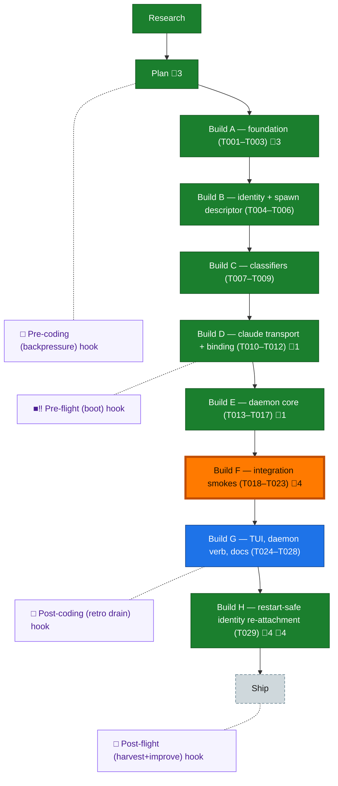

<!-- GENERATED by `harness flow render` — do not hand-edit; regenerate from the flow JSON. -->
# Flow · pij-tmux-control-plane

**Kind**: flight-plan · **Now**: build-f · **Next**: build-g · **Intent**: Group F — integration smokes + the code-review DOGFOOD: wire 'pij spawn --harness claude' so the daemon drives a real claude split, then spawn opus 4.8 to review the diff, tracked via file-changes + pij tail. Live mechanic already proven (BOUND ✅). · **Nodes**: 15 · **Events**: 65

**Rail**: ◆─◆─[ ◆─◆─◆─◆─◆─◇─◇─◆ ]─◇  ◆ Research · ◆ Plan · [ ◆ Build A — foundation (T001–T003) · ◆ Build B — identity + spawn descriptor (T004–T006) · ◆ Build C — classifiers (T007–T009) · ◆ Build D — claude transport + binding (T010–T012) · ◆ Build E — daemon core (T013–T017) · ◇ Build F — integration smokes (T018–T023) · ◇ Build G — TUI, daemon verb, docs (T024–T028) · ◆ Build H — restart-safe identity re-attachment (T029) ] · ◇ Ship

**Legend** — colour = type/status: 🟩 done · 🟢 in-progress · 🟥 blocked · 🟦 known · ⬜ assumed · 🔶 decision · 🗣 user input · 🟪 harness chore (faded = not yet done) · 🤖 companion · 🛠 worker · 🟧 current (you are here). Badges: 💬 comments · 📄 artifacts · 📝 instructions · 🧰 chore (° optional / recommended / ‼ strongly-recommended; ✓ done · ✕ skipped).

## Node log

### plan · Plan
- `2026-06-27T01:45:01.103Z` · — · validation — validate-v2 NEEDS ATTENTION: 4 HIGH design-gap findings in the spawn-&gt;daemon-&gt;phonehome handshake. Recommend re-run plan to fold fixes in. Deterministic proof clean (all refs/domains/files resolve).
- `2026-06-27T02:04:58.096Z` · — · validation — validate-v2 v1.1.1: VALIDATED WITH FIXES. Deterministic proof clean; all findings closed/fixed across 2 rounds.
- `2026-07-11T00:34:30.867Z` · — · validation — Plan v1.2.0 restart identity continuity amendment validated with fixes: authoritative native-id input, exact tuple cardinality, deterministic claim, Pi exact join persistence, and fresh-process integration proof.

### build · Build A — foundation (T001–T003)
- `2026-06-27T02:16:27.462Z` · — · note — Review stage (id 7) will be DOGFOODED: spawn opus 4.8 in a tmux split-right via the new control plane, review the diff, track via file-change watch + 'pij tail' of the reviewer session. Build must make spawn/tail/file-watch primitives real enough to drive this.
- `2026-06-27T02:25:12.334Z` · — · note — Group A (T001-T003) done: shared tmux-keys lib (argv-only, injectable runner) + 10 tests; harness driver re-delegates for parity; pij-control-plane domain created+registered. typecheck/lint clean.
- `2026-06-27T02:31:25.527Z` · — · note — Groups A-C done (T001-T009, 9/28): tmux-keys lib; descriptor+spawn builders (pre-alloc id, pending descriptor, lifecycle field); transport-selection + readiness + interstitial classifiers (R-01 frozen, F6 gate passed). 69 pure tests; typecheck/lint clean. Next: D binding, E daemon, F smokes (need live claude), G TUI/docs.

### build-d · Build D — claude transport + binding (T010–T012)
- `2026-06-27T02:46:14.177Z` · — · note — pre-flight boot validation: HEALTHY (typecheck+test green, 9s). Maturity L0. Note: governance back-pressure gap #1 (spawn/close smoke skips without tmux) is directly relevant to Group F integration smokes — they need live claude+tmux, no deterministic CI signal otherwise.

### build-e · Build E — daemon core (T013–T017)
- `2026-06-27T03:03:51.298Z` · — · note — Group D done (T010-T012, 13/28): claude transport (mangle pinned to live telemetry; new-path discovery never picks a pre-existing transcript) + pure binding/watchdog (init-exactly-once, confirm-line-only re-send) + pij phonehome verb. claude 10 + binding 11 + cli 20 green; full suite 769/4skip/0fail. Starting E: the daemon switchboard — unlock for the live claude-in-tmux code-review dogfood.

### build-f · Build F — integration smokes (T018–T023)
- `2026-06-27T03:17:18.318Z` · — · note — LIVE SMOKE PASSED (T016, claude v2.1.195/Opus 4.8): real claude spawned in tmux split-right; DaemonTmux+frozen classifiers read 'ready'; init injected via send-keys; deterministic binding picked the NEW transcript 9b58ec18-...jsonl (not any of 4 pre-existing in same cwd = AC-03 live); claude replied PIJ-SMOKE-OK; pane torn down. The whole spawn-&gt;bind mechanic holds against real Claude Code. Group E done (T013-T017, 18/28): router+ownership, index-state, lock, daemon loop/bin/adapter, thin receiver. 35 new tests; full suite 804/4skip/0fail.
- `2026-06-27T03:36:02.601Z` · — · note — DOGFOOD COMPLETE (headline goal): spawned Opus 4.8 in a tmux split via 'pij spawn --harness claude', tasked it to review the Plan 019 code, tracked it via 'pij tail' + file-change watch. It wrote a 139-line review that found a REAL HIGH bug (H1: before-snapshot races claude's transcript write, defeating deterministic AC-03 binding) + 4 MEDIUMs. ALL FIXED + confirmed live (fresh spawn captured 7 transcripts at spawn, bound deterministically). T018/T019/T022 done w/ live proofs. Full suite 814/4skip/0fail. Remaining F: T020/T021/T023; then G.
- `2026-06-27T04:56:05.268Z` · — · note — BIDIRECTIONAL RELAY DEMOED LIVE: self-adopted the orchestrator's own pane (pij adopt %72 → bound via CLAUDE_CODE_SESSION_ID), spawned Sonnet 4.6 right. Sonnet ran 'pij send &lt;me&gt;' → daemon send-keys'd it into the orchestrator pane → it popped in as a framed [pij from &lt;id&gt;] user turn (push-into-context, no poll). Replied back → landed in Sonnet's pane → Sonnet replied LOOP-CLOSED into ours. Built this turn: T023 adopt (own discovery rule), sender-framing on tmux injection (parity w/ pi receiver), Enter-settle hardening (T020/R-02: 350ms debounce so paste-pill submits crisply). 21/28 done. Full suite 819/4skip/0fail.
- `2026-06-27T05:04:29.410Z` · — · note — T021 CROSS-HARNESS verified LIVE: launched a real pi session in a tmux split; claude-orchestrator(adopted) &lt;-&gt; pi messaging works BOTH ways. me-&gt;pi: daemon OBSERVES (no inject), pi's in-process receiver delivers (AC-08 split holds). pi-&gt;me: pi's pij_send tool -&gt; my inbox -&gt; daemon relays via send-keys into my adopted pane -&gt; popped in as [pij from pij-9o8gx8]. Delivery ownership intact, pi path unregressed. 22/28 done (only T020 mid-turn R-02 remains, Enter-settle hardening already in).

### build-h · Build H — restart-safe identity re-attachment (T029)
- 📄 artifacts: docs/plans/019-pij-tmux-control-plane/pij-tmux-control-plane-plan.md, docs/plans/019-pij-tmux-control-plane/execution.log.md, docs/plans/019-pij-tmux-control-plane/reviews/t029-restart-identity-review.md, docs/plans/019-pij-tmux-control-plane/validations/pij-tmux-control-plane-plan-validation.md
