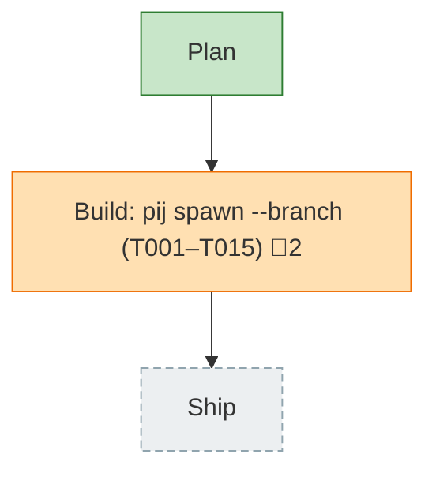

<!-- GENERATED by `harness flow render` — do not hand-edit; regenerate from the flow JSON. -->
# Flow · pij-spawn-branch-mode

**Kind**: flight-plan · **Now**: build · **Next**: ship · **Intent**: optional branch-from-self mode for pij spawn (claude-first): pij spawn --harness claude --branch forks the caller's own session into the new tmux pane via --resume &lt;caller-harnessSessionId&gt; --fork-session --session-id &lt;new-uuid&gt; · **Nodes**: 3 · **Events**: 13

**Rail**: ◆─[ ◐ ]─◇  ◆ Plan · [ ◐ Build: pij spawn --branch (T001–T015) ] · ◇ Ship

**Legend**: 🟩 done · 🟧 in-progress · 🟥 blocked · 🟦 known (designed) · ⬜ assumed (speculative) · 🔶 decision · 🗣 user input · 🟪 harness loop · 🤖 companion · 🛠 worker · 🧰 chore (upkeep).

## Node log

### build · Build: pij spawn --branch (T001–T015)
- `2026-06-28T01:13:21.258Z` · — · validation — Dogfood proof (2026-06-28): forked this live Opus session to a Sonnet 4.6 instance (claude --resume &lt;self&gt; --fork-session --session-id &lt;new&gt; --model sonnet); fork inherited full context (answered correctly about Plan 020) and self-IDed as claude-sonnet-4-6 on the pinned id. Mechanic + model-override + context-inheritance confirmed end-to-end.
- `2026-06-28T01:54:22.147Z` · — · note — T016 (fork reframe) shipped: buildInitInjection(pijId, branched) prepends a fork-reframe only when branchedFrom is set; daemon passes descriptor.branchedFrom != null. 3 tests + 881 suite green. Finding 08 recalibrated Medium (narrow: only branching an actively-orchestrating session).
