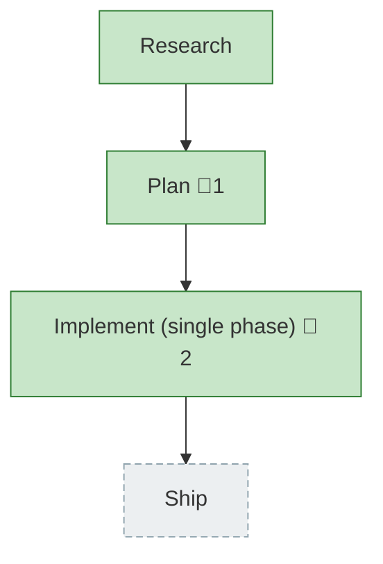

<!-- GENERATED by `harness flow render` — do not hand-edit; regenerate from the flow JSON. -->
# Flow · unify-spawn-harness

**Kind**: flight-plan · **Now**: impl · **Next**: ship · **Intent**: Unify pij spawn so pi, claude, copilot launch the same way (KISS; later more harnesses) · **Nodes**: 4 · **Events**: 22

**Rail**: ◆─◆─[ ◆ ]─◇  ◆ Research · ◆ Plan · [ ◆ Implement (single phase) ] · ◇ Ship

**Legend**: 🟩 done · 🟧 in-progress · 🟥 blocked · 🟦 known (designed) · ⬜ assumed (speculative) · 🔶 decision · 🗣 user input · 🟪 harness loop · 🤖 companion · 🛠 worker · 🧰 chore (upkeep).

## Node log

### plan · Plan
- `2026-06-28T02:19:51.272Z` · — · validation — validate-v2 VALIDATED — all 5 load-bearing code claims resolve against source; pi-must-not-bind design is sound.

### impl · Implement (single phase)
- `2026-06-28T02:41:13.211Z` · — · validation — flow-pair review (pi+GLM-1M, pij-yjwp09): round 1 APPROVE_WITH_NOTES — 2 Med + 1 Low. Fixed all 3: pure livePeerPanes helper (kills pane-count asymmetry + DRY + adds unit cov); honest AC map (smoke-only for impure bin, D-01); pi-branch guard uses supportsBranching. Gates green (885 tests). Re-review dispatched.
- `2026-06-28T02:42:04.498Z` · — · validation — flow-pair re-review (pi+GLM-1M): APPROVE. All 3 fixes verified in git diff; AC-04 confirmed (claude/copilot bind unchanged, only pane-count set widened, intended). Ship it. Implement phase complete + reviewed.
