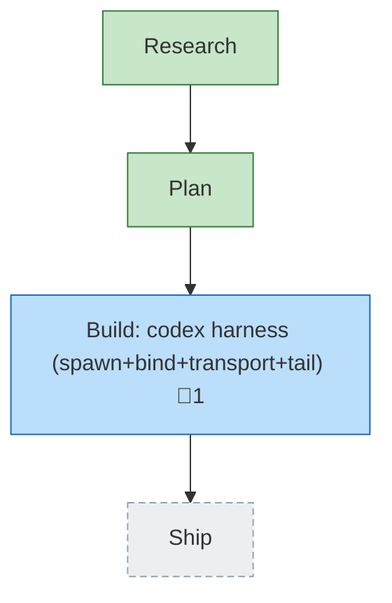

<!-- GENERATED by `harness flow render` — do not hand-edit; regenerate from the flow JSON. -->
# Flow · codex-spawn-support

**Kind**: flight-plan · **Now**: plan · **Next**: build · **Intent**: add support for codex to the pij spawner thing. codex is installed and logged in ready to go · **Nodes**: 4 · **Events**: 15

**Rail**: ◆─◆─[ ◇ ]─◇  ◆ Research · ◆ Plan · [ ◇ Build: codex harness (spawn+bind+transport+tail) ] · ◇ Ship

**Legend**: 🟩 done · 🟧 in-progress · 🟥 blocked · 🟦 known (designed) · ⬜ assumed (speculative) · 🔶 decision · 🗣 user input · 🟪 harness loop · 🤖 companion · 🛠 worker · 🧰 chore (upkeep).

## Node log

### build · Build: codex harness (spawn+bind+transport+tail)
- `2026-06-28T05:35:35.110Z` · — · validation — POC (2026-06-28): codex popped in tmux (pane %29, YOLO mode), controlled via send-keys (replied CODEX_POC_OK_42), bound via discovery (rollout UUID 019f0cb7…=session_meta.id), cwd-confirmed, tail parsed. New Finding 07: codex writes rollout lazily on first turn (binds after init-inject). Evidence: poc-evidence.md.
